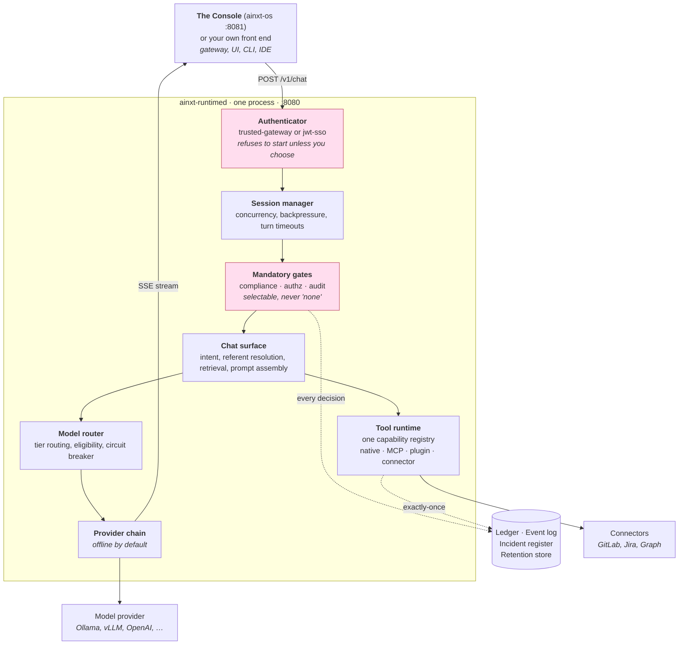
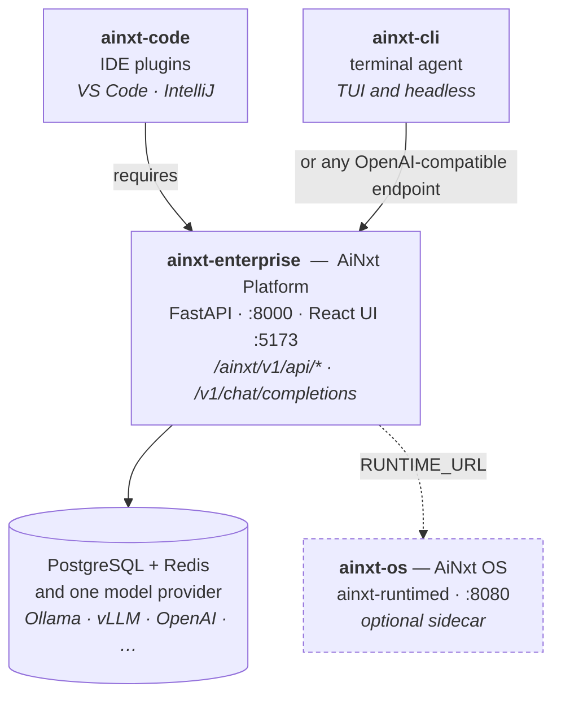

<p align="center">
  <!-- Brand-approved lockups from AINxt_logo_icon/. -01 is the transparent version for light
       backgrounds; -02 is the navy-plate version, which stays legible on GitHub's dark theme.
       PNG rather than SVG because GitHub sanitises inline SVG in Markdown. -->
  <picture>
    <source media="(prefers-color-scheme: dark)" srcset="AINxt_logo_icon/AINxt_CTC-02.png">
    
  </picture>
</p>

# AiNxt OS

[](OSSMETADATA)

**AiNxt OS** is the open-source **governed AI runtime** for enterprises. Every question
it answers passes through the same path: who are you, what are you allowed to see, what did the model
actually do — and each of those gates **fails closed**. Provider-agnostic, data-residency-aware,
agentic, and governed by default rather than by configuration.

There are two ways in, and you do not have to choose up front:

| | Who it is for | How you start |
|---|---|---|
| **The Console** | Anyone who wants to *use* AiNxt OS — try it, connect a model, change settings. No terminal knowledge needed beyond the first command. | `./setup.sh --run` opens a chat window in your browser |
| **The wire contract** | Teams building a product *on* AiNxt OS — a gateway, a UI, a CLI, an IDE plugin. | POST a turn, read a Server-Sent-Events stream — see **[DOCKING.md](DOCKING.md)** |

The Console is a real front end, not a demo: it is the reference implementation of the
authenticating-gateway contract in [DOCKING.md](DOCKING.md), which is exactly what AiNxt OS requires
of anything a browser can reach. Use it to evaluate AiNxt OS on day one, and keep using it as an
operator's window after you have built your own product on top.

---


## What this is

AiNxt OS ships as two binaries:

* **`ainxt-runtimed`** — the runtime itself. A single Rust binary that answers a governed AI turn
  over HTTP: you POST a chat turn and read a Server-Sent-Events stream back. This is the component
  every client docks into, and the thing you deploy.
* **`ainxt-os`** — the **Console**. Starts the runtime for you, serves a chat window, and turns the
  configuration into a settings page. This is the thing a person runs.

The point of the runtime is the part between the request and the stream. A turn does not go
straight to a model: it passes through an authenticator, a session manager, a
compliance gate, an authorizer, a model router and an audit sink, and each of
those **fails closed**. AiNxt OS refuses to start if you have not chosen how
identity is established. It refuses a turn whose caller lacks the capability. It
records what it did whether or not the model answered.

That is the whole design: the governance is not middleware you can forget to
install, it is the only path a turn can take.

**It runs on its own.** No database, no message broker, no model provider and no
API key are needed to start. With no provider configured it serves an offline
provider, so the socket always answers and you can exercise the entire path
before you commit to any infrastructure. A model is something you connect when
you are ready — from the Console's Settings page, or in a config file.

## Architecture

65 crates. This is the path a single `/v1/chat` turn takes:



A refusal arrives **inside** the SSE stream as an `error` frame, with HTTP 200.
The transport succeeded; the turn was declined. Treating HTTP 200 as success is
the most common mistake when docking a new client — see
[`DOCKING.md`](DOCKING.md) for the full wire contract.

### What each surface is for

| Route | What it does |
|---|---|
| `/healthz` | Liveness. Unauthenticated — a load balancer or kubelet has no token. Returns `{"status":"ok"}` and nothing else. |
| `/readyz` | Readiness. Unauthenticated. `200` normally; **`503`** when the mandatory audit sink cannot write, because every turn would then fail closed. |
| `/v1/chat` | A governed conversation turn. The main path. |
| `/v1/command` · `/v1/edit` | Structured operations and the semantic code-review pipeline |
| `/v1/replay` · `/v1/replay/step` | Re-execute or step through a recorded session |
| `/v1/events` · `/v1/observe` | The typed event stream and serving telemetry |
| `/graph` · `/v1/query_ledger` | The knowledge graph and the exactly-once dispatch ledger |
| `/v1/harness/*` · `/v1/capability/saga` | Capability invocation and multi-step composite actions |
| `/connectors/*` | OAuth surface for third-party connectors |
| `/memory/*` · `/feedback` | Durable memory, consent and export, and the improvement loop |

## Quick start

```sh
git clone https://github.com/npci/ainxt-os.git
cd ainxt-os
./setup.sh
```

`./setup.sh` verifies Rust, a C toolchain and free disk, builds AiNxt OS and its Console,
creates `runtimed.toml` from the shipped example, validates the configuration,
and prints exactly what to run next.
It is safe to re-run, and `./setup.sh --check` inspects prerequisites without
changing anything.

Then open the Console:

```sh
./setup.sh --run            # or, once built:  ./target/release/ainxt-os
```

That starts AiNxt OS, opens <http://127.0.0.1:8081> in your browser, and gives you a chat window,
a settings page, and the runtime's startup report. **Nothing else to install** — no Node, no npm,
no database, no model provider, no API key.

Your first reply will be `offline mode: no model configured.` That is correct, and it is not a
failure: it means the whole path — identity, session, compliance gate, authorisation, streaming and
the audit record — ran end to end without a model attached. Connect one in **Settings** when you
want real answers.

If you are integrating instead of evaluating, run the runtime directly:

```sh
AINXT_TRUSTED_GATEWAY=1 ./target/release/ainxt-runtimed --config runtimed.toml
```

The rest of this section explains each step, for when you need to change one.

### The same thing, step by step


### Prerequisites

| | |
|---|---|
| Rust | **1.94 or newer** (the workspace sets `rust-version = "1.94"`). Install via [rustup](https://rustup.rs). |
| C toolchain | A working `cc` — several dependencies (`ring`, `wasmtime`, `tree-sitter`) build native code. On macOS: Xcode command-line tools. On Debian/Ubuntu: `build-essential`. |
| Network | The first build fetches **299 external crates** from crates.io (364 packages including this workspace's own 65). No Rust dependency is vendored. |
| Platforms | **macOS** and **Linux** are supported and tested (this audit ran on macOS 14 / arm64). **Windows is not supported today**: `setup.sh` is a POSIX shell script and there is no PowerShell equivalent. The code itself is portable — the Console opens a browser via `cmd /C start` on Windows — so building with `cargo build --release -p ainxt-runtimed -p ainxt-console` and running the binaries directly is expected to work, but it is **unverified**. Use WSL2 for the documented path. |
| Disk | **~2 GB** for the release build you need to run AiNxt OS (`target/release` measures 1.7 GB). **~45 GB** if you also run `cargo test --workspace`, which links a separate test binary per crate and takes `target/debug` to about 40 GB. Running out mid-link fails with `ld: write() failed, errno=28`, which does not mention disk — check free space first. `cargo clean -p <crate>` or removing `target/debug` reclaims it. |

No database, message broker, model provider or API key is required to start. With no provider
configured the runtime serves an **offline** provider so the socket always answers.

### Build

```sh
cargo build --release -p ainxt-runtimed
```

### Configure

A commented example configuration ships in the repository:

```sh
cp crates/ainxt-runtimed/config/runtimed.example.toml runtimed.toml
```

Configuration is **layered**: pass `--config` more than once and each later file is deep-merged over
the earlier ones (defaults → deployment → tenant). `[server]` and `[session]` are consumed by the
daemon; everything else is the runtime configuration.

### Connecting a cloud model — the outsourcing register gate

**Read this before you conclude a provider is broken.** Declaring a cloud provider is not
sufficient to make it routable. AiNxt OS installs an **RBI outsourcing register** as a
non-overridable, fail-closed eligibility input: only routes with a **board-approved outsourcing
arrangement** on record — plus signed on-prem/offline exemptions — may receive a turn. Everything
else is excluded, and a turn refused this way reports:

```
"category":"provider_unavailable","message":"no eligible route: NoEligible(Public)"
```

This is deliberate. A regulated financial entity may not send data to an external service provider
without a recorded arrangement, and the runtime enforces that rather than trusting configuration.
Register one before routing to a cloud provider:

```sh
curl -X POST http://127.0.0.1:8080/admin/outsourcing/register \
  -H 'content-type: application/json' \
  -H 'X-AInxt-User: dpo' -H 'X-AInxt-Role: admin' \
  -H 'X-AInxt-Department: compliance' -H 'X-AInxt-Clearance: confidential' \
  -d '{"id":"outsourcing.cloud.<provider-id>","provider_legal_entity":"…",
       "permitted_data_class":"public","data_residency":"in","exit_plan_ref":"…",
       "concentration_tag":"…","contract_ref":"…","board_approval_ref":"…",
       "right_to_audit_clause":"…"}'
```

The route id is `"outsourcing.cloud." + <the provider's configured id>`. The register is held in
memory, so it must be re-registered after a restart — persist it in your deployment automation.
Full model: [`docs/governance_compliance/responsible_ai_outsourcing.md`](docs/governance_compliance/responsible_ai_outsourcing.md).

**Adopters outside India**: `residency` defaults to `'in'` and the exemption list is India-shaped.
Like the settlement perimeter described below, these are behaviour-affecting jurisdictional
defaults you will want to change — not branding.

**`data_residency` must satisfy the router's residency requirement.** The shipped router runs with
`residency='in'`; an arrangement registered with a different residency stays ineligible, and the turn
is refused with the message above rather than routed. Register with the residency your deployment's
register actually requires.

### Decide how identity is established — the daemon will not boot until you do

The default authenticator is `trusted-gateway`, which derives role, capabilities and clearance from
client-supplied `X-AInxt-*` headers. That is only safe when the runtime is unreachable except through
a gateway that has already validated the caller's token, so the daemon **refuses to start** rather
than silently trusting whatever the client asserts. Pick one:

```sh
# (a) You front the runtime with your own authenticating gateway.
#     Only use this when the listener is NOT reachable directly by a browser.
export AINXT_TRUSTED_GATEWAY=1
```

```toml
# (b) The runtime verifies identity itself. In your config:
[server]
authenticator = "jwt-sso"
jwt_hs256_secret = "…"        # required and non-empty, or assembly fails closed
```

### Health checks

```sh
curl -i http://127.0.0.1:8080/healthz     # → 200  {"status":"ok"}
curl -i http://127.0.0.1:8080/readyz      # → 200  {"status":"ready"}
```

These are the only two routes that do not pass through the identity gate — deliberately, because a
load balancer, a Kubernetes kubelet or a supervising process has no token and cannot be given one.
Both are safe to leave open because they are inert: they return a fixed body from a closed
vocabulary, so an unauthenticated caller learns nothing beyond whether to route here. `HEAD` works.

**They are not interchangeable, and the difference is the remedy:**

| | Question | On failure |
|---|---|---|
| `/healthz` | Is this process alive? | **Restart it.** |
| `/readyz` | Should it receive traffic *right now*? | **Take it out of rotation, leave it running.** |

Wiring `/healthz` to a dependency check is a classic outage amplifier: if AiNxt OS reported itself
*unhealthy* because its audit disk filled, Kubernetes would kill and restart it — which cannot fix a
full disk, so a recoverable condition becomes a crash loop.

`/healthz` is liveness. A `200` is worth more than a TCP connect: the route exists only on a fully
**assembled** router, so it distinguishes "composed and able to serve" from "a socket is bound",
which is all a port probe tells you.

`/readyz` is readiness, and it checks exactly one thing — whether the durable audit sink accepted its
last real write. That is chosen because it is the one condition that makes **every** turn fail: audit
is a mandatory, fail-closed gate, so a sink that cannot write means every governed turn is refused.
The signal comes from real appends, never a synthetic probe write, because appending to a
tamper-evident audit chain on every load-balancer poll would corrupt the artefact it protects.

It deliberately does **not** check:

* **The model provider** — no outbound call. Probes run every few seconds forever; dialling a paid
  API on each is a cost and rate-limit incident waiting to happen. It is also the wrong signal:
  AiNxt OS is *designed* to serve an offline provider, so "no model" is a supported posture.
* **Session capacity** — the session manager already sheds load with a `503` on a full inbox, which
  is the correct immediate backpressure. Reporting saturation here too would drop every instance out
  of rotation at once under a spike, turning a slowdown into an outage.

### Validate the configuration without serving

```sh
AINXT_TRUSTED_GATEWAY=1 ./target/release/ainxt-runtimed --config runtimed.toml --check
```

`--check` assembles everything, prints a report of what was wired (and what was deliberately left
unwired), and exits. Expect `config OK (--check) — not serving` and exit status `0`. **Read the
report** — it names each subsystem that is live versus deployment-owned.

### Run

```sh
AINXT_TRUSTED_GATEWAY=1 ./target/release/ainxt-runtimed --config runtimed.toml
# → ainxt-runtimed: listening on http://127.0.0.1:8080 (fully-wired: /v1/chat /v1/command
#   /v1/replay /v1/events /v1/observe /graph /v1/query_ledger /v1/infer /v1/harness/*
#   /connectors/* /v1/artifact /v1/replay/step)
```

Useful flags: `--config <file>` (repeatable), `--port <n>`, `--surface chat|engine`, `--check`.
`chat` serves the full conversation intelligence (intent cascade, referent resolution, prompt
engine) behind the compliance gate; `engine` serves a bare model turn behind the same mandatory
gates.

### Verify it works

Under `trusted-gateway` the runtime takes identity from the `X-AInxt-*` headers —
that is what the mode means — so the request has to carry them. In a real
deployment your gateway sets these after validating the caller's token; here you
are standing in for that gateway:

```sh
curl -N http://127.0.0.1:8080/v1/chat \
  -H 'content-type: application/json' \
  -H 'X-AInxt-User: alice' \
  -H 'X-AInxt-Role: engineer' \
  -H 'X-AInxt-Department: engineering' \
  -H 'X-AInxt-Caps: chat.send' \
  -H 'X-AInxt-Clearance: public' \
  -d '{"session":"c1","turn":"t1","input":"hello","data_class":"public"}'
```

You should get `HTTP 200` and an SSE stream whose frames carry a `type` discriminator:

```
id: 1
data: {"v":"1.0","session_id":"c1","turn_id":"t1","seq":1,…,"type":"turn.started",…}

id: 2
data: {"v":"1.0",…,"type":"text.delta","text":"offline mode: no model configured."}

id: 4
data: {"v":"1.0",…,"type":"turn.completed","outcome":"complete"}
```

`offline mode: no model configured` is the **expected** first-run output — it proves the whole
transport, session, gate and streaming path works without any provider credential. To use a real
model, set `ANTHROPIC_API_KEY` / `OPENAI_API_KEY`, or add a `[[models.providers]]` config layer.

Full request/response contract, the event vocabulary, and worked examples for docking a Python
gateway or a React UI: **[DOCKING.md](DOCKING.md)**.

### Run the tests

```sh
cargo test --workspace
```

### Troubleshooting

| Symptom | Cause and fix |
|---|---|
| `error: config error: authenticator = trusted-gateway derives role/caps/clearance from client-supplied X-AInxt-* headers…` | Working as designed — you have not chosen an identity posture. Set `AINXT_TRUSTED_GATEWAY=1` or configure `jwt-sso`. See above. |
| `cannot bind 127.0.0.1:8080: Address already in use` | Another daemon (often one you started earlier) holds the port. `pkill -f ainxt-runtimed`, or pass `--port`. **This line is the last of roughly eighty lines of startup output**, so it is easy to miss and the daemon looks like it started. If requests behave oddly, check the tail of the log and `lsof -nP -iTCP:8080 -sTCP:LISTEN` before anything else. |
| `401 missing Authorization: Bearer <jwt>` | You selected `authenticator = "jwt-sso"`; every governed route now needs a signed HS256 token. Send `Authorization: Bearer <jwt>`. |
| `422 … missing field 'session'` | The request body uses `session`, `turn`, `input` — not `session_id` or `message`. See [DOCKING.md](DOCKING.md) §2. |
| `"type":"error"` … `surface is department-scoped but the principal has no department` | Under `trusted-gateway` you are the gateway: send the `X-AInxt-*` headers shown in "Verify it works". The default profile is department-scoped, so `X-AInxt-Department` is required alongside `X-AInxt-User` and `X-AInxt-Role`. HTTP is still 200 — the refusal arrives inside the SSE stream as an `error` frame, not as a status code. |
| `"type":"error"` … `principal lacks required capability 'chat.send'` | Same cause, next gate. Add `X-AInxt-Caps: chat.send`. |
| Replies say `offline mode: no model configured` | Expected with no provider configured. Set a provider key or a `[[models.providers]]` layer. |
| A `cargo test` failure in `ainxt-runtimed` or `ainxt-payments` | Likely one of the known stale assertions above, not your change. Confirm against a clean checkout before investigating. |
| Build fails compiling `ring`, `wasmtime` or a `tree-sitter-*` crate | Missing C toolchain. Install Xcode command-line tools or `build-essential`. |
| `ainxt-os: could not find the ainxt-runtimed binary` | The Console looks next to itself, then in `target/release` and `target/debug`. Run `cargo build --release -p ainxt-runtimed`, or pass `--runtimed <path>`. |
| `cannot bind the console to 127.0.0.1:8081` | Something already holds the Console's port — often a Console you started earlier. `pkill -f 'ainxt-os'`, or pass `--port`. |
| Console says `AiNxt OS did not start listening on port 8080` | The runtime failed to boot. The Console prints the last lines of its log; the full log is `.ainxt-console/ainxt-os.log`, and the Activity tab shows it. |
| Console Settings says `AiNxt OS rejected this configuration` | The daemon's own `--check` refused the change, and the message shown is its own. Nothing was written — your `runtimed.toml` is untouched. |
| Every Console chat turn returns `401` | The Console and the runtime disagree on the signing secret, which happens if a stale `ainxt-runtimed` from an earlier run still holds port 8080. Stop it (`pkill -f ainxt-runtimed`) and restart the Console. |

---

## The Console

`ainxt-os` is the thin layer over AiNxt OS: one binary, one command, a chat window in a browser.
It exists so that evaluating AiNxt OS, connecting a model, and changing a setting do not require
reading TOML or holding a `curl` invocation in your head.

```sh
./target/release/ainxt-os
```

It starts AiNxt OS as a child process, waits for `GET /healthz` to answer, and serves the Console on
<http://127.0.0.1:8081>. Stopping the Console stops AiNxt OS with it — Ctrl-C (`SIGINT`) and
`pkill ainxt-os` (`SIGTERM`) are both handled, and the child is reaped before the Console exits — so
you never leave an orphaned daemon holding port 8080.

| Tab | What it is for |
|---|---|
| **Chat** | Ask a question and watch the governed turn. Shows the model used, timing, token usage, and any compliance notice. A refusal is rendered as a refusal — in plain language, with whether retrying could ever help. |
| **Settings** | Choose where answers come from, turn behaviour and safety checks on or off, set the port. Written to your `runtimed.toml`, validated before it is saved. |
| **Activity** | The runtime's own startup report — every subsystem it wired, and every one it deliberately left for a deployment to own. |

### Why the Console is a separate process, and not a page served on :8080

This is the important part, and it is a security property rather than an implementation detail.

AiNxt OS's default identity posture, `trusted-gateway`, derives role, capabilities and clearance
from client-supplied `X-AInxt-*` headers. That is safe **only** behind something that has already
authenticated the caller — which is why the daemon refuses to start until you assert the posture
deliberately. A web page served on `:8080` under that posture could simply send
`X-AInxt-Role: admin` and be believed.

So the Console does the job the architecture already requires of a front end: it **is** the
authenticating gateway. It decides who the operator is, runs AiNxt OS in **`jwt-sso`** mode with a
secret generated fresh at every start, and signs a short-lived token per request. The browser never
holds the secret and never asserts an identity.

```text
  browser  ──►  ainxt-os (Console, :8081)  ──►  ainxt-runtimed (AiNxt OS, :8080)
  no identity     mints a signed token           jwt-sso: believes only the token
```

Both listeners bind `127.0.0.1` only. With the Console running, the four obvious attacks on the
runtime are all rejected with `401`: self-asserted `X-AInxt-Role: admin`, no credentials at all, an
`alg:none` signature-strip, and a correctly-shaped token signed with the wrong secret.

### What Settings can and cannot change

**Can:** the model provider and its endpoint or API key; whether answers are grounded in your
documents (RAG); whether conversations survive a restart; the five guardrail rails and the
prompt-injection mode (`off` / `audit` / `enforce`); the port.

**Cannot:** the mandatory gates. `[gates] compliance`, `authz` and `audit` are the guarantee AiNxt OS
exists to provide and can never be set to `none`; the Console shows them read-only. Changing them is
a deployment decision made in a config file with a review, not from a chat window.

Every save is checked by the daemon itself — the Console writes a staged copy, runs
`ainxt-runtimed --check` against it, and only replaces your `runtimed.toml` if that passes. A
rejected change never leaves a broken config behind, and the daemon's own error message is what you
see. Your file's comments are preserved: the Console edits the document in place rather than
regenerating it.

### Where the Console keeps its state

`.ainxt-console/` next to your config (gitignored):

| File | Contents |
|---|---|
| `console.toml` | The operator identity the gateway asserts, and provider API keys. `0600`. |
| `auth.overlay.toml` | The generated `jwt-sso` config layer, including the signing secret. `0600`, rewritten every start. |
| `ainxt-os.log` | The runtime's stdout/stderr — what the Activity tab reads. |

**Credentials never enter `runtimed.toml`.** AiNxt OS reads provider keys from the environment, so
the Console holds them in its own `0600` file and injects them when it starts the daemon. That keeps
secrets out of the file you are most likely to paste into a support ticket.

### Flags

| Flag | Meaning |
|---|---|
| `--port <n>` | Port for the Console itself (default `8081`) |
| `--config <file>` | AiNxt OS config to use or create (default `runtimed.toml`) |
| `--runtimed <file>` | Path to the `ainxt-runtimed` binary, if it is not alongside the Console |
| `--no-open` | Do not open a browser automatically |

### What the Console is not

It is not a multi-user application. It asserts a single local operator identity and binds loopback,
which is right for evaluation, local use and operations — and wrong for serving a team. For that,
build your own front end against [DOCKING.md](DOCKING.md), or put AiNxt OS behind a gateway that
performs real authentication. The Console is the reference for how such a gateway should behave, and
deliberately small enough to read in one sitting.

---

## How this fits with the other AiNxt repositories

AiNxt is published as four separate repositories. They are **not** a monorepo
and you do not need all of them — but they do have a required order, and
picking the wrong starting point is the most common way to get stuck.

**You are here: `ainxt-os`** — the Runtime. It is the one component that also runs perfectly well on its own.



| Repository                              | What it is | Port | Do you need it? |
|-----------------------------------------|---|---|---|
| **`ainxt-enterprise`** — AiNxt Platform | The gateway. Python/FastAPI. Serves `/ainxt/v1/api/*` (auth, budgets, skills, admin) and an OpenAI-compatible `/v1/chat/completions`. Ships a React UI. | `8000` (API), `5173` (UI) | **Start here.** The CLI's `login` and the IDE plugins both depend on it. |
| **`ainxt-cli`** — terminal agent        | A TUI coding agent, also runs headless for CI. | — | Optional. Works against the Platform, or against any OpenAI-compatible endpoint if you only want raw model access and no accounts. |
| **`ainxt-code`** — IDE plugins          | VS Code extension and IntelliJ plugin. | — | Optional. **Requires the Platform** — it calls `/ainxt/v1/api/*`, so an OpenAI-compatible server such as vLLM is not a substitute. |
| **`ainxt-os`** — AiNxt OS               | A Rust network service (`ainxt-runtimed`) for governed turns: compliance gates, replay, ledger, graph. Ships its own Console (`ainxt-os`) — a browser chat window and settings page. | `8080` (runtime), `8081` (Console) | Optional as a Platform sidecar (`RUNTIME_URL`) — but **the only component in the suite that is useful entirely on its own**: the Console needs no database, no Platform and no API key. |

**The dependency you cannot skip:** PostgreSQL and Redis for the Platform, and at
least one model provider somewhere. Nothing in this suite bundles a model.

**A note on ports.** The Platform binds **`8000`** by default and
`ainxt-runtimed` binds `8080`. If a client reports "gateway not reachable",
check the port first.

Be careful here, because the Platform repository is not self-consistent about
it: `.env.example` sets `BIND=0.0.0.0:9001` and its README says `9001`, but
`gunicorn.conf.py` never loads `.env`, so `BIND` is unset unless you export it
yourself and the server falls back to `0.0.0.0:8000` — which is also what the
`Dockerfile` exposes and health-checks. **8000 is what you actually get.** If
you want 9001, export `BIND` into the environment before starting the server,
and set `AINXT_GATEWAY_URL` on the clients to match.

---


## Documentation

Everything is in this repository; there is no external docs site.

| Document | What it covers |
|---|---|
| [`README.md`](README.md) (this file) | Quickstart, what is and is not implemented, export control, licensing |
| [`DOCKING.md`](DOCKING.md) | Wiring the runtime behind a front end — the authenticating gateway contract |
| [`docs/`](docs/) | Per-subsystem architecture reference — **251 documents in 7 subject folders** (`core_infrastructure/`, `ai_engine/`, `governance_compliance/`, `pipeline_runtime/`, `tools_cli/`, `injection_service/`, `scenario_service/`); see [`docs/README.md`](docs/README.md). Open [`docs/index.html`](docs/index.html) in a browser for the rendered, navigable version — it works offline. |
| [`THIRD_PARTY_NOTICES.md`](THIRD_PARTY_NOTICES.md) · [`THIRD_PARTY_LICENSES.md`](THIRD_PARTY_LICENSES.md) | Dependency attribution |
| [`SECURITY.md`](SECURITY.md) | Reporting a vulnerability |
| [`CONTRIBUTING.md`](CONTRIBUTING.md) · [`GOVERNANCE.md`](GOVERNANCE.md) · [`MAINTAINERS.md`](MAINTAINERS.md) | Project process. **Note: contributions are not open yet** — see the banner in CONTRIBUTING |
| [`CHANGELOG.md`](CHANGELOG.md) | Release history |

Configuration reference lives with the code: run `ainxt-runtimed --check` to
validate a config file without serving, and see `crates/ainxt-surface/profiles/`
for the surface presets.

## What is implemented, and what is not

Stated plainly, because building on a placeholder is worse than knowing it is one.

**Implemented and exercised by tests:** the turn engine and its mandatory gates; the tool runtime;
the session manager; connectors; surface profiles; the Rust client SDK and headless CLI; the
extensibility seams; the `ainxt-runtimed` composition binary; a durable file-backed token store; and
a SHA-256 hash-chained, tamper-evident event log; and the Console (`ainxt-os`) — the shipped
authenticating-gateway front end. 65 crates in the workspace, 6 binaries.

**Design-only or placeholder — do not rely on these yet:** the eval platform; durable
Postgres/Redis backing for most seams; the real PCI/DSS detector (the OSS default is a labelled
placeholder); RAG / context fabric; memory and learning; agent teams; serving-ops; MCP; the WASM
sandbox; and the Python and TypeScript SDKs.

**The shipped settlement perimeter is India-centric by default.** `SettlementPerimeter::default_reserved()`
reserves national payment-rail destination patterns (`upi-settlement.`, `neft.rbi`, `rtgs.rbi`,
`nach.npci`, and the 2026 agent-payment-protocol networks). These are behaviour-affecting domain
data for a settlement guardrail, not branding, and they are overridable — see
`SettlementPerimeter::empty()`, `reserve()`, and `SettlementPolicy.perimeter_patterns`. **An adopter
outside India must supply their own patterns**; the shipped list will not recognise their rails.

---
## Open-source scope (read before touching the license)

Apache-2.0 (see [`LICENSE`](LICENSE)) covers this runtime project. It does **not** cover enterprise plugins (compliance rule packs, directory/RBAC integration, IP-bearing connectors), which may be developed separately and are never part of this OSS tree.

## Licensing and third-party material

- License — [`LICENSE`](LICENSE) (Apache-2.0), attribution in [`NOTICE`](NOTICE)
- Dependency-license policy, enforced by `cargo-deny` — [`deny.toml`](deny.toml)
- Third-party inventory — [`THIRD_PARTY_INVENTORY.yaml`](THIRD_PARTY_INVENTORY.yaml),
  [`THIRD_PARTY_NOTICES.md`](THIRD_PARTY_NOTICES.md), [`THIRD_PARTY_LICENSES.md`](THIRD_PARTY_LICENSES.md)
- Model weights — **none are distributed in this tree**, so there is no weight-licensing register
- Software Bill of Materials — **not yet published.** `THIRD_PARTY_INVENTORY.yaml` is the
  dependency inventory this tree actually ships; a machine-readable SBOM (CycloneDX/SPDX) is
  still outstanding.

`Cargo.lock` is committed: this is an application workspace, and a reproducible dependency set is
part of the licence and supply-chain posture. Do not remove it.

## Contributing, governance and security

**Contributions are not open yet.** Published under Apache-2.0 as source-available;
external pull requests and issues are not currently accepted or triaged. Security
vulnerabilities are the exception and may be reported privately at any time.

- [`CONTRIBUTING.md`](CONTRIBUTING.md) — the posture, and the workflow the maintaining team follows (including DCO sign-off)
- [`CODE_OF_CONDUCT.md`](CODE_OF_CONDUCT.md)
- [`GOVERNANCE.md`](GOVERNANCE.md), [`MAINTAINERS.md`](MAINTAINERS.md), [`CODEOWNERS`](CODEOWNERS)
- [`SECURITY.md`](SECURITY.md) — **report vulnerabilities privately, never as a public issue**
- [`CHANGELOG.md`](CHANGELOG.md)

## Independence statement

AiNxt is an independently engineered platform. External open-source projects were studied as references only; no source code, identifiers, prompts, comments, file layouts, or terminology were copied.

The architecture corpus and decision records (ADRs) that document this design process are **not published in this repository**. Statements about clean-room provenance therefore cannot be verified from this tree alone.

## Disclaimer

Licensed under the Apache License, Version 2.0. You may obtain a copy of the
licence at <http://www.apache.org/licenses/LICENSE-2.0> or in [`LICENSE`](LICENSE).

Unless required by applicable law or agreed to in writing, this software is
distributed on an **"AS IS" BASIS, WITHOUT WARRANTIES OR CONDITIONS OF ANY KIND**,
either express or implied. See the licence for the specific language governing
permissions and limitations, in particular §7 (Disclaimer of Warranty) and §8
(Limitation of Liability).

<!-- Worded from Apache-2.0's own text on purpose. The more familiar
     "free software / redistribute / no warranty" disclaimer paragraph that many
     projects use is the GPL's own "How to Apply These Terms" boilerplate. Pasting
     it into an Apache-2.0 project reads as a GPL notice and a licence scanner will
     classify it as one, so it is avoided here rather than reproduced. -->
