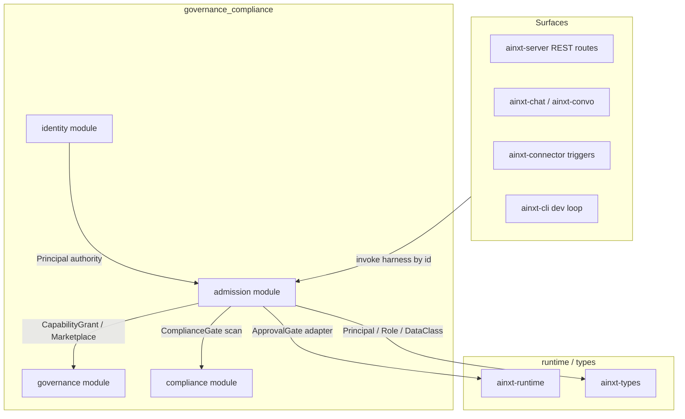
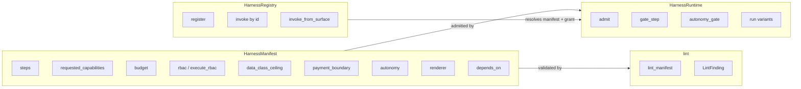
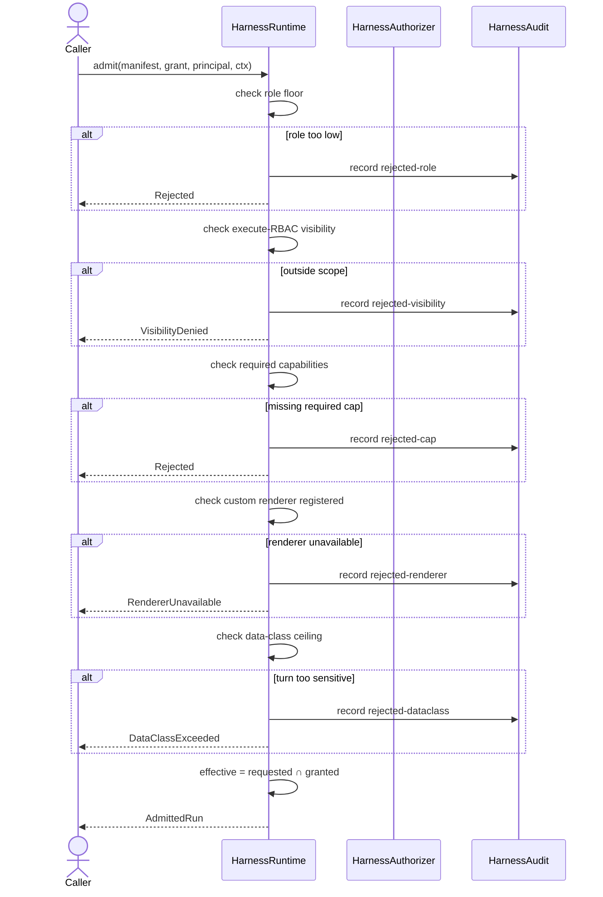
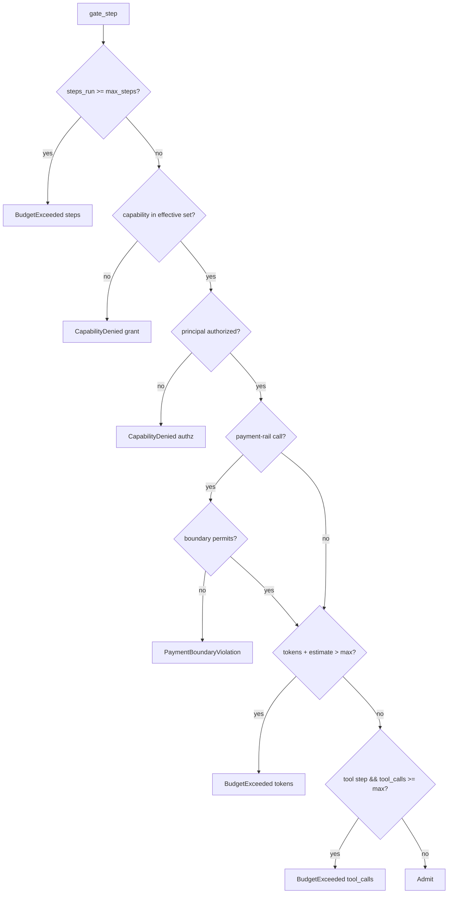
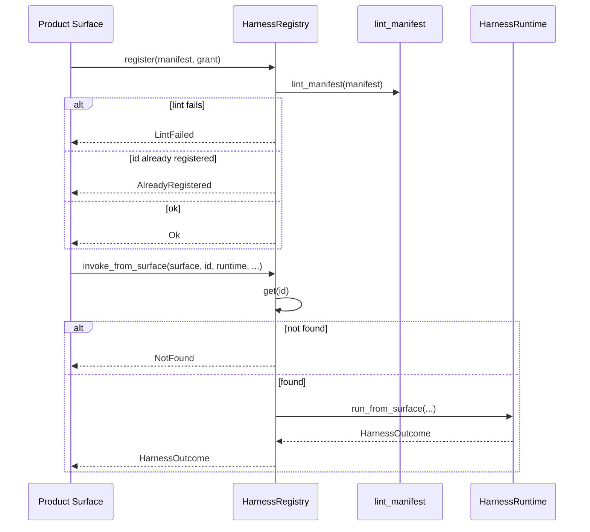
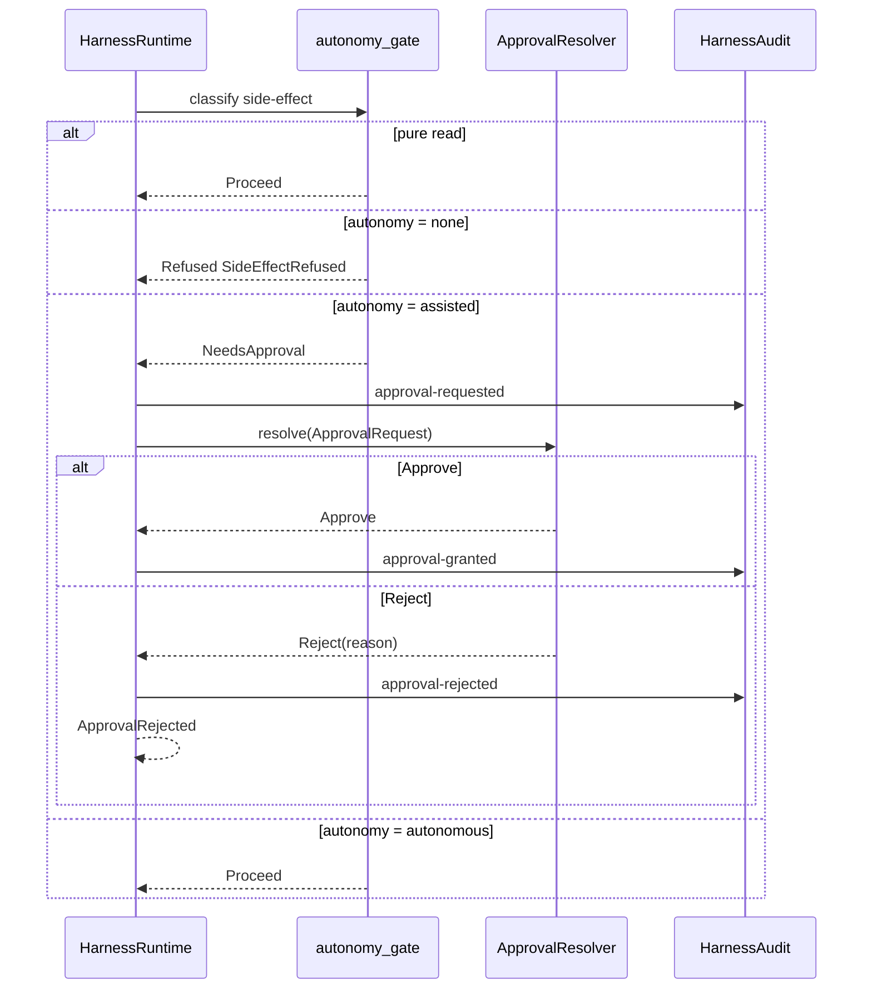
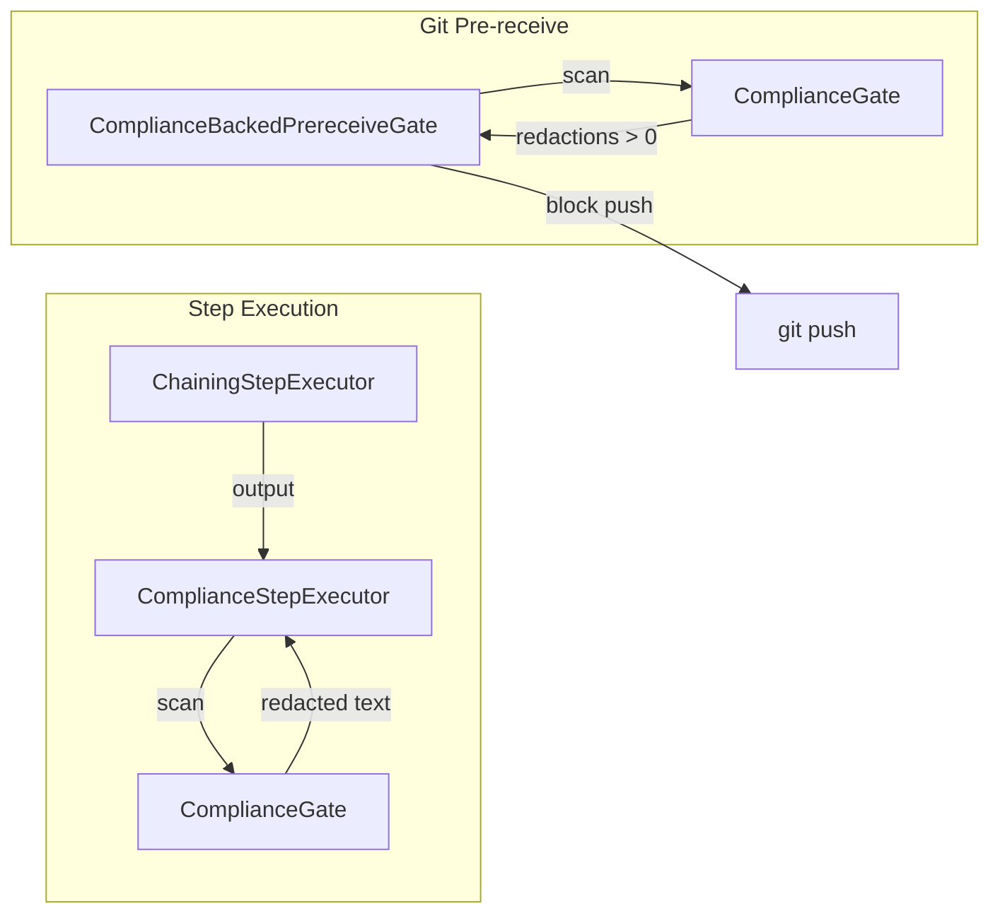
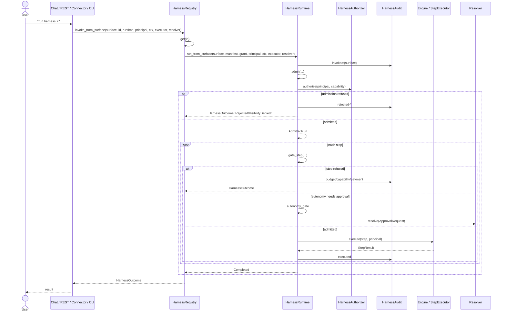

# Admission Module

## Overview

The `admission` module (`ainxt-admission`) is the **admission and capability-permission core** of the system. Its sole responsibility is to decide whether a declared, engineer-authored orchestration (called a *harness*) is allowed to run, and to bound what it may spend and access. It does **not** execute harness steps itself — execution is delegated to the engine/runtime layer. This separation is deliberate: *admission owns the gate; the engine owns execution*.

The module enforces a fail-closed safety spine around harness invocations, including:

- **Least-privilege capability authorization** — a harness can only use capabilities it requested, that governance granted, and that the invoking principal holds.
- **Hard resource budgets** — caps on steps, tokens, and tool calls.
- **Data-class ceiling** — a harness cannot process turns more sensitive than its declared or governance-capped ceiling.
- **Payment boundary** — live payment-rail access is explicitly declared and enforced.
- **RBAC-on-execute** — visibility scoping (`public`/`department`/`private`) controls who may invoke a harness.
- **Autonomy / HITL gating** — write/side-effect steps require human approval under `assisted` autonomy and are refused under `none`.
- **Auditability** — every admission decision and step execution is recorded.
- **Renderer registration** — a harness declaring a custom bundled renderer must have registered it.

The module is pure, executor-agnostic, and exhaustively testable. It is invoked from product surfaces such as REST, Chat, connector triggers, and the CLI.

---

## Module Context

The admission module sits within the broader `governance_compliance` area. It depends on lower-level identity, types, runtime, and governance primitives, and is consumed by the server and client surfaces.

---

## Architecture

The admission module is organized around four core artifacts:

1. **`HarnessManifest`** — the declarative definition of a harness (steps, capabilities, budget, RBAC, autonomy, payment boundary, renderer, dependencies).
2. **`HarnessRuntime`** — the policy engine that admits a manifest and gates each step.
3. **`HarnessRegistry`** — an id-keyed registry of published, invocable harnesses.
4. **`lint`** — deterministic semantic validation of manifests (shared by CI and CLI).

---

## Core Components

### `HarnessManifest`

A `HarnessManifest` is the serialized, declarative definition of a harness. Key fields:

| Field | Purpose |
|-------|---------|
| `kind` | Must be `"harness"`. |
| `id` | Stable, unique slug. |
| `version` | Semver, bumped on every publish. |
| `owner` | CODEOWNERS entry for authoring RBAC. |
| `requested_capabilities` | Capabilities the harness asks for. |
| `steps` | Ordered list of [`HarnessStep`] entries. |
| `budget` | Hard caps on steps, tokens, and tool calls. |
| `rbac` | Role floor and required capabilities. |
| `execute_rbac` | Visibility scope (`public`/`department`/`private`) and permissions. |
| `data_class_ceiling` | Maximum data sensitivity the harness may process. |
| `payment_boundary` | Live payment-rail access (`none`/`read-only`/`write`). |
| `autonomy` | HITL policy (`none`/`assisted`/`autonomous`). |
| `renderer` | `chat` default or a bundled custom renderer id. |
| `depends_on` | Pinned `[REDACTED]@content_hash` dependencies. |

The schema uses `deny_unknown_fields`, so a manifest cannot express a compliance, RBAC, or audit bypass.

### `HarnessStep`

Each step declares:

- `id` — stable step identifier.
- `kind` — `Llm`, `Tool`, or `Skill`.
- `capability` — the single capability required.
- `estimated_tokens` — used for the pre-execution token budget check.
- `input` — optional prompt/argument for the engine-turn bridge.

### `HarnessRuntime`

The runtime is constructed with mandatory seams:

- `HarnessAuthorizer` — on-behalf-of capability authorization.
- `HarnessAudit` — records admission and step events.
- `PaymentRailClassifier` — classifies payment-rail capabilities.
- `SideEffectClassifier` — classifies write/side-effect capabilities.
- `RendererResolver` — validates custom renderer availability.

Default OSS implementations are provided:

- `CapabilityAuthorizer` — principal must hold the capability.
- `InMemoryHarnessAudit` — shared in-memory event log.
- `MarkerPaymentRailClassifier` — heuristic rail marker classifier.
- `MarkerSideEffectClassifier` — heuristic write-verb classifier.
- `AnyRendererResolver` — permissive dev default.
- `RegisteredRendererResolver` — fail-closed allow-set resolver.

#### Admission Flow (`admit`)

#### Step Gating (`gate_step`)

After admission, each step is gated against:

1. Step budget (`max_steps`).
2. Effective capability set (`requested ∩ granted`).
3. Principal authorization (`HarnessAuthorizer`).
4. Payment boundary (if the capability is a rail call).
5. Token budget (using `estimated_tokens`).
6. Tool-call budget (for `Tool` steps).

### `HarnessRegistry`

The registry bridges *authoring* a harness with *invoking* it by id. A surface resolves a harness through the registry and then runs it through the runtime. Registration requires the manifest to pass `lint_manifest` and the id to be unique.

### Approval / HITL

The module defines an `ApprovalResolver` seam for human-in-the-loop decisions on write steps under `assisted` autonomy:

- `DenyingApprovalResolver` — fail-closed default; rejects all approvals.
- `AllowingApprovalResolver` — dev/test only; always approves.
- `RuntimeApprovalGateResolver` — adapts the runtime's live `ApprovalGate` (e.g., `WireApprovalGate`) into the harness approval seam, so the same human/wire mechanism gates both engine tool calls and harness writes.

### Compliance Integration

- `ComplianceStepExecutor` wraps a `StepExecutor` and applies a `ComplianceGate` to each step's output (redact-and-proceed).
- `run_with_compliance` uses a `ChainingStepExecutor` so each step only sees the **redacted** outputs of prior steps.
- `ComplianceBackedPrereceiveGate` adapts the real `ComplianceGate` into a git pre-receive gate, blocking pushes that contain material the runtime would redact.

---

## Run Variants

The runtime exposes several synchronous run paths:

| Method | Purpose |
|--------|---------|
| `run` | Basic admit + run with default `internal` data class. |
| `run_with_context` | Admit + run under a specific `RunContext` (data class). |
| `run_with_approvals` | Enforces autonomy/HITL on write steps. |
| `run_from_surface` | Records invoking surface and runs with approvals. |
| `run_with_compliance` | Applies compliance gate to every step output. |

The registry surfaces these through `invoke`, `invoke_with_approvals`, and `invoke_from_surface`.

---

## Lint (`lint.rs`)

`lint_manifest` performs deterministic, pure semantic validation:

- `kind` must be `"harness"`.
- `id` must be a non-empty lowercase slug.
- `version` must be semver `MAJOR.MINOR.PATCH`.
- `owner` is required.
- At least one step must be declared.
- Every step's capability must appear in `requested_capabilities`.
- `execute_rbac.permissions` must be scoped to declared capabilities.
- `Department` visibility requires a `department`.
- `depends_on` refs must be fully pinned (`repo`, `tag`, `content_hash`).

A manifest that fails lint cannot be registered and cannot merge through the control-repo CI.

---

## Security Invariants

The module encodes the following fail-closed invariants:

1. **No bypass fields** — `deny_unknown_fields` prevents manifests from disabling compliance/RBAC/audit.
2. **Least privilege** — effective capabilities are `requested ∩ granted`.
3. **Caller authority ceiling** — the principal must hold each step's capability.
4. **Budget minima** — the effective budget is the field-wise minimum of the manifest budget and any governance ceiling.
5. **Data-class minimum sensitivity** — the effective ceiling is the less sensitive of the manifest ceiling and the governance cap.
6. **Payment boundary** — a `none` boundary blocks all rail calls; `read-only` blocks writes.
7. **Visibility** — `department`/`private` harnesses refuse out-of-scope callers (admin break-glass allowed).
8. **Autonomy** — `none` refuses writes; `assisted` requires approval; `autonomous` proceeds but is judge-audited upstream.
9. **Renderer** — an unregistered custom renderer is refused before any step runs.
10. **Audit** — every admission refusal and step execution is recorded.

---

## Dependencies

The admission module depends on:

- [`ainxt-types`](ainxt-types.md) — `Principal`, `Role`, `DataClass`, `Tier`.
- [`ainxt-runtime`](ainxt-runtime.md) — `ComplianceGate`, `ApprovalGate`, `Redacted`.
- [`ainxt-governance`](ainxt-governance.md) — `Marketplace`, `PinnedSource`, `PrereceiveGate`, `PublishRequest`.
- `serde` — manifest serialization/deserialization.

It is consumed by:

- [`ainxt-server`](ainxt-server.md) — `/v1/harness/:id` route.
- [`ainxt-client`](ainxt-client.md) — SDK harness invocation and `WireApprovalGate`.
- [`ainxt-cli`](ainxt-cli.md) — `ainxt harness lint` / `ainxt harness dev`.

---

## Data Flow: Harness Invocation from a Surface

---

## Testing Strategy

The module is designed for exhaustive unit testing. The test suite covers:

- Budget ceiling enforcement (manifest vs. governance cap).
- Capability denial when not granted, not requested, or not held by the principal.
- RBAC floor and execute-RBAC visibility (`department`, `private`, admin break-glass).
- Data-class ceiling blocking overly sensitive turns.
- Payment boundary gating (`none`, `read-only`, write verbs).
- Autonomy/HITL behavior for reads vs. writes.
- `RuntimeApprovalGateResolver` bridging to `ApprovalGate`.
- Custom renderer registration gating.
- Compliance step output redaction and chaining.
- `ComplianceBackedPrereceiveGate` blocking spaced secrets.
- Manifest serde round-trips and rejection of bypass fields.
- Dependency hash-pinning and tamper detection.
- Registry registration, idempotency, duplicate-id rejection, and invoke-by-id.

All tests are pure and do not require I/O, making the safety invariants fast and reliable to verify in CI.
