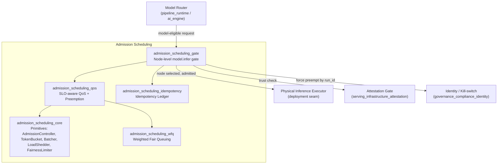
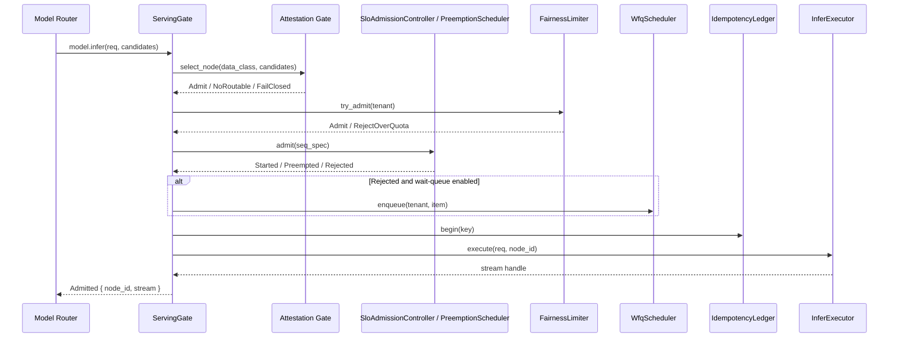

# Admission Scheduling Module

## Purpose

The `admission_scheduling` module is the pure, deterministic control-plane logic for serving-operations admission and flow control. It sits underneath the Model Router (which decides *which* model is eligible for a request) and above the physical inference execution (a deployment seam). Its job is to answer one question for every arriving turn: *can the fleet take this call right now, and if not, whose call yields?*

The module is intentionally **pure**: no I/O, no threads, no GPU access, and no wall-clock reads. Every notion of time is a logical tick passed in by the caller. This makes the entire control plane unit-testable and reproducible: the same inputs always produce the same decisions and state transitions. The actual request lifecycle, async wakeups, GPU memory, and model streams are injected by the deployment layer.

## Architecture Overview

The module is organized into five documentation sub-modules:

| Sub-module | Responsibility | Key Components |
|------------|----------------|----------------|
| [admission_scheduling_core](admission_scheduling_core.md) | Foundational flow-control primitives | `AdmissionController`, `TokenBucket`, `Batcher`, `LoadShedder`, `FairnessLimiter` |
| [admission_scheduling_qos](admission_scheduling_qos.md) | SLO-aware admission with chunk/step-granular preemption | `SloAdmissionController`, `PreemptionScheduler`, `QosRequest` |
| [admission_scheduling_gate](admission_scheduling_gate.md) | Node-level `model.infer` capability gate | `ServingGate`, `InferRequest`, `Preemption` |
| [admission_scheduling_wfq](admission_scheduling_wfq.md) | Weighted fair queuing and chunked-prefill interleaving | `WfqScheduler`, `WorkItem`, `BatchStep` |
| [admission_scheduling_idempotency](admission_scheduling_idempotency.md) | Exactly-once billing and divergence guard | `IdempotencyLedger`, `CommitOutcome` |

## Request Flow

A request passes through the admission scheduling layer in roughly this order:

## Core Design Principles

1. **Bounded resources, honest backpressure.** The `AdmissionController` and `SloAdmissionController` use hard caps on in-flight concurrency and wait-queue depth. When both are full, the request is shed with a typed reason rather than being queued without bound.

2. **Priority-aware preemption.** `PriorityClass` orders work as `Batch < Standard < Interactive`. A higher-priority arrival can preempt a strictly-lower-priority incumbent at its next chunk/step boundary, so an incident P0 never waits behind a 20-minute P2 batch run.

3. **Per-tenant fairness.** `FairnessLimiter` caps each tenant at its weighted quota, and `WfqScheduler` provides a minimum service-rate guarantee for backlogged tenants, preventing a single greedy department from starving siblings.

4. **Deterministic, seam-free core.** All arithmetic is saturating, all tie-breaking is deterministic, and all physical side effects (GPU execution, attestation crypto, wall-clock time) are injected seams.

5. **Exactly-once semantics.** `IdempotencyLedger` ensures a logical request is billed once and only once, and rejects divergent answers to the same logical request.

## Integration with the Rest of the System

- **Upstream:** The Model Router ([`ai_engine`](ai_engine.md) / [`pipeline_runtime`](pipeline_runtime.md)) calls `ServingGate::model_infer` after it has decided which model is eligible.
- **Trust:** The node-level attestation gate ([`serving_infrastructure_attestation`](serving_infrastructure_attestation.md)) is consulted for regulated data classes; regulated requests fail closed when no attested node is available.
- **Identity / Kill-switch:** `ServingGate` implements the `PreemptionSink` trait from [`governance_compliance_identity`](governance_compliance_identity.md), allowing a kill-switch to force-preempt in-flight work by `run_id`.
- **Downstream:** On admission, the physical `InferExecutor` seam dispatches to the prefill/decode pools. Completion calls update the ledger and free scheduler/fairness slots.

## When to Read Each Sub-module

- Start with [admission_scheduling_core](admission_scheduling_core.md) for the low-level primitives that every other layer builds on.
- Read [admission_scheduling_qos](admission_scheduling_qos.md) to understand how priority classes, preemption, and bounded queues are composed into the main admission decision.
- Read [admission_scheduling_gate](admission_scheduling_gate.md) for the node-level `model.infer` capability that ties attestation, fairness, preemption, and idempotency together.
- Read [admission_scheduling_wfq](admission_scheduling_wfq.md) for the weighted-fair-queuing minimum-service guarantee and chunked-prefill interleaving.
- Read [admission_scheduling_idempotency](admission_scheduling_idempotency.md) for exactly-once billing, divergence guarding, and drain-the-group disposition.
