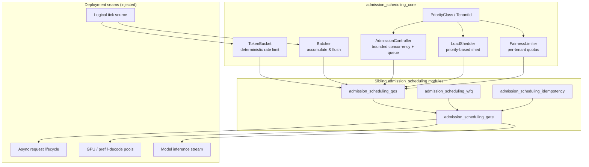
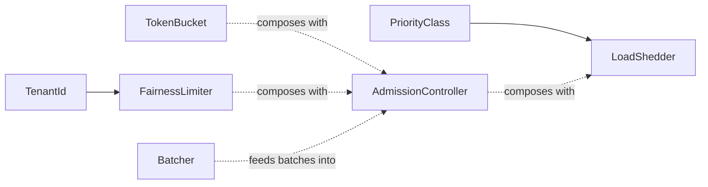
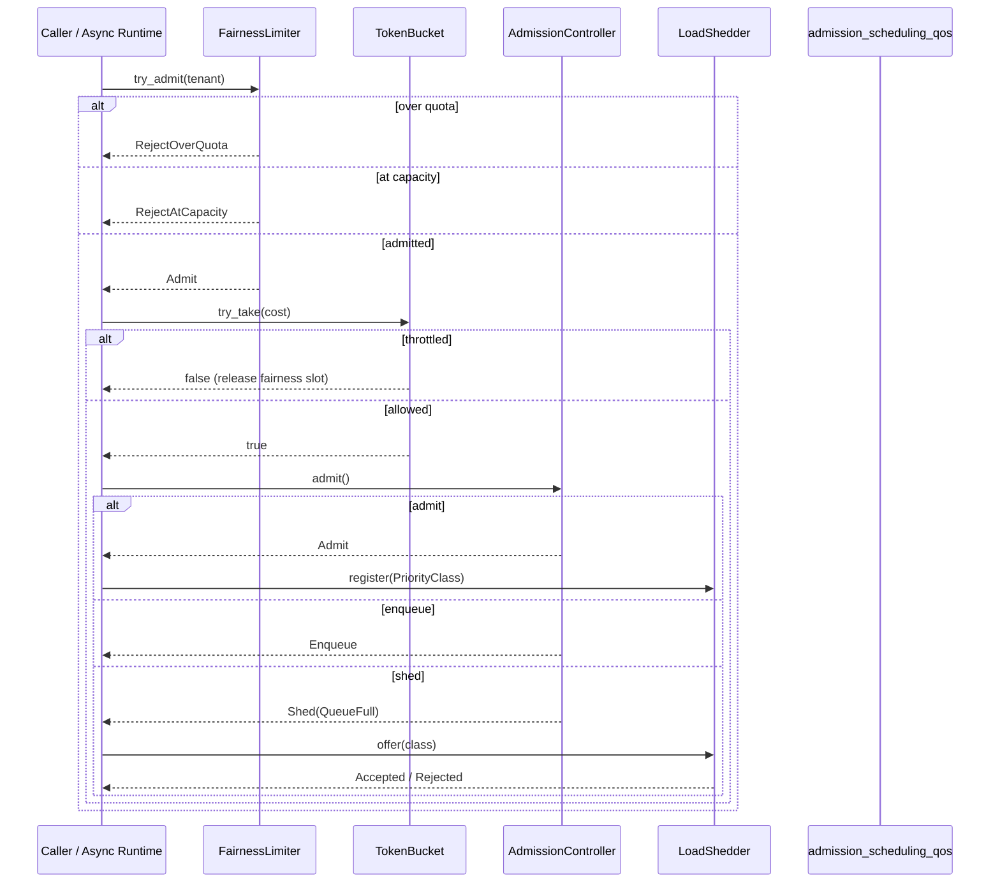
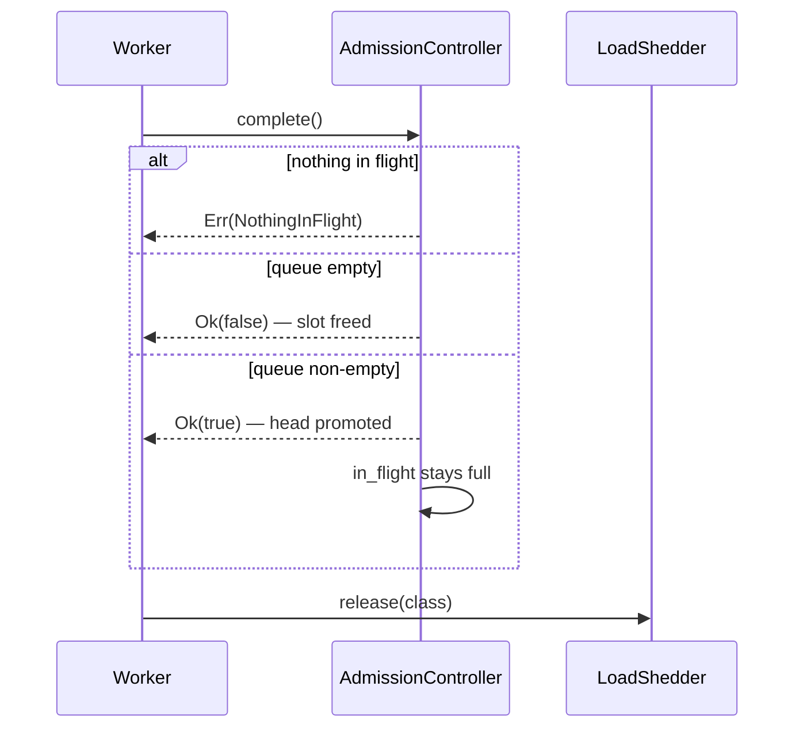
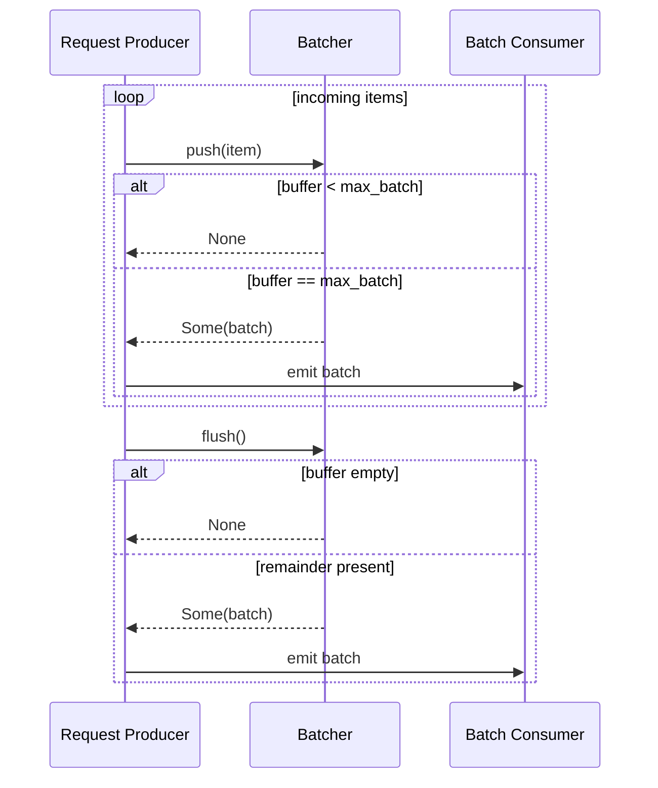
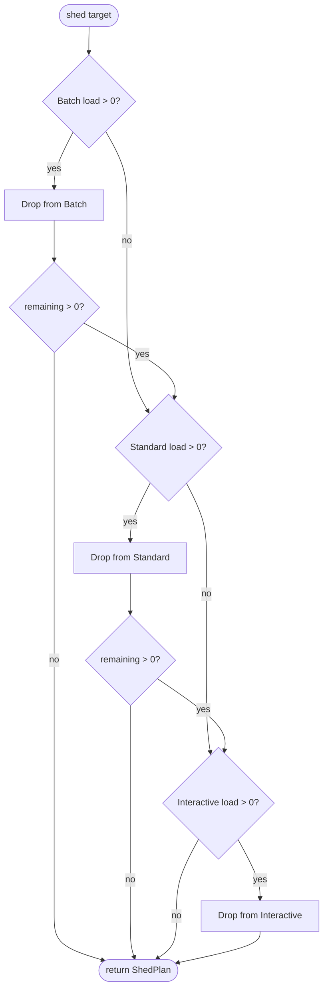
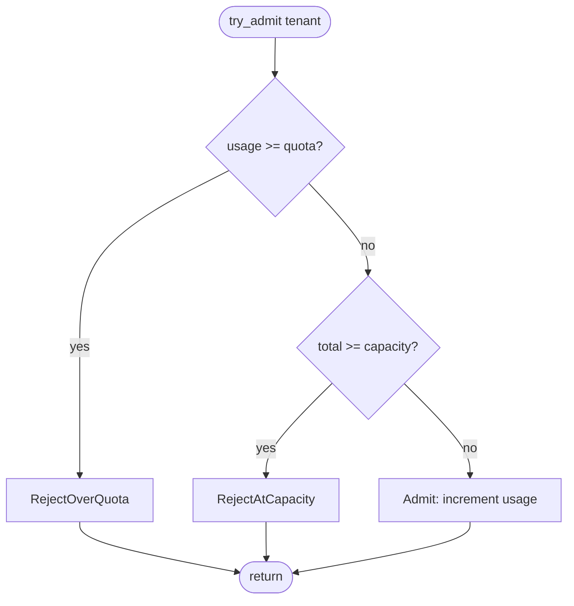
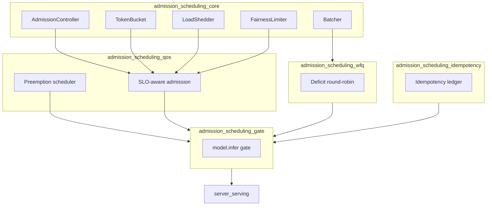

# admission_scheduling_core

## Brief Introduction

`admission_scheduling_core` is the pure, deterministic control-plane kernel for node-level request admission and flow control in the serving stack. It lives in `crates/ainxt-serving/src/lib.rs` and provides the foundational primitives that decide **whether** the fleet can accept a call right now, **whose** call yields under pressure, and **how** requests are batched and rate-limited — without performing any I/O, spawning threads, touching GPU memory, or reading a wall clock.

This module is the policy core underneath the higher-level serving scheduler. It is intentionally deterministic: every notion of time is a logical tick passed in by the caller, making admission behavior fully reproducible and unit-testable. The actual async request lifecycle, hardware pools, and model inference are injected as seams by the deployment layer.

For the full serving-ops context, see [server_serving](server_serving.md) and [pipeline_runtime](pipeline_runtime.md). For the SLO-aware QoS admission path that composes these primitives, see [admission_scheduling_qos](admission_scheduling_qos.md). For the node-level model inference gate, see [admission_scheduling_gate](admission_scheduling_gate.md).

---

## Module Purpose and Core Functionality

The module answers four questions for every arriving request:

1. **Can it run now?** — `AdmissionController` bounds in-flight concurrency and queue depth.
2. **Is it within rate?** — `TokenBucket` smooths bursts against a sustainable per-tick rate.
3. **Should it wait for batching?** — `Batcher` accumulates items and emits whole batches on size or flush tick.
4. **Whose request yields under pressure?** — `LoadShedder` and `FairnessLimiter` protect high-priority and under-served tenants.

These primitives are composed by sibling modules into the live request path:

- [admission_scheduling_qos](admission_scheduling_qos.md) adds SLO-aware preemption and priority scheduling.
- [admission_scheduling_gate](admission_scheduling_gate.md) composes attestation, fairness, preemption, and node selection into the `model.infer` gate.
- [admission_scheduling_wfq](admission_scheduling_wfq.md) provides weighted fair queuing and chunked-prefill interleaving.
- [admission_scheduling_idempotency](admission_scheduling_idempotency.md) tracks in-flight requests and exactly-once outcomes.

---

## Core Concepts

### Priority Classes

Requests are classified into three SLO priority tiers. The ordering is meaningful: lower-priority work is shed first.

| Class | Label | Characteristics |
|-------|-------|-----------------|
| `Batch` | P2 | Long-horizon runs, bulk indexing, eval sweeps; elastic, preemptible, shed first. |
| `Standard` | P1 | Agentic work, SDLC turns, coding-agent tool calls. |
| `Interactive` | P0 | Interactive chat, voice, incident RCA; TTFT-critical, shed last. |

### Tenant Identity

Fairness is enforced per `TenantId`, typically derived from the JWT `department` claim. Each tenant receives a weighted quota so that a greedy department cannot starve siblings.

---

## Architecture

The following diagram shows how the core primitives fit into the broader admission/scheduling subsystem and the seams they expose to the deployment layer.

### Component Dependency Graph

---

## Component Catalog

### `AdmissionController`

Bounded-concurrency + bounded-queue admission. Tracks `in_flight` and `queued` counts against configured ceilings.

- `admit()` returns:
  - `Admit` — slot available, run now.
  - `Enqueue` — no slot, but queue has room.
  - `Shed(QueueFull { max_queue_depth })` — both full; honest 503-style backpressure.
- `complete()` frees a slot and promotes the head of the queue in one atomic step.
- `abandon_queued()` drops a ghost queued request (e.g., client disconnect).

**Invariant:** the queue is a hard cap; it can never grow without bound.

### `TokenBucket`

Deterministic rate limiter driven by logical ticks.

- Starts full to allow an initial burst up to `capacity`.
- `try_take(k)` debits tokens; returns `false` if insufficient budget.
- `tick(n)` refills `refill_per_tick × n`, clamped to `capacity`.
- All arithmetic is saturating to prevent wrap-around on huge tick counts.
- `new_empty()` provides a cold-start variant that throttles until the first refill.

### `Batcher<T>`

Accumulates items and emits whole batches.

- `push(item)` flushes automatically when the buffer reaches `max_batch`.
- `flush()` drains the remainder on a periodic tick.
- Preserves order and never silently drops items — critical for token accounting and exactly-once semantics.
- `max_batch == 0` is a `ConfigError`.

### `LoadShedder`

Sheds load by priority, lowest first.

- `offer(class)` accepts a single arrival:
  - With free capacity: accepted, no eviction.
  - Full with a strictly lower-priority incumbent: evicts the lowest-priority victim and accepts.
  - Full with no lower-priority incumbent: rejects the arrival.
- `shed(target)` proactively drops up to `target` units, draining `Batch` first, then `Standard`, then `Interactive`.
- `register(class)` / `release(class)` maintain live load counts.

### `FairnessLimiter`

Per-tenant weighted-fair admission.

- Each tenant has a quota; over-quota requests are refused even when global capacity exists.
- `from_weights(capacity, weights)` computes quotas as `floor(capacity × wᵢ / Σw)`, guaranteeing the sum of quotas does not exceed capacity.
- `is_starvation_proof()` is true when `Σ quotas ≤ capacity`; under this condition every under-quota tenant is guaranteed admission.
- `try_admit(tenant)` checks quota before global capacity so the refusal reason is honest.

---

## Data Flow

### Request Admission Flow

### Completion and Queue Promotion Flow

### Batching Flow

---

## Process Flows

### Proactive Load Shedding

When downstream pressure is detected, the system calls `LoadShedder::shed(target)`:

1. Start with `Batch` (P2) load.
2. If more shedding is needed, move to `Standard` (P1).
3. Only if necessary, shed `Interactive` (P0).
4. Return a `ShedPlan` with per-class `ShedLine` entries and `total_shed`.

### Per-Tenant Fair Admission

---

## Integration with the System

`admission_scheduling_core` sits at the bottom of the serving admission stack. It is used by:

- [admission_scheduling_qos](admission_scheduling_qos.md) — composes fairness, priority preemption, and bounded-queue backpressure into the main admission path.
- [admission_scheduling_gate](admission_scheduling_gate.md) — the `model.infer` capability gate that adds attestation, node selection, and dispatch through the `InferExecutor` seam.
- [admission_scheduling_wfq](admission_scheduling_wfq.md) — deficit round-robin scheduling and chunked-prefill interleaving.
- [admission_scheduling_idempotency](admission_scheduling_idempotency.md) — tracks in-flight requests and exactly-once outcomes, interacting with admission decisions.

Upstream, these modules are consumed by [server_serving](server_serving.md) and the runtime engine described in [pipeline_runtime](pipeline_runtime.md).

---

## Configuration and Invariants

### Key Invariants

| Invariant | Enforced By | Why It Matters |
|-----------|-------------|----------------|
| Queue is bounded | `AdmissionController` | Prevents unbounded queue growth under load. |
| No token wrap-around | `TokenBucket` saturating arithmetic | Huge tick counts cannot corrupt the budget. |
| Batches are never empty | `Batcher::flush` returns `None` on empty buffer | Avoids useless downstream work. |
| Lower priority shed first | `LoadShedder` walks `PriorityClass::ASCENDING` | Protects P0 interactive traffic. |
| No tenant starvation | `FairnessLimiter::is_starvation_proof` | Guarantees minimum service when quotas are not oversubscribed. |

### Configuration Values

- `AdmissionController::new(max_in_flight, max_queue_depth)`
- `TokenBucket::new(capacity, refill_per_tick)`
- `Batcher::new(max_batch)` — must be `>= 1`
- `LoadShedder::new(capacity)`
- `FairnessLimiter::new(capacity, default_quota)` or `FairnessLimiter::from_weights(capacity, weights)`

Invalid values surface as `ConfigError` rather than being silently clamped, because these policies arrive from git-native manifests and must be auditable.

---

## Testing Strategy

The module is designed for deterministic unit testing:

- **AdmissionController:** admits to capacity, enqueues to queue cap, sheds beyond, promotes queue head on completion, errors on double-complete.
- **TokenBucket:** allows initial burst, throttles when empty, refills on tick, clamps to capacity, saturates on huge ticks.
- **Batcher:** flushes at `max_batch`, preserves order, never drops items, rejects zero batch size.
- **LoadShedder:** sheds lowest priority first, evicts lower-priority incumbents on high-priority arrival, rejects arrivals that are the lowest priority present.
- **FairnessLimiter:** caps greedy tenants, guarantees share for others when starvation-proof, handles oversubscribed quotas honestly.

Because all time is logical, tests are race-free and fully reproducible.

---

## See Also

- [admission_scheduling_qos](admission_scheduling_qos.md) — SLO-aware QoS admission and preemption.
- [admission_scheduling_gate](admission_scheduling_gate.md) — the `model.infer` node-level admission gate.
- [admission_scheduling_wfq](admission_scheduling_wfq.md) — weighted fair queuing and chunked-prefill interleaving.
- [admission_scheduling_idempotency](admission_scheduling_idempotency.md) — inference-call idempotency ledger.
- [server_serving](server_serving.md) — HTTP server and serving state orchestration.
- [pipeline_runtime](pipeline_runtime.md) — overall runtime engine context.
