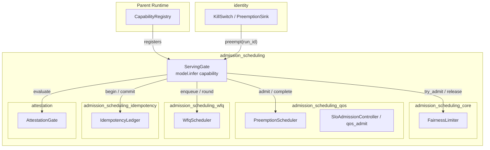
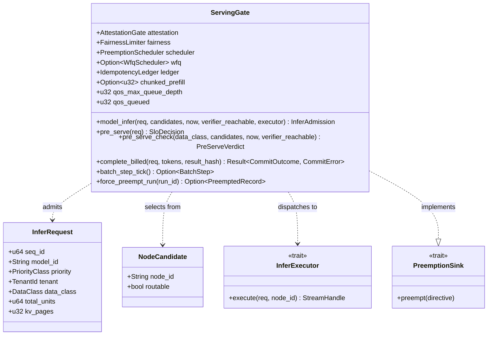
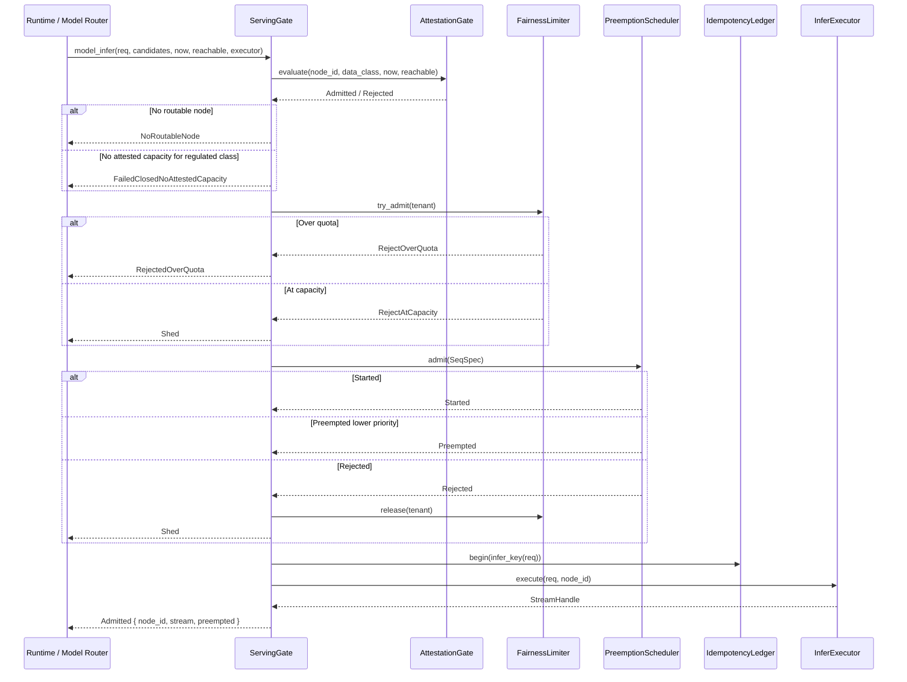
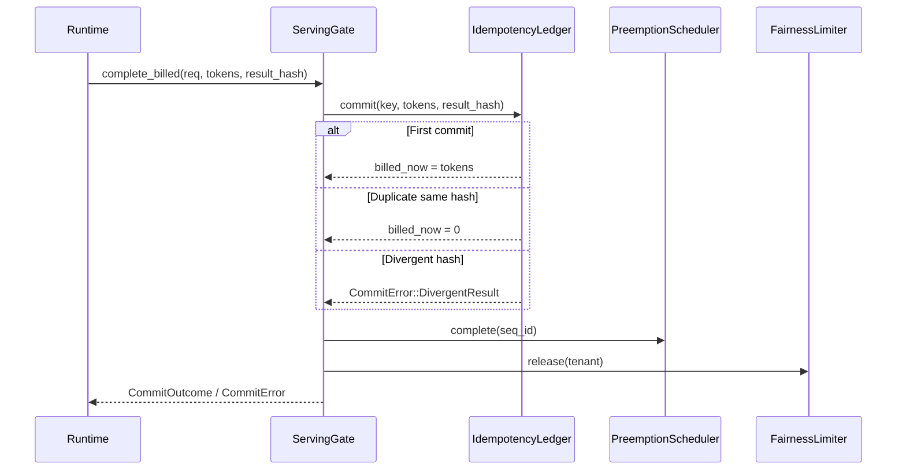

# admission_scheduling_gate

The `admission_scheduling_gate` module implements the node-level `model.infer` admission capability for the serving infrastructure. It is the composition root that ties together attestation, per-tenant fairness, preemptive QoS scheduling, weighted-fair-queuing (WFQ) wait ordering, and idempotent billing into a single deterministic pipeline. The gate decides whether the fleet can physically execute an inference request right now, on a node trusted enough to see the request's data class.

This module lives under the [`server_serving`](server_serving.md) → [`serving_infrastructure`](serving_infrastructure.md) → [`admission_scheduling`](admission_scheduling.md) branch of the system. It depends on the sibling [`admission_scheduling_core`](admission_scheduling_core.md), [`admission_scheduling_qos`](admission_scheduling_qos.md), [`admission_scheduling_wfq`](admission_scheduling_wfq.md), and [`admission_scheduling_idempotency`](admission_scheduling_idempotency.md) modules, and it is the concrete type wired into the runtime's capability registry.

---

## Core Components

| Component | File | Responsibility |
|-----------|------|----------------|
| `ServingGate` | `crates/ainxt-serving/src/gate.rs` | The `model.infer` capability implementation; composes attestation, fairness, preemption, WFQ, and idempotency. |
| `InferRequest` | `crates/ainxt-serving/src/gate.rs` | One logical `model.infer` call: model, priority, tenant, data class, size, and KV footprint. |
| `NodeCandidate` | `crates/ainxt-serving/src/gate.rs` | A node offered by placement/health, with a routable flag. |
| `Preemption` | `crates/ainxt-serving/src/gate.rs` | Record of a lower-priority victim displaced by a higher-priority arrival. |
| `InferExecutor` / `StreamHandle` | `crates/ainxt-serving/src/gate.rs` | Seams for the physical inference stream; the gate only records dispatch. |
| `PreServeVerdict` | `crates/ainxt-serving/src/gate.rs` | Standalone verdict for the node-trust pre-check. |
| `InferAdmission` | `crates/ainxt-serving/src/gate.rs` | Typed outcome of a full `model.infer` call. |

---

## Module Purpose

`admission_scheduling_gate` closes several audit gaps that were found when the individual serving mechanisms existed but had no caller:

1. **Attestation enforcement (SRV-02)** — `AttestationGate` had tests but no live caller. `ServingGate` applies it as a node-trust filter so regulated (`confidential`+) requests are never routed to an unattested node, even an idle one.
2. **Fairness composition** — `FairnessLimiter` and `PreemptionScheduler` were not composed into a single upward capability.
3. **WFQ minimum-service guarantee (SRV-07 / gap-6)** — the WFQ scheduler existed but the live path never enqueued into it.
4. **Idempotent billing (SRV-08)** — the `IdempotencyLedger` was implemented but not opened on the live admission path.
5. **Kill-switch preemption (gap-6 item 2)** — `KillSwitch::signal_preemption` claimed to wire into serving but no `PreemptionSink` implementation existed outside tests.

The gate exposes exactly one upward capability, `model.infer`, registered by the parent runtime in its capability registry. Callers above the gate do not need to know which of the underlying mechanisms admitted or rejected a call.

---

## Architecture

---

## Component Relationships

---

## Data Flow

### Full `model.infer` Admission

### Completion and Billing

---

## Process Flows

### Node Selection Policy

`ServingGate::select_node` iterates over candidates in order and applies two filters:

1. **Health filter** — the node must be `routable`.
2. **Trust filter** — for regulated data classes, the node must be admitted by `AttestationGate`.

The result is one of:

- `Selected(node_id)` — a health-routable, trust-eligible node.
- `NoRoutable` — no candidate is health-routable.
- `NoAttested` — routable nodes exist but none are attested for the regulated class.

For non-regulated classes, `AttestationGate` admits any node, so `NoAttested` is only reachable for regulated traffic. This is the fail-closed behavior required by ADR-021 §8.2.

### Priority-Aware Preemption

The `PreemptionScheduler` admits a request if capacity exists or if a strictly lower-priority incumbent can be preempted. `ServingGate` surfaces preemption details in `InferAdmission::Admitted.preempted` and in `SloDecision::Admitted.preempted` for the main chat path.

Preemption is chunk/step-granular: a preempted sequence's KV state is either checkpointed to `PENDING` or evicted as recoverable, depending on the victim's priority class. The gate does not make a second disposition decision; it relies on the scheduler's own rule.

### Weighted-Fair-Queuing Wait Queue

When `with_wfq` is configured, the gate replaces the plain FIFO bounded queue with a deficit-round-robin scheduler:

1. `pre_serve` first tries the fairness cap and scheduler admission.
2. If the scheduler rejects and the queue is under its ceiling, the turn is enqueued into the WFQ scheduler with a service cost (token budget proxy).
3. `pre_serve_drain_round` returns the deterministic, weight-proportional set of turns cleared to run this round.
4. The caller re-drives `pre_serve` for each dequeued turn as slots free.

This guarantees a minimum service rate per tenant, protecting low-weight tenants from being indefinitely delayed by a greedy sibling.

### Chunked-Prefill Interleaving

When `with_chunked_prefill` is configured, `batch_step_tick` schedules a bounded number of fresh prefill chunks interleaved with a decode step for every currently-running sequence. This keeps a long incoming prefill from blocking in-flight decode by more than one chunk per tick. The tick operates on the same `PreemptionScheduler` instance that `model_infer` admits into, so the gate's view of pool state remains consistent.

---

## Integration with the Broader System

### Upward: Capability Registry

`ServingGate::model_infer` is registered under the constant `MODEL_INFER_CAPABILITY` (`"model.infer"`). This is the single upward capability Serving-Ops exposes, per SERVING_OPS.md §7 / ADR-020. The parent runtime constructs one `ServingGate` per pool and registers it so that higher layers (model routing, chat surfaces, workforce surfaces) do not need to interact with the individual mechanisms.

### Downward: Sibling Modules

- [`admission_scheduling_core`](admission_scheduling_core.md) — provides `FairnessLimiter`, `PriorityClass`, `TenantId`, and shared types such as `ShedReason`.
- [`admission_scheduling_qos`](admission_scheduling_qos.md) — provides `PreemptionScheduler`, `SeqSpec`, `Phase`, `AdmitOutcome`, and the `qos_admit` / `qos_complete` helpers.
- [`admission_scheduling_wfq`](admission_scheduling_wfq.md) — provides `WfqScheduler`, `WorkItem`, and `batch_step` for wait-queue ordering and chunked-prefill interleaving.
- [`admission_scheduling_idempotency`](admission_scheduling_idempotency.md) — provides `IdempotencyLedger`, `CommitOutcome`, and `CommitError` for exactly-once billing and divergence detection.
- [`attestation`](attestation.md) — provides `AttestationGate` for node-trust evaluation.

### Sideward: Identity Kill Switch

`ServingGate` implements `ainxt_identity::authority::PreemptionSink`. When the identity plane's `KillSwitch` signals preemption for a `run_id`, the gate's `force_preempt_run` finds any running sequence carrying that `run_id` on its live scheduler and preempts it. This gives the kill switch reach into already-admitted runs, not just future issuances. See [`identity`](identity.md) for the identity-plane side of this contract.

### Parent: Runtime and Server

The gate is held by the runtime's assembled serving configuration (`ainxt_runtimed::AssembledFull::serving`) and by the server's `ServingAdmission::gate`. The server surfaces HTTP endpoints that ultimately drive `pre_serve`, `model_infer`, and `complete_billed`. See [`runtime_engine`](runtime_engine.md) and [`server_serving_core`](server_serving_core.md) for the wiring details.

---

## Key Design Decisions

- **Deterministic and pure** — `model_infer` takes `now` and `verifier_reachable` as inputs; it has no clock, no GPU, and no hidden I/O. The executor is an injected seam.
- **Fail-closed for trust** — regulated requests with no attested node are rejected, never silently routed to an untrusted node.
- **Honest backpressure** — every rejection path is typed (`NoRoutableNode`, `FailedClosedNoAttestedCapacity`, `RejectedOverQuota`, `Shed`); nothing is silently dropped.
- **Slot hygiene** — fairness and scheduler slots are released on every rejection and completion path, including the `CommitError::DivergentResult` error path.
- **Idempotency before execution** — the ledger attempt is opened before the physical stream seam is touched, so a dropped call leaves a retryable record.

---

## References

- [`admission_scheduling`](admission_scheduling.md) — parent module grouping.
- [`admission_scheduling_core`](admission_scheduling_core.md) — fairness and shared primitives.
- [`admission_scheduling_qos`](admission_scheduling_qos.md) — preemptive QoS scheduling.
- [`admission_scheduling_wfq`](admission_scheduling_wfq.md) — weighted-fair queuing and chunked-prefill interleaving.
- [`admission_scheduling_idempotency`](admission_scheduling_idempotency.md) — idempotent billing ledger.
- [`attestation`](attestation.md) — node attestation gate.
- [`identity`](identity.md) — identity plane and kill-switch preemption.
- [`runtime_engine`](runtime_engine.md) — runtime that wires the gate into the capability registry.
- [`server_serving_core`](server_serving_core.md) — HTTP server surfaces that drive the gate.
