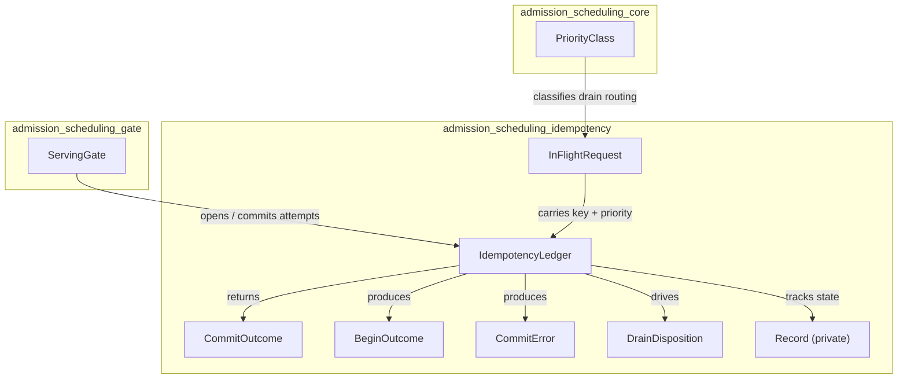
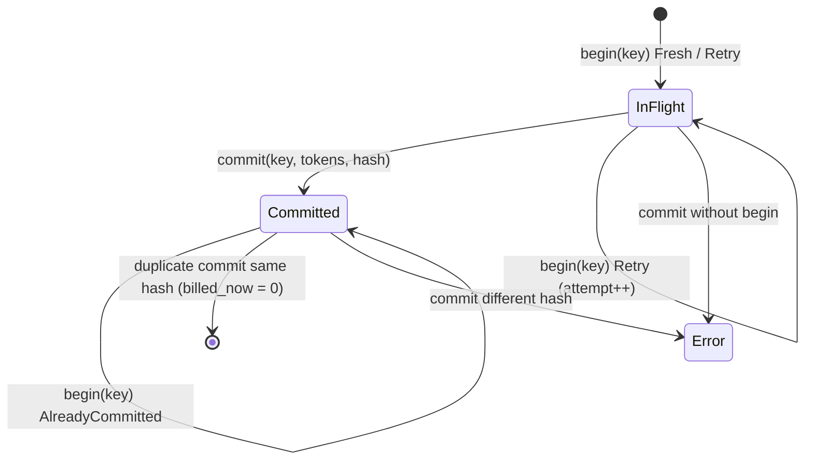
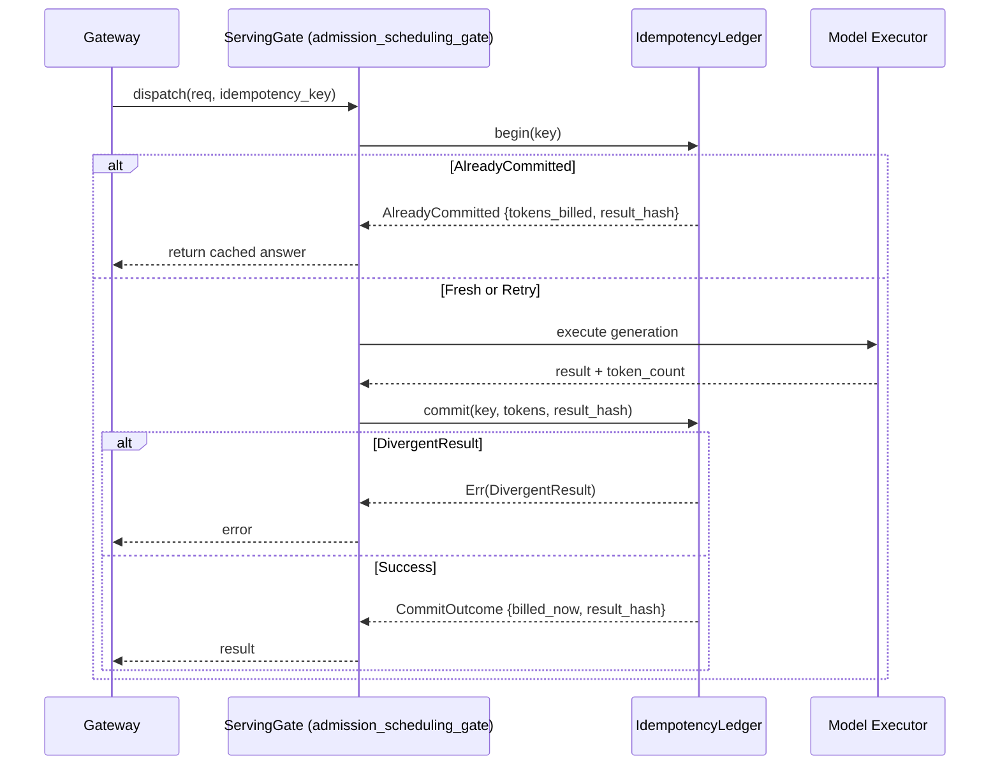
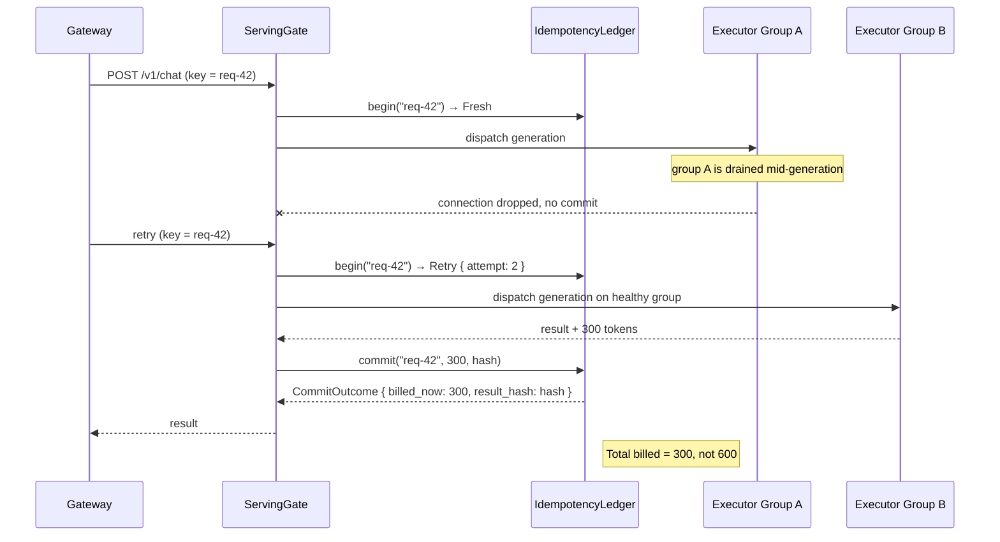

# admission_scheduling_idempotency

## Brief Introduction

The `admission_scheduling_idempotency` module provides a deterministic, in-memory idempotency ledger for inference calls in the serving layer. It was introduced to close audit gap **SRV-08**: gateway retries after a node drain could previously double-bill tokens or return two different answers for the same logical request. The module guarantees exactly-once billing and answer stability across retries, and it supplies the drain-the-group disposition logic that routes in-flight requests to the correct recovery path based on their priority class.

This module is a pure, deterministic core: it has no clock, no I/O, and no networking. It only enforces the idempotency contract that the rest of the admission and serving stack relies on.

---

## Core Functionality

### Exactly-Once Billing

Every inference dispatch is opened with `IdempotencyLedger::begin` under a caller-chosen key (typically a gateway request ID). Tokens are billed only when the dispatch completes and calls `IdempotencyLedger::commit`. Because billing happens at commit:

- A retry of an already-committed key returns the recorded result without re-executing or re-billing.
- A retry of an in-flight key (for example, after a node drain) starts a new attempt but does not bill the discarded partial work.

### Divergence Guard

Committing the same key with a different result hash is rejected with `CommitError::DivergentResult`. This is the concrete enforcement of the requirement that one logical request must never produce two different answers.

### Drain Disposition

When a shard group is drained, `dispose_on_drain` routes each in-flight request to the correct recovery path:

- **P0/P1 (Interactive / Standard):** retry on a healthy group under the same idempotency key.
- **P2 (Batch / Program Runs):** checkpoint to `PENDING` and re-queue at the Program Supervisor level, never retried inline.

Already-committed requests are filtered out: their answer is final and must not be re-run.

---

## Architecture

### Component Overview

### State Machine

### Data Flow

---

## Component Reference

### `IdempotencyLedger`

The central ledger. It stores a `BTreeMap<String, Record>` keyed by caller-provided idempotency keys.

| Method | Purpose |
|--------|---------|
| `begin(key)` | Start or resume a request. Returns `Fresh`, `Retry { attempt }`, or `AlreadyCommitted { tokens_billed, result_hash }`. |
| `commit(key, tokens, result_hash)` | Finalize a request. Bills tokens exactly once; rejects divergent hashes. |
| `is_committed(key)` | Check whether a key has a final answer. |
| `attempt(key)` | Return the current attempt number for an in-flight key. |
| `total_billed()` | Aggregate tokens billed across all committed records (FinOps signal). |

### `CommitOutcome`

Returned by a successful commit:

- `billed_now: u64` — tokens billed by this commit call. `0` when the commit is a duplicate of an already-committed answer.
- `result_hash: u64` — the pinned result hash for the key.

### `InFlightRequest`

Represents a request that is executing on a shard group at the moment the group is drained:

- `key: String` — the idempotency key that makes retry safe.
- `priority: PriorityClass` — the priority class that determines recovery routing.

### `BeginOutcome`

The result of `begin`:

- `Fresh` — first time the key is seen; proceed to execute.
- `Retry { attempt }` — a prior attempt is still in flight; safe to re-execute.
- `AlreadyCommitted { tokens_billed, result_hash }` — the request is done; return the recorded answer.

### `CommitError`

Why a commit failed:

- `NotBegun` — commit called for a key that was never begun.
- `DivergentResult { existing_hash, attempted_hash }` — the divergence guard fired.

### `DrainDisposition`

The recovery decision produced by `dispose_on_drain`:

- `RetryOnHealthyGroup { key, priority }` — for P0/P1 requests.
- `CheckpointToPending { key }` — for P2 batch/program requests.

---

## Integration with the System

### Within `admission_scheduling`

The idempotency ledger sits alongside the other admission submodules:

- **[admission_scheduling_core](admission_scheduling_core.md)** defines `PriorityClass` and the basic admission primitives (`AdmissionController`, `TokenBucket`, `LoadShedder`). The idempotency module imports `PriorityClass` from there.
- **[admission_scheduling_gate](admission_scheduling_gate.md)** owns a `ServingGate`, which embeds an `IdempotencyLedger`. `ServingGate::model_infer` opens a ledger attempt for every dispatch, and `ServingGate::complete_billed` commits the result.
- **[admission_scheduling_qos](admission_scheduling_qos.md)** and **[admission_scheduling_wfq](admission_scheduling_wfq.md)** manage preemption and fair queuing. When a node is drained, the requests they were tracking become the `InFlightRequest` inputs to `dispose_on_drain`.

### Within `server_serving` and `pipeline_runtime`

The module is part of the serving infrastructure that underpins the runtime engine. Higher-level components such as the chat surface, workforce surface, and program runtime dispatch inference calls through the serving gate, indirectly relying on the ledger for exactly-once semantics. For details, see:

- **[runtime_engine](runtime_engine.md)** — the core `Engine` and `TurnWire` that route requests into serving.
- **[server_serving_core](server_serving_core.md)** — the HTTP server and `AppState` that wire the serving layer to the outside world.

### Governance and Compliance

The ledger's guarantees are referenced by governance documentation:

- **SERVING_OPS.md §1** — relay-retry semantics.
- **SERVING_OPS.md §4 step 2** — drain-the-group recovery.
- **ADR-013** — inference-call idempotency design.
- **ADR-027** — P2 program-run checkpointing.

---

## Process Flow: Retry After Drain

---

## Design Principles

1. **Pure and deterministic.** No clock, no I/O, no async. This makes the ledger trivial to test and reason about in isolation.
2. **Caller-owned key namespace.** The ledger does not mint request IDs; the gateway or caller supplies the idempotency key.
3. **Billing at commit, not at begin.** This is what makes retries after a drop safe: partial work is never charged.
4. **Hash-based answer pinning.** A result hash (not the full payload) is stored, keeping the ledger small while still preventing divergence.
5. **No new recovery paths.** Drain disposition only routes to the two existing recovery mechanisms: gateway retry for P0/P1, Program Supervisor checkpoint for P2.

---

## Testing

The module includes unit tests that directly exercise the audit gap scenarios:

- First commit bills once; retry returns recorded answer without re-billing.
- Retry after a drop does not double-bill.
- Divergent result is rejected.
- Commit without begin is an error, not a panic.
- Drain disposition routes by priority class.
- Already-committed requests are not recovered on drain.

These tests are named with the `gap_ainxt_serving_srv_08` prefix so they can be traced back to the original audit finding.
