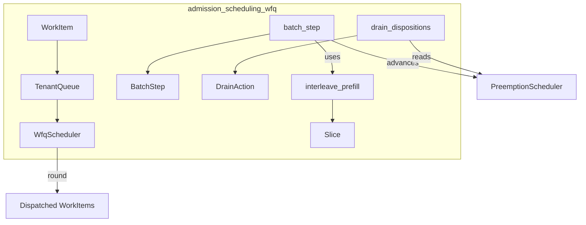
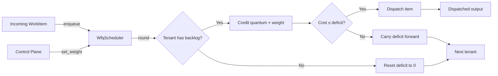
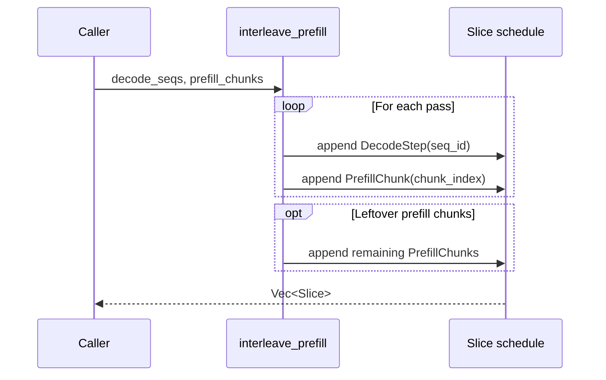
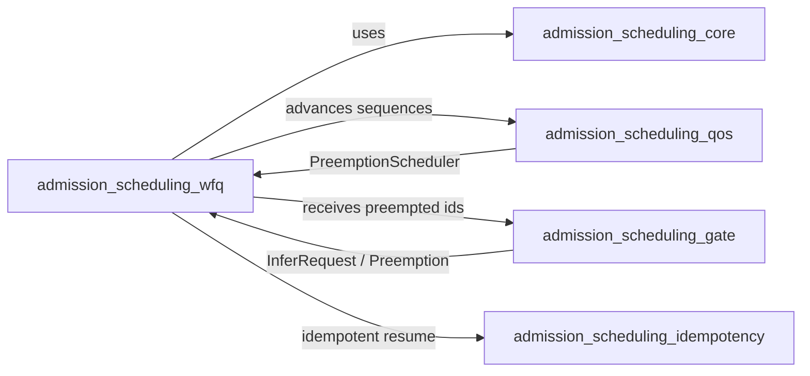
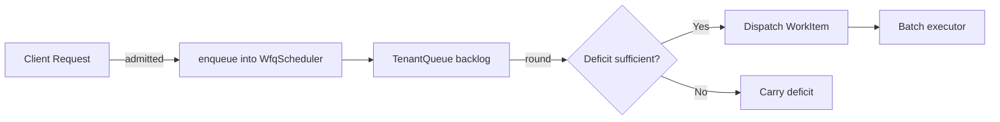
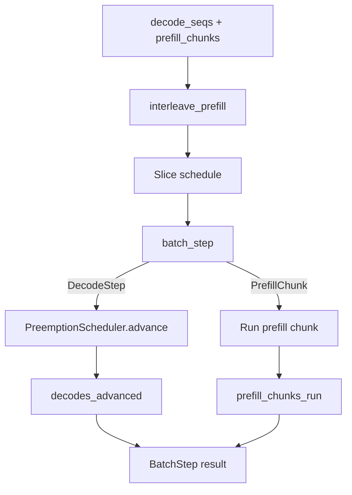
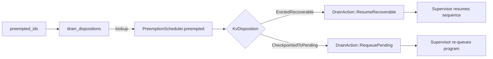
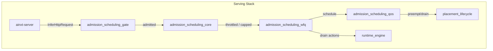

# admission_scheduling_wfq

## Brief Introduction

The `admission_scheduling_wfq` module implements **Weighted Fair Queuing (WFQ)** and **chunked-prefill interleaving** for the serving infrastructure. It is part of the broader `admission_scheduling` subsystem within `server_serving` → `serving_infrastructure`.

This module closes two operational gaps identified in `SERVING_OPS.md` §2:

1. **Fairness as a minimum service rate guarantee**: Unlike a simple concurrency cap (e.g., [`FairnessLimiter`](admission_scheduling_core.md)), this module provides true weighted fair queuing via a deficit round-robin scheduler. Each tenant receives service proportional to its configured weight, and no backlogged tenant can be starved by a greedy sibling.

2. **Chunked-prefill interleaving**: Long incoming prompts are split into fixed-size chunks and interleaved with the decode steps of already-running sequences. This bounds head-of-line blocking so that a running decode step never waits behind more than one prefill chunk, regardless of total prompt length.

The module is deterministic, pure, and clock-free: scheduling decisions are a total function of queue state, making fairness properties unit-testable.

---

## Core Functionality

### Weighted Fair Queuing via Deficit Round-Robin

The [`WfqScheduler`](admission_scheduling_wfq.md#wfqscheduler) maintains per-tenant queues with:

- A configured `weight` (default 1, minimum 1).
- A `deficit` counter that accumulates unused service credit.
- A FIFO queue of [`WorkItem`](admission_scheduling_wfq.md#workitem)s.

Each call to `round()`:

1. Visits every tenant in deterministic `TenantId` order.
2. Credits the tenant with `weight × quantum_unit` service units.
3. Dispatches head-of-queue items whose `cost` fits within the accumulated deficit.
4. Resets the deficit of idle tenants to prevent unbounded credit hoarding.

Backlogged tenants carry forward unused deficit, so large items eventually accrue enough credit to dispatch.

### Chunked-Prefill Interleaving

The [`interleave_prefill`](admission_scheduling_wfq.md#interleave_prefill) function produces a deterministic [`Slice`](admission_scheduling_wfq.md#slice) schedule:

- One decode step per running sequence per pass.
- One prefill chunk per pass.
- Leftover prefill chunks are appended after decode sequences are exhausted.

This guarantees that decode steps are never blocked by more than one prefill chunk while both are active.

### Live Batch Driver

The module composes with the preemption subsystem to drive real batch execution:

- [`batch_step`](admission_scheduling_wfq.md#batch_step) builds an interleaved schedule and advances each decode sequence one token through the [`PreemptionScheduler`](admission_scheduling_qos.md).
- [`drain_dispositions`](admission_scheduling_wfq.md#drain_dispositions) maps preempted sequences to concrete drain actions (`ResumeRecoverable` or `RequeuePending`).

---

## Architecture

### Component Overview

### WFQ Scheduler Internals

### Chunked-Prefill Schedule Generation

---

## Component Relationships

### Within `admission_scheduling_wfq`

| Component | Role | Collaborators |
|-----------|------|---------------|
| `WorkItem` | Unit of schedulable work with an id and service cost. | `TenantQueue`, `WfqScheduler` |
| `TenantQueue` | Per-tenant state: weight, deficit, and FIFO queue. | `WfqScheduler` |
| `WfqScheduler` | Deficit round-robin scheduler enforcing weighted fairness. | `TenantQueue`, `WorkItem` |
| `Slice` | One scheduled slot: either a decode step or a prefill chunk. | `interleave_prefill`, `batch_step` |
| `BatchStep` | Result of one continuous-batching step. | `batch_step` |
| `DrainAction` | Concrete action for a preempted sequence. | `drain_dispositions` |

### With Sibling Modules

- **[admission_scheduling_core](admission_scheduling_core.md)**: Provides the higher-level admission control primitives (`AdmissionController`, `FairnessLimiter`, `LoadShedder`, `TokenBucket`). `WfqScheduler` complements the concurrency cap with true queue-ordering fairness.
- **[admission_scheduling_qos](admission_scheduling_qos.md)**: Owns `SloAdmissionController`, `QosRequest`, and `QosPreemption`. `batch_step` and `drain_dispositions` consume the `PreemptionScheduler` from this module to advance and drain sequences.
- **[admission_scheduling_gate](admission_scheduling_gate.md)**: Owns `ServingGate` and `InferRequest`. The gate decides whether a request is admitted; WFQ decides the order in which admitted tenant work is dispatched.
- **[admission_scheduling_idempotency](admission_scheduling_idempotency.md)**: Owns `IdempotencyLedger` and `CommitOutcome`. `DrainAction::RequeuePending` preserves idempotent resume semantics when sequences are checkpointed to PENDING.

---

## Data Flow

### Enqueue → Schedule → Dispatch

### Continuous Batching Step

### Drain Flow

---

## How It Fits into the Overall System

The `admission_scheduling_wfq` module sits at the intersection of **admission control**, **preemption**, and **continuous batching** in the serving stack.

1. **Admission**: `ServingGate` decides if a request may enter the system.
2. **Fair Scheduling**: `WfqScheduler` orders admitted work so every tenant receives its weighted minimum service rate.
3. **Preemption**: `PreemptionScheduler` decides which running sequences to evict or checkpoint when capacity is constrained.
4. **Interleaving**: `batch_step` ensures long prefills do not starve running decodes.
5. **Drain**: `drain_dispositions` translates scheduler state into supervisor actions for graceful recovery.

The module is intentionally pure and deterministic so that fairness and interleaving invariants can be verified offline through unit tests, while the physical GPU batch executor remains a swappable seam.

---

## Key Invariants

- **Minimum service guarantee**: A backlogged tenant with weight `w` receives at least `w × quantum_unit` service per round.
- **No starvation**: Every backlogged tenant is visited once per round in deterministic order.
- **No deficit hoarding by idle tenants**: An idle tenant's deficit is reset to zero each round.
- **Bounded head-of-line blocking**: During chunked-prefill interleaving, a decode step waits behind at most one prefill chunk.
- **Determinism**: Scheduling decisions depend only on queue state, not on wall-clock time or thread scheduling.

---

## References

- [admission_scheduling_core](admission_scheduling_core.md) — concurrency caps, token buckets, and load shedding.
- [admission_scheduling_qos](admission_scheduling_qos.md) — SLO-aware admission, QoS preemption, and the `PreemptionScheduler`.
- [admission_scheduling_gate](admission_scheduling_gate.md) — request gating and node candidate selection.
- [admission_scheduling_idempotency](admission_scheduling_idempotency.md) — idempotency ledger and commit outcomes for re-queued work.
- [placement_lifecycle](placement_lifecycle.md) — model placement, autoscaling, and fleet health that WFQ-scheduled work runs on.
- [runtime_engine](runtime_engine.md) — the engine and surfaces that consume dispatched work and drain actions.
