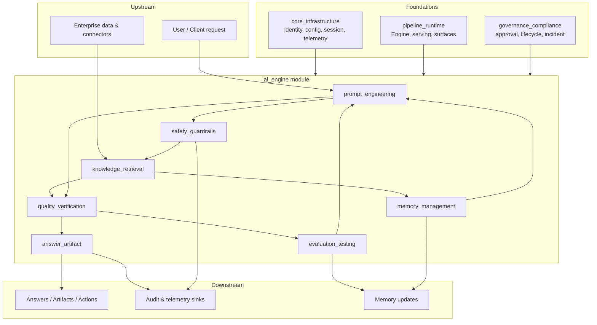
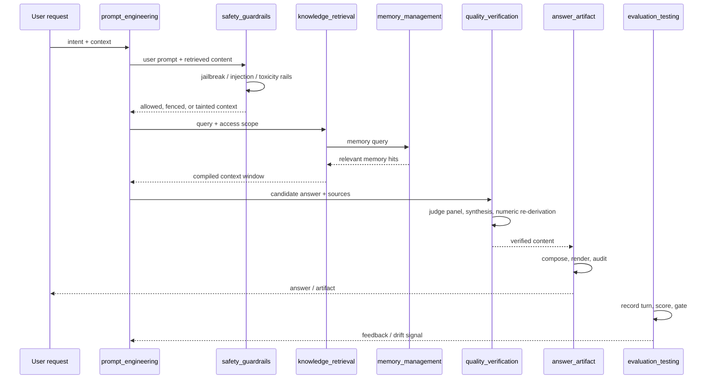

# `ai_engine` Module Overview

## Purpose

The `ai_engine` module is the central intelligence layer of the AiNxt platform. It transforms raw LLM capabilities into **safe, grounded, high-quality, and auditable** user-facing outputs and actions. Its responsibilities span the full model-interaction lifecycle:

- **Prompt engineering** — versioned, model-agnostic prompt assembly and optimization.
- **Knowledge retrieval** — secure, governed retrieval from enterprise documents, code, structured data, and federated sources.
- **Memory management** — typed, RBAC-governed, durable memory and continuous learning.
- **Safety guardrails** — indirect prompt-injection defense, egress DLP, and configurable input/output rails.
- **Quality verification** — multi-dimensional answer judging, synthesis, faithfulness checks, and drift detection.
- **Answer & artifact generation** — structured answer composition and rendering to text or binary office formats.
- **Evaluation & testing** — gold-set evals, release gates, runtime conformance, canaries, and deterministic replay.

The module is designed to be **deterministic, testable, and fail-closed**: core paths avoid hidden RNG or wall-clock dependence, and unsafe or unverified outputs are blocked rather than silently shipped.

---

## Architecture

### Module map

### Turn data flow

---

## Core Sub-modules

| Sub-module | Primary crates | Responsibility | Documentation |
|---|---|---|---|
| `answer_artifact` | `ainxt-answer`, `ainxt-artifact` | Typed answer composition, citation handling, and rendering to Markdown / Office / PDF. | [answer_artifact.md](answer_artifact.md) |
| `quality_verification` | `ainxt-judge`, `ainxt-quality`, `ainxt-synthesis` | Judge panels, multi-dimensional quality scoring, faithfulness verification, and drift monitoring. | [quality_verification.md](quality_verification.md) |
| `safety_guardrails` | `ainxt-injection`, `ainxt-guardrails` | Indirect prompt-injection detection, egress DLP, quarantine, and configurable I/O rails. | [safety_guardrails.md](safety_guardrails.md) |
| `prompt_engineering` | `ainxt-prompt`, `ainxt-promptopt`, `ainxt-providers`, `ainxt-classify` | Prompt registry/assembly, structured output, optimization, provider adapters, and classification. | [prompt_engineering.md](prompt_engineering.md) |
| `knowledge_retrieval` | `ainxt-context`, `ainxt-retrieval`, `ainxt-nl2sql` | Context fabric, hybrid retrieval, RLS/federation, and safe natural-language-to-SQL. | [knowledge_retrieval.md](knowledge_retrieval.md) |
| `memory_management` | `ainxt-memory` | Typed memory storage, OKI governance, durable persistence, promotion, and erasure. | [memory_management.md](memory_management.md) |
| `evaluation_testing` | `ainxt-eval`, `ainxt-conformance`, `ainxt-canary`, `ainxt-replay` | Gold-set evals, release gates, runtime conformance, canary analysis, and deterministic replay. | [evaluation_testing.md](evaluation_testing.md) |

---

## Key Design Principles

1. **Deterministic core** — scoring, retrieval ranking, drift detection, and replay avoid RNG and wall-clock dependence.
2. **Fail-closed** — guardrails, quality gates, and numeric re-derivation block unsafe or unverified outputs by default.
3. **Typed, not stringly** — answers, documents, prompts, and memory items are strongly typed data models.
4. **Audit-and-proceed** — compliance scanners record findings without silently mutating rendered artifacts.
5. **Separation of concerns** — each sub-module is independently testable and composed at the runtime layer.

---

## References to Core Components Documentation

- [answer_artifact.md](answer_artifact.md)
- [quality_verification.md](quality_verification.md)
- [safety_guardrails.md](safety_guardrails.md)
- [prompt_engineering.md](prompt_engineering.md)
- [knowledge_retrieval.md](knowledge_retrieval.md)
- [memory_management.md](memory_management.md)
- [evaluation_testing.md](evaluation_testing.md)