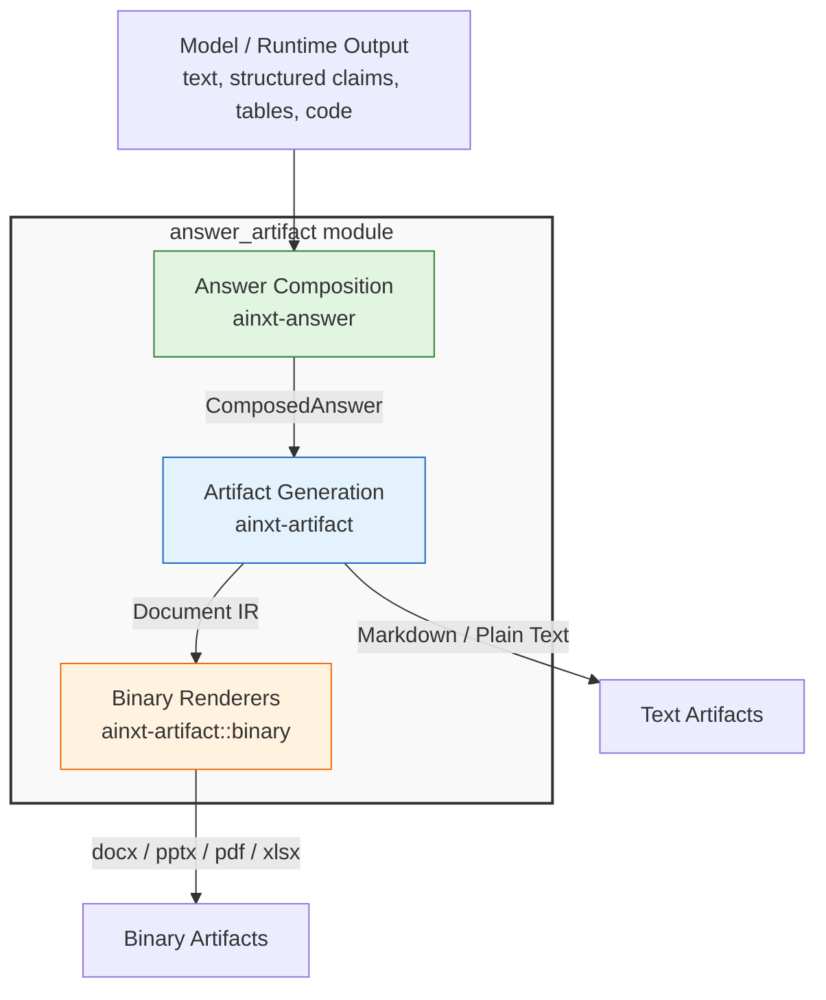
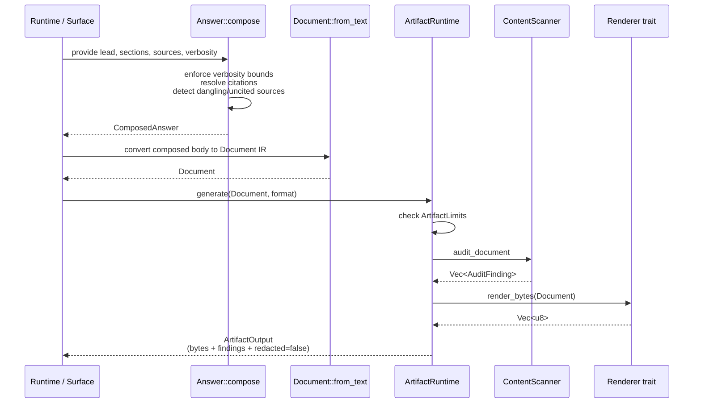
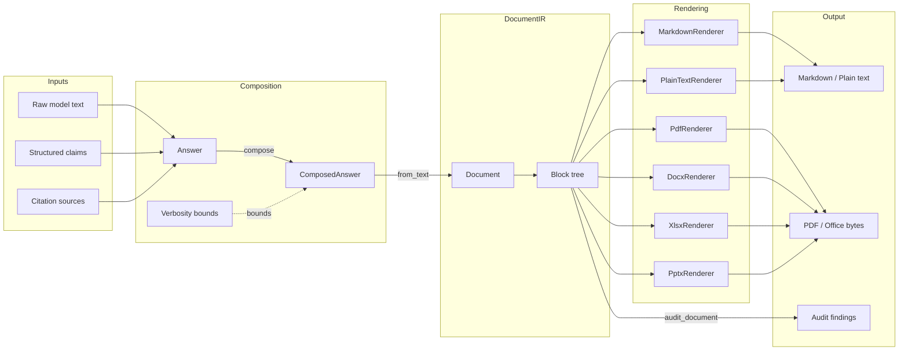
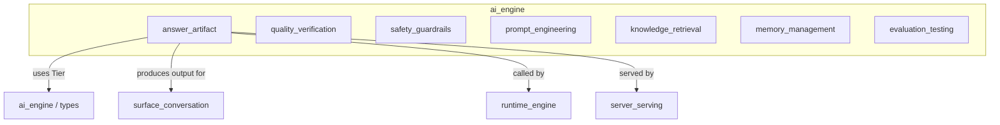

# answer_artifact Module

## Introduction and Purpose

The `answer_artifact` module is the **output-shaping layer** of the AiNxt AI engine. It sits at the boundary between raw model generations and the structured, user-facing artifacts the platform delivers. Its purpose is to ensure that every answer and generated document is:

- **Properly formatted** — not an unstructured blob of model text.
- **Right-sized** — verbosity matches the reasoning depth of the request.
- **Cited and auditable** — references are resolved, de-duplicated, and integrity-checked.
- **Exportable** — the same structured content can be rendered to Markdown, plain text, or binary office formats (docx, pptx, pdf, xlsx).
- **Compliance-aware** — sensitive content is detected and recorded, never silently redacted into a broken artifact.

The module is part of the larger `ai_engine` subsystem and is a sibling to quality verification, safety guardrails, prompt engineering, knowledge retrieval, memory management, and evaluation/testing modules. It is intentionally **pure and deterministic**: no I/O, no network calls, no hidden state. This makes it safe to run inside the serving hot path and trivial to test exhaustively.

## Scope and Boundaries

| Concern | Handled by `answer_artifact` | Handled elsewhere |
|---|---|---|
| Chat answer structure, verbosity, citations | ✅ `ainxt-answer` | — |
| Document IR, Markdown/plain-text renderers | ✅ `ainxt-artifact` | — |
| Binary office/PDF renderers | ✅ `ainxt-artifact::binary` | — |
| Content compliance scanning (audit-and-proceed) | ✅ `ainxt-artifact` scanners | — |
| Model input assembly / system prompts | ❌ | [`prompt_engineering`](prompt_engineering.md) |
| Retrieval of grounding context | ❌ | [`knowledge_retrieval`](knowledge_retrieval.md) |
| Quality judging / fact verification | ❌ | [`quality_verification`](quality_verification.md) |
| Safety / injection guardrails | ❌ | [`safety_guardrails`](safety_guardrails.md) |
| Conversation state and chat surface | ❌ | [`surface_conversation`](../core_infrastructure/surface_conversation.md) |

## Architecture Overview

### Component Interaction

## High-Level Functionality of Sub-Modules

### answer_artifact_composition

The [`answer_artifact_composition`](answer_artifact_composition.md) sub-module (crate `ainxt-answer`) defines a typed model for chat answers and renders them to Markdown or plain text. It addresses three quality gaps:

- **Formatting / rich rendering** — answers are structured as `Answer` { lead, sections, sources } with inline `Segment`s (text, code, table, citation).
- **Verbosity calibration** — `Verbosity` (Terse / Normal / Detailed) caps lead length and section count based on the request's reasoning tier.
- **Citation UX** — repeated sources are de-duplicated, references are numbered in first-appearance order, and integrity failures (dangling citations, uncited sources) are surfaced as `CompositionWarning`s.

See [`answer_artifact_composition.md`](answer_artifact_composition.md) for the full component reference.

### answer_artifact_generation

The [`answer_artifact_generation`](answer_artifact_generation.md) sub-module (crate `ainxt-artifact`) turns structured documents into rendered artifacts. It provides:

- A `Document` intermediate representation (`Block`s: headings, paragraphs, lists, tables, code, page breaks).
- A `Renderer` trait with built-in Markdown and plain-text renderers.
- Dependency-free binary renderers for `docx`, `pptx`, `pdf`, and `xlsx`.
- An `ArtifactRuntime` that enforces limits, audits content, and dispatches to the correct renderer.
- A `ContentScanner` seam with a Luhn + entropy detector and a deterministic marker scanner.
- An **audit-and-proceed** policy: findings are recorded, but the artifact is emitted intact (redaction would corrupt code/tables).

See [`answer_artifact_generation.md`](answer_artifact_generation.md) for the full component reference.

## Data Flow

## Key Design Principles

1. **Typed over stringly.** Answers and documents are data models, not prompt-shaped text. Renderers are pure functions of those models.
2. **Total composition.** `Answer::compose` cannot fail or panic — it is defined for empty, oversized, malformed, and adversarial inputs.
3. **Audit-and-proceed.** Compliance scanners record findings; they never mutate or redact the rendered artifact.
4. **Format independence.** The same `Document` IR renders faithfully to every supported format.
5. **Dependency-free binaries.** OOXML and PDF emitters are implemented in-tree without external document libraries, keeping the supply chain surface small.

## Relationship to the Rest of the System

- **Upstream callers:** the conversation surface (`ainxt-convo`), runtime engine (`ainxt-runtime`, `ainxt-runtimed`), and server (`ainxt-server`) produce or consume `Answer` / `Document` / `ArtifactOutput`.
- **Downstream consumers:** chat surfaces display Markdown/plain text; artifact endpoints return binary office/PDF payloads; audit sinks record `AuditFinding`s.
- **Sibling modules:** `answer_artifact` does not judge quality, retrieve facts, guard against injection, or manage conversation state — those responsibilities live in sibling `ai_engine` sub-modules.

## Mermaid: Module Dependency Map

## Related Documentation

- [`answer_artifact_composition.md`](answer_artifact_composition.md) — detailed reference for the `ainxt-answer` composition crate (typed answers, verbosity, citations, Markdown/plain-text rendering).
- [`answer_artifact_generation.md`](answer_artifact_generation.md) — detailed reference for the `ainxt-artifact` generation crate (`Document` IR, `Renderer` trait, binary office/PDF renderers, `ArtifactRuntime`, compliance scanning).
