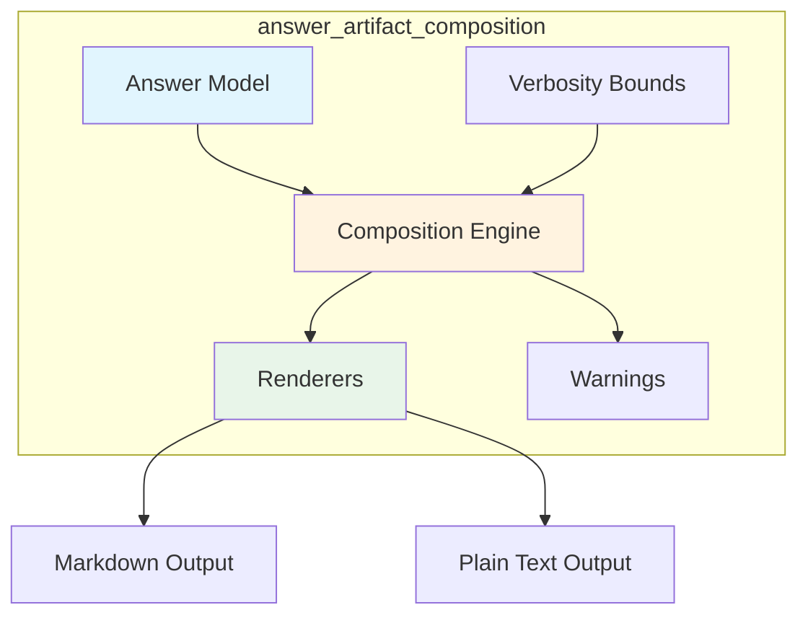
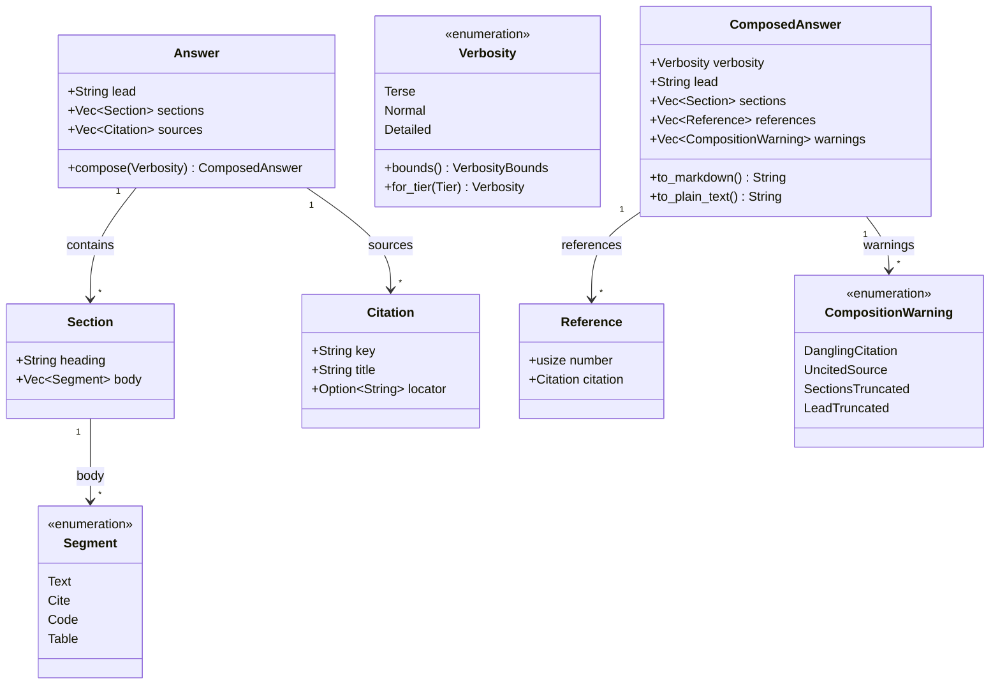
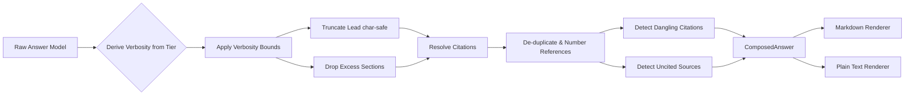
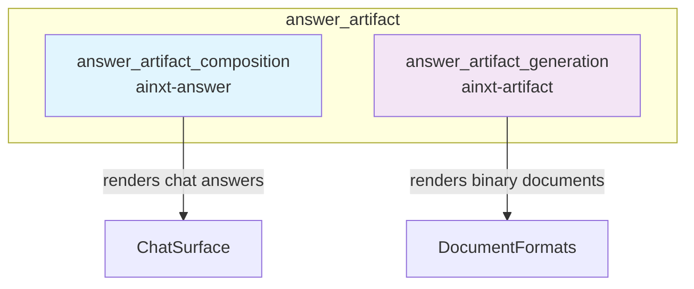
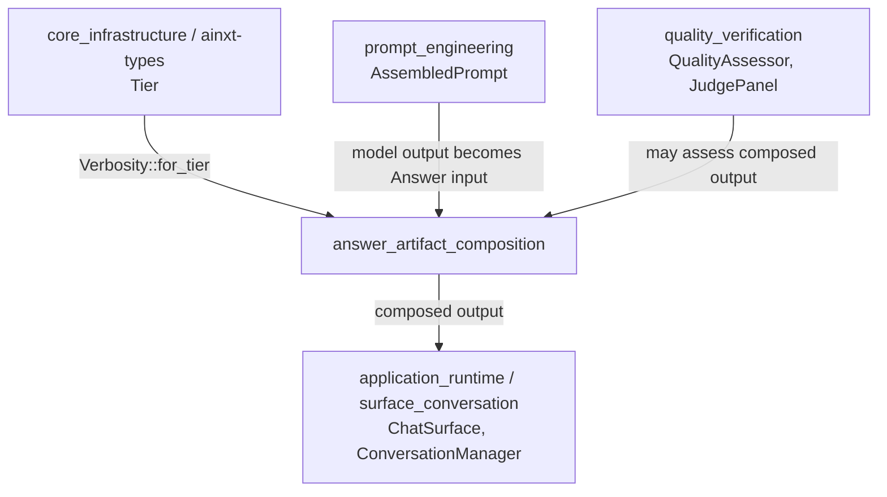
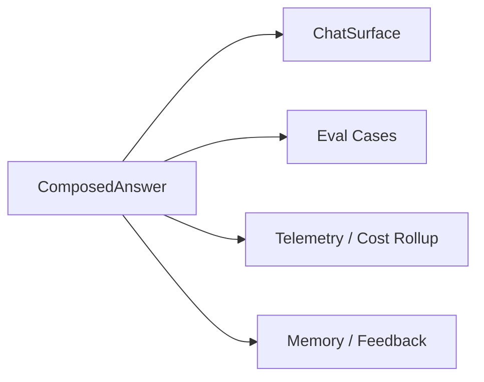
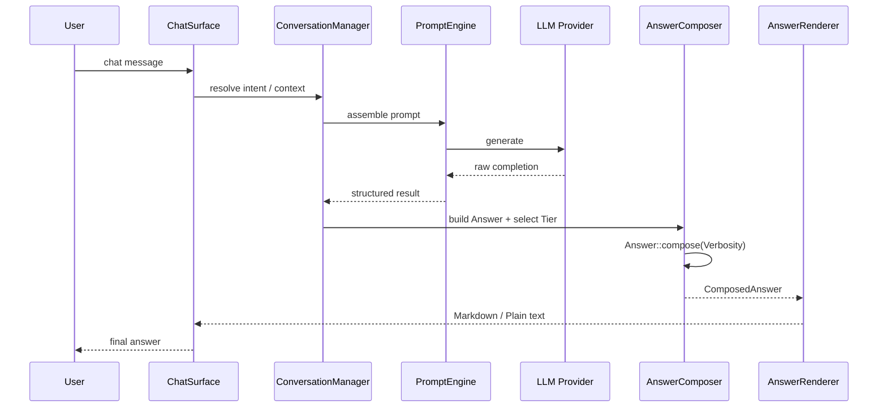
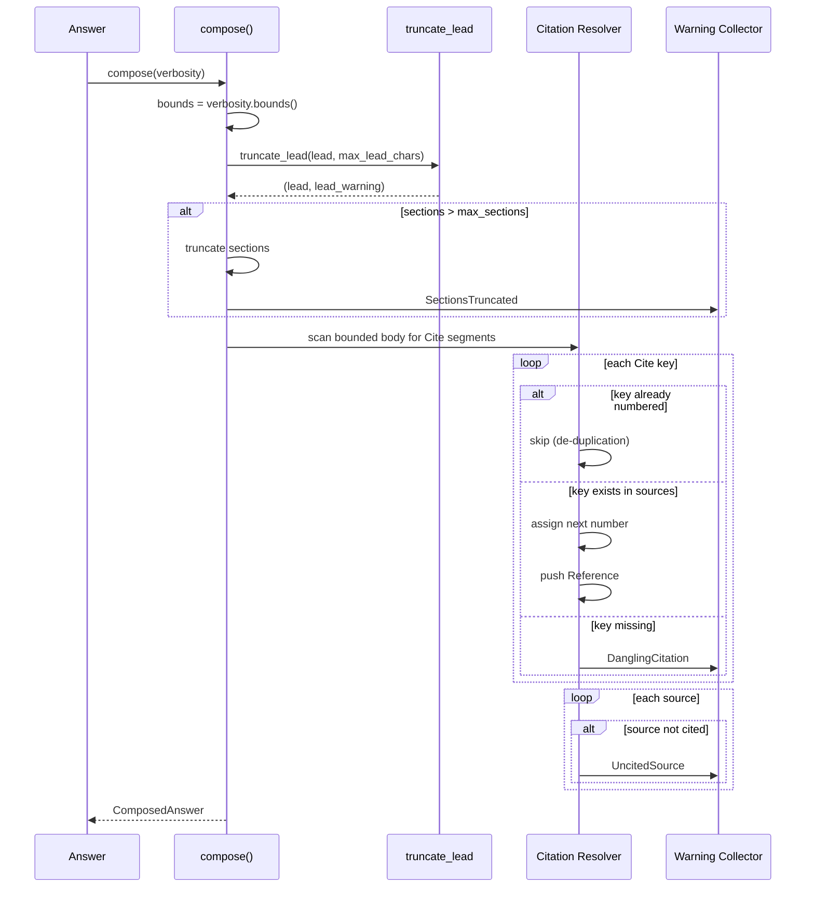

# answer_artifact_composition

## Brief Introduction

The `answer_artifact_composition` module is the **typed answer-composition and presentation core** for AiNxt chat. It transforms raw model output into a structured, bounded, and citable answer model, then renders that model into deterministic Markdown or plain text. The module addresses three quality gaps that are critical in enterprise chat systems:

- **Formatting and rich rendering**: Answers are represented as a typed model (`Answer`) with a lead, ordered sections, and inline segments (text, code, table, citation) rather than an unstructured blob of text.
- **Verbosity calibration ("right-sizing")**: A `Verbosity` bound derived from the reasoning-depth hint (`Tier`) caps lead length and section count so the answer size matches the question complexity.
- **Citation UX**: Repeated sources are de-duplicated, references are numbered `[n]` in first-appearance reading order, and integrity failures (dangling citations and uncited sources) are surfaced as warnings rather than swallowed.

This module is intentionally **pure, deterministic, and I/O-free**. It does not call language models, access databases, or perform network operations. It is the final shaping layer for chat output before it is handed to a surface or conversation layer for delivery.

> **Scope boundary**: This module shapes *chat output* only. Document generation (docx, pptx, pdf, xlsx) is handled by the sibling [answer_artifact_generation](answer_artifact_generation.md) module, and model input assembly is handled by the [prompt_engineering](prompt_engineering.md) module.

---

## Core Concepts

### Typed Answer Model

The central abstraction is `Answer`, a serializable structure composed of:

| Field | Purpose |
|-------|---------|
| `lead` | The tl;dr or summary shown first. |
| `sections` | Ordered body sections, each with a heading and a list of segments. |
| `sources` | The pool of citable sources referenced by inline citation keys. |

Each section body is a list of `Segment` values in reading order:

- `Text` — inline prose.
- `Cite { key }` — an inline citation to a source by its stable key.
- `Code` — a fenced code block with an optional language info-string.
- `Table` — a simple tabular block.

The model is deliberately minimal. Rich document layout and binary formats are out of scope; they belong to `ainxt-artifact`.

### Verbosity Calibration

`Verbosity` is a three-level enum that bounds the composed answer:

| Level | `max_sections` | `max_lead_chars` | Typical use |
|-------|----------------|------------------|-------------|
| `Terse` | 1 | 160 | Trivial follow-ups, greetings |
| `Normal` | 4 | 400 | Default chat turns |
| `Detailed` | 12 | 800 | Deep analysis, complex SDLC tasks |

The level is derived from [`Tier`](../core_infrastructure/core_infrastructure.md) (`Simple`, `Medium`, `Complex`) via `Verbosity::for_tier`. The bounds are monotone: `Terse ⊆ Normal ⊆ Detailed` on both axes. Truncation is always recorded as a `CompositionWarning`, never silent.

### Citation Resolution

During composition, citations are resolved in **first-appearance reading order** over the bounded body (lead is not scanned for citations). The same source cited multiple times receives a single `[n]` number. Two integrity checks are performed:

1. **Dangling citation**: an inline `Cite { key }` has no matching source in the pool. Rendered as `[?]`.
2. **Uncited source**: a source exists in the pool but is never cited in any kept segment.

Only cited sources appear in the final references list.

### Composition Result

`ComposedAnswer` is the output of `Answer::compose`. It contains the bounded answer, the resolved references, and any warnings. From this value, renderers are pure functions:

- `to_markdown` — GitHub-flavored Markdown with headings, fenced code, pipe tables, and a references section.
- `to_plain_text` — Markdown-free text for surfaces that cannot render rich syntax.

---

## Architecture

### Component Overview



### Data Model



### Composition Pipeline



---

## Dependencies and Relationships

### Within `answer_artifact`



- [answer_artifact_generation](answer_artifact_generation.md) handles generated documents (docx, pptx, pdf, xlsx). `answer_artifact_composition` does not produce binary artifacts.
- Both modules may be invoked from the same chat turn when a user requests a document alongside a chat response.

### Upstream Dependencies



- [`Tier`](../core_infrastructure/core_infrastructure.md) from `ainxt-types` drives verbosity selection.
- [prompt_engineering](prompt_engineering.md) assembles the model input; the model's raw output is structured into an `Answer` by a higher-level orchestrator.
- [quality_verification](quality_verification.md) may evaluate composed answers for completeness, groundedness, citation presence, and format validity.
- [application_runtime](../core_infrastructure/application_runtime.md) / [surface_conversation](../core_infrastructure/surface_conversation.md) delivers the rendered text to the user.

### Downstream Consumers



- Chat surfaces receive Markdown by default.
- Evaluation frameworks compare rendered output against expected answers.
- Telemetry may record verbosity level, warning counts, and rendering outcomes.
- Memory and feedback systems may store composed answers for future retrieval.

---

## Data Flow

### Typical Chat Turn



### Composition Detail



---

## Rendering

### Markdown Renderer

The Markdown renderer produces:

1. The lead paragraph first.
2. Sections as `## heading` followed by body segments.
3. A `## References` section last.

Special care is taken to prevent adversarial or malformed content from corrupting the output:

- **Code fences**: The fence length is one backtick longer than the longest inner backtick run, so code containing ```` ``` ```` cannot break out.
- **Info strings**: Backticks and newlines are sanitized so the opening fence line remains valid.
- **Table cells**: Pipe characters are escaped and newlines are flattened to prevent column desync.
- **Headings**: Newlines in headings are flattened to a single line to prevent injected structure.

### Plain Text Renderer

The plain text renderer removes all Markdown syntax:

- Headings are bare lines.
- Code is indented by four spaces.
- Tables are space-aligned.
- `[n]` citation markers are preserved because they are not Markdown.

This renderer is the seam for surfaces that cannot display rich formatting (SMS, voice, legacy integrations). The current chat path unconditionally uses Markdown, but the plain text path is ready for future negotiation.

---

## Safety and Robustness

The module is designed for hostile and edge-case inputs:

- **Empty answers** render to an empty string without panic.
- **Multi-byte characters** are truncated on `char` boundaries, never byte boundaries.
- **Dangling citations** render as `[?]` and are reported.
- **Uncited sources** are reported and omitted from the references list.
- **Ragged tables** (rows shorter or longer than headers) are padded or truncated defensively.
- **Composition is total**: `Answer::compose` cannot fail or panic.

---

## Integration Points

| Consumer | Usage |
|----------|-------|
| `ainxt-convo::compose_chat_answer` | Calls `to_markdown()` unconditionally for the production chat path. |
| `ainxt-convo::compose_chat_answer_typed` | Returns the typed `ComposedAnswer`, enabling future format negotiation. |
| `ainxt-quality` | Assesses `ComposedAnswer` for dimensions like `CitationPresence`, `FormatValidity`, and `VerbosityFit`. |
| `ainxt-eval` | Compares rendered output against reference answers in RAG and QA eval cases. |
| `ainxt-server` | Serves chat responses; may route composed answers to surfaces or artifact generation. |

---

## Related Documentation

- [answer_artifact](answer_artifact.md) — parent module covering both composition and generation.
- [answer_artifact_generation](answer_artifact_generation.md) — binary document generation (docx, pptx, pdf, xlsx).
- [prompt_engineering](prompt_engineering.md) — model input assembly and prompt management.
- [quality_verification](quality_verification.md) — answer quality assessment and judging.
- [application_runtime](../core_infrastructure/application_runtime.md) — runtime surfaces and conversation delivery.
- [core_infrastructure](../core_infrastructure/core_infrastructure.md) — shared types including `Tier`.
