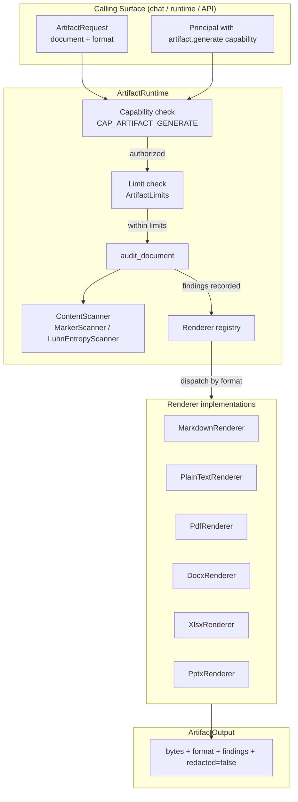
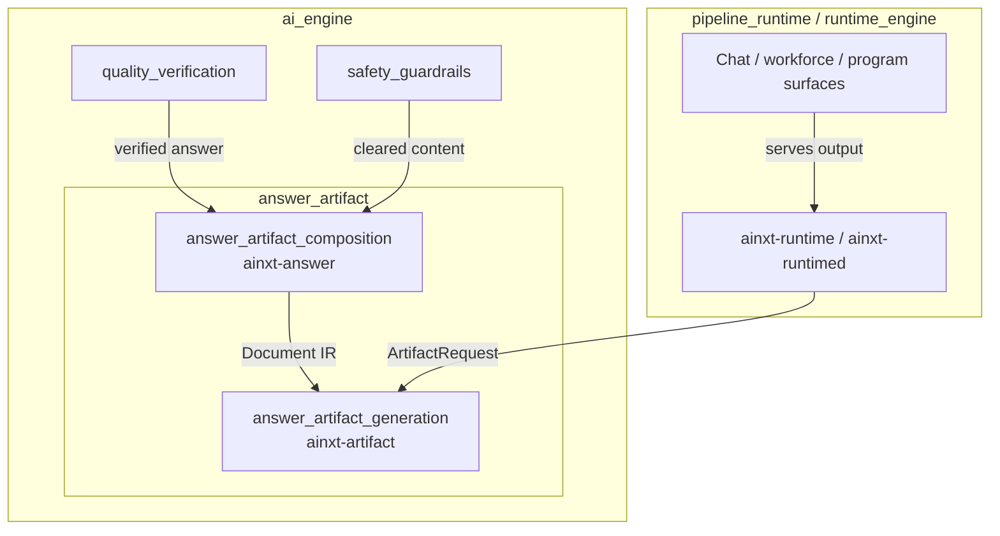
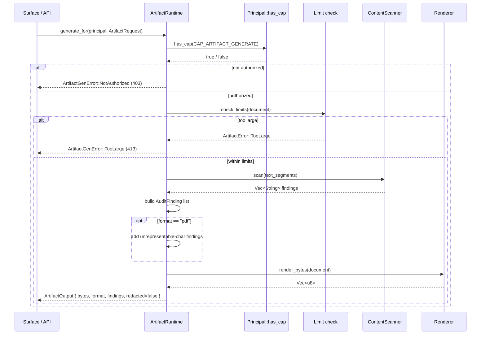
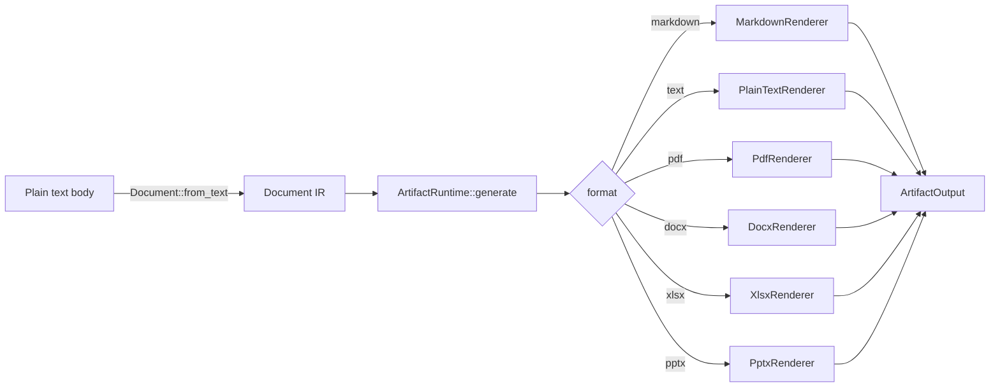
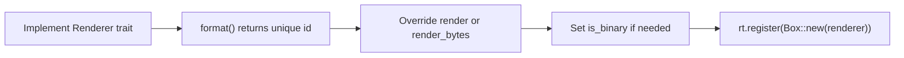
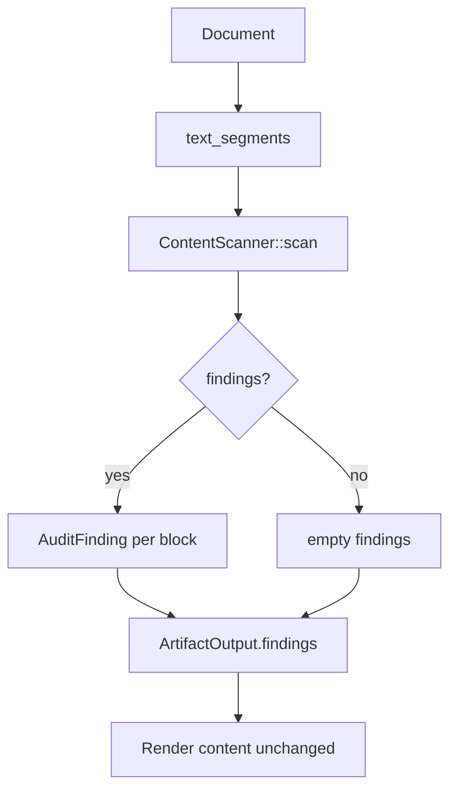

# answer_artifact_generation

## Brief Introduction

The `answer_artifact_generation` module is the document-generation runtime of the AI engine. It turns a structured, typed document intermediate representation (IR) into concrete output formats — Markdown, plain text, PDF, DOCX, XLSX, and PPTX — while enforcing resource limits and recording compliance findings without ever mutating the rendered content.

The module lives under `ai_engine → answer_artifact → answer_artifact_generation` and is implemented by the `ainxt-artifact` crate. It is the counterpart to [`answer_artifact_composition`](answer_artifact_composition.md): while that module composes answers from sections, citations, and references, this module renders those answers (and any other structured document) into deliverable artifacts.

---

## Core Purpose

1. **Separate content structure from presentation.** Models and runtimes produce a [`Document`] IR — a tree of headings, paragraphs, lists, tables, code blocks, and page breaks — rather than raw format-specific strings. The same IR renders faithfully to every supported format.
2. **Audit-and-proceed compliance.** A pluggable [`ContentScanner`] detects sensitive content (PAN-like digit runs, high-entropy secrets, etc.) and records [`AuditFinding`]s. The artifact is emitted **intact**; redaction inside a code block or table would corrupt the document.
3. **One-shot, RBAC-gated generation.** [`ArtifactRuntime::generate_for`] is the route-ready entrypoint used by HTTP surfaces. It checks the `artifact.generate` capability before limits, audit, and render.
4. **Dependency-free binary renderers.** DOCX, XLSX, PPTX, and PDF are emitted without external OOXML or PDF libraries, keeping the supply-chain surface small and the output deterministic.

---

## Architecture

### High-level component diagram



### Module position in the system



---

## Key Components

### Document IR

The [`Document`] type is a title plus an ordered list of [`Block`]s:

| Block variant | Renders as |
|---------------|------------|
| `Heading { level, text }` | Markdown `#`..`######`; DOCX `HeadingN`; PDF larger font |
| `Paragraph { text }` | Plain paragraph |
| `BulletList { items }` | `-` / `•` list |
| `NumberedList { items }` | `1.` / `N.` list |
| `Table { headers, rows }` | GFM pipe table; XLSX rows/columns |
| `Code { language, code }` | Fenced code block; emitted verbatim |
| `PageBreak` | `---` in Markdown; new page/slide in binary formats |

[`Document::from_text`] provides a lightweight parser that converts plain or lightly-marked-up text into the structured IR, closing the gap between conversational surfaces that resolve a generation turn to a title + body string and the IR the runtime requires.

### Renderer trait

```rust
pub trait Renderer: Send + Sync {
    fn format(&self) -> &str;
    fn render(&self, doc: &Document) -> String;
    fn render_bytes(&self, doc: &Document) -> Vec<u8> { ... }
    fn is_binary(&self) -> bool { false }
}
```

All renderers implement the same trait. Text renderers override `render`; binary renderers override `render_bytes` and set `is_binary = true`. This lets [`ArtifactRuntime`] hold a homogeneous registry and dispatch by format id.

### ContentScanner trait and implementations

| Scanner | Purpose |
|---------|---------|
| [`MarkerScanner`] | Deterministic floor: ≥12 digit runs and secret markers (`PAN=`, `TOKEN=`, etc.) |
| [`LuhnEntropyScanner`] | Real-but-generic detector: Luhn-valid PANs and high-entropy (≥3.5 bits/char) API-key-shaped tokens |

Enterprise deployments replace the scanner via the trait seam with a PCI/DSS-specific engine. The in-tree scanners are deterministic, allocation-light, and contain no regex, RNG, or clock.

### ArtifactRuntime

The live runtime:

- Registers renderers in a `BTreeMap<String, Box<dyn Renderer>>`.
- Holds an injected `Box<dyn ContentScanner>`.
- Enforces [`ArtifactLimits`] (`max_blocks`, `max_total_bytes`).
- Exposes:
  - [`ArtifactRuntime::generate`] — internal one-shot generate.
  - [`ArtifactRuntime::generate_for`] — RBAC-scoped, route-ready entrypoint.

Factory methods:

- `new(scanner)` — empty registry.
- `with_builtin_renderers(scanner)` — Markdown + plain text.
- `with_all_renderers(scanner)` — all text + binary renderers.

### Binary renderers

Implemented in `binary.rs`:

| Renderer | Format | Technique |
|----------|--------|-----------|
| [`PdfRenderer`] | `pdf` | Hand-emits PDF 1.7 with catalog, pages, content streams, xref table, and WinAnsi Helvetica font. Tracks unrepresentable characters (CJK, Devanagari, emoji) as audit findings. |
| [`DocxRenderer`] | `docx` | WordprocessingML packaged by [`StoredZip`]; maps heading levels to `HeadingN` styles. |
| [`XlsxRenderer`] | `xlsx` | SpreadsheetML; tables become rows, other blocks become single-column rows. |
| [`PptxRenderer`] | `pptx` | Full PresentationML master → layout → theme chain; each `PageBreak` starts a new slide. |

[`StoredZip`] writes a deterministic STORED-method ZIP (no compression) with correct local/central headers and end-of-central-directory record, sufficient for Office to open the output.

---

## Data Flow

### Single artifact generation request



### From plain text to rendered artifact



---

## Component Interactions

### With answer composition

The sibling module [`answer_artifact_composition`](answer_artifact_composition.md) (crate `ainxt-answer`) produces structured answers (`Answer`, `ComposedAnswer`, `Section`, `Citation`, `Reference`). A surface or runtime converts that composed answer into a [`Document`] IR and then calls this module to render it. This module does **not** know about answers or citations; it only knows about document blocks.

### With surfaces and runtime

- [`runtime_engine`](../pipeline_runtime/runtime_engine.md) constructs an [`ArtifactRuntime`] at startup and exposes `POST /v1/artifact`.
- [`surface_conversation`](../core_infrastructure/surface_conversation.md) may resolve a document-generation turn to a title + body string, then use [`Document::from_text`] to bridge into the artifact IR.
- The capability check uses [`Principal`](../core_infrastructure/security_config.md) from the security config layer.

### With quality and safety modules

- [`quality_verification`](quality_verification.md) judges answers before they are rendered.
- [`safety_guardrails`](safety_guardrails.md) runs injection, topic, toxicity, and other rails upstream.
- This module records additional artifact-specific compliance findings but never blocks on them.

---

## Process Flows

### Adding a new renderer



### Compliance audit flow



---

## Configuration & Limits

[`ArtifactLimits`] caps a single generation to prevent a hostile or broken document from exhausting a worker:

| Field | Default | Purpose |
|-------|---------|---------|
| `max_blocks` | 10,000 | Maximum number of blocks in the document |
| `max_total_bytes` | 8 MiB | Maximum UTF-8 bytes across all text segments |

Limits are enforced **before** audit and render. Exceeding them returns [`ArtifactError::TooLarge`] (mapped to HTTP 413 in the route layer).

---

## Error Model

[`ArtifactGenError`] is the serializable, route-ready error enum:

| Variant | HTTP mapping | Cause |
|---------|--------------|-------|
| `NotAuthorized` | 403 | Caller lacks `CAP_ARTIFACT_GENERATE` |
| `UnknownFormat` | 404 | No renderer registered for the format id |
| `TooLarge` | 413 | Document exceeds `ArtifactLimits` |

Compliance findings are **never** errors. They ride along on a successful [`ArtifactOutput`].

---

## Testing Strategy

The crate's tests cover:

- Markdown rendering of every block type and heading-level clamping.
- Plain-text stripping of markup.
- `Document` serialization round-trips.
- Audit-and-proceed behavior: findings are recorded but content is never redacted.
- Code-block integrity: secrets inside code are flagged but the code is emitted verbatim.
- `Document::from_text` parsing of headings, lists, and paragraphs.
- Runtime one-shot generation with injected scanners.
- Limit enforcement.
- Binary renderer byte path (PK zip magic, non-UTF-8 bytes).
- Luhn + entropy scanner accuracy and false-positive avoidance.

---

## Security & Compliance Notes

- **No redaction in renderers.** Redacting inside a code block, table cell, or OOXML run would corrupt the artifact. The module records findings and emits content intact.
- **Capability-gated surface.** `CAP_ARTIFACT_GENERATE` is checked before any format lookup or limit check, preventing the error shape from becoming a capability oracle.
- **Deterministic output.** Binary ZIP emitters zero mod-time and omit extra fields, producing byte-identical archives for identical inputs.
- **PDF character loss is auditable.** The built-in WinAnsi font cannot represent CJK, Devanagari, or emoji. `PdfRenderer::unrepresentable_chars` surfaces these as findings rather than silently dropping them.

---

## See Also

- [`answer_artifact_composition`](answer_artifact_composition.md) — composing answers from sections, citations, and references.
- [`runtime_engine`](../pipeline_runtime/runtime_engine.md) — the runtime that hosts and dispatches artifact generation.
- [`surface_conversation`](../core_infrastructure/surface_conversation.md) — conversational surfaces that may invoke document generation.
- [`quality_verification`](quality_verification.md) — answer quality judging upstream of rendering.
- [`safety_guardrails`](safety_guardrails.md) — injection, topic, toxicity, and other safety rails.
- [`security_config`](../core_infrastructure/security_config.md) — `Principal` and capability model.
