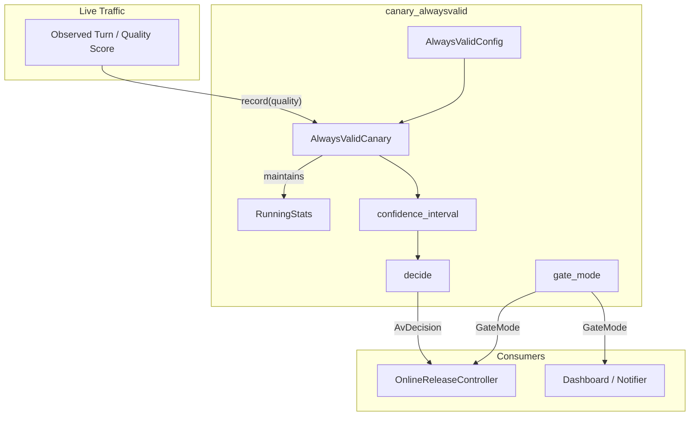
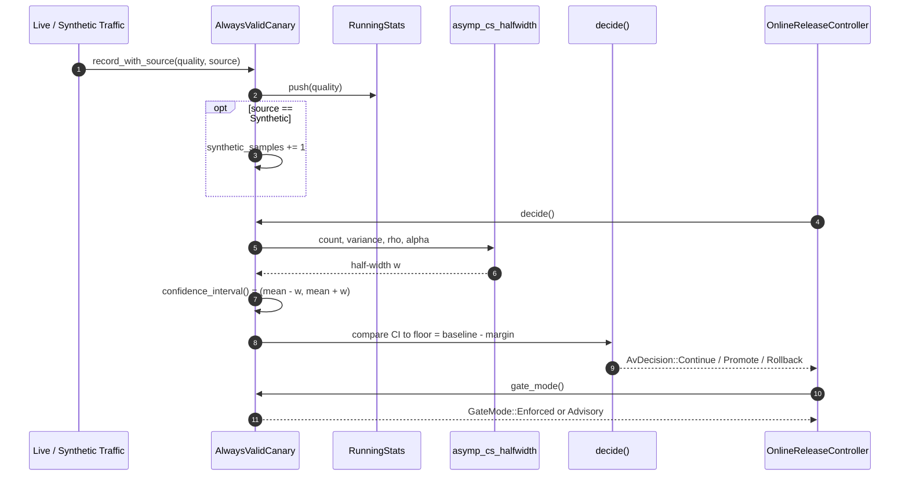
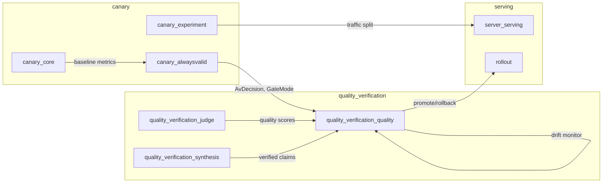
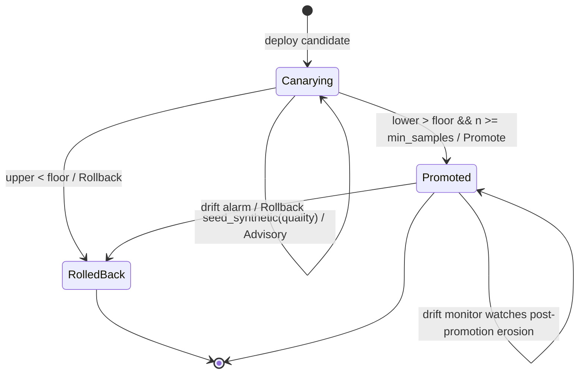

# canary_alwaysvalid

## Brief Introduction

`canary_alwaysvalid` implements an **anytime-valid (always-valid) online canary gate** for production rollouts. Unlike a traditional fixed-sample hypothesis test, which inflates false-positive rates when operators peek at live metrics and stop early, this module uses an **asymptotic confidence sequence (AsympCS)** to provide time-uniform coverage. This means the gate can be monitored continuously, and promote/rollback decisions can be made at any moment without incurring a statistical "peeking penalty."

The module is part of the broader [`canary`](canary.md) evaluation-testing subsystem within the AI engine. It consumes per-turn quality observations from a candidate deployment, maintains running mean and variance via Welford's online algorithm, and emits one of three decisions: **Continue**, **Promote**, or **Rollback**. A structural [`GateMode`](canary_alwaysvalid.md#gatemode) label distinguishes between a genuinely enforced gate and a cold-start advisory window where insufficient evidence has accrued.

---

## Core Concepts

### The Peeking Problem

In a fixed-sample canary, an operator might watch a live dashboard and roll back the moment a p-value crosses a threshold. Because the test is only valid at the pre-committed sample size, this continuous monitoring inflates the Type-I error rate and causes flapping gates. The engineering fix is a **confidence sequence**: a sequence of confidence intervals that are valid uniformly over time, so stopping rules based on the sequence do not break coverage.

### Asymptotic Confidence Sequence (AsympCS)

`canary_alwaysvalid` implements the AsympCS from Waudby-Smith et al. (2021). At every step `n`, the running mean is bracketed by:

```
μ̂ ± σ̂ · sqrt( 2(nρ²+1)/(n²ρ²) · ln( sqrt(nρ²+1)/α ) )
```

The width shrinks like `~1/√n` with an iterated-log inflation that preserves uniform coverage. The champion (production) metric is treated as a fixed baseline, and the candidate stream is evaluated as a one-sample confidence sequence against that baseline.

### Non-Inferiority

The gate is configured with a `baseline` (champion quality score) and a `margin` (acceptable regression in points). The candidate is rolled back only when the **entire** confidence sequence falls below `baseline - margin`, and promoted only when the **entire** sequence is above that floor **and** enough samples have been collected.

---

## Architecture



### Component Responsibilities

| Component | Responsibility |
|-----------|----------------|
| `RunningStats` | Numerically stable online mean/variance accumulation using Welford's algorithm. |
| `AlwaysValidConfig` | Tuning parameters: baseline, margin, alpha, min_samples, and AsympCS rho. |
| `AlwaysValidCanary` | Accumulates candidate observations and produces anytime-valid decisions. |
| `AvDecision` | The ternary verdict: `Continue`, `Promote`, or `Rollback`. |
| `GateMode` | Loud structural label distinguishing `Enforced` from `Advisory` cold-start state. |
| `ObservationSource` | Provenance tracking for live vs. synthetic (Breaker-seeded) observations. |

---

## Data Flow



---

## Component Reference

### `RunningStats`

A deterministic, numerically stable accumulator for mean and unbiased sample variance. It uses Welford's online algorithm, so it can be updated one observation at a time without storing the full sample history. This is important for deterministic replay and low memory footprint.

Key methods:
- `push(x: f64)` — fold one observation in.
- `mean()` — current running mean.
- `variance()` — unbiased sample variance (`m2 / (n - 1)`), zero for `n < 2`.
- `std_dev()` — square root of variance.

### `AlwaysValidConfig`

Configuration for the anytime-valid monitor:

| Field | Meaning |
|-------|---------|
| `baseline` | Established champion quality score (0–100). |
| `margin` | Non-inferiority margin in points. |
| `alpha` | Error level for the confidence sequence (coverage `1 - α`). |
| `min_samples` | Minimum candidate samples before a `Promote` decision. |
| `rho` | AsympCS tuning parameter, typically derived from a target sample size. |

The helper `AlwaysValidConfig::tuned(...)` computes `rho` from a target sample size using `rho_for_target`.

### `AlwaysValidCanary`

The main stateful monitor. It owns:
- the configuration,
- a `RunningStats` accumulator for candidate observations,
- a counter of synthetic-seeded samples.

Key methods:
- `record(quality)` — record a live observation.
- `seed_synthetic(quality)` — record a Breaker-verified synthetic observation.
- `record_with_source(quality, source)` — record with explicit provenance.
- `confidence_interval()` — current time-uniform CI for the candidate mean.
- `decide()` — produce an `AvDecision`.
- `gate_mode()` — produce a `GateMode` based on total accrued evidence.

### `AvDecision`

```rust
pub enum AvDecision {
    Continue { lower: f64, upper: f64 },
    Rollback { lower: f64, upper: f64, reason: String },
    Promote  { lower: f64, upper: f64 },
}
```

- **Rollback** fires as soon as the CI upper bound is below the non-inferiority floor (`baseline - margin`). This is a safety-first rule: the moment the candidate is established to be materially worse, stop serving it.
- **Promote** fires only when the CI lower bound is above the floor **and** `min_samples` have been observed.
- **Continue** means the sequence has not established either verdict yet.

### `GateMode`

```rust
pub enum GateMode {
    Enforced,
    Advisory { samples: u64, min_samples: u64, synthetic_samples: u64 },
}
```

`GateMode` is a loud, structural label that prevents a `Continue` decision during cold-start from being mistaken for protection. While advisory, the gate explicitly warns that a regression could still ship undetected. Once total evidence reaches `min_samples`, the gate becomes `Enforced`.

The `warning()` method returns a human-readable string for dashboards and notifiers when the gate is still advisory.

### `ObservationSource`

```rust
pub enum ObservationSource {
    Live,
    Synthetic,
}
```

Distinguishes real served traffic from Breaker-verified synthetic cases. Synthetic observations count toward statistical power exactly like live samples, but their provenance is disclosed in the advisory label.

---

## Mathematical Helpers

### `rho_for_target(n_star, alpha)`

Computes the AsympCS tuning parameter `ρ` optimized around a target sample size:

```
ρ = sqrt( (-2 ln α + ln(-2 ln α + 1)) / n_star )
```

### `asymp_cs_halfwidth(n, var, rho, alpha)`

Computes the half-width of the confidence sequence. Returns `f64::INFINITY` before two samples exist or when the log term is non-positive, ensuring no premature verdict.

---

## Relationship to the Broader System

### Parent Module: [`canary`](canary.md)

`canary_alwaysvalid` lives alongside:
- [`canary_core`](canary.md) — the basic fixed-sample canary (`Canary`, `CanaryConfig`, `ArmMetrics`).
- [`canary_experiment`](canary_experiment.md) — traffic splitting primitives (`TrafficSplit`, `SplitArm`).

The basic canary is suitable for offline gates with a committed sample size. The anytime-valid canary is the correct choice for online rollouts where operators must be allowed to watch and stop at any time.

### Consumer: [`quality_verification_quality`](quality_verification_quality.md)

The primary consumer of `AlwaysValidCanary` is [`OnlineReleaseController`](quality_verification_quality.md), which orchestrates live canary phases and post-promotion drift monitoring. Each `ControllerStep` carries the current `GateMode` so that dashboards and notifiers can surface whether the canary is advisory or enforced.



### Related Quality and Evaluation Modules

- [`quality_verification_quality`](quality_verification_quality.md) — computes the 0–100 quality scores fed into the canary.
- [`quality_verification_judge`](quality_verification_judge.md) — provides judge-based scoring that may produce the observations consumed by the canary.
- [`evaluation_testing`](evaluation_testing.md) — the parent evaluation-testing domain, which includes offline release gates, conformance tests, replay, and canary monitoring.
- `server_serving_rollout` — consumes promote/rollback signals to drive weight-based traffic rollouts.

---

## Process Flow: Online Canary Lifecycle



---

## Determinism and Replay

`canary_alwaysvalid` is designed to be deterministic:

- `RunningStats` uses only arithmetic on accumulated counters — no RNG or clock.
- `decide()` is a pure function of the accumulated state and configuration.
- This makes canary decisions reproducible from a recorded event log, which is important for [`replay`](replay.md) and incident analysis.

---

## Cold-Start Mitigation

A brand-new capability has too little live traffic to power a gate. The module supports two complementary mitigations:

1. **Advisory labeling** — `GateMode::Advisory` loudly warns that the gate is not yet enforced.
2. **Synthetic seeding** — `seed_synthetic` allows Breaker-verified synthetic cases to contribute statistical power before enough live traffic has accrued. The number of synthetic samples is preserved and disclosed in the advisory warning.

This design is explicitly called out in `EVAL_PLATFORM.md` §275 and ADR-010: a cold-start window is honest about its limitations and never silently treated as protection.

---

## Configuration Example

```rust
use ainxt_canary::alwaysvalid::{AlwaysValidCanary, AlwaysValidConfig};

let cfg = AlwaysValidConfig::tuned(
    90.0,   // baseline quality
    2.0,    // non-inferiority margin
    0.05,   // alpha
    100,    // min_samples before Promote
    500,    // target sample size for rho tuning
);

let mut canary = AlwaysValidCanary::new(cfg);

// Live traffic
for quality in live_scores {
    canary.record(quality);
}

// Optionally seed synthetic Breaker cases
for quality in synthetic_scores {
    canary.seed_synthetic(quality);
}

match canary.decide() {
    AvDecision::Promote { lower, upper } => { /* promote candidate */ }
    AvDecision::Rollback { reason, .. } => { /* roll back */ }
    AvDecision::Continue { lower, upper } => { /* keep watching */ }
}

if let Some(warning) = canary.gate_mode().warning() {
    eprintln!("{}", warning);
}
```

---

## Testing Strategy

The module includes unit tests covering:

- Welford correctness against batch mean/variance.
- Confidence-sequence width shrinkage with more samples.
- Rollback when the candidate is clearly worse.
- Promotion when the candidate is established non-inferior.
- Continuation under thin, noisy data.
- No false rollback for a candidate exactly at baseline under continuous peeking.
- Cold-start advisory behavior and transition to enforced.
- Synthetic seeding narrowing the cold-start window and disclosing provenance.
- Serialization of config and gate mode.

These tests encode the core statistical and safety invariants of the module.

---

## References

- [canary](canary.md) — parent canary module.
- [canary_experiment](canary_experiment.md) — traffic splitting and experiment arms.
- [quality_verification_quality](quality_verification_quality.md) — online release controller and drift monitoring.
- [quality_verification_judge](quality_verification_judge.md) — judge-based quality scoring.
- [evaluation_testing](evaluation_testing.md) — evaluation and testing domain overview.
- server_serving_rollout — rollout weight management.
- [replay](replay.md) — deterministic replay infrastructure.
