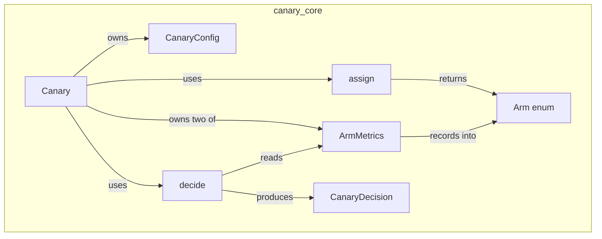
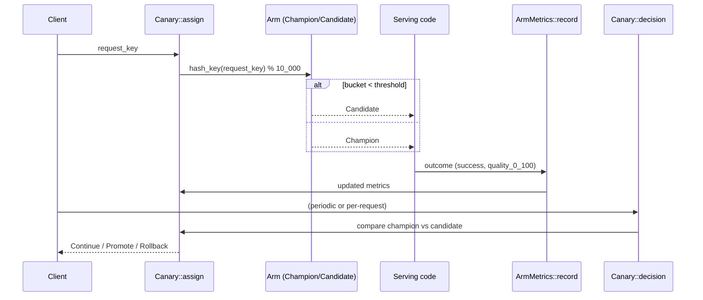
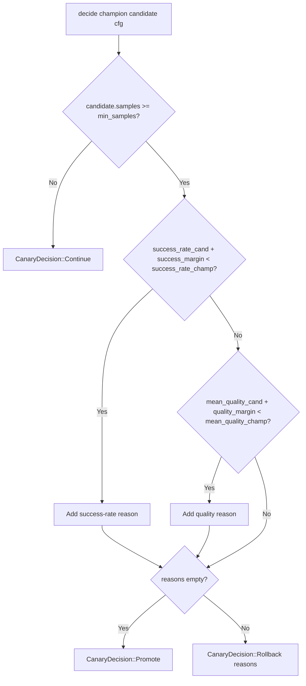
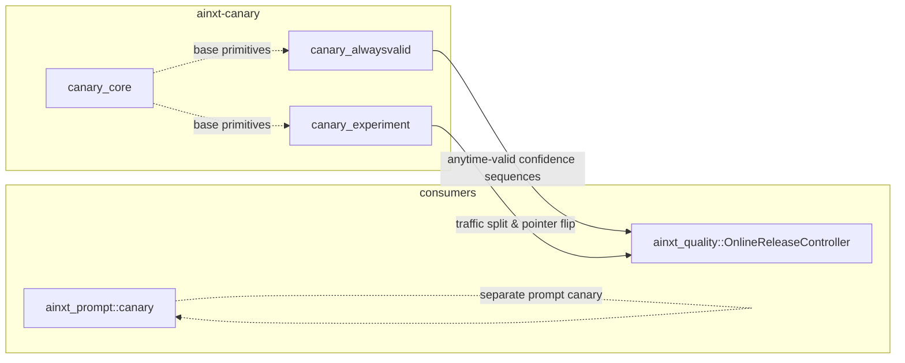

# canary_core

`canary_core` is the foundational two-arm canary engine inside the `ainxt-canary` crate. It provides deterministic request-to-arm assignment, per-arm outcome accumulation, and a fixed-sample promote / rollback / continue decision — the minimal library primitives needed to run an online A/B canary between a **champion** (production) deployment and a **candidate** change.

> **Scope note:** This module is intentionally a *primitive*. The production canary paths in the larger system are wired through the more capable [`canary_alwaysvalid`](canary_alwaysvalid.md) (anytime-valid confidence sequences) and [`canary_experiment`](canary_experiment.md) (multi-arm, git-ref-pinned traffic pointer) submodules, composed by upstream quality and runtime modules. `canary_core` remains valuable as a self-contained, dependency-light A/B engine for embedders who do not need those advanced features.

---

## Core concepts

| Concept | Responsibility |
|--------|----------------|
| `Arm` | Enum distinguishing `Champion` from `Candidate`. |
| `ArmMetrics` | Running counters for one arm: `samples`, `successes`, and `quality_sum`. |
| `CanaryConfig` | Tunables: candidate traffic share, minimum samples, success-rate margin, quality margin. |
| `CanaryDecision` | Outcome of a decision: `Continue`, `Promote`, or `Rollback(Vec<String>)`. |
| `assign` | Pure function mapping a request key to an arm via stable FNV-1a hashing. |
| `decide` | Pure function comparing champion and candidate metrics against configured margins. |
| `Canary` | Stateful wrapper holding config and both arms' metrics. |

---

## Architecture



The module is deliberately stateless at its core. `assign` and `decide` are pure functions, while `Canary` is a thin stateful wrapper that owns the two `ArmMetrics` accumulators and the `CanaryConfig`.

---

## Data flow

A single canary request flows through three deterministic stages:



1. **Assignment** — `assign(request_key, cfg)` hashes the key with FNV-1a and maps it into 10,000 basis points. The candidate receives traffic proportional to `candidate_traffic`.
2. **Recording** — The serving code records `success` and a `quality_0_100` score into the arm's `ArmMetrics`.
3. **Decision** — Once the candidate has at least `min_samples`, `decide` compares success rate and mean quality against the champion using the configured margins.

---

## Decision logic



* **Continue** — Not enough candidate samples; keep the split running.
* **Rollback** — Candidate is worse than champion beyond at least one configured margin. All failing reasons are collected.
* **Promote** — Candidate is within or above both margins.

The decision is a pure function of accumulated counters, making it replayable and unit-testable without a live backend.

---

## Determinism & testability

* **No RNG.** Arm assignment uses a stable FNV-1a hash of the request key, so the same key always hits the same arm.
* **Pure decisions.** `decide` depends only on `ArmMetrics` and `CanaryConfig`.
* **Integer accumulation.** `ArmMetrics` stores `quality_sum` as a `u64` and derives the mean on demand, avoiding floating-point drift during accumulation.

These properties make the engine suitable for deterministic replay, property-based tests, and offline evaluation.

---

## Relationship to other modules



* **[`canary_alwaysvalid`](canary_alwaysvalid.md)** — Provides `AlwaysValidCanary`, a stronger, anytime-valid confidence-sequence decision engine. It can declare rollback earlier for safety while requiring more evidence for promotion.
* **[`canary_experiment`](canary_experiment.md)** — Provides `TrafficSplit`, `SplitArm`, and in-memory pointer/notifier primitives for weighted multi-arm routing and instant pointer flips, pinned to git refs.
* **[`evaluation_testing`](evaluation_testing.md)** — The parent evaluation domain. The eval gate catches regressions before release; `ainxt-canary` catches the regressions that only surface in production.

The production composition root closes the "online canary + auto-rollback" gap by wiring `canary_alwaysvalid` together with `canary_experiment` via `ainxt_quality::OnlineReleaseController` and `ainxt_runtimed::governed::build_release_controller`, rather than using the simpler `canary_core::Canary` directly.

---

## Configuration reference

`CanaryConfig` fields:

| Field | Type | Default | Description |
|-------|------|---------|-------------|
| `candidate_traffic` | `f64` | `0.05` | Fraction of traffic routed to the candidate (`0.0`–`1.0`). |
| `min_samples` | `u64` | `100` | Minimum candidate samples before a promote/rollback decision. |
| `success_margin` | `f64` | `0.02` | Success-rate regression tolerance (0.0–1.0). |
| `quality_margin` | `f64` | `3.0` | Mean quality regression tolerance in 0–100 points. |

---

## Example usage

```rust
use ainxt_canary::{Canary, CanaryConfig, Arm, CanaryDecision};

let mut canary = Canary::new(CanaryConfig::default());

for i in 0..200 {
    let key = format!("session-{i}");
    let arm = canary.assign(&key);
    // Serve the request, then record the observed outcome.
    let (success, quality) = match arm {
        Arm::Champion => (true, 92),
        Arm::Candidate => (i % 4 != 0, 92),
    };
    canary.record(arm, success, quality);
}

match canary.decision() {
    CanaryDecision::Continue => println!("not enough data yet"),
    CanaryDecision::Promote => println!("promote candidate"),
    CanaryDecision::Rollback(reasons) => println!("rollback: {reasons:?}"),
}
```

---

## Summary

`canary_core` is a small, deterministic, fixed-sample two-arm canary library. It defines the essential primitives — arm assignment, metric accumulation, and promote/rollback decisioning — that the broader `ainxt-canary` crate builds upon. For production deployments, prefer the composition of [`canary_alwaysvalid`](canary_alwaysvalid.md) and [`canary_experiment`](canary_experiment.md), which add anytime-valid statistics, multi-arm routing, and git-ref-pinned pointer control.
