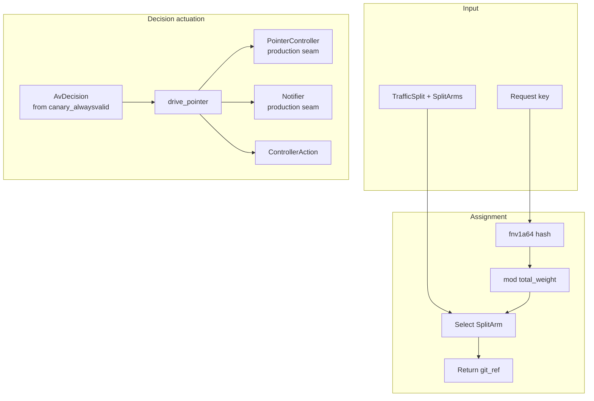
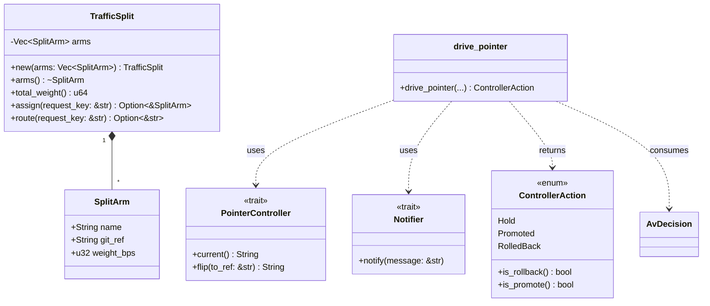
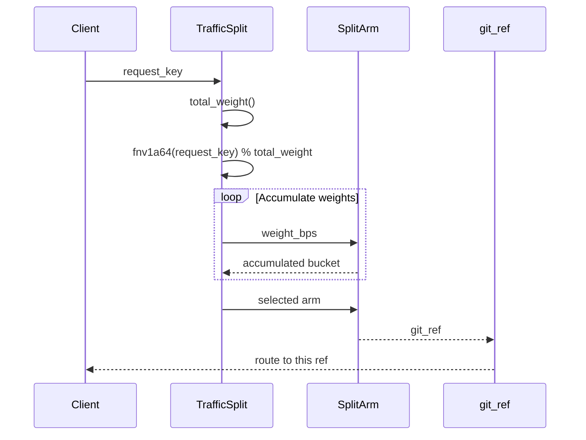
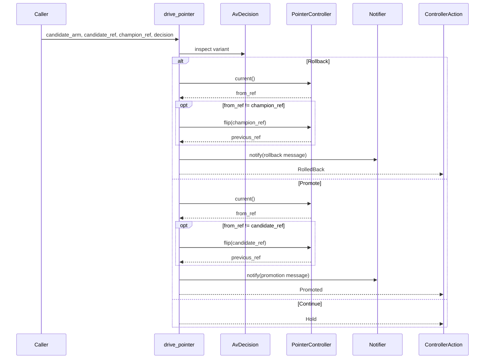
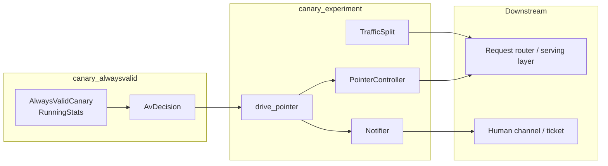

# canary_experiment

The `canary_experiment` module implements the **git-ref-pinned traffic split, multi-arm A/B testing, and live pointer-flip auto-rollback** logic for the canary release system. It is the decision-actuation layer that sits between the anytime-valid statistical inference performed by [`canary_alwaysvalid`](canary_alwaysvalid.md) and the actual production routing surface.

Unlike feature-flag or database-driven canaries, this module treats the deployment pointer as a **git ref** (`env/prod`, `env/prod-canary`, etc.). Traffic is deterministically partitioned across arms using a stable hash of the request key, and when the statistical controller establishes a regression or a win, the live `env/prod` pointer is flipped instantly and byte-for-byte to the chosen ref. On regression, the system **notifies a human, it does not page one** — a deliberate safety posture documented as "gap AS" in the platform evaluation requirements.

---

## Core responsibilities

1. **Deterministic traffic splitting** — assign each request to a weighted, git-ref-pinned arm using a stable FNV-1a-64 hash, with no randomness and no external state.
2. **Multi-arm A/B support** — run more than one candidate ref concurrently alongside the champion.
3. **Pointer-flip actuation** — promote a winning candidate or roll back a regressed one by flipping the live `env/prod` pointer through the [`PointerController`] seam.
4. **Human notification** — emit a notification through the [`Notifier`] seam on every pointer change, never an automated page.
5. **Offline testability** — all split/assignment/decision logic is pure and deterministic; production seams are trait-based and replaced by in-memory doubles in tests.

---

## Architecture

The module is intentionally split into two halves:

- **Pure routing half** ([`TrafficSplit`], [`SplitArm`], [`fnv1a64`]) — fully deterministic, serializable, and testable without any production infrastructure.
- **Seamed actuation half** ([`PointerController`], [`Notifier`], [`drive_pointer`], [`ControllerAction`]) — connects the pure decision to the outside world through replaceable traits.

---

## Component relationships

---

## Data flow

### Request routing

### Pointer actuation

---

## Core components

### `SplitArm`

A single experiment arm. It binds a human-readable `name` to a pinned `git_ref` and a traffic weight expressed in **basis points** (`weight_bps`, where `10000` = 100%). The champion is simply the arm whose ref is the live `env/prod`.

### `TrafficSplit`

A weighted, git-ref-pinned traffic split across N arms.

- `new` filters out arms with non-positive weight; remaining weights are normalized against their total, so they need not sum to exactly `10000`.
- `assign(request_key)` returns the selected arm using a stable FNV-1a-64 hash of the request key modulo the total weight.
- `route(request_key)` is a convenience that returns only the selected `git_ref`.

The assignment is:

- **Deterministic** — the same request key always maps to the same arm.
- **Uniform-ish** — over many distinct keys the share of traffic each arm receives approximates its weight.
- **RNG-free** — no random number generator is used, making tests reproducible and the routing offline-capable.

### `PointerController` (trait)

The production seam that represents the live deploy pointer.

- `current()` returns the git-ref that `env/prod` currently points at.
- `flip(to_ref)` moves `env/prod` to a new ref and returns the previous ref.

A production implementation updates the signed env-ref; tests use an in-memory double such as `MemPointer`.

### `Notifier` (trait)

The production seam for human notification.

- `notify(message)` posts a message to a channel or opens a ticket.

The design intentionally notifies rather than pages, aligning with the safety requirement that a canary rollback should not wake an on-call engineer for an already-contained failure.

### `ControllerAction`

An enum describing what the controller did this step:

- `Hold` — no verdict established yet; keep the split running.
- `Promoted { arm, from_ref, to_ref }` — a candidate arm was promoted to live `env/prod`.
- `RolledBack { arm, from_ref, to_ref, reason }` — a candidate regressed and `env/prod` was flipped back to the champion ref.

Helper methods `is_rollback()` and `is_promote()` simplify test and caller assertions.

### `drive_pointer`

The main actuation function. It consumes an [`AvDecision`](canary_alwaysvalid.md#avdecision) from the anytime-valid inference layer and drives the live pointer accordingly.

Behavior:

1. **Rollback is prioritized over promotion** (safety first).
2. On `Rollback`, if the current pointer is not already the champion, flip it to the champion and notify. If already on the champion, record the safety signal but do not flip.
3. On `Promote`, if the current pointer is not already the candidate ref, flip it to the candidate and notify. If already promoted, return `Hold`.
4. On `Continue`, return `Hold` and do not notify.

---

## How it fits into the system

The canary subsystem is part of the broader [`evaluation_testing`](evaluation_testing.md) domain under [`ai_engine`](ai_engine.md). It works in tandem with:

- [`canary_core`](canary_core.md) — defines the top-level [`Canary`](canary_core.md#canary) orchestrator and [`CanaryConfig`](canary_core.md#canaryconfig), which configure traffic fraction and regression margins.
- [`canary_alwaysvalid`](canary_alwaysvalid.md) — provides the anytime-valid confidence sequence that produces [`AvDecision`](canary_alwaysvalid.md#avdecision) verdicts consumed by `drive_pointer`.
- Serving infrastructure (e.g., [`server_serving`](../pipeline_runtime/server_serving.md), [`runtime_engine`](../pipeline_runtime/runtime_engine.md)) — ultimately routes requests according to the git-ref returned by [`TrafficSplit::route`](#trafficsplit) and the live pointer maintained by [`PointerController`](#pointercontroller-trait).

For the statistical details of how a rollback or promote decision is reached, see [`canary_alwaysvalid`](canary_alwaysvalid.md). For how the canary fits into release gates and broader evaluation pipelines, see [`evaluation_testing`](evaluation_testing.md).

---

## Design decisions

### Git-ref-pinned split

The canary is a git-ref split rather than a database flag. This means:

- The artifact deployed to each arm is immutable and exactly pinned.
- Promotion and rollback are pointer flips, not redeployments.
- The routing decision is stateless and reproducible from the request key plus the split configuration.

### Deterministic assignment

Using FNV-1a-64 instead of RNG:

- Makes unit tests deterministic and reproducible.
- Avoids needing a randomness source in the request path.
- Keeps the routing layer horizontally scalable without shared state.

### Safety-first actuation

- Rollback is checked before promotion.
- A rollback decision is still recorded and notified even if the pointer is already on the champion, so the safety signal is not lost.
- Promotion is idempotent: a second `Promote` decision when the candidate is already live returns `Hold`.

### Human notification, not paging

The [`Notifier`](#notifier-trait) seam is explicitly designed to notify a human through a ticket or channel rather than triggering a page. This reflects the expectation that a canary regression should be an auto-remediated, contained event.

---

## Testing strategy

The module is built for offline testing:

- `MemPointer` and `MemNotifier` are in-memory doubles for the production seams.
- Tests verify deterministic assignment, approximate traffic shares, multi-arm coverage, rollback pointer flips, promotion pointer flips, `Continue` no-ops, and JSON serialization of the split configuration.
- Because assignment is hash-based, traffic-share tests use a large number of distinct keys and assert that the observed share is within a small tolerance of the configured weight.
