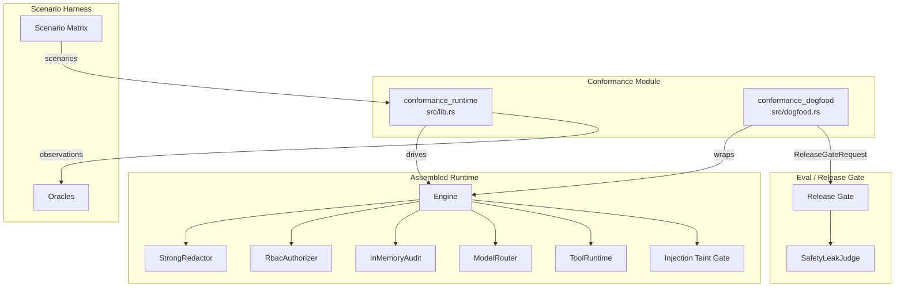
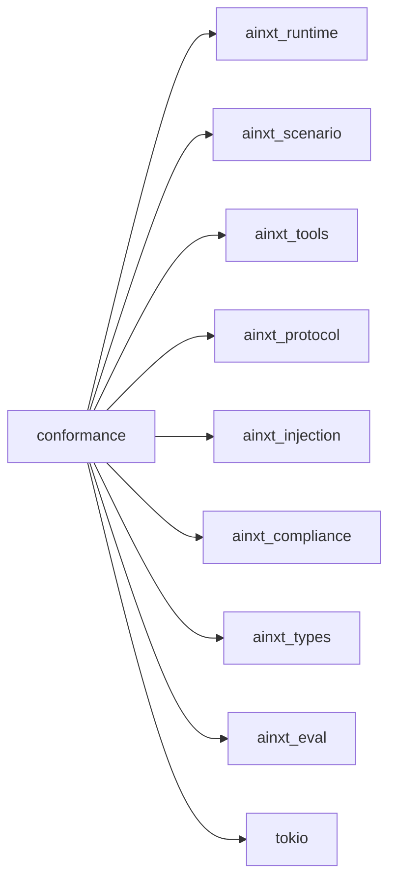
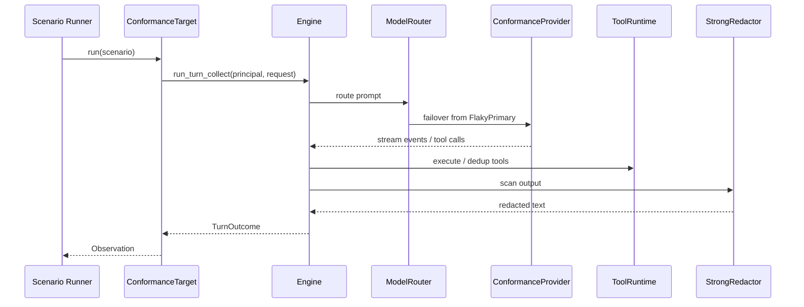
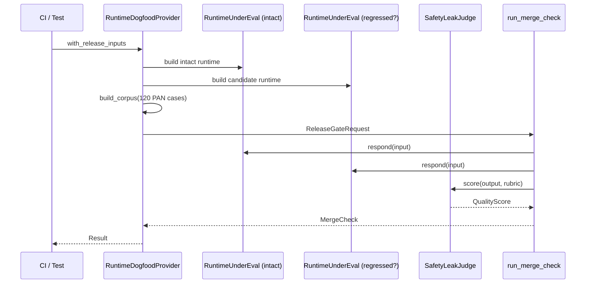

# Conformance Module

The **conformance** module is the system's Definition-of-Done (DoD) harness. It exercises the fully assembled AI runtime against a large, adversarial, deterministic scenario matrix rather than against mocks or individual components. It closes the gap between unit-tested components and the real pipeline by proving that invariants such as output redaction, RBAC enforcement, provider failover, idempotent tool execution, injection taint-gating, and cooperative cancellation hold when all subsystems are wired together.

## Purpose

- Run 1,000+ generated scenarios through the **real** [`ainxt_runtime::Engine`](../pipeline_runtime/runtime_engine.md).
- Verify that safety and compliance invariants are preserved end-to-end.
- Provide a **dogfood** provider that feeds the real runtime into the composed release gate ([`ainxt_eval`](evaluation_testing.md)), so merge decisions are backed by runtime-level evidence.

## Scope

The module contains two sub-modules:

| Sub-module | File | Responsibility |
|------------|------|----------------|
| [conformance_runtime](conformance_runtime.md) | `src/lib.rs` | Assembles the real runtime into a [`Target`](../scenario_service/scenario_service_core.md) and runs the scenario matrix. |
| [conformance_dogfood](conformance_dogfood.md) | `src/dogfood.rs` | Wraps the same runtime as an [`EvalSystem`](evaluation_testing.md) and drives the statistical release gate. |

## Architecture Overview

## High-Level Functionality

### conformance_runtime

[`ConformanceTarget`](conformance_runtime.md) builds a production-like engine and implements the [`Target`](../scenario_service/scenario_service_core.md) trait from [`ainxt_scenario`](../scenario_service/scenario_service.md). For each [`Scenario`](../scenario_service/scenario_service_core.md) it runs a real turn through:

1. **Output redaction** via [`StrongRedactor`](../governance_compliance/compliance.md).
2. **Capability authorization** via [`RbacAuthorizer`](../pipeline_runtime/runtime_engine.md).
3. **Provider failover** — a [`FlakyPrimary`](conformance_runtime.md) provider always fails, forcing the router to the [`ConformanceProvider`](conformance_runtime.md).
4. **Tool execution** — real [`ToolRuntime`](../tools_cli/tools_cli.md) with idempotent [`SettleTool`](conformance_runtime.md) and structured [`PayTool`](conformance_runtime.md).
5. **Injection taint-gating** — tainted turns refuse side-effecting tools.

The provider interprets scenario directives such as `@pan`, `@secret`, `@email`, duplicate settlements, malformed JSON, and injection attempts. Because the provider and the matrix generator share the same derivation functions, a green result means the runtime invariant genuinely holds.

Public entry points:

- `run_matrix()` — full generated matrix.
- `run_pairwise_matrix()` — pairwise-generated corpus.
- `ConformanceTarget::run_cancelled()` — pre-cancelled turn.
- `ConformanceTarget::run_many_concurrent()` — concurrent session isolation.

See [conformance_runtime.md](conformance_runtime.md) for details.

### conformance_dogfood

[`RuntimeDogfoodProvider`](conformance_dogfood.md) is the missing implementation of [`ReleaseGateProvider`](evaluation_testing.md): it runs the **actual assembled runtime** through the rigorous release gate instead of in-crate fakes. It:

1. Builds a baseline runtime with an intact output gate and a candidate runtime that may include a regression.
2. Generates 120 distinct PAN-leak scenarios from deterministic seeds.
3. Scores outputs with the deterministic [`SafetyLeakJudge`](conformance_dogfood.md).
4. Submits a fully assembled [`ReleaseGateRequest`](evaluation_testing.md) to [`run_merge_check`](evaluation_testing.md).

A null change ships; a regressed output gate (e.g., [`Regression::LeakyOutputGate`](conformance_dogfood.md)) leaks PANs, scores 0, and the gate blocks the merge.

Public entry points:

- `dogfood_merge_check()` — null change.
- `dogfood_merge_check_with_regression(regression)` — negative control.

See [conformance_dogfood.md](conformance_dogfood.md) for details.

## Dependencies

- **[ainxt_runtime](../pipeline_runtime/runtime_engine.md)** — the engine, router, RBAC authorizer, audit, and provider trait.
- **[ainxt_scenario](../scenario_service/scenario_service.md)** — scenario definitions, matrix generation, oracles, and the `Target` trait.
- **[ainxt_tools](../tools_cli/tools_cli.md)** — tool runtime, ledger, and tool trait.
- **[ainxt_protocol](../core_infrastructure/core_interaction.md)** — request/event protocol.
- **[ainxt_injection](safety_guardrails_injection.md)** — injection detection and taint-gate configuration.
- **[ainxt_compliance](../governance_compliance/compliance.md)** — `StrongRedactor` output compliance gate.
- **[ainxt_types](../core_infrastructure/security_config_identity.md)** — `Principal` and `DataClass`.
- **[ainxt_eval](evaluation_testing.md)** — release gate, judge calibration, sealed corpus, and regression vault.

## Data Flow

### Scenario Matrix Run

### Dogfood Release Gate

## Key Design Decisions

1. **No mocks for the runtime.** The engine, router, authorizer, audit, tool runtime, and injection gate are all real implementations. Only the LLM providers are fake.
2. **Deterministic providers.** `ConformanceProvider` and `FlakyPrimary` are fully deterministic, so matrix runs are reproducible and require no network or API keys.
3. **Failover on every turn.** Registering `FlakyPrimary` as the primary ensures provider-failover logic is exercised by every scenario.
4. **Shared derivation with the matrix.** The provider uses `ainxt_scenario::matrix::parse_directive`, so scenarios cannot be green because of test-specific shortcuts.
5. **Fail-closed dogfood judge.** `SafetyLeakJudge` is deterministic, in-house, and scores 0 if the forbidden PAN appears in the output.

## Documentation Map

| Document | Description |
|----------|-------------|
| [conformance_runtime.md](conformance_runtime.md) | Core conformance runtime target, provider, tools, and matrix runners. |
| [conformance_dogfood.md](conformance_dogfood.md) | Dogfood provider that runs the real runtime through the release gate. |

## Related Documentation

- [conformance_runtime.md](conformance_runtime.md)
- [conformance_dogfood.md](conformance_dogfood.md)
- [runtime_engine.md](../pipeline_runtime/runtime_engine.md)
- [scenario_service.md](../scenario_service/scenario_service.md)
- [evaluation_testing.md](evaluation_testing.md)
- [safety_guardrails_injection.md](safety_guardrails_injection.md)
- [compliance.md](../governance_compliance/compliance.md)
- [tools_cli.md](../tools_cli/tools_cli.md)
