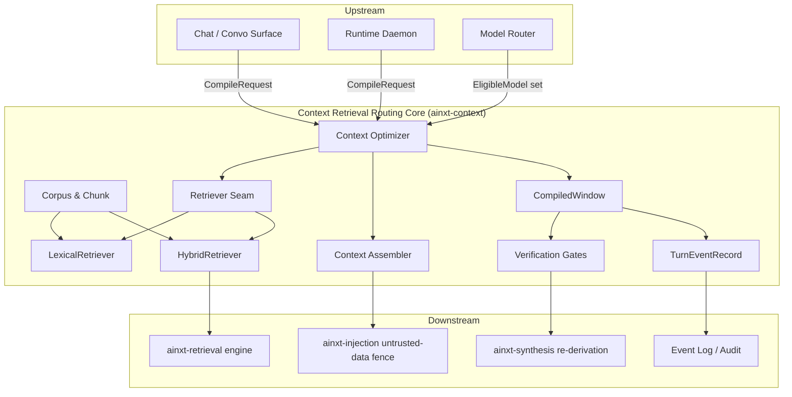
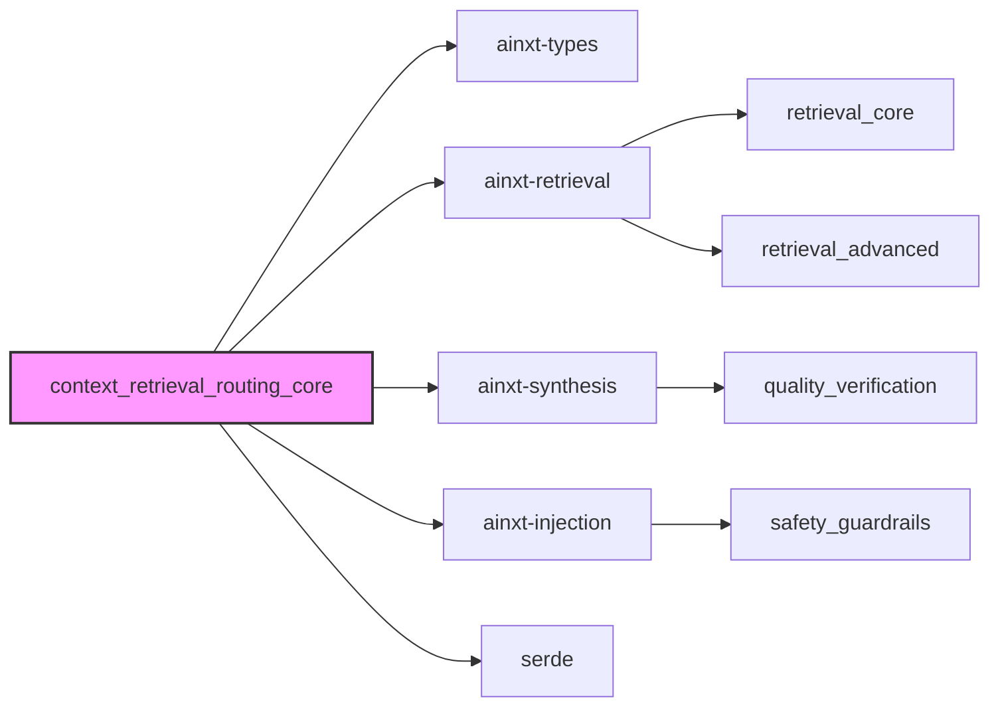
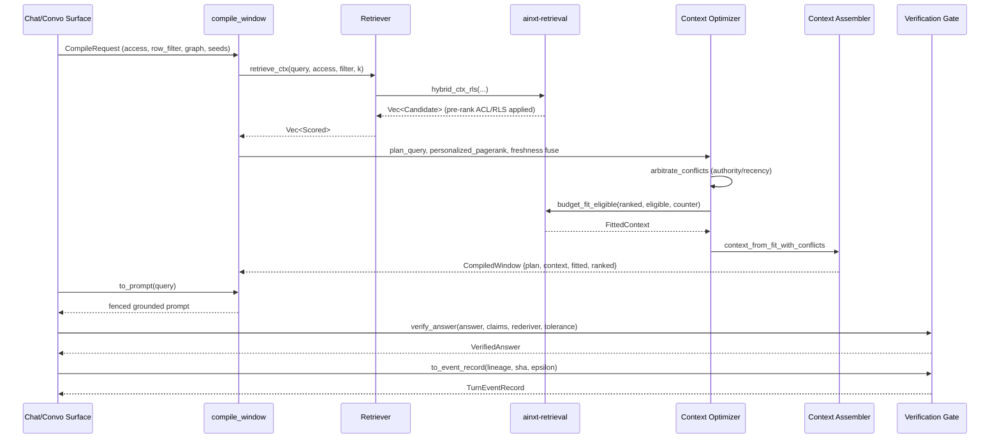
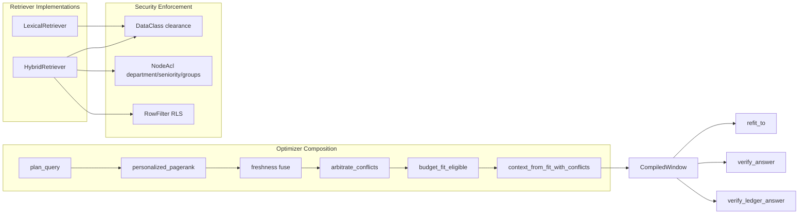
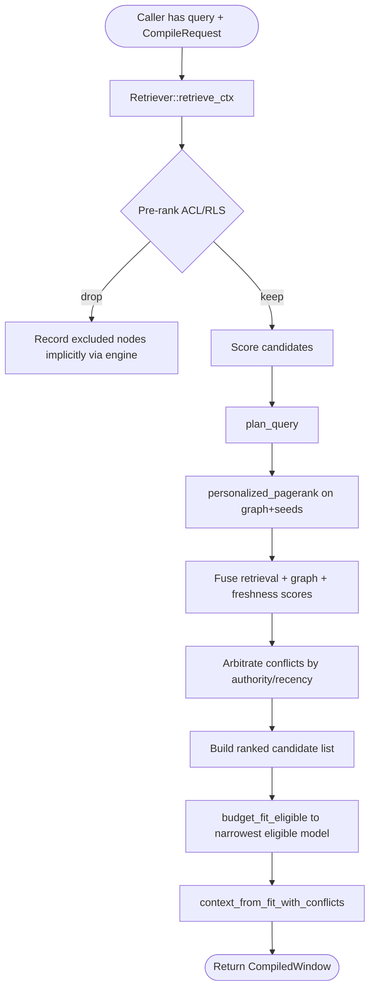
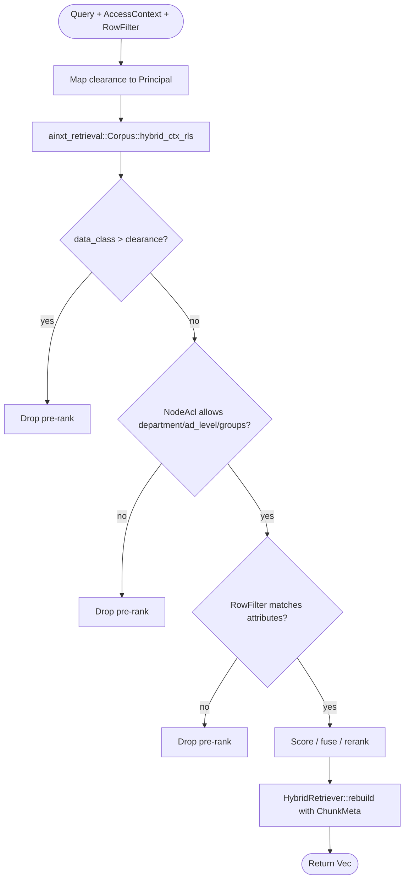
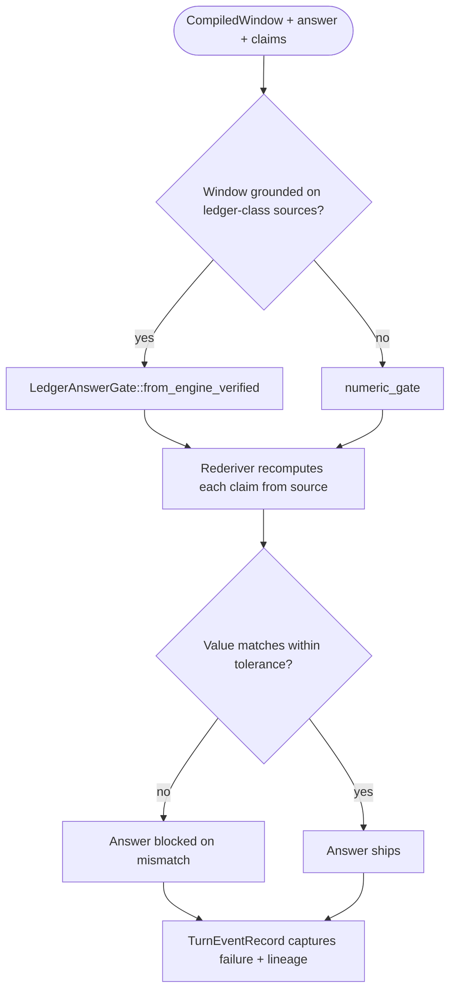

# Context Retrieval Routing Core

## Brief Introduction

The **Context Retrieval Routing Core** (`ainxt-context`) implements the **Context Fabric**: the subsystem responsible for retrieving, ranking, filtering, and assembling grounded context for a language-model turn. It sits between raw knowledge corpora and the conversational/serving surfaces, ensuring that every answer is built only from sources the caller is authorized to see, that every included or excluded source is accounted for in an auditable lineage, and that numeric claims can be verified through server-side re-derivation before they are returned to a user.

This module is the central composition point for retrieval + grounding + citations. It defines a `Retriever` seam that both a simple lexical implementation and the production hybrid engine (`pgvector` HNSW + BM25 → RRF → rerank) can satisfy, so higher layers never need to change when the retrieval backend is swapped. It also hosts the **Context Optimizer**, which fuses cross-graph personalized PageRank, freshness preferences, and eligible-model budget fitting into a single `CompiledWindow` that carries its own verification gates.

For the surrounding retrieval ecosystem, see [context_retrieval_routing_optimizer](context_retrieval_routing_optimizer.md) (graph-based query planning and ranking) and [context_retrieval_routing_router](context_retrieval_routing_router.md) (multi-graph fabric routing). For the lower-level retrieval engine this module wraps, see [retrieval_core](retrieval_core.md).

---

## Module Purpose and Core Functionality

The module has four responsibilities:

1. **Represent knowledge** as `Chunk`s inside a populatable `Corpus`, preserving per-node RBAC (`NodeAcl`), row-level attributes, source authority, freshness, and conflict-group metadata.
2. **Retrieve securely** through the `Retriever` trait, enforcing caller clearance, department/seniority/group ACL, and RLS row-filters **pre-rank** so that inaccessible sources never influence ranking or leak their existence.
3. **Assemble grounded context** (`Context`) with citations and a complete `LineageNode` audit trail for every retrieved node — included, budget-dropped, or superseded by conflict arbitration.
4. **Compile and verify windows** via the Context Optimizer: plan the query, fuse graph signals, fit to the narrowest eligible model window, and run numeric re-derivation gates over the resulting answer.

The design is driven by `CONTEXT_FABRIC.md` and ADR-012, with explicit hooks for ADR-008/010 groundedness verification and ADR-009 instruction/data separation.

---

## Architecture

The architecture is layered around a single public compile entrypoint, `compile_window`, which consumes a `CompileRequest` and emits a `CompiledWindow`. The window is then used by the caller to build a prompt, generate an answer, and verify numeric claims. All retrieval backends implement the same `Retriever` trait, so the optimizer and assembler are backend-agnostic.

---

## Core Components

### Knowledge Representation

- **`Chunk`** — One retrievable unit of knowledge. Carries `id`, `source`, `text`, `data_class`, plus optional `timestamp` (freshness), `authority` and `topic` (conflict arbitration), `acl` (per-node RBAC), and `attributes` (RLS row labels).
- **`Corpus`** — An in-memory collection of `Chunk`s with load/ingest/extend APIs. `Corpus::to_retrieval_corpus()` maps context chunks onto the `ainxt_retrieval::Corpus` format while preserving `NodeAcl` and row attributes so the production engine can enforce them pre-rank.
- **`ChunkMeta`** — Optimizer-only metadata (`timestamp`, `authority`, `topic`) that the retrieval engine does not carry, re-attached by `HybridRetriever` after retrieval.

### Retrieval Seam

- **`Retriever`** — The trait that abstracts every retrieval backend. Provides three retrieval methods:
  - `retrieve(query, clearance, k)` — class-clearance filtering only.
  - `retrieve_scoped(query, principal, row_filter, k)` — adds RLS row-filtering.
  - `retrieve_ctx(query, access_context, row_filter, k)` — full node/edge RBAC + RLS.
- **`Scored`** — A retrieved `Chunk` with its relevance score.
- **`LexicalRetriever`** — Term-overlap baseline retriever. Enforces class clearance pre-rank; useful for tests and offline environments.
- **`HybridRetriever`** — Production adapter over `ainxt_retrieval::Corpus`. Supports dense query embeddings, cross-encoder reranking, and full ACL/RLS pre-rank enforcement. Built from a `Corpus` via `hybrid_retriever()` or `hybrid_retriever_full()`.
- **`QueryEmbedder`** — Optional seam for turning a query string into a dense vector for the hybrid retriever's dense arm.

### Context Assembly

- **`Context`** — The assembled grounding material for one turn: included `Chunk`s, display `Citation`s, and a full `LineageNode` trail.
- **`Citation`** — User-facing reference (`marker`, `source`, `chunk_id`, `data_class`).
- **`LineageNode`** — Audit/erasure record for one retrieved node, including `data_class`, `provenance`, and `LineageOutcome`.
- **`LineageOutcome`** — `Included`, `DroppedByBudget`, or `SupersededByConflict`. Every retrieved node is accounted for.

### Context Optimizer

- **`OptimizerConfig`** — Tuning for a compile pass: `k`, eligible models, freshness/graph weights, and PageRank parameters.
- **`CompileRequest`** — The single per-turn input bundle: `AccessContext`, optional `RowFilter`, optional `RankGraph`, and seed entities.
- **`CompiledWindow`** — The optimizer's output: query plan, assembled `Context`, token fit, ranked candidates, and id→chunk map. Supports `refit_to()` for model-confirm and failover, plus `verify_answer()` and `verify_ledger_answer()` for numeric gates.

### Verification and Event Logging

- **`VerifiedAnswer`** — Wrapper around the numeric re-derivation gate outcome, with `ships()` and `blocked_on_mismatch()` accessors.
- **`TurnEventRecord`** — The single Event-Log-ready payload joining lineage, re-derivation hashes, federated epsilon spend, and the live control-plane SHA.

---

## Dependencies

- **[ainxt-types](../core_infrastructure/security_config.md)** — `DataClass`, `Principal`, and other security primitives. Clearance is expressed through `DataClass::sensitivity()` and `Principal::clearance`.
- **[ainxt-retrieval](retrieval_core.md)** — The production retrieval engine (`Corpus`, `Candidate`, `FittedContext`, `TokenCounter`, `Reranker`), plus ACL/RLS enforcement (`AccessContext`, `NodeAcl`, `RowFilter`, `RlsSession`).
- **[ainxt-synthesis](quality_verification.md)** — Numeric re-derivation and ledger-class answer verification (`Rederiver`, `numeric_gate`, `LedgerAnswerGate`, `AnswerVerification`).
- **[ainxt-injection](safety_guardrails.md)** — Untrusted-data fencing (`wrap_untrusted`, `Provenance::Retrieved`) so retrieved content is labelled as data, not instructions.
- **serde** — Serialization for `Context`, `LineageNode`, `TurnEventRecord`, and configuration types.

---

## Data Flow

The data flow is intentionally single-entry: `compile_window` performs retrieval, ranking, fitting, and assembly in one call. The returned `CompiledWindow` then supports prompt construction, re-fitting, and answer verification without re-running retrieval.

---

## Component Interactions

The optimizer composes graph, freshness, conflict arbitration, and budget fitting as a pipeline. Security enforcement happens inside the retriever implementations, with `HybridRetriever` delegating to `ainxt_retrieval::Corpus::hybrid_ctx_rls` so that ACL and RLS are applied in the same pre-rank pass.

---

## Process Flows

### Compile Window

### Retrieval and Security

### Numeric Verification

---

## Security Model

The module's security guarantees are enforced **before** ranking, not after:

- **Class clearance** — A chunk whose `data_class.sensitivity()` exceeds the caller's clearance is dropped before scoring.
- **Node ACL** — When `Chunk::acl` is set, `HybridRetriever` carries it into `ainxt_retrieval::Chunk` and `retrieve_ctx` enforces department, `ad_level`, and allow/deny group constraints in the same pre-rank pass.
- **RLS row-filtering** — `Chunk::attributes` are bound against the per-request `RowFilter` from the OBO principal. Rows outside the caller's scope are never scored.
- **Existence non-leakage** — Because filtering is pre-rank, a forbidden chunk cannot influence ordering, citations, or lineage, and its existence is not revealed by score gaps or truncation.
- **Conflict arbitration** — Competing statements of the same `topic` are resolved by authority then recency; losers are recorded as `SupersededByConflict` rather than silently co-grounded.
- **Untrusted-data fencing** — `Context::to_prompt` wraps retrieved content with `ainxt_injection::wrap_untrusted(..., Provenance::Retrieved)` to separate retrieved data from system instructions.

For the broader injection and guardrail layers, see [safety_guardrails](safety_guardrails.md).

---

## Integration with the Overall System

The Context Retrieval Routing Core is part of the [knowledge_retrieval](knowledge_retrieval.md) subsystem under [ai_engine](ai_engine.md). Its position in the call stack:

- **Upstream callers**: `ainxt-convo` (conversation intelligence), `ainxt-chat` (chat surface), and `ainxt-runtimed` (runtime daemon) call `compile_window` with a `CompileRequest` built from the OBO principal and the model router's eligible-model set.
- **Sibling modules**:
  - [context_retrieval_routing_optimizer](context_retrieval_routing_optimizer.md) supplies `plan_query`, `personalized_pagerank`, and `RankGraph`.
  - [context_retrieval_routing_router](context_retrieval_routing_router.md) supplies multi-graph fabric routing (`RoutedWindow`, `MultiGraphFabric`).
  - [context_sources](context_sources.md) provides artifact stores and code extraction that feed chunks into the corpus.
- **Downstream dependencies**:
  - [retrieval_core](retrieval_core.md) and [retrieval_advanced](retrieval_advanced.md) provide the actual search, ACL, RLS, federation, and structured-query engines.
  - [quality_verification](quality_verification.md) provides synthesis and re-derivation for the numeric gates.
  - [safety_guardrails](safety_guardrails.md) provides the untrusted-data fence and broader guardrails.

The module is designed so that wiring the production hybrid retriever into a served surface is a one-line change: replace `Box::new(LexicalRetriever::new(corpus))` with `hybrid_retriever(&corpus)` or `hybrid_retriever_full(...)`.

---

## Key Design Decisions

- **Single `Retriever` trait** — Both lexical and hybrid engines implement the same interface, making the optimizer and assembler backend-agnostic.
- **Pre-rank security** — ACL and RLS are applied before scoring/fusion/reranking, guaranteeing that inaccessible sources never leak existence or influence results.
- **Complete lineage** — Every retrieved node is recorded as `Included`, `DroppedByBudget`, or `SupersededByConflict`, enabling audit, citations, and right-to-erasure cascades.
- **`CompiledWindow` owns verification** — The same object that grounds the context also runs numeric re-derivation gates, so verification is tied to the exact sources that shaped the answer.
- **Event-log-ready record** — `TurnEventRecord` joins lineage, re-derivation hashes, federated epsilon spend, and control-plane SHA into one serializable payload for downstream audit sinks.

---

## References

- [context_retrieval_routing_optimizer](context_retrieval_routing_optimizer.md) — Graph-based query planning and personalized PageRank.
- [context_retrieval_routing_router](context_retrieval_routing_router.md) — Multi-graph fabric routing.
- [context_sources](context_sources.md) — Artifact stores and source extraction.
- [retrieval_core](retrieval_core.md) — Core retrieval engine, token fitting, and reranking.
- [retrieval_advanced](retrieval_advanced.md) — Federation, RLS, and structured retrieval.
- [quality_verification](quality_verification.md) — Synthesis, re-derivation, and ledger-class answer gates.
- [safety_guardrails](safety_guardrails.md) — Injection defense and untrusted-data fencing.
- [security_config](../core_infrastructure/security_config.md) — `DataClass`, `Principal`, and security primitives.
