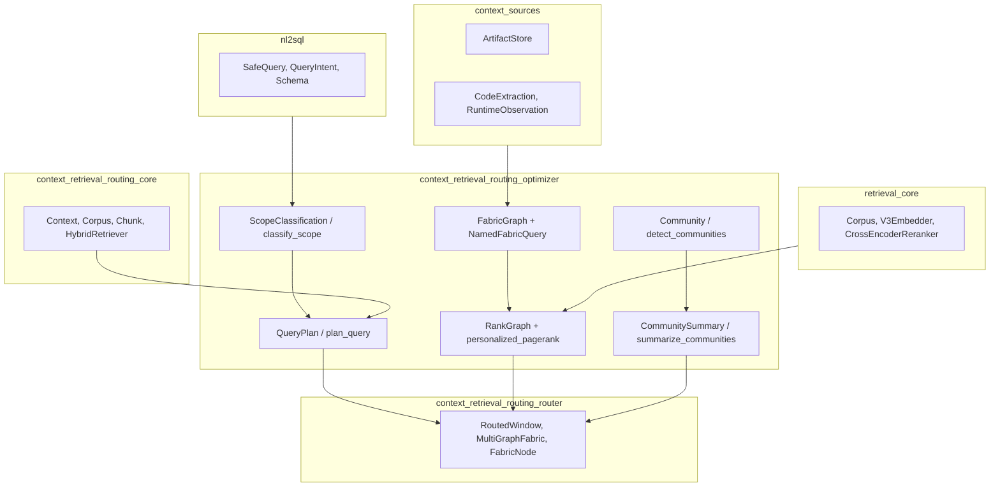
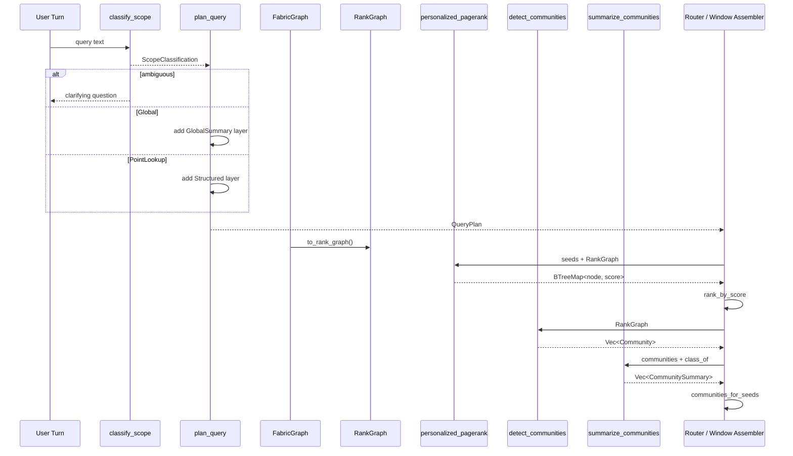
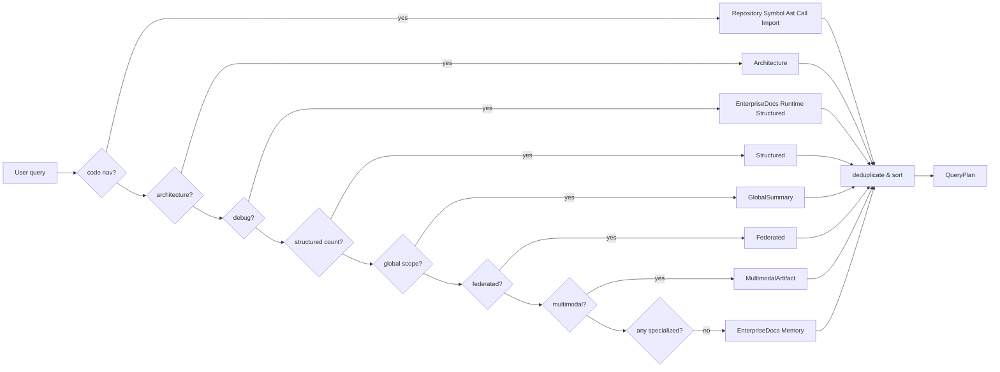
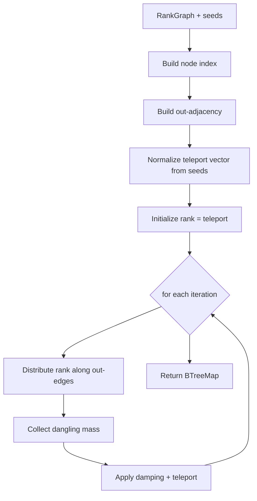
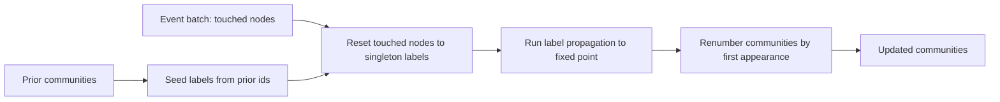

# Context Retrieval Routing Optimizer

The **Context Retrieval Routing Optimizer** is the planning and ranking core of the Context Fabric. It decides *which* knowledge-graph layers a turn should draw from, classifies the query's scope tier, ranks candidate nodes across the unified graph, and produces the community summaries used for global sensemaking. It lives in `crates/ainxt-context/src/optimizer.rs` and is designed to be deterministic, dependency-light, and mount-ready for served routes.

---

## 1. Purpose and Core Functionality

The optimizer solves three related problems in the retrieval pipeline:

1. **Layer selection** — avoid fanning every query across all sixteen Context Fabric layers. Instead, `plan_query` inspects the query's shape and returns a `QueryPlan` containing only the relevant `GraphLayer` variants.
2. **Scope classification** — decide whether a question is a bounded *point lookup* (route to structured NL-to-SQL) or a cross-cutting *global sensemaking* ask (route to GraphRAG map-reduce). The classifier accumulates weighted evidence and exposes an `ambiguous` flag when the margin is too low.
3. **Cross-graph ranking and summarization** — score nodes with personalized PageRank over a `RankGraph`, query typed relations through `FabricGraph`, and detect/label communities for the global summary layer.

The module is intentionally pure: it contains no I/O, no RNG, no wall-clock reads, and no hash-map iteration order leakage. All outputs are deterministic for a given input, which makes the optimizer safe for regression tests, replay, and audit.

---

## 2. Architecture



The optimizer sits between the raw fabric sources and the router that assembles windows. It consumes graphs and query text and emits plans, scores, and community summaries. The actual embedding, chunking, and low-level retrieval are delegated to sibling modules.

---

## 3. Component Reference

### 3.1 `GraphLayer`

An enum enumerating the sixteen fabric layers defined in `CONTEXT_FABRIC.md` §2 and `STRUCTURED_FEDERATED_RETRIEVAL.md` §1. Examples include `Conversation`, `Symbol`, `Call`, `Import`, `Architecture`, `Runtime`, `Structured`, `Federated`, `GlobalSummary`, and `MultimodalArtifact`.

### 3.2 `QueryPlan`

```rust
pub struct QueryPlan {
    pub layers: Vec<GraphLayer>,
}
```

The planner's output. Layers are returned in canonical declaration order and deduplicated. `Conversation` is always included because current and related turns ground every answer.

### 3.3 `ScopeClassification`

```rust
pub struct ScopeClassification {
    pub scope: QueryScope,
    pub confidence: f64,
    pub ambiguous: bool,
    pub global_score: f64,
    pub point_score: f64,
}
```

The result of `classify_scope`. `scope` is either `PointLookup` or `Global`. `ambiguous` is set when both classes accumulated real evidence but the normalized margin is below `SCOPE_AMBIGUITY_THRESHOLD` (0.20). Callers must clarify rather than guess.

### 3.4 `RankGraph`

A simple directed graph used by the cross-graph ranker:

```rust
pub struct RankGraph {
    pub nodes: Vec<String>,
    pub edges: Vec<(String, String)>,
}
```

`personalized_pagerank` runs over this structure. The teleport vector is seeded on the query's in-scope entities; dangling nodes redistribute mass through the same teleport vector so total rank is conserved.

### 3.5 `FabricGraph`

The typed, queryable knowledge graph. It stores `TypedEdge` values labeled by `EdgeKind` (`Calls`, `References`, `Imports`, `DependsOn`, `ChangedWith`, `TestCovers`, `RuntimeError`, `ArchitectureContains`) and optional per-node `GraphLayer` labels.

It exposes the named structured query interface from `CONTEXT_FABRIC.md` §5:

| Method | Query semantics |
|--------|-----------------|
| `who_calls(sym)` | Symbols that call `sym` |
| `refs_of(sym)` | Symbols that reference `sym` |
| `deps(module)` | Modules imported or depended on by `module` |
| `changed_with(file)` | Files that change together with `file` |
| `tests_covering(fn)` | Tests covering `fn` |
| `runtime_errors_for(fn)` | Runtime errors observed for `fn` |
| `architecture_around(module)` | What contains / is contained by `module` |

`to_rank_graph()` projects the typed graph onto an untyped `RankGraph` so the PageRank ranker can operate over the whole fabric.

### 3.6 `NamedFabricQuery`

A route-ready request enum that mirrors the named methods above. `named_fabric_query` is the single dispatcher a served route can call, avoiding ad-hoc method access.

### 3.7 `Community` and `CommunitySummary`

`Community` is a detected node cluster. `CommunitySummary` adds an RBAC `data_class` label computed as the maximum sensitivity over the community's members, so a summary never leaks the existence of a more-sensitive node.

---

## 4. Data Flow



1. The query is classified.
2. A `QueryPlan` is produced.
3. The typed fabric is projected to a `RankGraph`.
4. Personalized PageRank scores nodes against query seeds.
5. Communities are detected (or updated incrementally) and labeled.
6. The router assembles the final context window from plans, scores, and summaries.

---

## 5. Process Flows

### 5.1 Query Planning



Rules are additive. If no specialized rule fires, the fallback is general prose Q&A over docs and memory.

### 5.2 Personalized PageRank



The algorithm is deterministic: nodes are sorted, iteration count is fixed, and ties in `rank_by_score` are broken by node id.

### 5.3 Incremental Community Detection



`detect_communities_incremental` preserves stable community ids across mostly-unchanged regions of a large fabric, which is required for live graph maintenance described in `CONTEXT_FABRIC.md` §4.

---

## 6. Dependencies and Relationships

### 6.1 Upstream dependencies

| Module | What it provides | How the optimizer uses it |
|--------|------------------|---------------------------|
| [context_retrieval_routing_core](context_retrieval_routing_core.md) | `Context`, `Corpus`, `Chunk`, `HybridRetriever`, `OptimizerConfig` | Configuration and the core context types that the planner consumes |
| [context_sources](context_sources.md) | `ArtifactStore`, `CodeExtraction`, `RuntimeObservation` | Raw material that populates `FabricGraph` edges and layers |
| [retrieval_core](retrieval_core.md) | `Corpus`, `V3Embedder`, `CrossEncoderReranker`, `LexicalRetriever` | Low-level retrieval and reranking that consumes optimizer scores |
| [nl2sql](nl2sql.md) | `SafeQuery`, `QueryIntent`, `Schema` | Receives point-lookup queries classified by the optimizer |

### 6.2 Downstream consumers

| Module | What it consumes |
|--------|------------------|
| [context_retrieval_routing_router](context_retrieval_routing_router.md) | `QueryPlan`, `RankGraph` scores, `CommunitySummary` |
| [context_retrieval_routing_core](context_retrieval_routing_core.md) | `OptimizerConfig`, `CompiledWindow` assembly |

### 6.3 External crate dependencies

- `serde` — serialization of plans, graphs, and queries.
- `ainxt_types::DataClass` — RBAC sensitivity labels for community summaries.
- `std::collections::{BTreeMap, BTreeSet}` — deterministic ordering.

---

## 7. Determinism and Testing

The module is built for deterministic, reproducible behavior:

- No random number generators.
- No wall-clock reads.
- Sorted node order and canonical layer order.
- Fixed iteration counts for PageRank and label propagation.
- Tie-breaking by smallest label or lexicographic id.

The inline test suite covers:

- Query planning for refactor, debug, count, global, federated, multimodal, and fallback intents.
- Determinism and canonical ordering of `QueryPlan`.
- Personalized PageRank seed bias, mass conservation, dangling-node handling, and uniform fallback.
- Typed fabric queries (`who_calls`, `refs_of`, `deps`, `changed_with`, `tests_covering`, `runtime_errors_for`, `architecture_around`).
- Community detection, RBAC-labeled summaries, and incremental community updates.

---

## 8. Design Notes and Tradeoffs

- **Label propagation vs. Louvain/Leiden**: The community detector uses synchronous label propagation because it is near-linear, has no randomized tie-breaking, and requires no extra dependencies. The tradeoff is that it does not optimize global modularity, so deployments that need modularity-optimal partitions at very large scale can swap the `RankGraph -> Vec<Community>` function in an indexing crate without changing the optimizer interface.
- **Scope classification is evidence-based, not keyword-switch**: `classify_scope` accumulates graded cues and decides on the normalized margin. A low margin with competing evidence marks the query `ambiguous` and triggers clarification.
- **Planner rules are additive**: A query can match multiple rules and therefore include multiple layers. The final plan is always deduplicated and sorted.

---

## 9. Related Documentation

- [context_retrieval_routing_core](context_retrieval_routing_core.md) — core context types and retriever composition.
- [context_retrieval_routing_router](context_retrieval_routing_router.md) — window routing and fabric-node assembly.
- [context_sources](context_sources.md) — artifact stores and source extraction.
- [retrieval_core](retrieval_core.md) — embedding, reranking, and corpus retrieval.
- [nl2sql](nl2sql.md) — structured query generation for point lookups.
