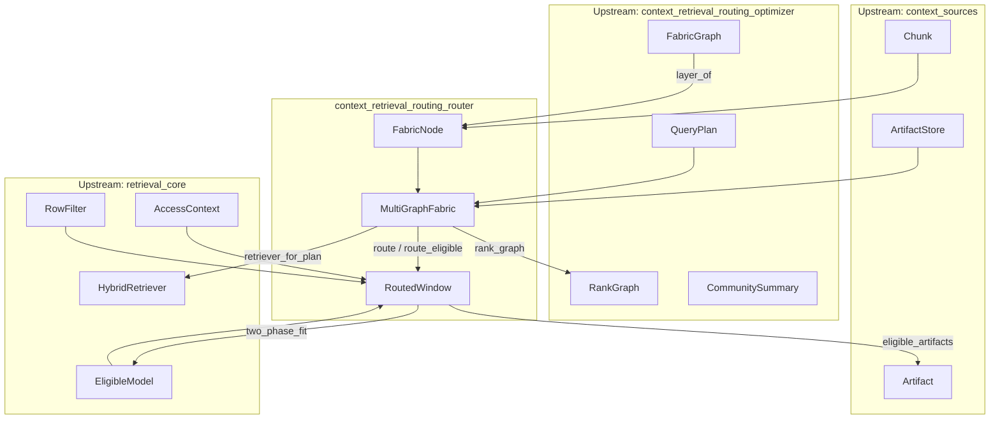
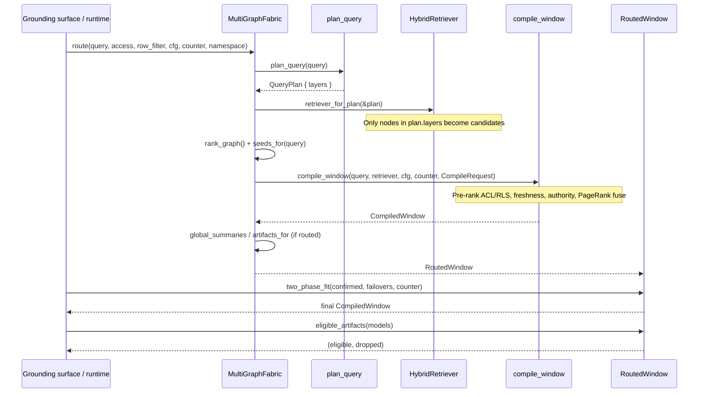

# context_retrieval_routing_router

The **Context Retrieval Routing Router** is the served routing layer of the Context Optimizer. It transforms the static, multi-layer "fabric of graphs" into a live, query-planned retrieval source that every grounding surface can call each turn.

In other words: this module is where the abstract context fabric (layers, typed edges, community summaries, and multimodal artifacts) is wired into a concrete, routable retrieval pipeline. It closes several previously-dormant paths by making the fabric retrievable over, by letting the query plan decide which layers participate, by running cross-graph personalized PageRank on the served path, and by mounting the global/sensemaking and multimodal tiers only when the plan says they are relevant.

## Core responsibilities

1. **Multi-graph fabric as a live retrieval source** — `MultiGraphFabric` holds layered `FabricNode`s, typed `FabricGraph` edges, and an `ArtifactStore`. It can build a real `HybridRetriever` over the nodes a query plan selected, so the fabric is retrieved over rather than only modelled.
2. **Query planning routes retrieval** — Only nodes whose `GraphLayer` is in the `QueryPlan` enter the candidate set. Out-of-plan layers are never scored.
3. **Cross-graph personalized PageRank on the served path** — The fabric's edges become the `RankGraph` and the query's in-scope nodes become the seed vector, fusing graph structure into ranking.
4. **Global/sensemaking + multimodal tiers routed by plan** — Community summaries and artifact handles are returned only when the plan routes to `GlobalSummary` or `MultimodalArtifact`.
5. **Two-phase budget fit driven by real model eligibility** — `RoutedWindow::two_phase_fit` re-fits the window to the confirmed model and to every failover target, preventing silent truncation.
6. **Model-eligibility gating for multimodal artifacts** — `RoutedWindow::eligible_artifacts` routes each artifact through `crate::artifact::route_model` so regulated data never resolves to a cloud model.

Everything here is a retrieval read-filter / ranking concern — never a turn-admission decision. An empty plan, a fully-filtered fabric, or an empty artifact tier yields an empty routed window, never a denied turn.

## Architecture



## Component reference

### `FabricNode`

A single node in the unified fabric. It pairs a `Chunk` (the retrievable text body with RBAC/RLS labels) with the `GraphLayer` it belongs to. This pairing is what lets the query planner include or exclude the node from a turn's candidate set.

```rust
pub struct FabricNode {
    pub layer: GraphLayer,
    pub chunk: Chunk,
}
```

- `layer` — the fabric graph layer label (e.g. `Repository`, `Runtime`, `GlobalSummary`).
- `chunk` — the retrievable content, carrying `data_class`, optional `acl`, row `attributes`, freshness, authority, and topic metadata.

### `MultiGraphFabric`

The unified, queryable multi-graph fabric as a live retrieval source. It owns:

- `nodes: Vec<FabricNode>` — all layered chunks.
- `graph: FabricGraph` — typed cross-graph edges (whoCalls, deps, imports, etc.).
- `artifacts: ArtifactStore` — multimodal artifact tier.

Key methods:

| Method | Purpose |
|--------|---------|
| `new` / `default` | Create an empty fabric. |
| `with_node` | Index a layered node. |
| `with_graph` | Attach typed cross-graph edges. |
| `with_artifacts` | Attach the multimodal artifact store. |
| `from_fabric(graph, contents)` | Build a fabric from a populated `FabricGraph` plus chunk bodies. Nodes whose id is not labelled by the graph are skipped, preventing mis-layering. |
| `retriever_for_plan(plan)` | Build a `HybridRetriever` over only the nodes whose layer is in the plan. Preserves per-node ACL + RLS attributes. |
| `rank_graph()` | Project the typed edges onto an untyped `RankGraph` for PageRank. |
| `seeds_for(query)` | Return the query's in-scope seed nodes for personalized PageRank (lexical match, weight 1.0). |
| `global_summaries(query, access)` | Return clearance-filtered community summaries when the plan routes to `GlobalSummary`. |
| `artifacts_for(namespace, access)` | Return ACL-scoped artifacts when the plan routes to `MultimodalArtifact`. |
| `route(...)` | The single routed served entrypoint: plan → retrieve → rank → fit → attach global/artifact tiers. |
| `route_eligible(...)` | Same as `route`, but uses the caller-supplied per-request eligible-model set instead of the config default. |

### `RoutedWindow`

The output of a routed compile. It contains:

```rust
pub struct RoutedWindow {
    pub plan: QueryPlan,
    pub window: CompiledWindow,
    pub community_summaries: Vec<CommunitySummary>,
    pub artifacts: Vec<Artifact>,
    pub compiled_layers: Vec<GraphLayer>,
}
```

- `plan` — the query plan that drove routing.
- `window` — the compiled, ranked, budget-fit `CompiledWindow`.
- `community_summaries` — global/sensemaking tier, populated only when routed.
- `artifacts` — multimodal artifact tier, populated only when routed.
- `compiled_layers` — the distinct fabric layers that actually contributed chunks to the window; observable proof that the compile drew from the fabric's layers.

Key methods:

| Method | Purpose |
|--------|---------|
| `layer_count()` | Number of distinct fabric layers compiled into the window. |
| `two_phase_fit(confirmed, failovers, counter)` | Re-fit the window to the confirmed model and then to each failover model. |
| `eligible_artifacts(models)` | Pair artifacts with eligible `ArtifactModel`s; drop ineligible ones with a concrete `RoutingError`. |

## Data flow



## How routing works

1. **Plan the query** — `plan_query` inspects the query text and returns a `QueryPlan` containing the relevant `GraphLayer`s. For example, a "refactor" query routes to `Repository`, `Symbol`, `Ast`, `Call`, `Import`, and possibly `Test` and `GitHistory`. A "how many" query routes to `Structured`. A genuinely global-scope query routes to `GlobalSummary`.

2. **Build a scoped retriever** — `retriever_for_plan` filters the fabric's `FabricNode`s to only those whose layer is in the plan, clones their `Chunk`s, and builds a `HybridRetriever` from them. Because `Chunk` carries ACL and row attributes, the retrieval engine can enforce them pre-rank.

3. **Fuse graph structure into ranking** — `rank_graph()` projects the typed fabric edges onto an untyped adjacency list. `seeds_for(query)` finds nodes whose text contains query terms. These are passed to `compile_window` as the `graph` and `seeds` fields of `CompileRequest`, so the optimizer's personalized PageRank fuse runs on the served path.

4. **Compile the window** — `compile_window` retrieves candidates, applies pre-rank ACL/RLS, fuses lexical + graph + freshness + authority scores, arbitrates conflicts by topic, and fits the result to the eligible-model floor.

5. **Attach routed tiers** — If the plan includes `GlobalSummary`, community summaries are computed, filtered to the query's seed communities, and clearance-filtered. If the plan includes `MultimodalArtifact`, artifacts in the namespace visible to the caller are returned.

6. **Track compiled layers** — The resulting `RoutedWindow` records which fabric layers actually contributed chunks (`compiled_layers`), giving observability into the "fabric of graphs compiled into the window each turn" property.

## Two-phase budget fit

The initial `route` call performs a phase-1 fit to the eligible floor (the narrowest context window among eligible models). After the Model Router resolves the actual model for the turn, the caller should call `RoutedWindow::two_phase_fit`:

```rust
let final_window = routed_window.two_phase_fit(
    &confirmed_model,
    &[failover_a, failover_b],
    counter,
);
```

This re-fits to the confirmed model (whose window is typically wider than the floor) and then re-fits to each failover model in order. Failover targets can be narrower than the primary, so re-fitting prevents silent truncation if the request falls back.

## Artifact model eligibility

The multimodal artifact tier previously had no model-eligibility gate inside this crate. `RoutedWindow::eligible_artifacts` closes that gap:

```rust
let (eligible, dropped) = routed_window.eligible_artifacts(&artifact_models);
```

Each artifact is routed through `crate::artifact::route_model`, which enforces:

- modality match (`ArtifactModel::modality == Artifact::modality`)
- regulated-data rule: regulated artifacts never resolve to a cloud model

Eligible artifacts are returned paired with their model. Ineligible artifacts are returned in `dropped` with a `RoutingError`, allowing the caller to emit a compliance/observability finding instead of silently forwarding the artifact to the wrong model or dropping it.

## Dependencies

This module sits inside the `context_retrieval_routing` submodule of `knowledge_retrieval` under `ai_engine`. It directly depends on:

- [context_retrieval_routing_optimizer](context_retrieval_routing_optimizer.md) — for `plan_query`, `FabricGraph`, `RankGraph`, `QueryPlan`, `GraphLayer`, community detection, and summarization.
- [context_sources](context_sources.md) — for `Chunk` bodies and the `ArtifactStore` / `Artifact` multimodal tier.
- [retrieval_core](retrieval_core.md) — for `HybridRetriever`, `Corpus`, `AccessContext`, `RowFilter`, `EligibleModel`, `TokenCounter`, `Candidate`, and `FittedContext`.

It is consumed by grounding surfaces in the runtime and server layers, which hand in the caller's access claims, row filter, and per-request eligible-model set.

## Security and compliance notes

- **Existence-never-leaks**: ACL and RLS filtering happen pre-rank inside `compile_window`. A caller who is not cleared for a node never sees its score or presence.
- **Clearance-filtered summaries**: Community summaries are filtered to the caller's clearance, using the most-sensitive data class among the community's members.
- **Namespace-isolated artifacts**: Artifact search is scoped to a namespace and filtered by the caller's `AccessContext`.
- **No turn-admission decisions**: An empty result is an empty `RoutedWindow`, not a denied turn. Compliance redact-and-proceed logic lives elsewhere.
- **Auditability**: `compiled_layers`, `dropped` artifacts, and the `RoutingError` values provide concrete signals for observability and compliance findings.
