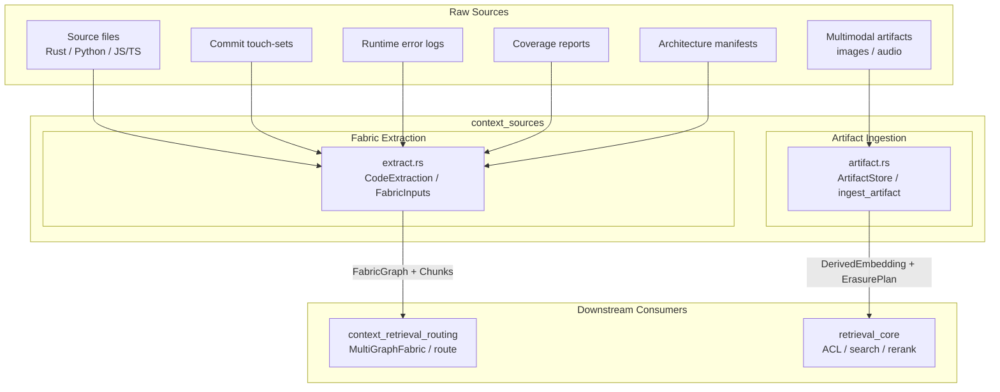
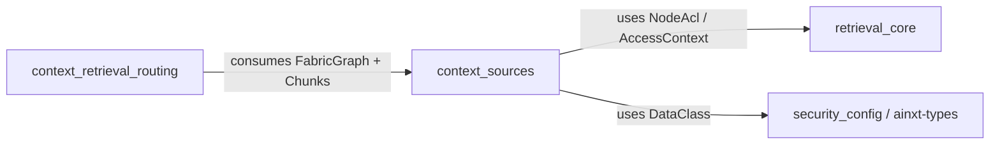
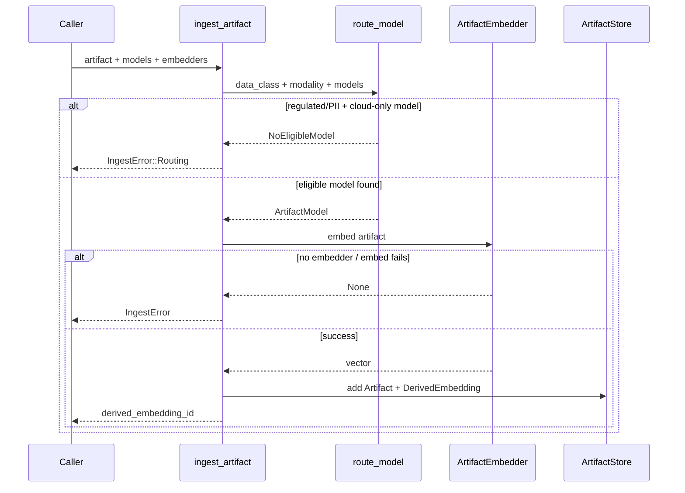
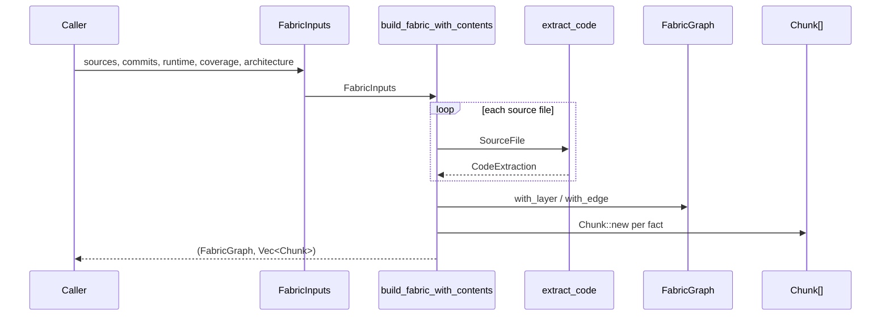

# context_sources

The `context_sources` module is the **source-material tier** of the knowledge-retrieval stack. It is responsible for turning raw, heterogeneous inputs into the structured, retrievable, and governed artifacts that downstream retrieval, routing, and synthesis components consume.

In practical terms, `context_sources` answers two questions:

1. **How do multimodal artifacts (images, audio) enter the system safely?**  
   It provides data-class-aware model routing, namespace isolation, RBAC pre-filtering, and erasure cascades for vision/ASR embeddings.
2. **How does the system build the Context Fabric graph from real repository artifacts?**  
   It extracts symbols, AST spans, call/import edges, architecture containment, git-history coupling, runtime observations, and test-coverage records into a unified, queryable `FabricGraph` with retrievable `Chunk` content.

`context_sources` lives under [`ai_engine`](ai_engine.md) → [`knowledge_retrieval`](knowledge_retrieval.md). It feeds [`context_retrieval_routing`](context_retrieval_routing.md), which routes and compiles the resulting chunks into served context windows.

---

## Architecture Overview

### Design Principles

- **Fail-closed routing**: Regulated or PII artifacts are never silently sent to a cloud vision/ASR model. If no in-house model exists, ingestion is refused.
- **Existence-never-leaks RBAC**: Artifact search filters above-clearance or ACL-blocked items *before* results form, mirroring the text-retrieval guarantee in [`retrieval_core`](retrieval_core.md).
- **Erasure cascade**: Deleting an artifact also deletes every derived embedding produced from it, satisfying right-to-erasure requirements.
- **Deterministic extraction**: All fabric extractors use sorted iteration and no external clocks or RNG, making outputs reproducible and testable.
- **Layer-complete fabric**: Every Context Fabric layer (Repository, Symbol, AST, Call, Import, Architecture, GitHistory, Runtime, Test) is materialized as both a typed graph edge and a retrievable `Chunk`, so routing rules can actually surface them into compiled windows.

---

## Sub-modules

| Sub-module | File | Responsibility | Documentation |
|---|---|---|---|
| Fabric Extraction | `crates/ainxt-context/src/extract.rs` | Lexical source extraction and structured-artifact ingestion into `FabricGraph` + `Chunk`s. | [context_sources_fabric_extraction](context_sources_fabric_extraction.md) |
| Artifact Ingestion | `crates/ainxt-context/src/artifact.rs` | Multimodal artifact indexing, data-class model routing, namespace isolation, RBAC, and erasure cascades. | [context_sources_artifacts](context_sources_artifacts.md) |

---

## Dependencies

- [`retrieval_core`](retrieval_core.md): provides ACL primitives (`NodeAcl`, `AccessContext`) reused by artifact search.
- [`security_config`](../core_infrastructure/security_config.md) / `ainxt-types`: provides `DataClass` sensitivity labels that drive both artifact routing and fabric chunk classification.
- [`context_retrieval_routing`](context_retrieval_routing.md): consumes the `FabricGraph` and `Chunk`s produced by the fabric extractor, and the `DerivedEmbedding`s produced by artifact ingestion, to compile served context windows.

---

## Data Flow

### Multimodal Artifact Ingestion

### Context Fabric Construction

---

## Integration Notes

- `context_sources` does **not** perform final retrieval ranking or window compilation. It produces the *material* that [`context_retrieval_routing`](context_retrieval_routing.md) ranks and compiles.
- The artifact tier is modality-isolated by construction: one embedder per modality, and regulated data never routes to cloud models. The actual vision/ASR model implementation is an infra seam represented by the `ArtifactEmbedder` trait.
- The fabric extractor is intentionally a deterministic lexical pass rather than a full tree-sitter parse. This keeps the crate dependency-light while still emitting a real, queryable graph. A production AST indexer can replace or augment `extract_code` without changing the graph contract.

---

## See Also

- [context_sources_fabric_extraction](context_sources_fabric_extraction.md) — detailed documentation for source-code and structured-artifact fabric extraction.
- [context_sources_artifacts](context_sources_artifacts.md) — detailed documentation for multimodal artifact ingestion, routing, and erasure.
- [context_retrieval_routing](context_retrieval_routing.md) — the downstream module that routes and compiles fabric chunks into served windows.
- [retrieval_core](retrieval_core.md) — provides the ACL and search primitives reused by artifact search.
