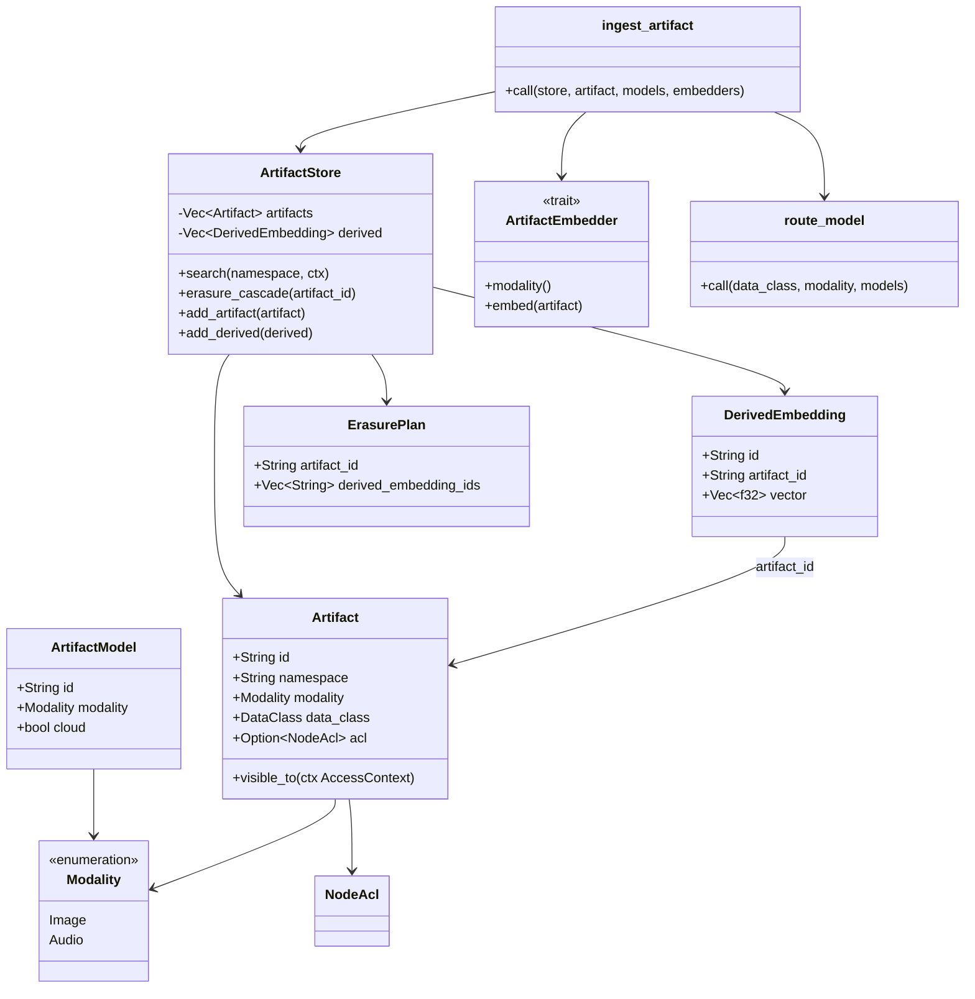
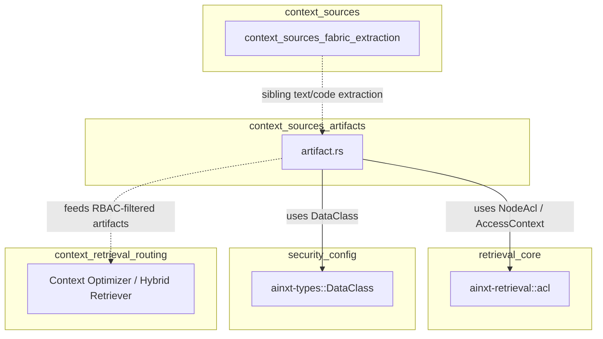
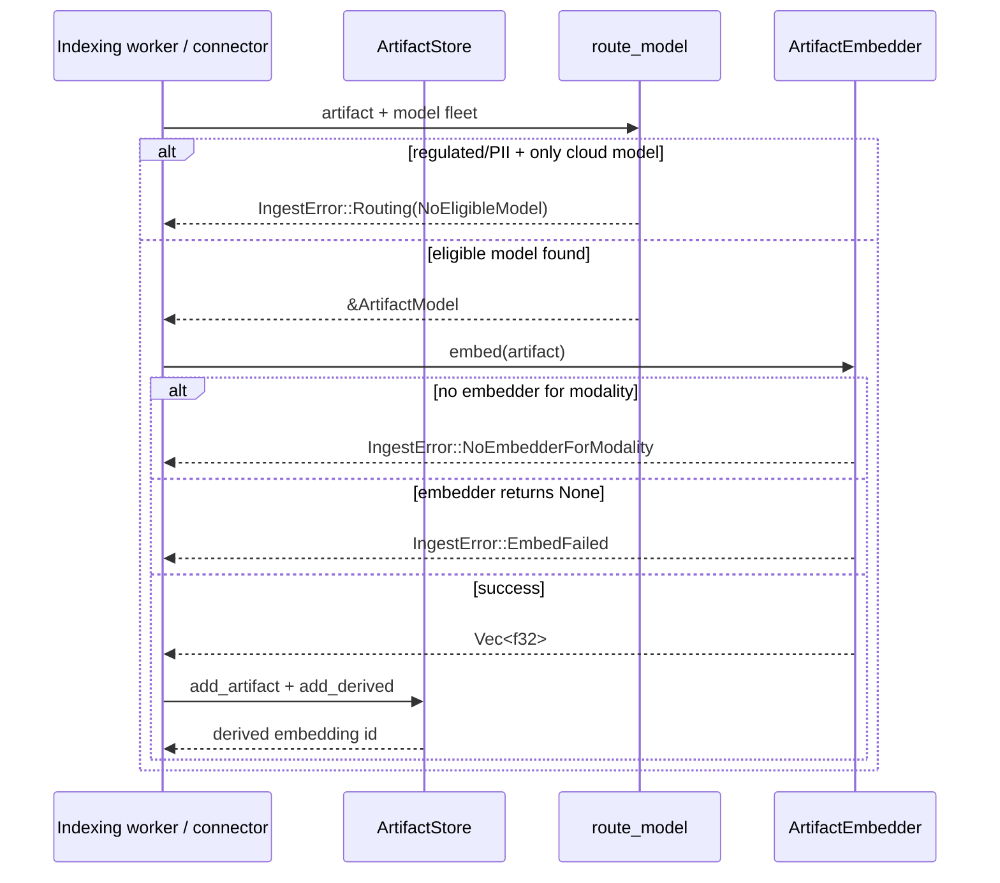
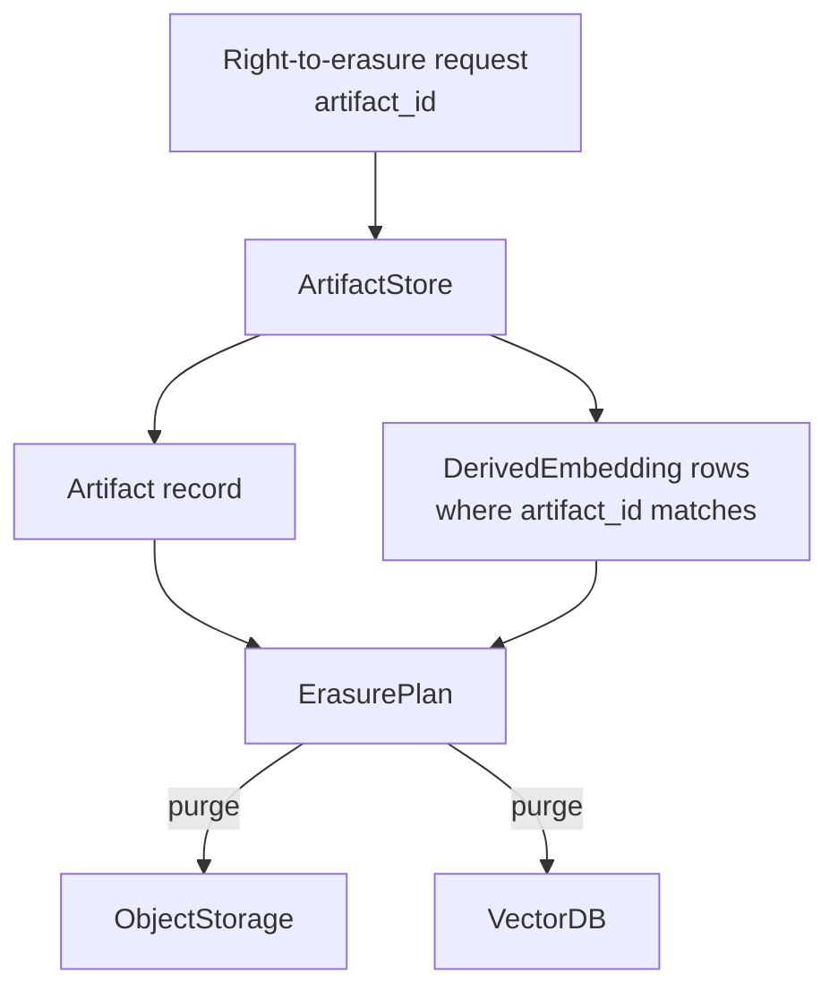
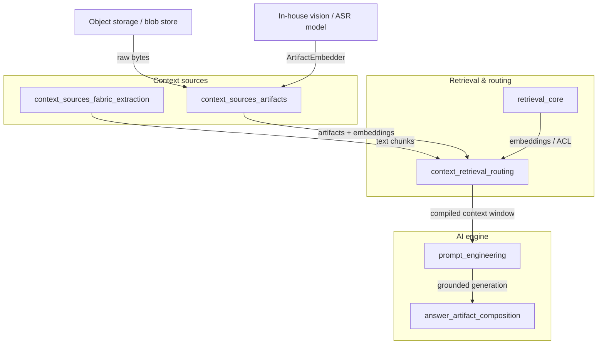

# `context_sources_artifacts` — Multimodal Artifact Ingestion & Retrieval

The `context_sources_artifacts` module implements the **multimodal artifact tier** of the
knowledge-retrieval fabric. It provides a deterministic, offline-capable pipeline for ingesting,
indexing, searching, and erasing non-text artifacts such as cheque scans, KYC images, and call
recordings. The module is deliberately **modality-isolated**: each artifact type (image, audio)
travel through its own namespace, embedding pipeline, and access-control boundary, and regulated or
PII-bearing artifacts are never routed to cloud-hosted vision/ASR models.

This module lives under [`context_sources`](context_sources.md) inside
[`knowledge_retrieval`](knowledge_retrieval.md), which is part of the broader
[`ai_engine`](ai_engine.md). It complements the text/code extraction pipeline implemented in
[`context_sources_fabric_extraction`](context_sources_fabric_extraction.md) and feeds ranked,
RBAC-filtered context into [`context_retrieval_routing`](context_retrieval_routing.md).

---

## What this module does

1. **Artifact modelling** — Represents multimodal artifacts (`Artifact`), their derived vector rows
   (`DerivedEmbedding`), and the in-house/cloud models that may embed them (`ArtifactModel`).
2. **Data-class model routing** — Selects an eligible embedding model for an artifact based on its
   `modality` and `data_class`. Regulated/PII artifacts are refused unless an in-house model exists.
3. **Pluggable embedding** — Defines the `ArtifactEmbedder` seam so infrastructure can inject the
   real vision/ASR model without coupling the routing/RBAC logic to it.
4. **Namespace-isolated, RBAC-aware search** — `ArtifactStore::search` filters results **pre-rank**
   by namespace, data-class clearance, and optional `NodeAcl`, guaranteeing that an unauthorized
   caller cannot learn that a protected artifact exists.
5. **Erasure cascade** — `ArtifactStore::erasure_cascade` returns an `ErasurePlan` that covers both
   the artifact handle and every derived embedding, supporting right-to-erasure workflows.

---

## Core components

| Component | Responsibility |
|-----------|----------------|
| `Artifact` | A typed, RBAC-labelled handle to a non-text blob (image, audio). |
| `Modality` | Enum isolating `Image` and `Audio` pipelines into separate namespaces. |
| `ArtifactModel` | A vision/ASR model descriptor with a `cloud` flag; regulated data may only use non-cloud models. |
| `route_model` | Deterministic, fail-closed router that picks the first eligible model by sorted id. |
| `ArtifactEmbedder` | Trait seam for the actual modality embedder (ONNX vision, Whisper ASR, etc.). |
| `DerivedEmbedding` | A vector row produced from an artifact; linked by `artifact_id` for cascade erasure. |
| `ArtifactStore` | In-memory reference index of artifacts and derived embeddings, partitioned by namespace. |
| `ErasurePlan` | The set of ids (artifact + derived embeddings) that must be purged for a right-to-erasure request. |
| `ingest_artifact` | End-to-end ingestion pipeline: route → embed → index atomically, with fail-visible errors. |
| `RoutingError` / `IngestError` | Explicit failure reasons; ingestion never silently drops a rejected artifact. |
| `FixedEmbedder` | Test-only deterministic embedder fixture used to exercise the ingestion pipeline offline. |

---

## Architecture



### Component relationships

- `Artifact` is the central domain object. It carries a `data_class` from
  [`security_config`](../core_infrastructure/security_config.md) and an optional `NodeAcl` from
  [`retrieval_core`](retrieval_core.md), reusing the same access-control model as text chunks.
- `ArtifactModel` and `route_model` enforce the **data-class routing policy**: a regulated/PII
  artifact (`DataClass::RegulatedPayment`, `DataClass::Pii`) is matched only with models whose
  `cloud` flag is `false`.
- `ArtifactEmbedder` is the **infra seam**. The module does not contain the actual vision/ASR model;
  it only defines the contract that an embedder must satisfy. This keeps the routing, RBAC, and
  erasure logic deterministic and testable offline.
- `ArtifactStore` is a **reference index**. A production deployment would back it with object storage
  for blobs and a vector database for `DerivedEmbedding` rows; the in-memory implementation here
  captures the exact policy semantics.

---

## Module dependencies



- **Upstream**: `context_sources_artifacts` depends on [`security_config`](../core_infrastructure/security_config.md) for
  `DataClass` and on [`retrieval_core`](retrieval_core.md) for `NodeAcl`/`AccessContext`. These are
  shared with the text-retrieval path so that artifacts and text chunks obey the same clearance and
  ACL semantics.
- **Sibling**: [`context_sources_fabric_extraction`](context_sources_fabric_extraction.md) handles
  text and code extraction; this module handles the multimodal (image/audio) side of the same
  `context_sources` layer.
- **Downstream**: [`context_retrieval_routing`](context_retrieval_routing.md) consumes the filtered
  artifacts (or their embeddings) when assembling a grounded context window.

---

## Data flows

### 1. Ingestion flow (`ingest_artifact`)



The pipeline is **atomic and fail-visible**:

1. `route_model` resolves an eligible model. If none exists, the artifact is **not indexed**.
2. The matching `ArtifactEmbedder` computes the vector. Missing embedders or model failures surface
   as explicit errors.
3. Only on full success are both the `Artifact` and its `DerivedEmbedding` inserted into the store.

This prevents half-ingested artifacts that would break the erasure-cascade guarantee.

### 2. Search flow (`ArtifactStore::search`)


Filtering happens **before** any scoring or result formation, mirroring the
"existence-never-leaks" guarantee of the text-retrieval path. A caller who lacks clearance or is in
a denied department cannot infer the presence of a protected artifact.

### 3. Erasure flow (`ArtifactStore::erasure_cascade`)



The returned `ErasurePlan` includes the artifact id and the ids of **all** derived embeddings. This
ensures that erasing a regulated cheque scan also erases its vision embedding, satisfying DPDP
right-to-erasure and the modality-isolation design.

---

## RBAC, compliance, and safety guarantees

| Guarantee | Mechanism |
|-----------|-----------|
| **Modality isolation** | `Modality` enum and one embedder per modality; image and audio pipelines never share an index. |
| **Data-class routing** | `route_model` rejects regulated/PII artifacts when only cloud models are available. |
| **Existence-never-leaks** | `ArtifactStore::search` applies namespace, clearance, and ACL filters pre-rank. |
| **Right-to-erasure** | `erasure_cascade` returns both the artifact and every derived embedding id. |
| **Fail-visible ingestion** | `ingest_artifact` returns explicit errors; rejected artifacts are never indexed. |

These properties are the multimodal projection of the same policies that govern text chunks in
[`context_sources_fabric_extraction`](context_sources_fabric_extraction.md) and
[`context_retrieval_routing`](context_retrieval_routing.md).

---

## How it fits into the overall system



- **Input**: raw multimodal blobs from object storage and an `ArtifactEmbedder` implementation from
  the in-house vision/ASR infrastructure.
- **Processing**: `context_sources_artifacts` routes, embeds, indexes, and protects the artifacts.
- **Output**: RBAC-filtered artifact handles and derived embeddings that the context optimizer in
  [`context_retrieval_routing`](context_retrieval_routing.md) can fuse with text chunks into a
  grounded context window.
- **Consumers**: downstream [`prompt_engineering`](prompt_engineering.md) and
  [`answer_artifact_composition`](answer_artifact_composition.md) use the grounded context to
  produce answers and artifacts.

---

## Usage example

```rust
use ainxt_context::artifact::{
    ingest_artifact, Artifact, ArtifactEmbedder, ArtifactModel, ArtifactStore, Modality,
};
use ainxt_retrieval::acl::AccessContext;
use ainxt_types::DataClass;

// 1. Define a model fleet with one in-house image model.
let models = vec![ArtifactModel::new("inhouse-vision", Modality::Image, false)];

// 2. Provide an embedder implementation (here a stub; real code uses ONNX/Whisper).
struct VisionEmbedder;
impl ArtifactEmbedder for VisionEmbedder {
    fn modality(&self) -> Modality { Modality::Image }
    fn embed(&self, _a: &Artifact) -> Option<Vec<f32>> { Some(vec![0.1, 0.2, 0.3]) }
}

// 3. Ingest a regulated KYC scan.
let mut store = ArtifactStore::new();
let derived_id = ingest_artifact(
    &mut store,
    Artifact::new("kyc-1", "kyc:bankA", Modality::Image, DataClass::RegulatedPayment),
    &models,
    &[&VisionEmbedder],
).expect("ingestion succeeds");

// 4. Search with a cleared caller.
let ctx = AccessContext::new(DataClass::RegulatedPayment, Some("kyc-ops"), None, &[]);
let hits = store.search("kyc:bankA", &ctx);
assert_eq!(hits.len(), 1);

// 5. Erase the artifact and its derived embedding.
let plan = store.erasure_cascade("kyc-1");
assert_eq!(plan.derived_embedding_ids, vec![derived_id]);
```

---

## Testing strategy

The module ships with deterministic, offline tests that exercise the policy surface without
requiring real vision/ASR models:

- **Routing policy**: regulated/PII artifacts route only to non-cloud models; a regulated audio
  artifact with only a cloud ASR model is refused.
- **Namespace + ACL isolation**: cross-namespace queries, department-level ACLs, and below-clearance
  callers all return no leaked results.
- **Erasure cascade**: deleting an artifact also deletes every linked `DerivedEmbedding`.
- **Ingestion failure modes**: cloud-only regulated model, missing embedder, and embedder failure all
  leave the store untouched.

A test-only `FixedEmbedder` is used to simulate embedder behavior deterministically.

---

## See also

- [`context_sources`](context_sources.md) — parent module covering all context-source pipelines.
- [`context_sources_fabric_extraction`](context_sources_fabric_extraction.md) — text and code
  extraction sibling.
- [`context_retrieval_routing`](context_retrieval_routing.md) — context optimizer and hybrid
  retriever that consumes artifact output.
- [`retrieval_core`](retrieval_core.md) — shared retrieval primitives (`NodeAcl`, `AccessContext`,
  embedding/reranking interfaces).
- [`security_config`](../core_infrastructure/security_config.md) — `DataClass` definitions and clearance model.
- [`ai_engine`](ai_engine.md) — top-level AI engine documentation.
