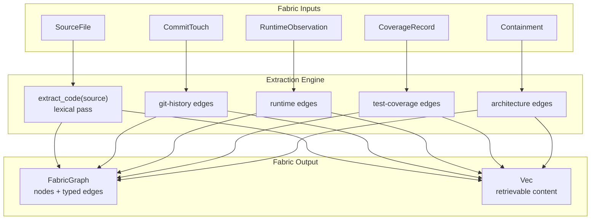
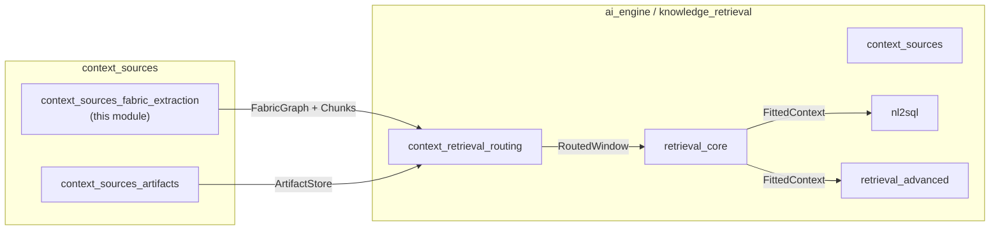
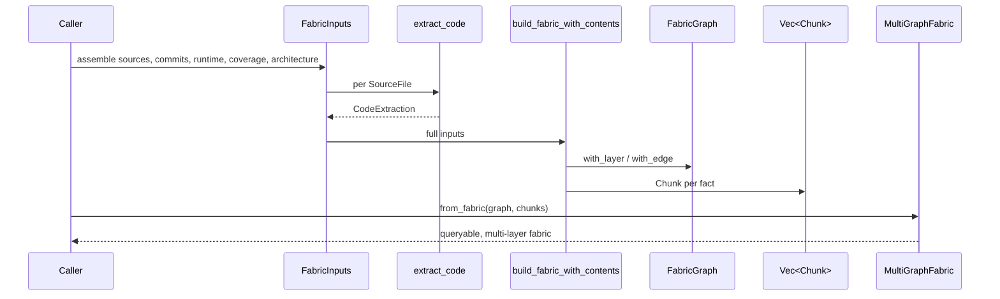
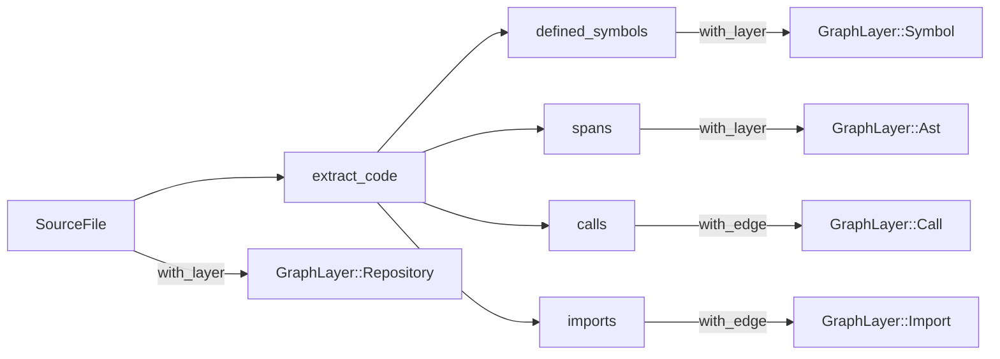
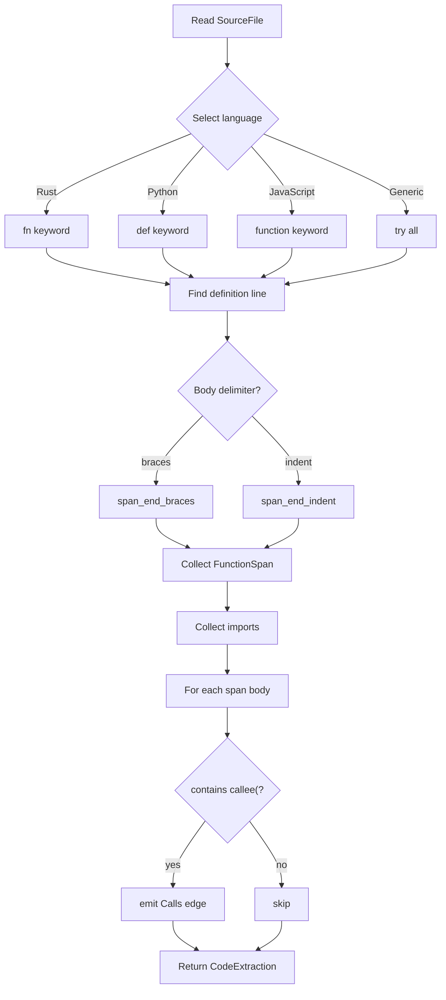
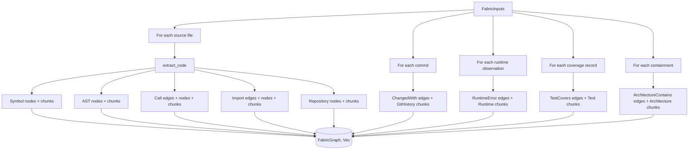

# context_sources_fabric_extraction

The `context_sources_fabric_extraction` module implements the **offline fabric extractors** that populate the Context-Fabric graph layers defined in `CONTEXT_FABRIC.md` §2. It turns concrete repository artifacts—source files, git commit touch-sets, runtime observability logs, test-coverage reports, and architecture manifests—into the typed [`FabricGraph`] that the context optimizer queries and ranks over.

In short, this is the bridge between raw engineering data and the structured, multi-layer context fabric used by the retrieval and routing pipeline.

---

## Purpose and Core Functionality

The module's job is to **ingest real artifacts and emit a deterministic, queryable fabric graph** plus retrievable content chunks. It addresses the gap between having a fabric *substrate* and actually *populating* it from live inputs.

Key responsibilities:

1. **Lexical source-code extraction** for Rust, Python, JavaScript/TypeScript, and generic best-effort parsing:
   - Defined symbols (functions/methods) → `GraphLayer::Symbol`
   - Function line spans → `GraphLayer::Ast`
   - Call edges between defined symbols → `GraphLayer::Call`
   - Import/module references → `GraphLayer::Import`
   - File nodes → `GraphLayer::Repository`

2. **Structured-artifact extraction** from already-collected inputs:
   - Git commit touch-sets → `GraphLayer::GitHistory`
   - Runtime error observations → `GraphLayer::Runtime`
   - Test coverage records → `GraphLayer::Test`
   - Architecture containment records → `GraphLayer::Architecture`

3. **Unified fabric building** via [`build_fabric`] and [`build_fabric_with_contents`], producing both the edge-labelled graph and retrievable [`Chunk`]s for every layer.

4. **Observability** via [`layer_edge_counts`], which reports per-layer population counts so callers can assert that extraction actually happened.

The design is intentionally deterministic: sorted iteration, no RNG, no wall clock, and allocation-bounded. The symbol/AST/call/import pass is lexical rather than a full tree-sitter parse, keeping the crate permissive and lightweight while still covering common shapes across Rust, Python, and JS/TS.

---

## Architecture

### High-level component layout



### Module position in the system



`context_sources_fabric_extraction` sits at the **source ingestion** boundary of the knowledge-retrieval stack. It feeds [`context_retrieval_routing`](context_retrieval_routing.md), which in turn relies on [`retrieval_core`](retrieval_core.md) and related modules to rank, fit, and serve context windows.

---

## Core Components

### `SourceFile`

A single source file to extract from.

| Field | Type | Description |
|-------|------|-------------|
| `path` | `String` | File path, used as the repository node id. |
| `language` | `Language` | Rust, Python, JavaScript, or Generic. |
| `text` | `String` | Full file content. |

`Language` selects the definition/call/import lexical rules. `Generic` tries every rule set as a best-effort fallback.

### `FunctionSpan`

Represents a defined function's 1-based, inclusive line span (the AST-structure layer).

| Field | Type | Description |
|-------|------|-------------|
| `name` | `String` | Function name. |
| `start_line` | `usize` | First line of the declaration. |
| `end_line` | `usize` | Last line of the body. |

### `CodeExtraction`

The per-file result of the lexical pass.

| Field | Type | Description |
|-------|------|-------------|
| `defined_symbols` | `Vec<String>` | Symbols defined in the file. |
| `spans` | `Vec<FunctionSpan>` | AST spans for each symbol. |
| `calls` | `Vec<(String, String)>` | Call edges `(caller, callee)`. |
| `imports` | `Vec<String>` | Imported modules/paths. |

### `extract_code`

The main lexical extractor. It runs two passes:

1. **Definition discovery**: scans for `fn`/`def`/`function` keywords, extracts the identifier, and computes the body span by brace-matching (Rust/JS) or indentation (Python).
2. **Call-edge discovery**: for each span's body text, checks whether it contains `callee(` for any other defined symbol and emits a `Calls` edge if so.

Import extraction recognizes:

- Rust: `use path::...;`
- Python: `from module import ...` and `import module`
- JavaScript: `import ... from 'mod'` and `require('mod')`

### `CommitTouch`

A single commit's touch-set: the files that changed together.

| Field | Type | Description |
|-------|------|-------------|
| `files` | `Vec<String>` | Paths touched in the commit. |

### `RuntimeObservation`

A production observation linking a function to an error signature.

| Field | Type | Description |
|-------|------|-------------|
| `function` | `String` | Function where the error was observed. |
| `error_signature` | `String` | Error class/signature. |

### `CoverageRecord`

A test-coverage record linking a test to the functions it covers.

| Field | Type | Description |
|-------|------|-------------|
| `test` | `String` | Test name. |
| `covers` | `Vec<String>` | Functions covered by the test. |

### `Containment`

An architecture-containment record.

| Field | Type | Description |
|-------|------|-------------|
| `parent` | `String` | Containing module/service. |
| `child` | `String` | Contained component. |

### `FabricInputs`

The unified input bundle for a repository snapshot.

| Field | Type | Description |
|-------|------|-------------|
| `sources` | `Vec<SourceFile>` | Source files. |
| `commits` | `Vec<CommitTouch>` | Git history. |
| `runtime` | `Vec<RuntimeObservation>` | Observability data. |
| `coverage` | `Vec<CoverageRecord>` | Test coverage. |
| `architecture` | `Vec<Containment>` | Architecture manifest. |

### `build_fabric` / `build_fabric_with_contents`

`build_fabric` returns a [`FabricGraph`] only. `build_fabric_with_contents` is the **real builder**: it returns both a [`FabricGraph`] and a `Vec<Chunk>` so that every layer fact is retrievable.

Each synthesized chunk gets a distinct id prefixed by layer:

| Layer | Prefix | Example id |
|-------|--------|------------|
| `Repository` | (file path) | `settlement.rs` |
| `Symbol` | (symbol name) | `process_settlement` |
| `Ast` | `ast:` | `ast:settlement.rs:process_settlement` |
| `Call` | `call:` | `call:process_settlement->validate_batch` |
| `Import` | `import:` | `import:settlement.rs->ledger` |
| `GitHistory` | `git:` | `git:settlement.rs~ledger.rs` |
| `Runtime` | `runtime:` | `runtime:process_settlement~TimeoutError` |
| `Test` | `test:` | `test:test_process_settlement~process_settlement` |
| `Architecture` | `arch:` | `arch:settlement-service->ledger-module` |

This prefixing ensures each fact becomes its own node, preventing one layer's label from clobbering another's on the same underlying symbol or file.

### `layer_edge_counts`

Returns a `BTreeMap<&str, usize>` with counts for:

- `symbol`
- `ast`
- `call`
- `import`
- `git_history`
- `runtime`
- `test_coverage`
- `architecture`

Useful for lineage, observability, and test assertions that prove extraction populated a layer rather than silently no-oping.

---

## Data Flow

### Building a fabric from real inputs



### How a source file becomes graph layers



---

## Component Interactions

### With `context_sources_artifacts`

[`context_sources_artifacts`](context_sources_artifacts.md) provides the [`ArtifactStore`] and artifact-model abstractions. `context_sources_fabric_extraction` does not depend on it directly, but both feed [`context_retrieval_routing`](context_retrieval_routing.md): fabric extraction supplies graph structure and content chunks, while the artifacts module supplies stored artifacts and derived embeddings.

### With `context_retrieval_routing`

[`MultiGraphFabric`](context_retrieval_routing.md) consumes the `(FabricGraph, Vec<Chunk>)` output. It requires **both** a labelled graph node and a matching content chunk to surface a layer into a compiled window. This is why `build_fabric_with_contents` synthesizes a chunk for every layer fact—without it, layers like `Architecture` or `Runtime` would exist only as edges and would be invisible to retrieval.

### With `retrieval_core`

[`retrieval_core`](retrieval_core.md) provides the embedding, ranking, and fitting machinery (e.g., `V3Embedder`, `CrossEncoderReranker`, `FittedContext`). The chunks produced here flow into that pipeline as corpus candidates.

### With `ai_engine` quality and guardrails

The fabric's structured layers (especially `Runtime`, `Test`, and `GitHistory`) support downstream quality-verification and safety-guardrail modules such as [`safety_guardrails`](safety_guardrails.md) and [`quality_verification`](quality_verification.md), which may use provenance and test-coverage signals to ground or verify answers.

---

## Process Flows

### Lexical extraction pass



### Full fabric build



---

## Design Notes and Trade-offs

- **Lexical, not syntactic**: The extractor uses regex-like whole-word scanning and brace/indent matching rather than a full parser. This keeps dependencies light and the crate permissive, but it means unusual macro-generated code or deeply nested constructs may be approximated. A production-grade AST is expected from a dedicated indexing crate or tree-sitter integration.
- **Determinism**: No randomness, no wall clock. Outputs are stable across runs, which is essential for reproducible context windows and tests.
- **Allocation-bounded**: The implementation avoids unbounded growth; chunk ids are derived deterministically from input data.
- **Round-15 fix**: `build_fabric_with_contents` was introduced to address a historical gap where `GraphLayer` values like `Architecture`, `GitHistory`, `Runtime`, and `Test` were modelled only as edges and therefore unreachable by `MultiGraphFabric::from_fabric`. Now each fact is a labelled, content-bearing node.

---

## Testing

The module includes unit tests covering:

- Rust symbol, call, and import extraction.
- Python indentation-based spans and calls.
- End-to-end multi-layer fabric population and compilation into a single served window, proving that 12+ `GraphLayer` values are populated and retrievable.

Run the tests with:

```bash
cargo test -p ainxt-context
```

---

## Related Documentation

- [`context_sources`](context_sources.md) — parent module overview.
- [`context_sources_artifacts`](context_sources_artifacts.md) — artifact storage and derived embeddings.
- [`context_retrieval_routing`](context_retrieval_routing.md) — routing and window compilation over the fabric.
- [`retrieval_core`](retrieval_core.md) — embedding, ranking, and context fitting.
- [`knowledge_retrieval`](knowledge_retrieval.md) — broader retrieval architecture.
- [`ai_engine`](ai_engine.md) — top-level AI engine documentation.
