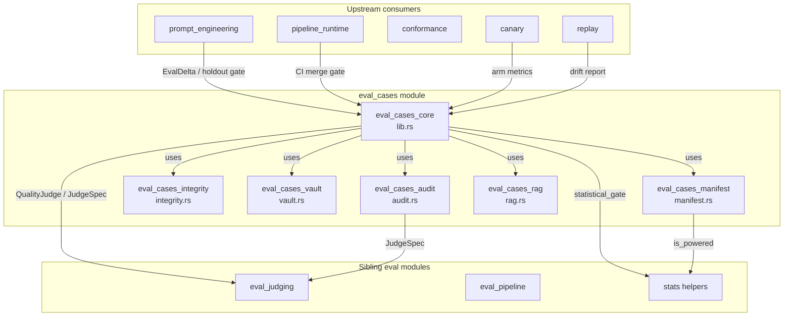
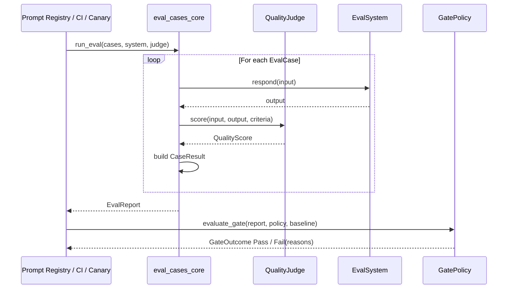

# eval_cases

The `eval_cases` module is the **gold-set evaluation core** of the `ainxt-eval` crate. It implements the "eval-as-continuous-gate" pattern: every change that can affect model behavior is run against a fixed, reviewable set of test cases, scored by an independent judge, and blocked from shipping if it regresses quality.

## Purpose

- Define **gold-set cases** ([`EvalCase`](eval_cases_core.md#evalcase)) with input, rubric, and passing threshold.
- Run a **system under eval** through those cases and score each output with a **quality judge**.
- Produce an [`EvalReport`](eval_cases_core.md#evalreport) that can be serialized as a regression baseline.
- Apply a [`GatePolicy`](eval_cases_core.md#gatepolicy) combining absolute floors (pass-rate, mean score) and non-inferiority against a baseline.
- Provide statistically-valid alternatives ([`evaluate_gate_statistical`](eval_cases_core.md#evaluate_gate_statistical)) that pair candidate and baseline by case id to avoid "blocking on coin-flips".

The module sits inside the larger `evaluation_testing` area of `ai_engine` and is consumed by prompt-registry gating, prompt-optimizer holdout guards, CI merge checks, canary analysis, and replay-based drift detection.

## Architecture Overview

## Core Data Flow

## Sub-modules

| Sub-module | File | Responsibility | Documentation |
|------------|------|----------------|---------------|
| `eval_cases_core` | `src/lib.rs` | Gold-set definition, eval run, aggregate report, gate policies, statistical drop-in | [eval_cases_core.md](eval_cases_core.md) |
| `eval_cases_manifest` | `src/manifest.rs` | Git-reviewable eval-set manifests, pre-registration, recursive meta-gate | [eval_cases_manifest.md](eval_cases_manifest.md) |
| `eval_cases_integrity` | `src/integrity.rs` | Sealed holdouts, Merkle content commitment, contamination scanning, rotation, tripwires, staging | [eval_cases_integrity.md](eval_cases_integrity.md) |
| `eval_cases_vault` | `src/vault.rs` | Monotonic regression vault, reproducible-from-SHA cases, route restoration | [eval_cases_vault.md](eval_cases_vault.md) |
| `eval_cases_audit` | `src/audit.rs` | Verdict records, reproduce-from-SHA, event-log sink, data-class judge routing | [eval_cases_audit.md](eval_cases_audit.md) |
| `eval_cases_rag` | `src/rag.rs` | RAG-specific evals: retrieval metrics, claim groundedness, citation faithfulness, embedding-migration gate, sensemaking | [eval_cases_rag.md](eval_cases_rag.md) |

## Relationship to the Wider System

- **prompt_engineering**: the prompt registry's `EvalDelta` and the prompt optimizer's holdout guard call the eval gate to decide whether a new prompt layer or variant may ship. See [prompt_engineering.md](prompt_engineering.md).
- **eval_judging**: concrete [`QualityJudge`](eval_cases_core.md#qualityjudge) implementations and [`JudgeSpec`](eval_cases_audit.md#judgespec) definitions live there. See [eval_judging.md](eval_judging.md).
- **eval_pipeline**: orchestrates release gates, contamination scans, CI status publishing, and durable stores. See [eval_pipeline.md](eval_pipeline.md).
- **conformance / canary / replay**: use eval reports for dogfood testing, traffic-split analysis, and deterministic replay drift detection. See [conformance.md](conformance.md), [canary.md](canary.md), and [replay.md](replay.md).
- **ai_engine / knowledge_retrieval**: RAG evals consume retrieval results and embedding versions from the context/retrieval crates. See [knowledge_retrieval.md](knowledge_retrieval.md).

## Key Design Principles

1. **Fail-closed**: an empty run, missing judge, underpowered set, or contaminated candidate blocks rather than passes.
2. **Deterministic**: every gate takes explicit seeds/epochs; no wall-clock dependencies in the core.
3. **Reproducible-from-SHA**: verdict records, vault cases, and sealed manifests bind every input to a content hash.
4. **Monotonic in safety**: the regression vault only grows; live cases rotate but never silently drop.
5. **Separation of concerns**: case authorship, scoring, gating, audit, and RAG-specific metrics are independent sub-modules.

## Generated Sub-module Documentation

Detailed component descriptions, data structures, and process flows for each sub-module are available in:

- [eval_cases_core.md](eval_cases_core.md)
- [eval_cases_manifest.md](eval_cases_manifest.md)
- [eval_cases_integrity.md](eval_cases_integrity.md)
- [eval_cases_vault.md](eval_cases_vault.md)
- [eval_cases_audit.md](eval_cases_audit.md)
- [eval_cases_rag.md](eval_cases_rag.md)
