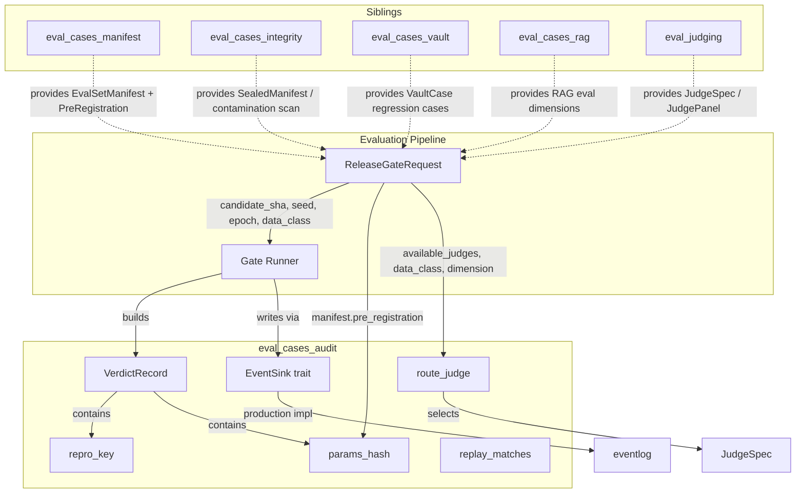
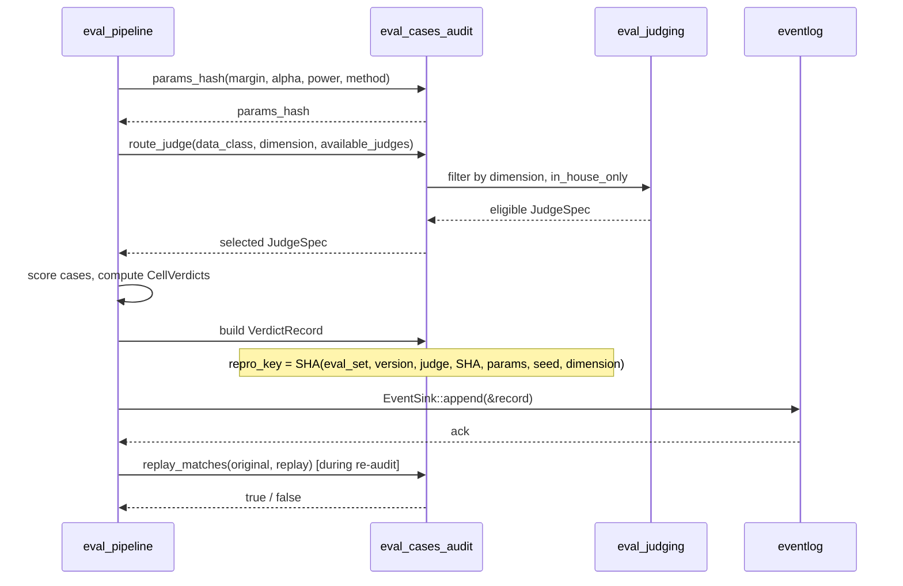
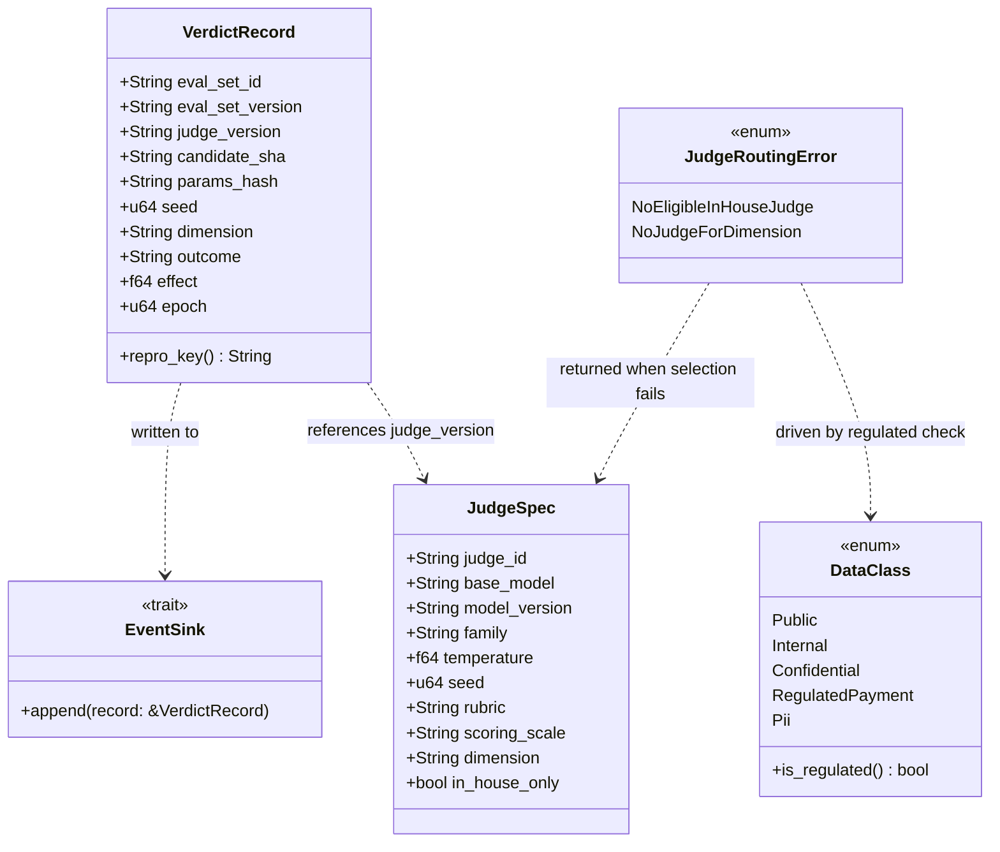
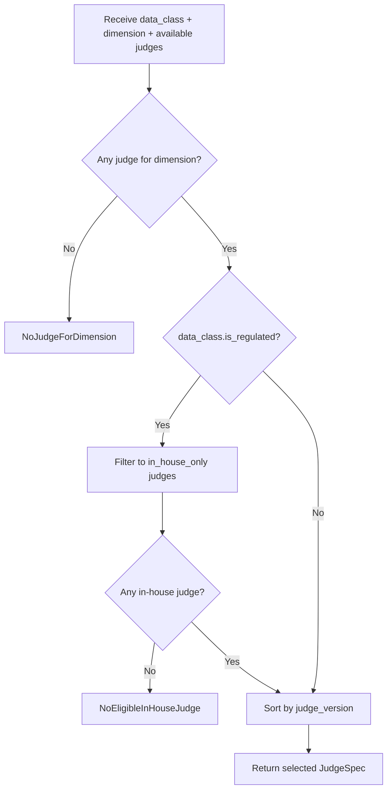

# eval_cases_audit

The `eval_cases_audit` module provides the **reproducible verdict record**, **audit contract**, and **data-class-aware Judge routing** for the evaluation platform. It is the small, deterministic core that guarantees every gate decision can be replayed from a SHA-256 reproduction key and that regulated or PII evaluations never leave the in-house trust boundary.

This module lives inside the `ainxt-eval` crate (`crates/ainxt-eval/src/audit.rs`) and is the audit sibling of the broader [`eval_cases`](eval_cases.md) family.

---

## What this module does

1. **Captures a complete reproduction key** for every gate verdict via [`VerdictRecord`](eval_cases_audit.md#verdictrecord).
2. **Hashes pre-registered analysis parameters** so any change to margins, α, power, or method produces a new reproduction key.
3. **Provides an append-only `EventSink` seam** so verdicts can be written to a tamper-evident log before a change ships.
4. **Verifies replay fidelity** with [`replay_matches`](eval_cases_audit.md#replay_matches): two records with the same reproduction key must carry the same outcome.
5. **Routes Judges by data class** with [`route_judge`](eval_cases_audit.md#route_judge): regulated/PII evals are fail-closed to in-house Judges only.

---

## Architecture



---

## Core components

### `VerdictRecord`

The immutable audit record for a single gate verdict. It is intentionally provider- and enum-evolution-stable: the `outcome` is a plain string (`"pass"`, `"block"`, `"indeterminate"`) rather than a Rust enum so the wire format survives refactors.

| Field | Meaning |
|-------|---------|
| `eval_set_id` | Which eval set was run (e.g. `rag-groundedness`). |
| `eval_set_version` | Version of the eval set manifest. |
| `judge_version` | Pinned version of the Judge that produced the score. |
| `candidate_sha` | Control-plane commit SHA of the change under test. |
| `params_hash` | SHA-256 of the pre-registered analysis parameters. |
| `seed` | Deterministic seed used for sampling / Judge temperature. |
| `dimension` | The quality dimension being scored. |
| `outcome` | Stable-string verdict. |
| `effect` | Measured effect size in metric units. |
| `epoch` | Event-Log epoch (passed in, not wall-clock). |

The record exposes [`repro_key()`](eval_cases_audit.md#repro_key) which collapses the identifying fields into a single SHA-256 digest. Two runs that share this key must produce the same outcome; if they do not, [`replay_matches`](eval_cases_audit.md#replay_matches) flags the verdict as non-reproducible.

### `EventSink`

```rust
pub trait EventSink {
    fn append(&mut self, record: &VerdictRecord);
}
```

A minimal seam that keeps the eval core decoupled from any specific logging backend. The production implementation is provided by the `eventlog` crate (tamper-evident, chain-hashed JSONL). Test code can implement `EventSink` with an in-memory vector.

### `repro_key` / `params_hash`

- `repro_key` feeds all identifying inputs into SHA-256 with length-prefixed fields so distinct field boundaries cannot collide.
- `params_hash` hashes the pre-registration parameters (`margin`, `alpha`, `power`, `method`). Changing any of these mints a new reproduction key, preventing silent analysis-plan drift.

### `replay_matches`

A replay is faithful iff:

1. The two records share the same `repro_key`, **and**
2. The two records share the same `outcome`.

A same-key pair with different outcomes means the verdict is not deterministic — a defect the audit must catch before the change ships.

### `route_judge`

Selects an eligible [`JudgeSpec`](eval_judging.md#judgespec) for a given `DataClass` and dimension.

| Data class | Behavior |
|------------|----------|
| `RegulatedPayment` / `Pii` | Only `in_house_only == true` Judges are eligible. If none exist, the function returns `JudgeRoutingError::NoEligibleInHouseJudge`. |
| `Public` / `Internal` / `Confidential` | Any Judge for the dimension may be used. |

Selection is deterministic: candidates are sorted by `judge_version` and the first match is chosen.

---

## Data flow: from release gate to audit record



---

## Component interaction



---

## Process flow: regulated Judge routing



---

## Relationship to the wider system

| Module | Relationship |
|--------|--------------|
| [`eval_cases`](eval_cases.md) | Parent module. Defines `EvalCase`, `EvalCriteria`, `CaseResult`, `GatePolicy`, and the overall eval domain model. |
| [`eval_cases_manifest`](eval_cases_manifest.md) | Supplies `EvalSetManifest` and `PreRegistration`, whose parameters feed `params_hash`. |
| [`eval_cases_integrity`](eval_cases_integrity.md) | Supplies sealed-corpus integrity checks and contamination scanning that run before the verdict is minted. |
| [`eval_cases_vault`](eval_cases_vault.md) | Supplies `VaultCase` regression cases whose origins reference the same `event_log_id` / `control_plane_sha` recorded in `VerdictRecord`. |
| [`eval_cases_rag`](eval_cases_rag.md) | Supplies RAG-specific eval dimensions that may appear in `VerdictRecord.dimension`. |
| [`eval_judging`](eval_judging.md) | Supplies `JudgeSpec`, `JudgePanel`, calibration, and the `QualityJudge` seam that `route_judge` selects from. |
| [`eval_pipeline`](eval_pipeline.md) | Orchestrates the release gate and is the primary consumer of `VerdictRecord` and `EventSink`. |
| `eventlog` | Provides the tamper-evident `JsonlEventLog` that backs the production `EventSink` implementation. |
| [`security_config_identity`](../core_infrastructure/security_config_identity.md) | Defines `DataClass` and its regulated/PII classification used by `route_judge`. |

---

## Fail-closed design notes

- **No wall clock**: `epoch` is passed in, so reproduction is deterministic.
- **No cloud fallback**: regulated/PII data never routes to a non-in-house Judge.
- **Stable strings**: `outcome` is a string to survive enum evolution and remain admissible as evidence.
- **Param drift detection**: any change to pre-registered analysis parameters changes `params_hash`, which changes `repro_key`.
- **Replay mismatch = defect**: `replay_matches` returns `false` when two records with the same key disagree, surfacing non-determinism before it can ship.

---

## See also

- [`eval_cases.md`](eval_cases.md)
- [`eval_cases_manifest.md`](eval_cases_manifest.md)
- [`eval_cases_integrity.md`](eval_cases_integrity.md)
- [`eval_cases_vault.md`](eval_cases_vault.md)
- [`eval_cases_rag.md`](eval_cases_rag.md)
- [`eval_judging.md`](eval_judging.md)
- [`eval_pipeline.md`](eval_pipeline.md)
- `eventlog.md`
- [`security_config_identity.md`](../core_infrastructure/security_config_identity.md)
