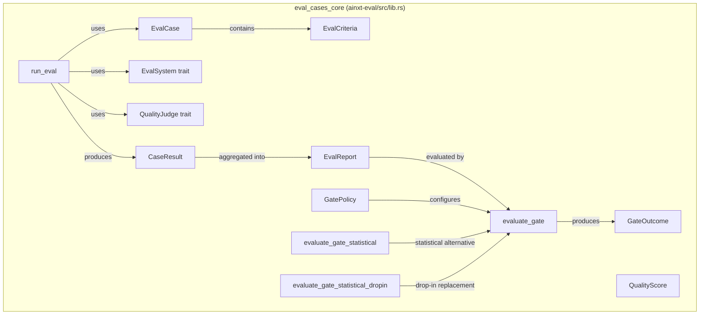
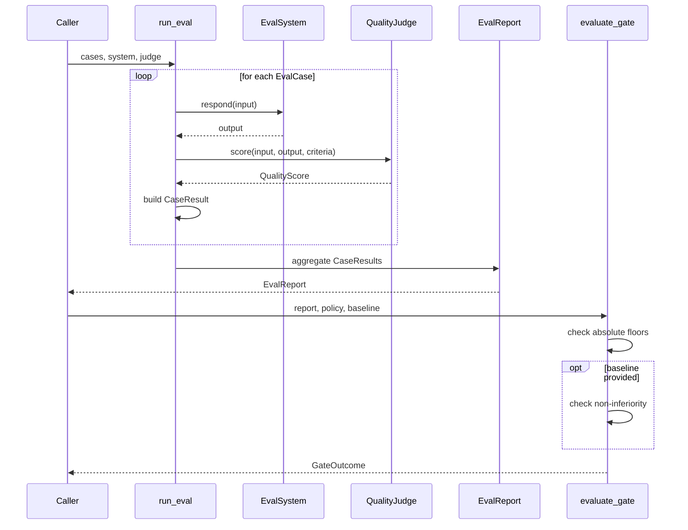
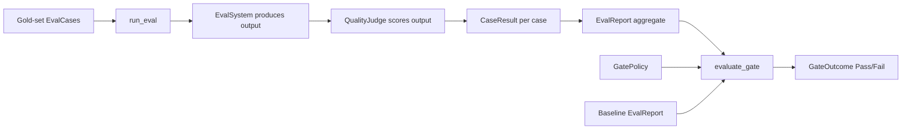
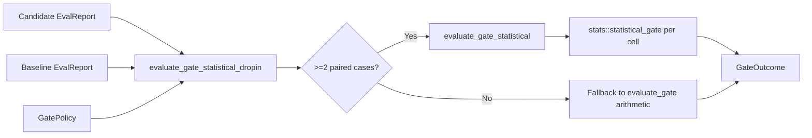
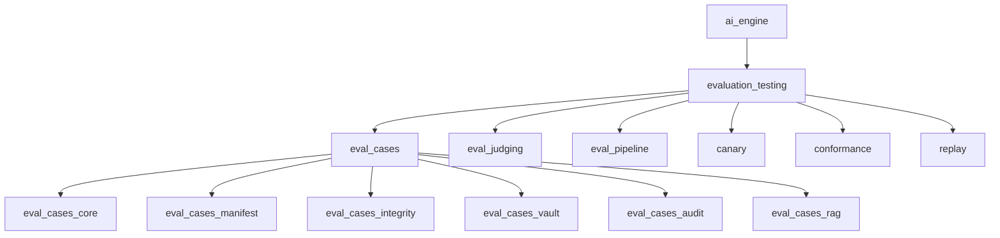
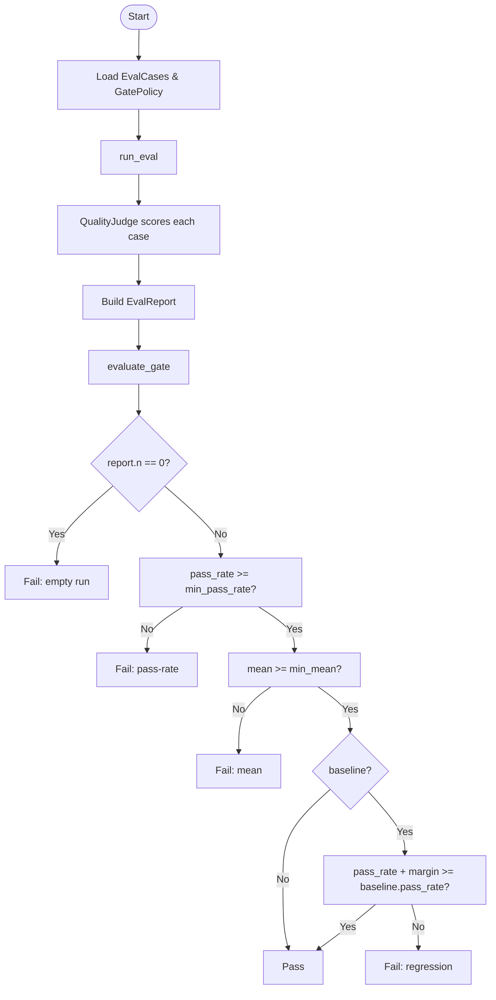
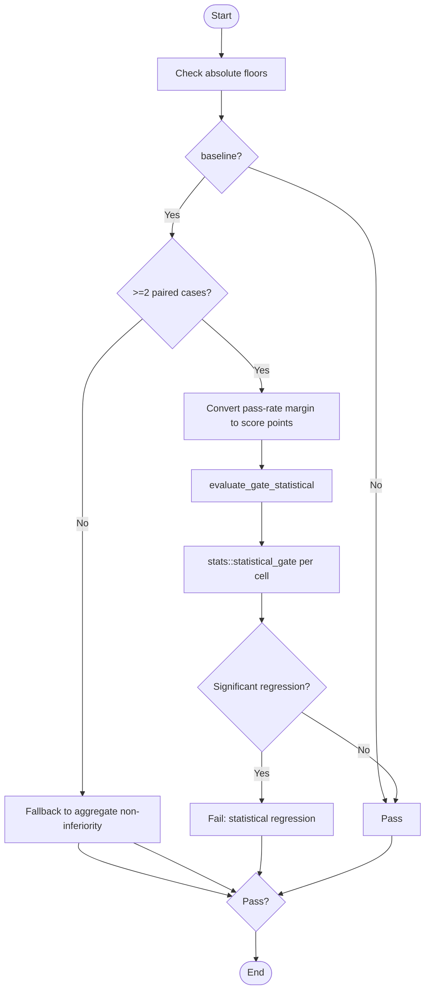

# eval_cases_core

## Brief Introduction

`eval_cases_core` is the foundational evaluation gate of the AI engine's evaluation and testing platform. It defines the data model and deterministic execution logic for running a **gold-set of eval cases** against a system under evaluation, scoring each output with an independent judge, and applying a fail-closed [`GatePolicy`] to decide whether a change may proceed.

The crate implements the "eval-as-continuous-gate" philosophy: evaluation is not merely a reporting dashboard, but a blocking quality gate that can prevent regressions from shipping. It supports both absolute thresholds (minimum pass-rate and mean score) and non-inferiority comparisons against a stored baseline [`EvalReport`]. A statistically-valid drop-in replacement avoids "coin-flip" blocking on sampling noise while still catching genuine regressions.

---

## Core Purpose and Functionality

### What It Does

1. **Defines the eval contract** — [`EvalCase`], [`EvalCriteria`], [`QualityScore`], and [`CaseResult`] model a single gold-set case and its scored outcome.
2. **Runs an eval deterministically** — [`run_eval`] executes every case through a pluggable [`EvalSystem`] and scores each output with a pluggable [`QualityJudge`]. Judges are consulted per-case and never see peer verdicts.
3. **Aggregates results** — [`EvalReport`] collects all [`CaseResult`]s and computes `n`, `passed`, `mean`, and `pass_rate`. The report is serializable and serves as the regression-vault baseline.
4. **Enforces the gate** — [`evaluate_gate`] applies absolute floors and, optionally, a non-inferiority margin against a baseline.
5. **Provides statistically-valid gating** — [`evaluate_gate_statistical`] and [`evaluate_gate_statistical_dropin`] replace aggregate pass-rate arithmetic with paired per-case statistical testing, preventing flapping on noise while blocking real regressions.

### Key Design Principles

- **Deterministic and testable**: The core logic is pure; LLM judges and target systems are injected as traits.
- **Fail-closed**: Empty runs, missing baselines, and unmet thresholds all result in `GateOutcome::Fail` with explanatory reasons.
- **Baseline-aware**: [`EvalReport`] is the unit of record for regression comparisons and vault storage.
- **Statistical rigor**: The statistical drop-in pairs runs by case id and applies correction for multiple comparisons.

---

## Architecture and Component Relationships

### Core Types

| Type | Role |
|------|------|
| [`EvalCriteria`] | Defines the rubric and the passing threshold (0–100) for a case. |
| [`EvalCase`] | A single gold-set item: `id`, `input`, and [`EvalCriteria`]. |
| [`QualityScore`] | A judge's verdict for one output: `score` and `rationale`. |
| [`QualityJudge`] | Trait for scoring an output against criteria. Implemented by LLM judges in production and deterministic stubs in tests. |
| [`EvalSystem`] | Trait for the system being evaluated; maps an input string to an output string. |
| [`CaseResult`] | The scored result for one case, including the generated output, score, pass/fail status, and rationale. |
| [`EvalReport`] | Aggregate of a full eval run; serializable baseline for regression vaults. |
| [`GatePolicy`] | Absolute floors (`min_pass_rate`, `min_mean`) plus a non-inferiority margin. |
| [`GateOutcome`] | `Pass` or `Fail(Vec<String>)` with all blocking reasons. |

### Module Architecture

### Component Interaction

---

## Data Flow

### Statistical Drop-In Flow

---

## How It Fits into the Overall System

`eval_cases_core` sits at the center of the `evaluation_testing` domain within the `ai_engine` layer. It is consumed by higher-level eval orchestration, prompt engineering, quality verification, canary release, and runtime serving components.

### Position in the Module Tree

### Upstream Consumers

| Consumer | Relationship |
|----------|--------------|
| [eval_pipeline](eval_pipeline.md) | Orchestrates release gates and CI merge checks; calls the eval gate to block or allow a release. |
| [eval_judging](eval_judging.md) | Provides calibrated judges, pairwise panels, and statistical aggregation that implement [`QualityJudge`]. |
| [prompt_engineering](prompt_engineering.md) | The prompt registry's `EvalDelta` and the prompt optimizer holdout guard use the statistical drop-in to validate prompt changes. |
| [quality_verification](quality_verification.md) | Quality assessors and synthesis modules feed into the criteria and rubrics used by eval cases. |
| [canary](canary.md) | Canary traffic-split arms are compared via eval reports to detect regressions in production. |
| [conformance](conformance.md) | Dogfood and safety conformance tests reuse the eval gate semantics for pass/fail decisions. |

### Downstream Dependencies

| Dependency | Purpose |
|------------|---------|
| [eval_cases_manifest](eval_cases_manifest.md) | Defines `EvalSetManifest`, `MetricSpec`, and pre-registration metadata that describe eval sets. |
| [eval_cases_integrity](eval_cases_integrity.md) | Seals and contamination-checks eval case content before it enters the gold set. |
| [eval_cases_vault](eval_cases_vault.md) | Stores [`EvalReport`] baselines and regression vault cases. |
| [eval_cases_audit](eval_cases_audit.md) | Records `VerdictRecord` audit trails for gate decisions. |
| [eval_cases_rag](eval_cases_rag.md) | Specialized RAG eval cases (`RetrievalCase`, `QaCase`, `SensemakingCase`) extend the core model. |

---

## Process Flows

### Standard Eval-and-Gate Process

### Statistical Drop-In Process

---

## Configuration and Constants

| Constant | Value | Meaning |
|----------|-------|---------|
| `DEFAULT_GATE_ALPHA` | `0.05` | Default significance level for statistical non-inferiority. |
| `DEFAULT_GATE_Q` | `0.05` | Default FDR `q` for statistical correction. |

### Default GatePolicy

| Field | Default | Description |
|-------|---------|-------------|
| `min_pass_rate` | `0.9` | At least 90% of cases must pass. |
| `min_mean` | `70` | Mean score must be at least 70. |
| `noninferiority_margin` | `0.02` | Candidate pass-rate must be within 2 percentage points of baseline. |

---

## Testing and Determinism

The module is designed to be exhaustively testable:

- [`StubSystem`] and [`KeywordJudge`] are example test implementations.
- [`LowScorer`] demonstrates that the mean floor can fail independently of pass-rate.
- Unit tests cover scoring, aggregation, absolute gating, non-inferiority regression detection, empty-run rejection, serialization, and the statistical drop-in behavior.

Because the LLM judge is behind the [`QualityJudge`] trait, the gate logic itself can be verified with deterministic stubs, while production judges remain swappable.

---

## References

- [eval_cases](eval_cases.md) — parent module overview for eval case management.
- [eval_cases_manifest](eval_cases_manifest.md) — eval set manifests and metric specifications.
- [eval_cases_integrity](eval_cases_integrity.md) — sealing, staging, and contamination detection.
- [eval_cases_vault](eval_cases_vault.md) — baseline storage and regression vault.
- [eval_cases_audit](eval_cases_audit.md) — verdict audit records.
- [eval_cases_rag](eval_cases_rag.md) — RAG-specific eval case types.
- [eval_judging](eval_judging.md) — judges, panels, and statistical aggregation.
- [eval_pipeline](eval_pipeline.md) — release gates, CI integration, and pipeline orchestration.
- [prompt_engineering](prompt_engineering.md) — prompt registry and optimizer consumers of the gate.
- [quality_verification](quality_verification.md) — quality assessment dimensions feeding eval criteria.
- [canary](canary.md) — production traffic-split evaluation.
- [conformance](conformance.md) — dogfood and safety conformance testing.
