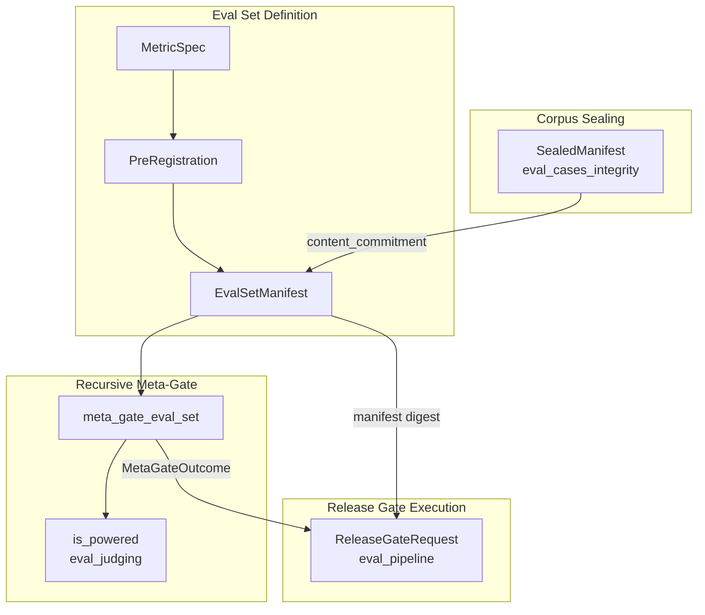
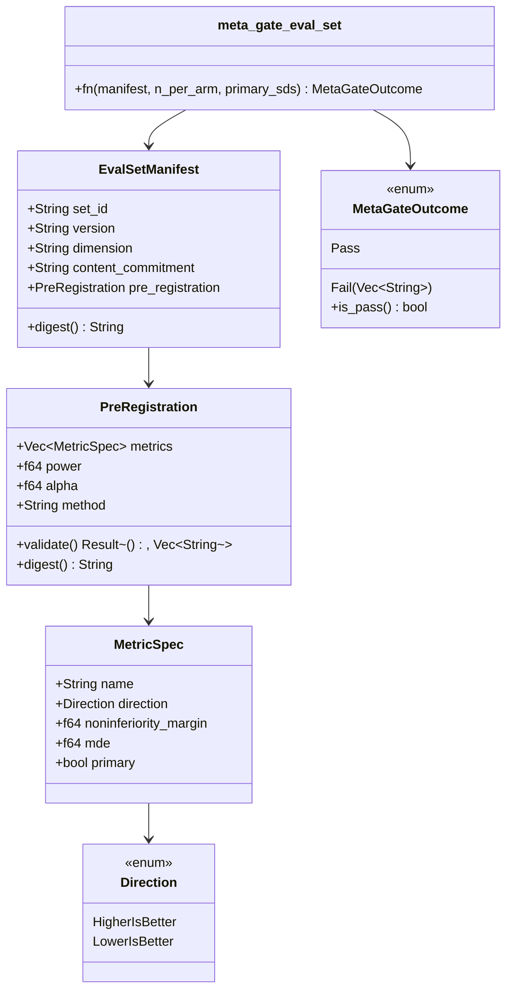
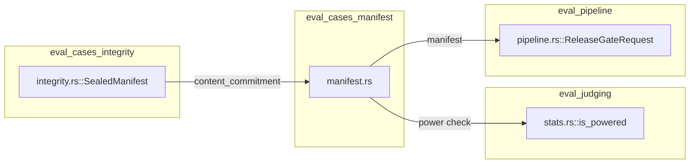
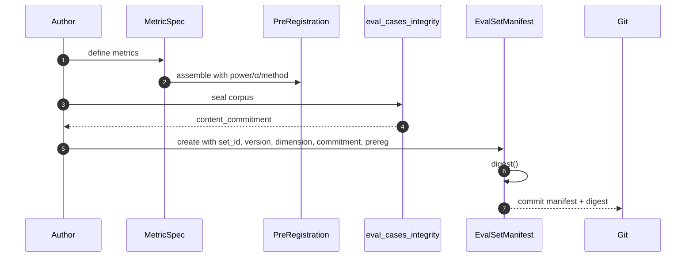
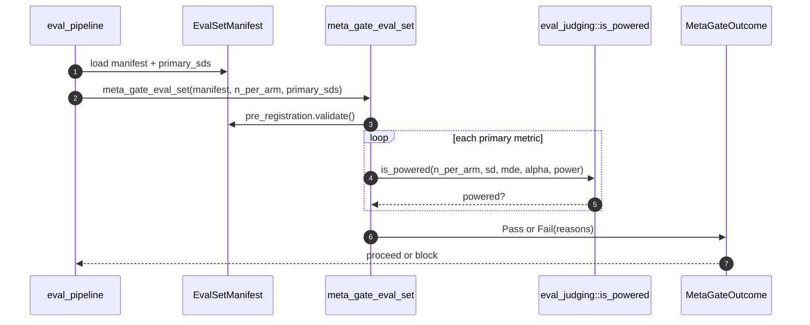
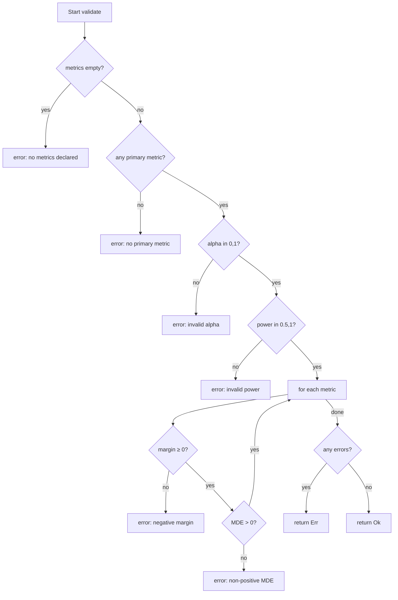
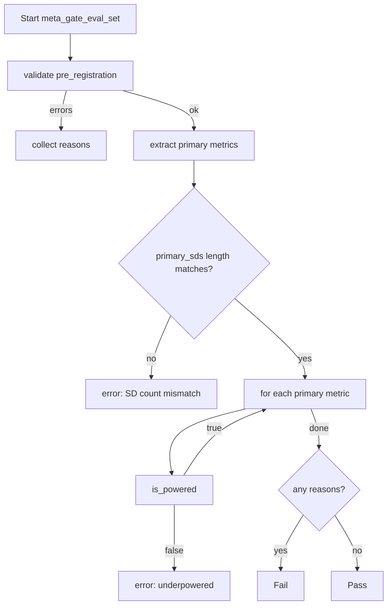

# eval_cases_manifest

## Brief Introduction

`eval_cases_manifest` is the manifest subsystem of the evaluation platform. It defines the **git-reviewable, content-addressable declaration** of an eval set: what it measures, how it will be analyzed, and which sealed corpus it commits to. By treating eval sets and judges as *definitions* (per ADR-026), the module ensures that every evaluation is pre-registered, tamper-evident, and statistically powered before it can certify a change.

The module lives in `crates/ainxt-eval/src/manifest.rs` and provides three core data structures:

- [`MetricSpec`](eval_cases_manifest.md#metricspec) — a single pre-registered metric with direction, non-inferiority margin, minimum detectable effect (MDE), and primary/secondary classification.
- [`PreRegistration`](eval_cases_manifest.md#preregistration) — the full analysis plan declared **before** data collection, including metrics, power, α, and analysis method.
- [`EvalSetManifest`](eval_cases_manifest.md#evalsetmanifest) — the eval-set identity bound to its pre-registration and a Merkle content commitment over the sealed corpus.

A recursive meta-gate, [`meta_gate_eval_set`](eval_cases_manifest.md#meta_gate_eval_set), validates the manifest itself: pre-registration must be well-formed, and the set must be powered to detect every primary metric's pre-registered MDE. An underpowered set fails as a defect rather than producing a falsely-confident pass.

---

## Core Components

### `Direction`

```rust
pub enum Direction {
    HigherIsBetter,
    LowerIsBetter,
}
```

`Direction` governs the non-inferiority direction for a metric. It is serialized as kebab-case strings (`higher-is-better`, `lower-is-better`) so that manifests remain human-readable in JSON/YAML form.

### `MetricSpec`

```rust
pub struct MetricSpec {
    pub name: String,
    pub direction: Direction,
    pub noninferiority_margin: f64,
    pub mde: f64,
    pub primary: bool,
}
```

A `MetricSpec` declares one metric that the eval set will measure:

| Field | Meaning |
|-------|---------|
| `name` | Human-readable metric identifier. |
| `direction` | Whether higher or lower values are better. |
| `noninferiority_margin` | How much worse the candidate may be versus baseline while still not regressing (in metric units). Must be ≥ 0. |
| `mde` | Minimum detectable effect the set must be powered to see (in metric units). Must be > 0. |
| `primary` | Primary metrics gate the release; secondary metrics are reported but do not block on their own. |

### `PreRegistration`

```rust
pub struct PreRegistration {
    pub metrics: Vec<MetricSpec>,
    pub power: f64,
    pub alpha: f64,
    pub method: String,
}
```

`PreRegistration` is the analysis plan fixed before any data is collected. It is designed to prevent p-hacking and metric-shopping:

- At least one metric must be declared.
- At least one metric must be primary.
- `alpha` must be in `(0, 1)`.
- `power` must be in `(0.5, 1)`.
- All non-inferiority margins must be non-negative.
- All MDEs must be positive.

`PreRegistration::validate()` returns `Ok(())` or `Err(Vec<String>)` with human-readable defect messages.

`PreRegistration::digest()` produces a deterministic SHA-256 hash over the entire pre-registration. Because the digest is content-sensitive and stable, changing any metric, margin, MDE, or analysis method changes the digest. This binds the analysis plan into the manifest digest, making post-hoc changes structurally detectable.

### `EvalSetManifest`

```rust
pub struct EvalSetManifest {
    pub set_id: String,
    pub version: String,
    pub dimension: String,
    pub content_commitment: String,
    pub pre_registration: PreRegistration,
}
```

`EvalSetManifest` is the PII-free, git-reviewable definition of an eval set:

| Field | Meaning |
|-------|---------|
| `set_id` | Stable identifier for the eval set (e.g., `role-analyst-correctness`). |
| `version` | Version tag (e.g., `v7`). |
| `dimension` | The quality dimension the set targets (e.g., `correctness`, `safety`). |
| `content_commitment` | Merkle root over the sealed corpus; see [`eval_cases_integrity`](eval_cases_integrity.md). |
| `pre_registration` | The pre-registered analysis plan. |

`EvalSetManifest::digest()` binds together `set_id`, `version`, `dimension`, `content_commitment`, and the pre-registration digest. This digest serves as the manifest's content-addressable identity and is used by the release gate to verify that the exact intended set is being executed.

### `MetaGateOutcome`

```rust
pub enum MetaGateOutcome {
    Pass,
    Fail(Vec<String>),
}
```

The recursive gate's verdict on the eval set itself. `is_pass()` returns `true` only for `Pass`.

### `meta_gate_eval_set`

```rust
pub fn meta_gate_eval_set(
    manifest: &EvalSetManifest,
    n_per_arm: usize,
    primary_sds: &[f64],
) -> MetaGateOutcome
```

`meta_gate_eval_set` is the **recursive gate on the eval set definition**. It performs two checks:

1. **Well-formedness**: `manifest.pre_registration.validate()` must pass.
2. **Statistical power**: For every primary metric, the set must have enough cases per arm (`n_per_arm`) and a provided observed sample standard deviation (`primary_sds`) to detect the metric's MDE at the declared `power` and `alpha`.

Power is computed via `is_powered` from the [`eval_judging`](eval_judging.md) statistics module. If the sample SD is ≤ 0, the effect is considered trivially detectable.

An underpowered set is treated as a **defect** (ADR-010 test #4), not a pass. This prevents the platform from certifying changes with inconclusive evidence.

---

## Architecture

The manifest module sits at the boundary between eval-set *definition* and eval-set *execution*. It consumes sealed-corpus commitments produced by [`eval_cases_integrity`](eval_cases_integrity.md) and provides manifests consumed by the release-gate pipeline in [`eval_pipeline`](eval_pipeline.md).



### Component Relationships



---

## Dependencies

`eval_cases_manifest` depends on:

- `eval_cases_judging` — for `is_powered`, the statistical power calculation used by the meta-gate.
- [`eval_cases_integrity`](eval_cases_integrity.md) — for the `content_commitment` field, which is the Merkle root produced when the eval corpus is sealed.
- [`eval_pipeline`](eval_pipeline.md) — the primary consumer of `EvalSetManifest`; `ReleaseGateRequest` embeds the manifest and uses its digest to fix the analysis plan.
- [`eval_cases_core`](eval_cases_core.md) — provides the `EvalCase` and `EvalCriteria` types that the sealed corpus contains.



---

## Data Flow

### Manifest Creation Flow

1. An author defines one or more `MetricSpec` values.
2. The metrics are assembled into a `PreRegistration` with `power`, `alpha`, and `method`.
3. The corpus is sealed by [`eval_cases_integrity`](eval_cases_integrity.md), producing a `content_commitment` (Merkle root) and `case_count`.
4. The `EvalSetManifest` binds `set_id`, `version`, `dimension`, `content_commitment`, and `pre_registration`.
5. The manifest digest is computed and can be stored in git, signed, or referenced by the release gate.



### Meta-Gate Flow

1. The release gate (or CI) loads the `EvalSetManifest` and observed primary SDs.
2. `meta_gate_eval_set` validates the pre-registration.
3. For each primary metric, it calls `is_powered(n_per_arm, sd, mde, alpha, power)`.
4. If any check fails, the outcome is `Fail(reasons)`.
5. Only a `Pass` outcome allows the release gate to proceed with scoring.



---

## Process Flows

### Pre-Registration Validation



### Digest Computation

Both `PreRegistration::digest()` and `EvalSetManifest::digest()` are deterministic, canonical SHA-256 hashes. They include:

- A domain-separated prefix (`ainxt-eval-prereg\0` or `ainxt-eval-manifest\0`).
- Length-prefixed strings to avoid collision attacks.
- Numeric values in little-endian byte form.
- For metrics: name, direction byte, margin, MDE, and primary flag.

This construction makes the digest stable across serializations and sensitive to any semantic change.

### Power Check



---

## Integration with the System

`eval_cases_manifest` is one submodule of [`eval_cases`](eval_cases_core.md), which is part of the larger [`evaluation_testing`](evaluation_testing.md) domain in the AI engine. Its role is to make evaluation **reviewable and reproducible**:

- **Git-native**: Manifests are PII-free and can be committed to source control.
- **Content-addressable**: The manifest digest fixes the exact analysis plan and corpus.
- **Self-gating**: The meta-gate ensures the eval set is statistically sound before it is allowed to judge a change.
- **Anti-p-hacking**: Pre-registration is content-hashed, so metric-shopping or post-hoc analysis changes are detectable.

The module is consumed by:

- [`eval_pipeline`](eval_pipeline.md) — `ReleaseGateRequest` takes the manifest and primary SDs, runs the meta-gate, and then executes the paired non-inferiority analysis.
- [`eval_cases_integrity`](eval_cases_integrity.md) — provides the `content_commitment` that the manifest binds to.
- `eval_judging` — provides the statistical utilities (`is_powered`, power analysis) used by the meta-gate.

---

## References

- [`eval_cases_core`](eval_cases_core.md) — core eval-case types (`EvalCase`, `EvalCriteria`, `QualityScore`).
- [`eval_cases_integrity`](eval_cases_integrity.md) — sealed corpus and content commitments.
- [`eval_cases_vault`](eval_cases_vault.md) — regression vault for long-lived case storage.
- [`eval_cases_audit`](eval_cases_audit.md) — verdict records and audit trail.
- [`eval_cases_rag`](eval_cases_rag.md) — RAG-specific eval cases and reports.
- [`eval_judging`](eval_judging.md) — judge panels, calibration, and statistical utilities.
- [`eval_pipeline`](eval_pipeline.md) — release gate execution and CI integration.
- [`evaluation_testing`](evaluation_testing.md) — parent module overview.
