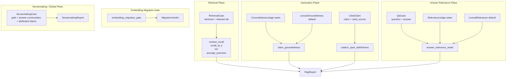
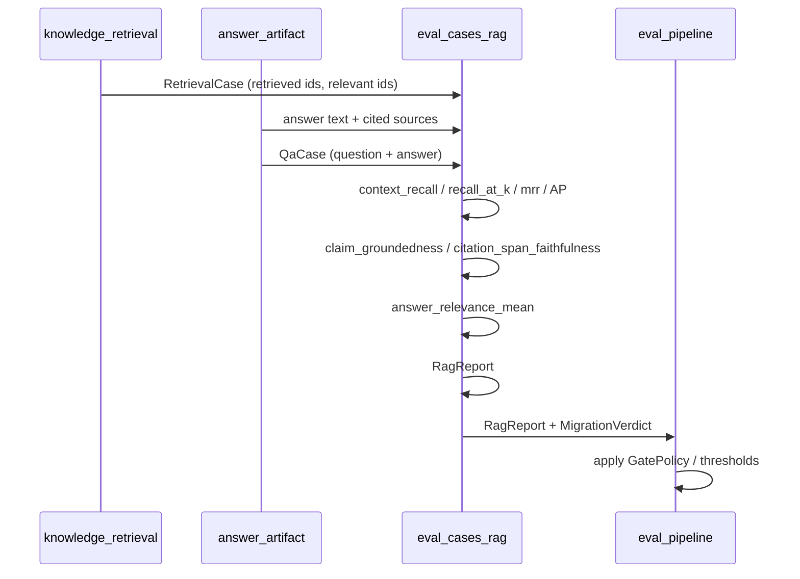
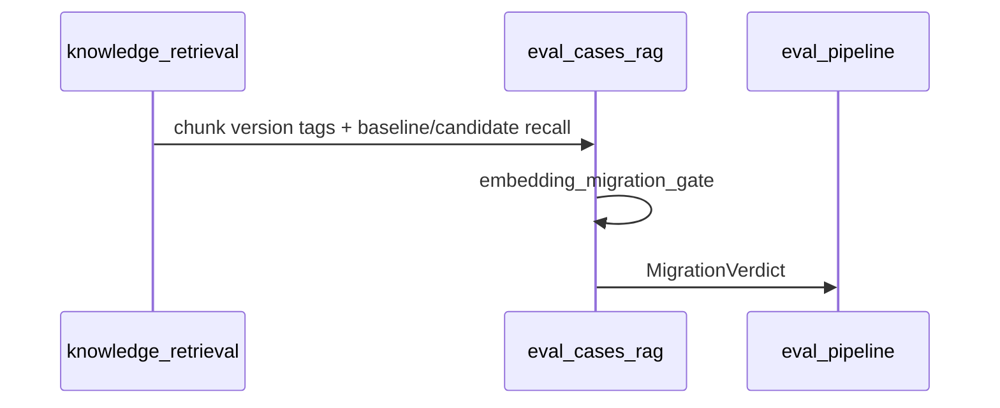
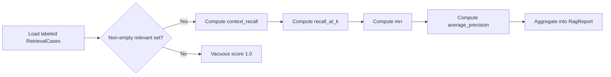
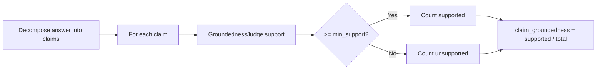
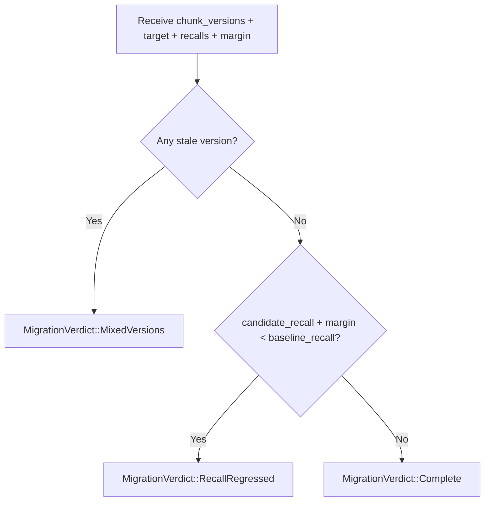
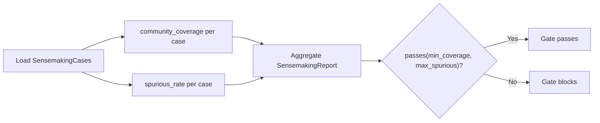

# eval_cases_rag

## Brief Introduction

`eval_cases_rag` is the RAG (Retrieval-Augmented Generation) evaluation submodule of the broader [`eval_cases`](eval_cases_core.md) test harness. It lives in `crates/ainxt-eval/src/rag.rs` and provides deterministic, dependency-light metrics that decompose RAG quality into **retrieval** and **generation** dimensions. The goal is to make regressions localizable: instead of reporting "the answer got worse," the module can say whether the root cause was a recall drop, a citation failure, an off-question generation, or a half-migrated embedding index.

The module is intentionally pure and `std`-only. It does not call LLMs directly; instead it exposes judge seams (`GroundednessJudge`, `RelevanceJudge`) where semantic LLM-judges can be wired, while shipping fast lexical defaults for CI and offline gates.

Key responsibilities:

- Compute deterministic retrieval metrics (`context_recall`, `recall_at_k`, `mrr`, `average_precision`, `context_precision`) against labeled gold sets.
- Score generation groundedness at the **claim** level, with both a lexical fallback and a judge seam.
- Measure **citation-span faithfulness** to catch "real but wrong" citations.
- Score **answer relevance** independently of groundedness, penalizing answers that are fluent but off-question.
- Provide an **embedding-migration gate** that blocks mixed-version indexes and recall regressions.
- Provide a separate **sensemaking/global-mode eval set** for map-reduce answers over community summaries.

---

## Architecture Overview

The module is organized into four evaluation planes, plus a migration gate. Each plane produces scalar metrics that can be aggregated into reports.



---

## Core Components

### `RetrievalCase`

A single retrieval observation. It stores the ranked list of chunk ids returned by the retriever (`retrieved`) and the labeled relevant ids for that query (`relevant`).

```rust
pub struct RetrievalCase {
    pub retrieved: Vec<String>,
    pub relevant: Vec<String>,
}
```

This is the input type for all retrieval-side metrics.

### Retrieval Metrics

All retrieval metrics are deterministic functions over a `RetrievalCase`:

| Function | Purpose |
|----------|---------|
| `context_recall` | Fraction of relevant chunks that appear anywhere in the retrieved set. |
| `recall_at_k` | Fraction of relevant chunks in the top-`k` results. |
| `mrr` | Mean reciprocal rank of the first relevant chunk. |
| `average_precision` | Rank-aware precision that rewards high placement of relevant chunks. |
| `context_precision` | Alias for `average_precision`; used for aggregate reporting. |

These metrics are the primary signal for the embedding-migration gate and for diagnosing "we stopped fetching the evidence" regressions.

### Generation Metrics

#### `GroundednessJudge` and `LexicalGroundedness`

`GroundednessJudge` is a trait seam for semantic support scoring:

```rust
pub trait GroundednessJudge: Send + Sync {
    fn support(&self, claim: &str, context: &[String]) -> f64;
}
```

`LexicalGroundedness` is the deterministic default. It computes the fraction of a claim's content words that appear in the union of the provided context passages. It is used when no LLM judge is wired, making the module usable in offline or sandboxed CI.

#### `claim_groundedness`

Decomposes an answer into atomic claims (sentence-ish units) and returns the fraction of claims whose support score is at least `min_support`. This localizes hallucination to specific claims rather than giving a single opaque answer score.

#### `CitedClaim` and `citation_span_faithfulness`

`CitedClaim` pairs a claim with the specific source passage it cites:

```rust
pub struct CitedClaim {
    pub claim: String,
    pub cited_source: String,
}
```

`citation_span_faithfulness` checks whether each cited source actually supports its attached claim. This catches a failure mode that whole-context groundedness misses: a citation that points to a real document but does not say what the claim says.

### Answer Relevance

#### `RelevanceJudge` and `LexicalRelevance`

`RelevanceJudge` is the seam for answer-relevance scoring:

```rust
pub trait RelevanceJudge: Send + Sync {
    fn relevance(&self, question: &str, answer: &str) -> f64;
}
```

`LexicalRelevance` is the deterministic default. It measures how well the answer addresses the question by:

1. Computing the fraction of the question's content words present in the answer.
2. Computing the precision of the answer's content words relative to the question.
3. Combining the two with a recall-weighted harmonic measure.

This is independent of groundedness: a perfectly grounded answer to the wrong question scores low.

#### `QaCase` and `answer_relevance_mean`

`QaCase` is a question/answer pair. `answer_relevance_mean` aggregates relevance over a suite of cases.

### Aggregate Reports

#### `RagReport`

```rust
pub struct RagReport {
    pub n: usize,
    pub context_recall: f64,
    pub context_precision: f64,
    pub recall_at_k: f64,
    pub mrr: f64,
    pub k: usize,
    pub answer_relevance: Option<f64>,
}
```

`rag_report` computes retrieval-only aggregates over a slice of `RetrievalCase`s. `rag_report_with_relevance` adds the answer-relevance dimension when QA pairs and a judge are available.

### Embedding Migration Gate

#### `MigrationVerdict`

```rust
pub enum MigrationVerdict {
    Complete,
    MixedVersions { target: String, stale_count: usize, total: usize },
    RecallRegressed { baseline_recall: f64, candidate_recall: f64, margin: f64 },
}
```

#### `embedding_migration_gate`

The gate takes the embedding-model-version tag of every chunk in the index, the target version, baseline recall, candidate recall, and an allowed margin. It fails early if:

- Any chunk is not on the target version (`MixedVersions`).
- The candidate recall regresses beyond the margin (`RecallRegressed`).

This prevents the silent degradation caused by a half-migrated, mixed-embedding-version index.

### Sensemaking / Global Mode

For global queries answered by map-reduce over community summaries, top-k retrieval metrics do not apply. The module provides a separate eval set.

#### `SensemakingCase`

```rust
pub struct SensemakingCase {
    pub gold_communities: Vec<String>,
    pub answer_communities: Vec<String>,
    pub attributed_claims: Vec<(String, String)>,
}
```

#### `SensemakingReport`

```rust
pub struct SensemakingReport {
    pub n: usize,
    pub community_coverage: f64,
    pub spurious_rate: f64,
}
```

- `community_coverage`: fraction of real communities represented in the answer.
- `spurious_rate`: fraction of theme claims attributed to a non-existent or empty community.

`sensemaking_report` aggregates over a suite, and `passes` enforces coverage and spurious-rate thresholds.

---

## Data Flow

A typical RAG evaluation run flows from raw retrieval/generation outputs into a `RagReport`, with optional relevance and migration checks.



For embedding migrations, the flow is shorter:



---

## Process Flows

### Retrieval Evaluation Flow



### Generation Evaluation Flow



### Embedding Migration Gate Flow



### Sensemaking Evaluation Flow



---

## Dependencies and Integration

`eval_cases_rag` is intentionally low-dependency. It only uses `serde` and the Rust standard library. It does not depend on the retrieval or generation crates directly; instead it consumes their outputs in the form of plain strings and ids.

### Upstream consumers

- [`eval_cases_core`](eval_cases_core.md) provides the base `EvalCase`, `EvalCriteria`, `QualityScore`, and `CaseResult` abstractions that RAG cases participate in.
- [`eval_cases_manifest`](eval_cases_manifest.md) registers RAG eval sets via `EvalSetManifest` and `MetricSpec`.
- [`eval_pipeline`](eval_pipeline.md) runs the release gate and applies `GatePolicy` to `RagReport` and `MigrationVerdict` outputs.

### Downstream data sources

- [`knowledge_retrieval`](knowledge_retrieval.md) produces the ranked chunk ids and embedding-version tags consumed by `RetrievalCase` and `embedding_migration_gate`.
- [`answer_artifact`](answer_artifact.md) produces the answer text, citations, and composed answers that feed `claim_groundedness`, `citation_span_faithfulness`, and `answer_relevance_mean`.
- [`quality_verification`](quality_verification_quality.md) may provide semantic `GroundednessJudge` and `RelevanceJudge` implementations via LLM judges.

### Sibling modules

- [`eval_cases_integrity`](eval_cases_integrity.md) handles contamination, holdout sets, and sealed corpora.
- [`eval_cases_vault`](eval_cases_vault.md) stores regression cases in a `RegressionVault`.
- [`eval_cases_audit`](eval_cases_audit.md) records verdicts via `VerdictRecord`.

---

## Testing Strategy

The module includes inline unit tests that cover:

- Correctness of recall, precision, MRR, and AP against hand-constructed cases.
- Regression detection when evidence is missing.
- Claim-level groundedness localization of hallucinations.
- Citation-span faithfulness catching wrong-but-real citations.
- Aggregate `RagReport` computation.
- Answer relevance distinguishing on-topic from off-topic answers.
- Sensemaking coverage and spurious-community detection.
- Embedding migration gate blocking mixed versions and recall regressions.

Because the module is pure, tests are deterministic and do not require network access or model weights.

---

## References

- [`eval_cases_core`](eval_cases_core.md) — base eval case abstractions.
- [`eval_cases_manifest`](eval_cases_manifest.md) — eval set registration and metric specs.
- [`eval_cases_integrity`](eval_cases_integrity.md) — contamination and holdout integrity.
- [`eval_cases_vault`](eval_cases_vault.md) — regression vault storage.
- [`eval_cases_audit`](eval_cases_audit.md) — verdict recording.
- [`eval_pipeline`](eval_pipeline.md) — release gate orchestration.
- [`knowledge_retrieval`](knowledge_retrieval.md) — retrieval and embedding-version sources.
- [`answer_artifact`](answer_artifact.md) — answer and citation generation.
- [`quality_verification_quality`](quality_verification_quality.md) — semantic quality judges.
- [`quality_verification_judge`](quality_verification_judge.md) — judge panels and calibration.
