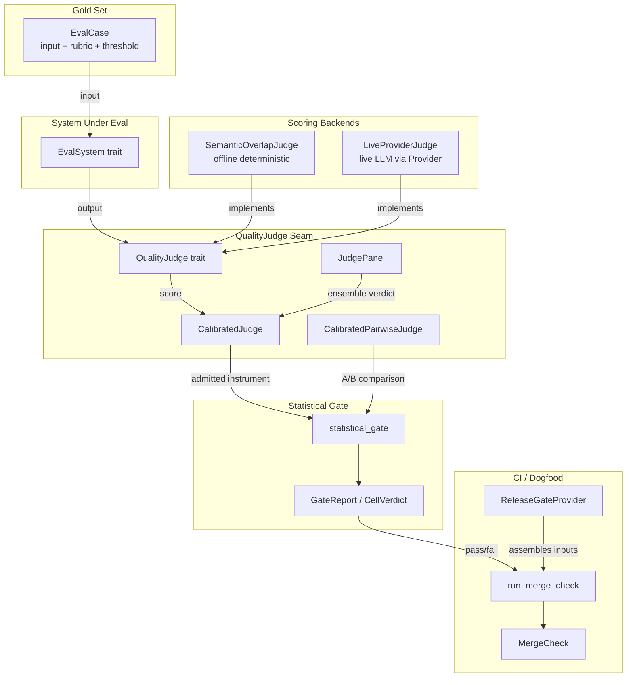
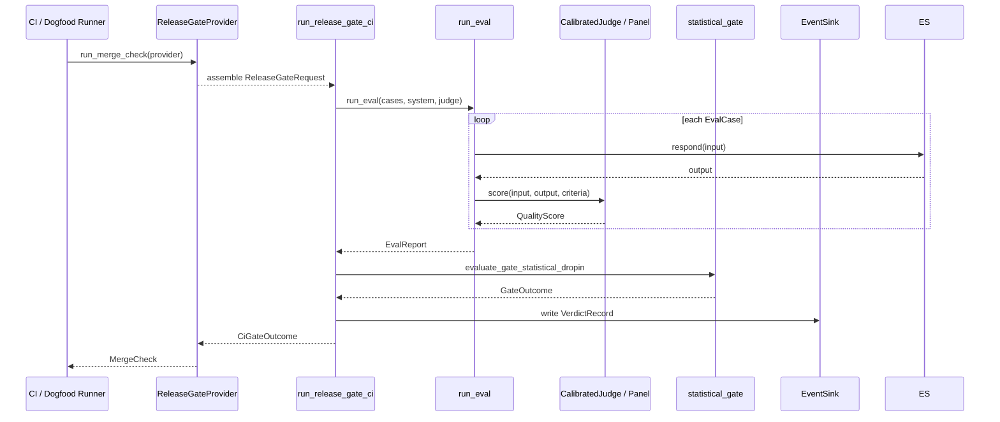

# eval_judging

## Introduction

The `eval_judging` module is the judgment and scoring engine of the `ainxt-eval` crate. It implements the **eval-as-continuous-gate** philosophy described in ADR-010: every change is evaluated against a gold set by an independent judge, and a statistically-valid gate decides whether the change may ship. The module is deliberately fail-closed — a missing judge, an unparseable reply, an underpowered set, or an unavailable input is treated as a blocking regression rather than a silent pass.

The module's responsibilities span five areas:

1. **Core eval loop** — run a gold set through a system under eval and score each case independently.
2. **Calibrated judge instruments** — pin, version, admit, and govern LLM judges so that a score is reproducible and bias-controlled.
3. **Statistical methodology** — replace aggregate pass-rate arithmetic with powered, corrected, paired non-inferiority tests.
4. **Pluggable scoring backends** — offline deterministic stand-ins and live provider-backed judges behind the same trait seam.
5. **CI / dogfood enforcer** — turn the composed release gate into a single merge-check entrypoint that branch protection can consume.

## Architecture Overview

### Data Flow

## Sub-modules

| Sub-module | Files | Responsibility | Documentation |
|------------|-------|----------------|---------------|
| `eval_judging_core` | `src/lib.rs` | Gold-set definition, eval loop, absolute gate, and statistical drop-in | [eval_judging_core.md](eval_judging_core.md) |
| `eval_judging_calibration` | `src/judge.rs` | Pinned judge specs, admission, panels, bias controls, and calibrated instruments | [eval_judging_calibration.md](eval_judging_calibration.md) |
| `eval_judging_statistics` | `src/stats.rs` | Distribution primitives, paired non-inferiority tests, power/MDE, CUPED, and multiplicity correction | [eval_judging_statistics.md](eval_judging_statistics.md) |
| `eval_judging_backends` | `src/semantic.rs`, `src/live.rs` | Offline semantic judge and live provider-backed judge behind the `QualityJudge` seam | [eval_judging_backends.md](eval_judging_backends.md) |
| `eval_judging_dogfood` | `src/dogfood.rs` | CI merge-check enforcer and `ReleaseGateProvider` seam | [eval_judging_dogfood.md](eval_judging_dogfood.md) |

## Key Design Decisions

- **Fail-closed by default**: empty runs, unparseable judge replies, provider errors, unavailable inputs, and underpowered statistical tests all block the gate.
- **Independent per-case scoring**: a judge never sees another case's verdict, preventing anchoring and leakage.
- **Content-addressed judges**: a `JudgeSpec` hashes every field (model, version, params, rubric, scale, dimension) into a reproducible version SHA; any silent edit creates a different instrument.
- **Paired non-inferiority**: baseline comparison pairs cases by ID and applies corrected t-tests, so null changes pass and genuine regressions block.
- **Trait seams for backends**: the same `QualityJudge` trait is implemented by deterministic offline judges, live provider judges, and test doubles; swapping backends is a one-line composition.

## Dependencies

The module relies on sibling crates and same-crate modules for transport, runtime, and governance:

- [`core_interaction`](../core_infrastructure/core_interaction.md) (`ainxt-protocol`) — `Event` enum used by `LiveProviderJudge` to stream model replies.
- [`runtime_engine`](../pipeline_runtime/runtime_engine.md) (`ainxt-runtime`) — `Provider` trait implemented by Anthropic / OpenAI-schema / Gemini adapters in `ainxt-providers`.
- [`security_config_identity`](../core_infrastructure/security_config_identity.md) (`ainxt-types`) — `DataClass` eligibility checks for provider routing.
- Same-crate modules (referenced but not detailed here):
  - `audit` — `EventSink` and `VerdictRecord` for tamper-evident logging.
  - `ci` — `run_release_gate_ci`, `CiGateOutcome`, and exit codes.
  - `pipeline` — `ReleaseGateRequest` and `ReleaseGateReport` that compose the full release gate.

## When to Use This Module

Use `eval_judging` when you need to:

- Run a gold-set evaluation against a system and produce an `EvalReport`.
- Compare a candidate change to a baseline with statistical rigor.
- Admit, version, and govern an LLM judge as a calibrated instrument.
- Escalate split panel verdicts to humans rather than hiding them behind majority votes.
- Wire the release gate into a CI merge-check or dogfood job.

For the full evaluation platform (case management, integrity, vaulting, RAG evaluation, etc.), see the parent [`evaluation_testing`](evaluation_testing.md) module and its other sub-modules.

## Related Documentation

Generated sub-module documentation for `eval_judging`:

- [`eval_judging_core.md`](eval_judging_core.md) — core eval loop and gate policies
- [`eval_judging_calibration.md`](eval_judging_calibration.md) — calibrated judge instruments and panels
- [`eval_judging_statistics.md`](eval_judging_statistics.md) — statistical non-inferiority testing
- [`eval_judging_backends.md`](eval_judging_backends.md) — offline and live scoring backends
- [`eval_judging_dogfood.md`](eval_judging_dogfood.md) — CI merge-check enforcer
