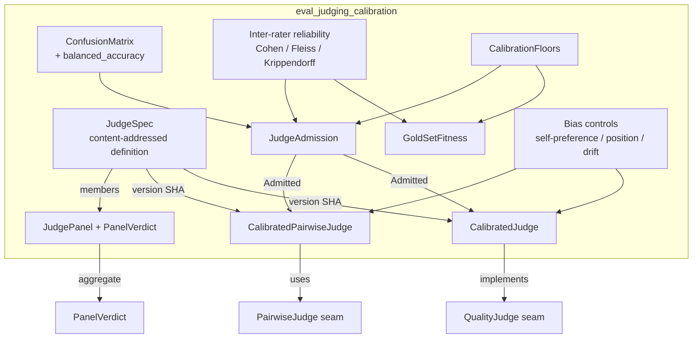
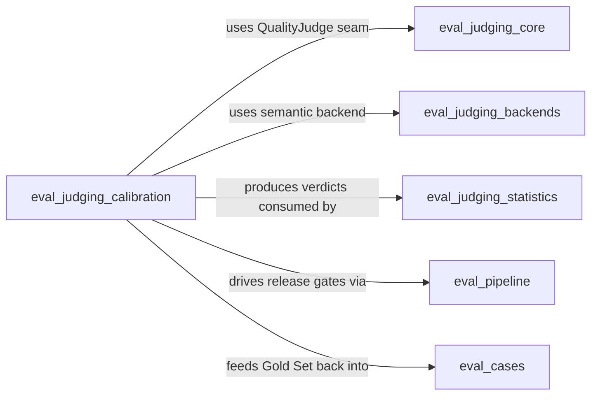
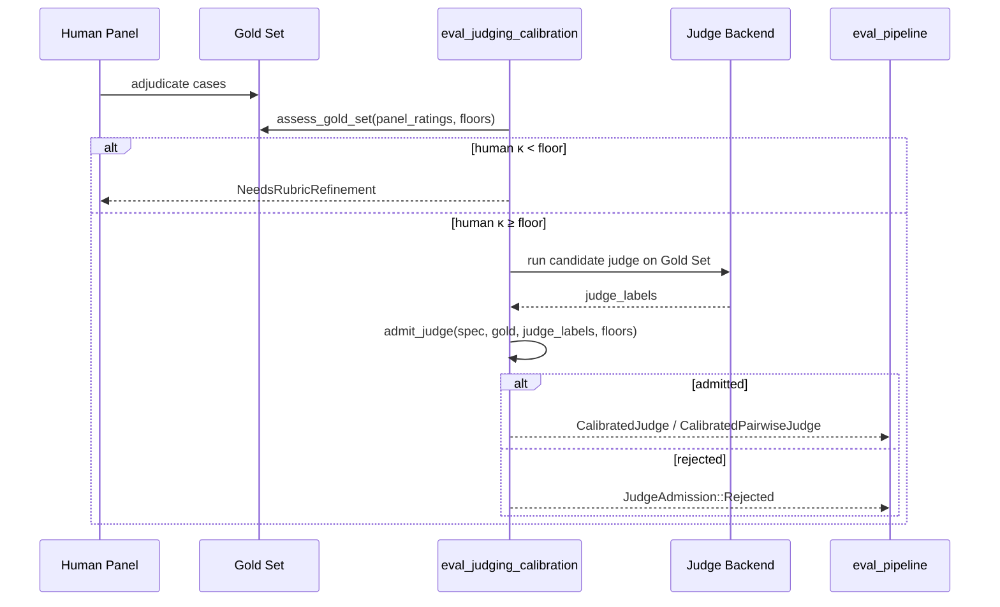
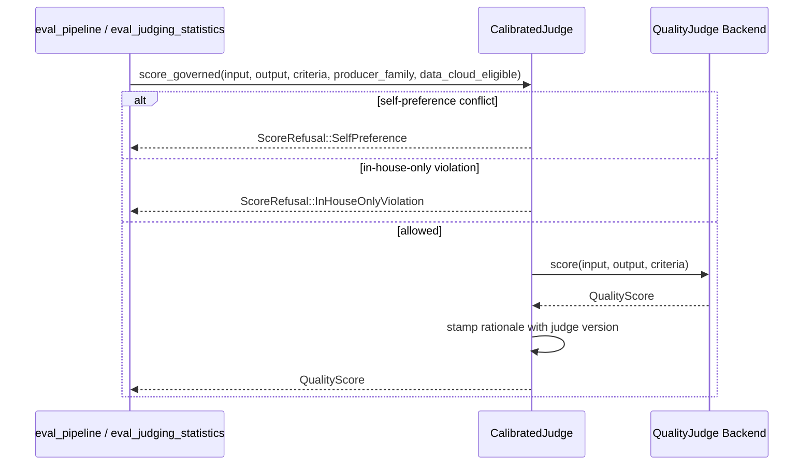
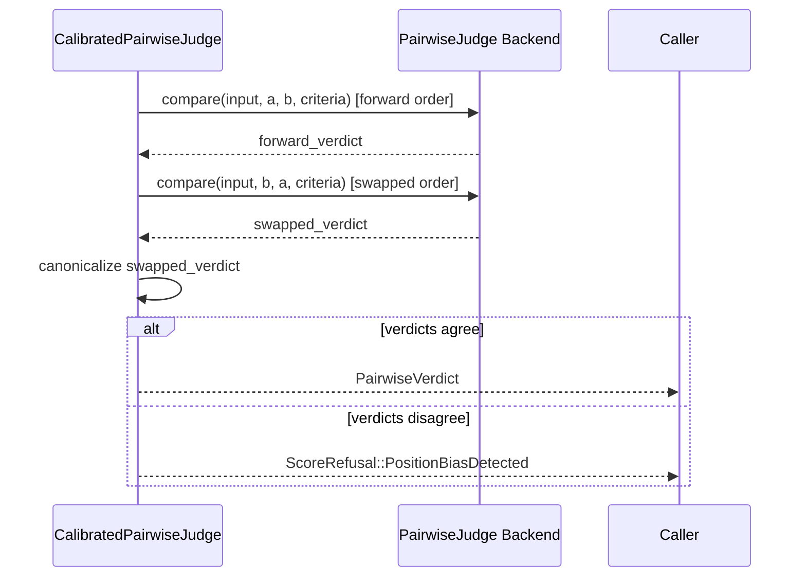
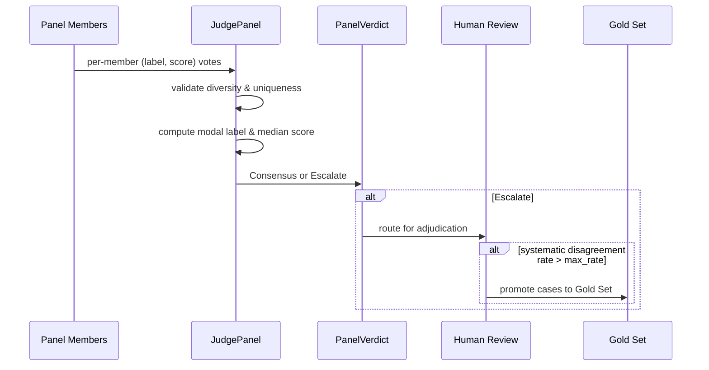
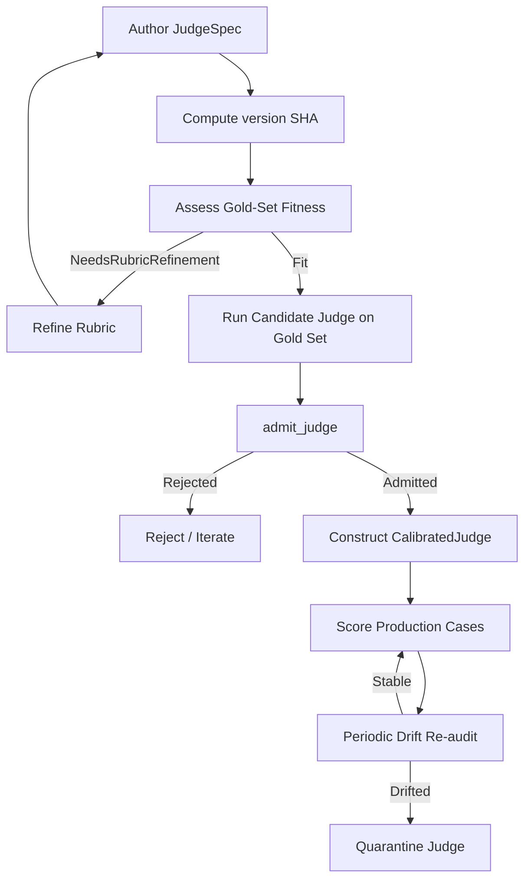
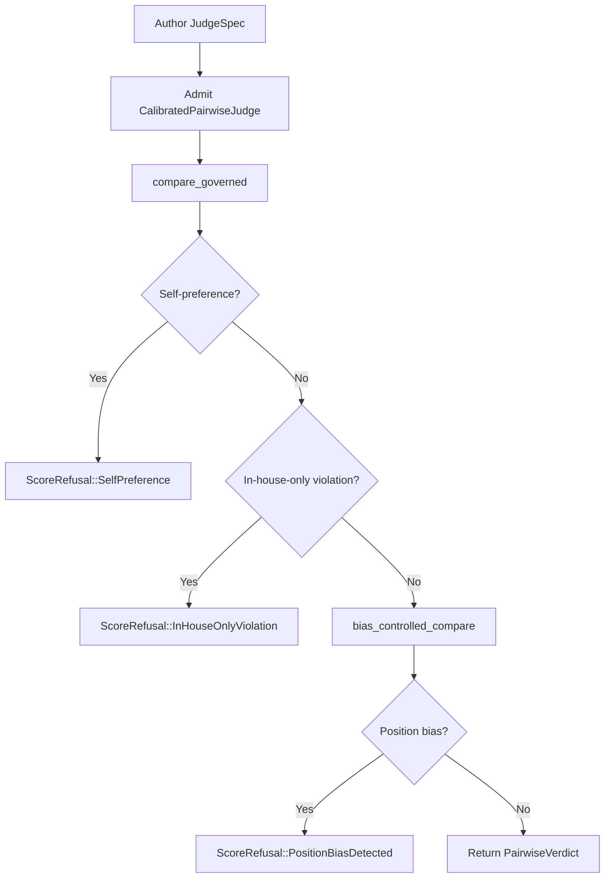

# eval_judging_calibration

## Brief Introduction

`eval_judging_calibration` is the governance layer that turns an LLM call into a **trustworthy, reproducible measurement instrument** for evaluation. It defines the `JudgeSpec` — a content-addressed, pinned, versioned judge definition — and the admission, calibration, and bias-control machinery required before any judge is allowed to score production outputs.

The module answers the question: *"How do we know the judge itself is not the source of drift or bias?"* It does so by:

- Requiring human Gold-Set agreement floors before calibration.
- Admitting judges only when they meet both κ (inter-rater reliability) and balanced-accuracy floors against the Gold Set.
- Enforcing structural bias controls: self-preference refusal, in-house-only routing, position-bias detection, and periodic drift re-audit.
- Supporting model-diverse judge panels with consensus/escalation semantics.

This module lives under [`eval_judging`](eval_judging.md) within [`evaluation_testing`](evaluation_testing.md) in the [`ai_engine`](ai_engine.md) domain.

---

## Core Concepts

### The Judge as a Pinned Instrument

A judge is not "whatever model we called that day." A [`JudgeSpec`](#judgespec) is a content-addressed definition containing:

- `base_model` and `model_version` (never `"latest"`).
- Sampling parameters (`temperature`, `seed`).
- The full `rubric` text.
- `scoring_scale`, `dimension`, and `family`.
- An `in_house_only` routing flag.

The [`JudgeSpec::version`](#judgespec) is a deterministic SHA-256 over every field. Any silent edit to the rubric, model, or parameters produces a different version — making every score reproducible and auditable.

### Gold-Set Fitness

Before a machine judge can be calibrated, the human reference labels must themselves be trustworthy. [`assess_gold_set`](#assess_gold_set) uses Fleiss' κ across the human panel. If human agreement is below the configured floor, the module refuses calibration and signals that the rubric needs refinement.

### Judge Admission

[`admit_judge`](#admit_judge) compares a candidate judge's labels against adjudicated Gold labels. Admission requires:

- Judge-vs-Gold κ ≥ `judge_kappa_floor`.
- Balanced accuracy ≥ `balanced_accuracy_floor`.

A candidate that fails either floor is rejected; it cannot become a [`CalibratedJudge`](#calibratedjudge).

### Structural Bias Controls

| Control | Purpose |
|---------|---------|
| [`self_preference_conflict`](#self_preference_conflict) | Prevents a judge from scoring output produced by its own model family. |
| [`position_bias_flip_rate`](#position_bias_flip_rate) / [`bias_controlled_compare`](#bias_controlled_compare) | Detects A/B verdicts that flip when presentation order is swapped. |
| [`judge_drift`](#judge_drift) | Re-audits an admitted judge against the Gold Set; a material κ drop suggests a silent provider model swap. |
| `in_house_only` routing | Refuses to send regulated data to a cloud-eligible judge. |

### Judge Panels

A [`JudgePanel`](#judgepanel) is an ensemble of model-diverse judges. It validates that members come from at least `min_families` distinct families and that no `judge_id` is duplicated. [`JudgePanel::aggregate`](#judgepanelaggregate) produces either a [`PanelVerdict::Consensus`](#panelverdict) (median score, agreement within tolerance) or a [`PanelVerdict::Escalate`](#panelverdict) (human review). Systematic disagreement across a batch is detected by [`systematic_disagreement`](#systematic_disagreement) and can be promoted back into the Gold Set.

---

## Architecture

---

## Component Reference

### `JudgeSpec`

A pinned, versioned judge definition. Its `version()` method returns a deterministic SHA-256 over every field, ensuring that any change to model, parameters, or rubric creates a new instrument identity.

### `ConfusionMatrix`

A categorical confusion matrix keyed by `(truth_label, predicted_label)`. Supports arbitrary string labels for binary or multi-class rubrics. Provides `accuracy()` and is consumed by `balanced_accuracy()`.

### `balanced_accuracy`

Mean per-class recall. Catches judges that perform well on the majority class while ignoring minority classes — a blind spot raw accuracy can hide.

### `cohens_kappa`, `fleiss_kappa`, `krippendorff_alpha`

Inter-rater reliability statistics:

- `cohens_kappa`: two raters, categorical labels.
- `fleiss_kappa`: N raters, categorical labels.
- `krippendorff_alpha`: interval/ordinal scores, handles missing raters and respects distance between scores.

### `CalibrationFloors`

Documented admission thresholds:

- `gold_kappa_floor` (default 0.6)
- `judge_kappa_floor` (default 0.6)
- `balanced_accuracy_floor` (default 0.7)

### `GoldSetFitness`

Result of `assess_gold_set`:

- `Fit { human_kappa }` — the human panel is reliable enough to calibrate against.
- `NeedsRubricRefinement { human_kappa, floor }` — the rubric is defective and must be refined before calibration.

### `JudgeAdmission`

Result of `admit_judge`:

- `Admitted { judge_version, kappa, balanced_accuracy }`
- `Rejected { judge_version, reasons }`

### `CalibratedJudge`

The pinned, calibrated instrument for absolute (input → output) scoring. Constructed only via `CalibratedJudge::admit`. Enforces self-preference and in-house-only refusals at scoring time. Implements the `QualityJudge` seam so it plugs into the broader evaluation pipeline.

### `CalibratedPairwiseJudge`

The A/B comparison instrument. In addition to the admission discipline of `CalibratedJudge`, it applies the position-bias control at scoring time via `bias_controlled_compare`: every comparison is run under both presentation orders, and a flip is surfaced as `ScoreRefusal::PositionBiasDetected` rather than silently resolved.

### `JudgePanel`

An ensemble of pinned judges. Validates size, model-family diversity, and uniqueness of `judge_id`. Aggregates per-member `(label, score)` votes into a `PanelVerdict`.

### `PanelVerdict`

- `Consensus { score, agreement }` — median score, agreement within tolerance.
- `Escalate { median_score, disagreement, member_labels }` — routed to a human; not counted as a confident pass/fail.

### `ScoreRefusal`

Visible refusal reasons emitted by governed scoring:

- `SelfPreference`
- `InHouseOnlyViolation`
- `PositionBiasDetected`

---

## Dependencies

- **[`eval_judging_core`](eval_judging_core.md)**: Provides the `QualityJudge` seam and `KeywordJudge` baseline used during calibration.
- **[`eval_judging_backends`](eval_judging_backends.md)**: Supplies concrete judge backends such as `SemanticOverlapPairwiseJudge` (offline) and `LiveProviderJudge` (production LLM calls).
- **[`eval_judging_statistics`](eval_judging_statistics.md)**: Consumes `PanelVerdict` and admission records for aggregation into `GateReport`, `MetricCell`, and `SampleStats`.
- **[`eval_pipeline`](eval_pipeline.md)**: Orchestrates release-gate evaluation; `JudgeCalibration` and `ArmJudge` rely on admitted judges from this module.
- **[`eval_cases`](eval_cases.md)**: Provides `EvalCase`, `EvalCaseContent`, and the Gold Set cases that calibration is measured against.

---

## Data Flow

### Calibrating and Admitting a Judge

### Governed Scoring with a Calibrated Judge

### Bias-Controlled Pairwise Comparison

### Panel Aggregation and Escalation

---

## Process Flows

### Judge Lifecycle

### Pairwise Comparison Lifecycle

---

## Integration with the Wider System

`eval_judging_calibration` sits at the intersection of evaluation governance and model inference:

- **Upstream**: It depends on human-adjudicated Gold Sets (managed by [`eval_cases`](eval_cases.md)) and on judge backends (managed by [`eval_judging_backends`](eval_judging_backends.md)).
- **Downstream**: Admitted judges are consumed by [`eval_pipeline`](eval_pipeline.md) for release-gate decisions and by [`eval_judging_statistics`](eval_judging_statistics.md) for metric aggregation.
- **Cross-cutting**: The `in_house_only` routing control connects to the system's data-residency and security posture; the self-preference control connects to model-family metadata produced by the prompt/provider layers.

Because the actual LLM call lives behind the `QualityJudge` / `PairwiseJudge` seams, swapping an offline semantic stand-in for a pinned cloud judge is a backend change only — the calibration, versioning, and governance logic remains unchanged.

---

## Design Principles

1. **Reproducibility**: Every judge is content-addressed; a score is tied to a SHA.
2. **Admission by evidence**: A judge is usable only after it clears documented statistical floors.
3. **Fail-visible**: Governance violations produce `ScoreRefusal`, never silent low scores.
4. **Bias control at scoring time**: Position-bias detection is part of the comparison call, not a post-hoc audit.
5. **Human-in-the-loop**: Panel disagreements and systematic disagreement are escalated to humans and fed back into the Gold Set.
