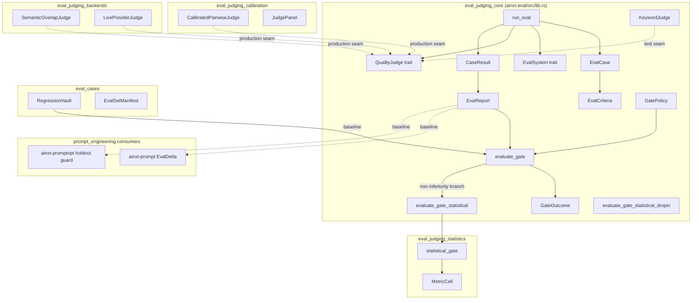
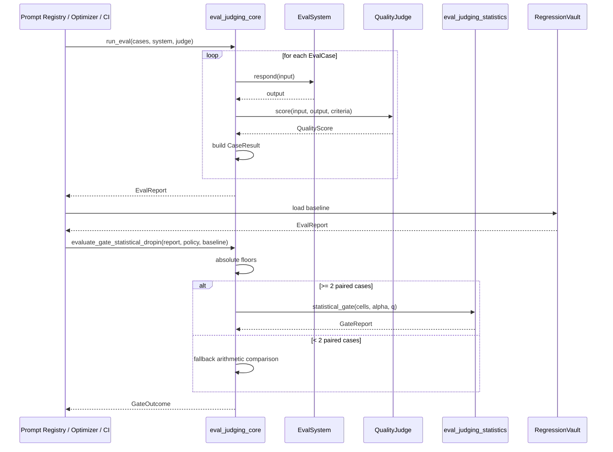
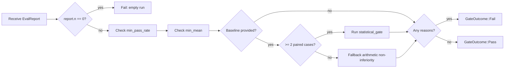

# eval_judging_core

## Brief Introduction

`eval_judging_core` is the foundational evaluation gate of the AI engine. It implements **eval-as-continuous-gate**: a deterministic, testable framework that runs a gold-set of [`EvalCase`](eval_cases.md)s through a system under evaluation, scores each output with an independent [`QualityJudge`](eval_judging_core.md#qualityjudge), and applies a [`GatePolicy`](eval_judging_core.md#gatepolicy) to decide whether the change is allowed to ship.

The core is intentionally seam-driven. [`EvalSystem`](eval_judging_core.md#evalsystem) and [`QualityJudge`](eval_judging_core.md#qualityjudge) are traits, so production can plug in an LLM judge while tests use deterministic judges. The result is a serializable [`EvalReport`](eval_judging_core.md#evalreport) that serves as a regression-vault baseline. Downstream consumers such as the prompt registry and prompt optimizer call the gate to block regressions before they reach users.

This module lives in `crates/ainxt-eval/src/lib.rs` and is the parent of the broader [`eval_judging`](eval_judging.md) subsystem.

---

## Core Concepts

| Concept | Purpose |
|---------|---------|
| `EvalCase` | A single gold-set item: input, rubric, and passing threshold. |
| `EvalCriteria` | The rubric and threshold that define "good" for a case. |
| `QualityJudge` | Trait for an independent scorer. Implemented by [`eval_judging_calibration`](eval_judging_calibration.md), [`eval_judging_backends`](eval_judging_backends.md), and test-only judges such as `KeywordJudge`. |
| `EvalSystem` | Trait for the system being evaluated. |
| `CaseResult` | The scored outcome for one case, including output, score, pass/fail, and rationale. |
| `EvalReport` | Aggregate, serializable result of an eval run; used as a baseline for non-inferiority checks. |
| `GatePolicy` | Absolute floors (min pass-rate, min mean) plus a non-inferiority margin vs baseline. |
| `GateOutcome` | `Pass` or `Fail(Vec<String>)` with all blocking reasons. |

---

## Architecture

---

## Component Relationships

### Evaluation Loop

The evaluation loop is intentionally simple and deterministic:

1. `run_eval` iterates over the provided `&[EvalCase]`.
2. For each case it calls `EvalSystem::respond` to obtain the candidate output.
3. It calls `QualityJudge::score` with the input, output, and criteria.
4. It records a `CaseResult` with the score and pass/fail status.
5. It aggregates all results into an `EvalReport` (count, pass-rate, mean).

Judges are consulted **per-case** and never see another case's verdict, preventing leakage between examples.

### Gate Decision

`evaluate_gate` applies a fail-closed policy:

1. Refuse empty runs.
2. Enforce absolute floors (`min_pass_rate`, `min_mean`).
3. If a baseline `EvalReport` is provided, enforce non-inferiority: the candidate pass-rate must not fall more than `noninferiority_margin` below the baseline.
4. Return `GateOutcome::Fail` with **all** reasons, so authors see every problem at once.

### Statistical Drop-in

`evaluate_gate_statistical_dropin` is the recommended replacement for `evaluate_gate` when a baseline is available. It keeps the same absolute floors but replaces the aggregate pass-rate comparison with a paired per-case statistical test via [`eval_judging_statistics`](eval_judging_statistics.md). This avoids "blocking on coin-flips": a null change returns `Pass`, while a genuine regression returns `Fail`. If fewer than two paired cases exist, it falls back to the arithmetic comparison to stay fail-closed.

---

## Data Flow

---

## Process Flow: Gate Evaluation

---

## How It Fits into the System

`eval_judging_core` sits at the center of the [`evaluation_testing`](evaluation_testing.md) domain within [`ai_engine`](ai_engine.md). It is the keystone that turns "we have evals" into "a change cannot ship if quality regressed."

- **Upstream**: [`eval_cases`](eval_cases.md) provides case definitions, manifests, integrity checks, and the regression vault that stores baselines.
- **Peers**: [`eval_judging_calibration`](eval_judging_calibration.md) supplies calibrated LLM judges and panels; [`eval_judging_statistics`](eval_judging_statistics.md) provides the rigorous paired non-inferiority test; [`eval_judging_backends`](eval_judging_backends.md) offers semantic-overlap and live-provider judge implementations; [`eval_judging_dogfood`](eval_judging_dogfood.md) provides broken/silent provider seams for testing the gate itself.
- **Downstream**: [`prompt_engineering`](prompt_engineering.md) modules (`ainxt-prompt` registry `EvalDelta`, `ainxt-promptopt` holdout guard) consume `EvalReport`s and gate outcomes to decide whether a prompt variant or optimized prompt can be promoted. [`eval_pipeline`](eval_pipeline.md) orchestrates release gates that call this core.
- **Cross-cutting**: The serializable `EvalReport` enables [`eval_judging_statistics`](eval_judging_statistics.md) baselines, canary analysis, and drift monitoring without coupling the core to those concerns.

---

## Key Design Decisions

1. **Seam-driven design**: `EvalSystem` and `QualityJudge` are traits, making the core fully testable with deterministic judges and stub systems.
2. **Fail-closed**: Empty runs, missing baselines, and tiny paired sets all result in `Fail` rather than silent passes.
3. **Aggregate + statistical gates**: `evaluate_gate` provides simple arithmetic thresholds; `evaluate_gate_statistical_dropin` adds rigorous paired testing for baseline comparisons.
4. **Serializable baselines**: `EvalReport` is the contract between eval runs, regression vaults, and downstream gates.

---

## Related Modules

- [`eval_judging`](eval_judging.md) — parent module covering all judging implementations.
- [`eval_judging_calibration`](eval_judging_calibration.md) — calibrated pairwise judges and judge panels.
- [`eval_judging_statistics`](eval_judging_statistics.md) — statistical non-inferiority testing and metric cells.
- [`eval_judging_backends`](eval_judging_backends.md) — semantic overlap and live provider judges.
- [`eval_judging_dogfood`](eval_judging_dogfood.md) — adversarial provider seams for gate self-testing.
- [`eval_cases`](eval_cases.md) — eval case definitions, manifests, integrity, vault, and RAG cases.
- [`eval_pipeline`](eval_pipeline.md) — release-gate orchestration that consumes these reports.
- [`prompt_engineering`](prompt_engineering.md) — primary downstream consumer of eval gate outcomes.
