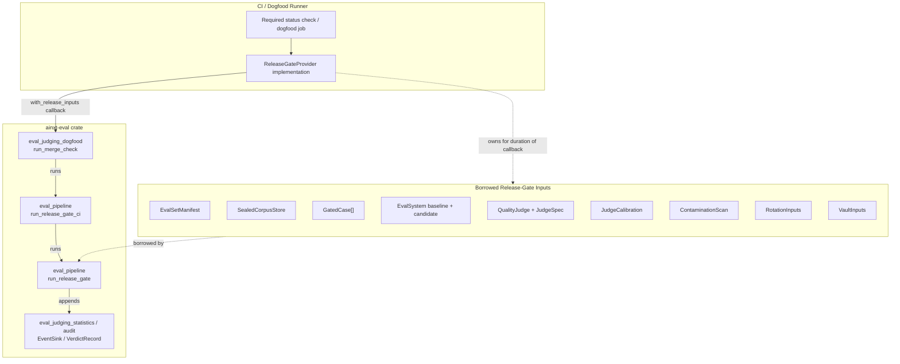
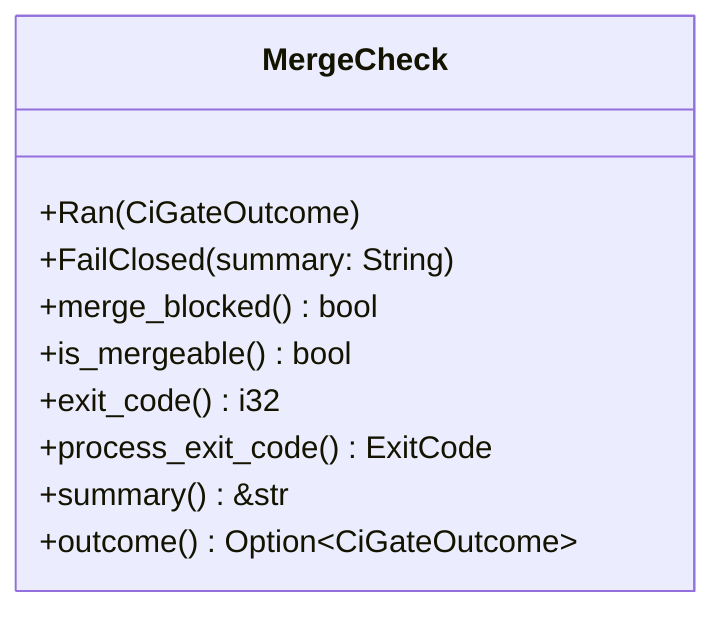
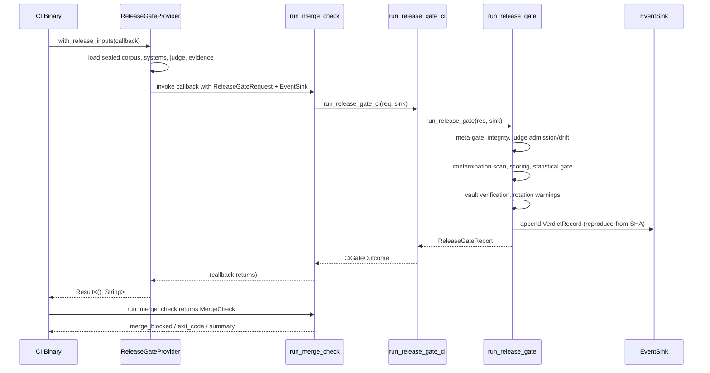
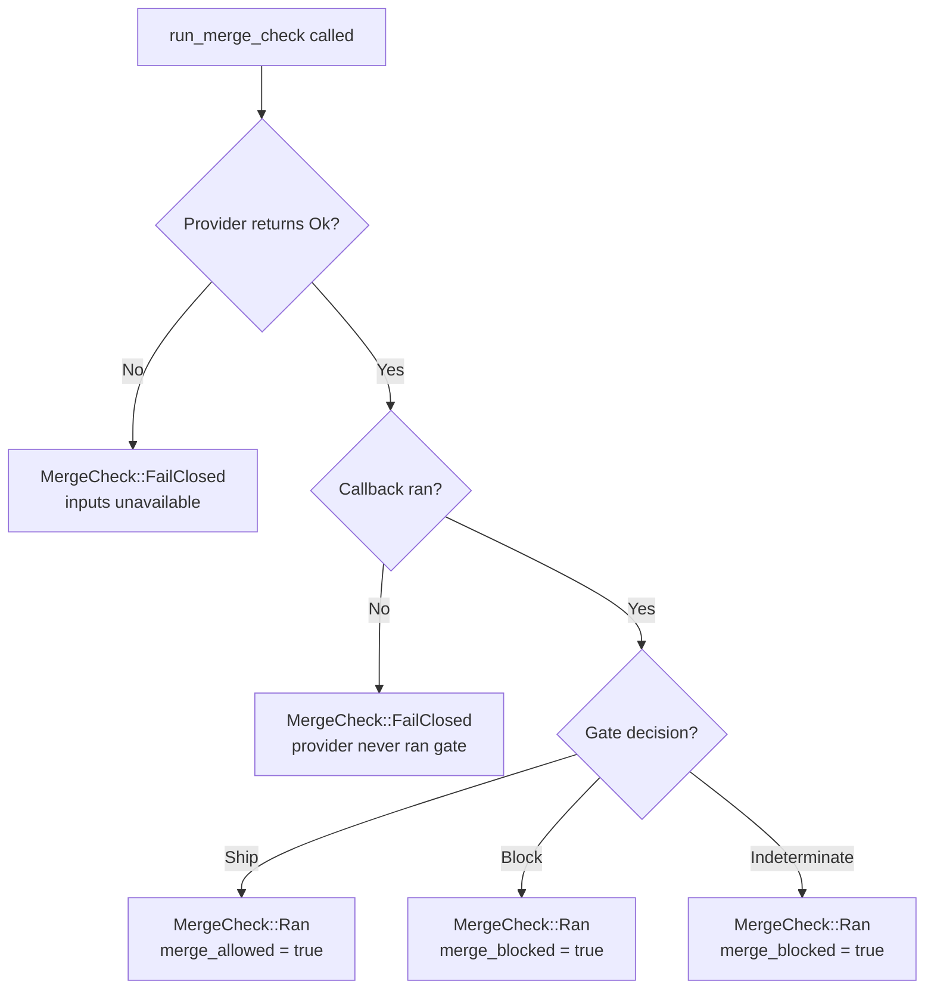
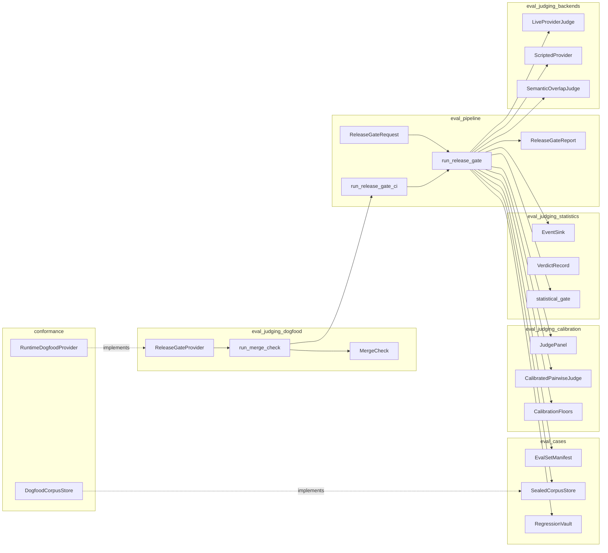
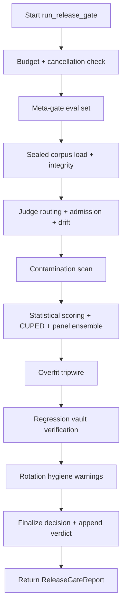
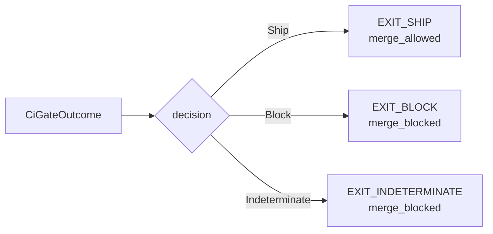

# eval_judging_dogfood

## Brief Introduction

`eval_judging_dogfood` is the **CI merge-check enforcer** for the evaluation platform. It provides the single non-test entrypoint that a required status check or dogfood job calls to run the composed release gate against a real change. The module lives in `crates/ainxt-eval/src/dogfood.rs` and bridges the gap between the fully-assembled [`ReleaseGateRequest`](eval_pipeline.md) (which borrows sealed corpora, systems, judges, and calibration evidence) and the CI surface defined in [`eval_pipeline`](eval_pipeline.md) and [`eval_judging_calibration`](eval_judging_calibration.md).

The core abstraction is [`ReleaseGateProvider`](#releasegateprovider), a trait implemented by the dogfood runner or CI job to assemble gate inputs and keep them alive for exactly the duration of the gate call. The [`run_merge_check`](#run_merge_check) function consumes that provider, invokes the real release gate, and returns a [`MergeCheck`](#mergecheck) value that a CI binary can turn directly into a process exit code and a stable summary line.

The module is intentionally small and fail-closed: if the provider cannot assemble inputs, or if it returns success without ever running the gate, the merge is blocked. This prevents a gate that could not run from being mistaken for a gate that passed.

---

## Core Responsibilities

1. **Provide a CI-callable seam** — `ReleaseGateProvider` lets the dogfood runner load the sealed corpus, stand up the in-house judge, run the baseline and candidate systems, and gather calibration / contamination / rotation / vault evidence.
2. **Run the real composed gate** — `run_merge_check` calls [`run_release_gate_ci`](eval_pipeline.md) (which in turn calls `run_release_gate`), so every instrument runs and the reproduce-from-SHA verdict is written to the Event Log before the decision returns.
3. **Return a CI-friendly outcome** — `MergeCheck` exposes `merge_blocked`, `exit_code`, `process_exit_code`, and `summary`, so a thin `cargo xtask eval-gate` binary can report the result to branch protection.
4. **Fail closed on every error path** — missing inputs, provider bugs, and indeterminate gate results all block the merge.

---

## Architecture

### Component Overview



### Key Components

#### `ReleaseGateProvider`

A trait with a single method:

```rust
fn with_release_inputs(
    &self,
    run: &mut dyn FnMut(&ReleaseGateRequest<'_>, &mut dyn EventSink),
) -> Result<(), String>;
```

The provider is responsible for:

- Loading the sealed corpus from an encrypted store.
- Standing up the in-house judge.
- Running the dogfooded baseline and candidate systems.
- Gathering calibration slices, contamination evidence, rotation inputs, and vault inputs.
- Building a [`ReleaseGateRequest`](eval_pipeline.md) and invoking the callback exactly once.

The visitor-style callback (`FnMut`) is deliberate: `ReleaseGateRequest` borrows all of its inputs, so the provider keeps them alive on its own stack for the duration of the call and drops them afterward. This avoids self-referential lifetimes across the trait boundary and avoids requiring `'static` inputs or an arena.

#### `MergeCheck`

The outcome of a merge-check run:



- **`Ran(CiGateOutcome)`** — the gate ran and produced a decision (`Ship`, `Block`, or `Indeterminate`).
- **`FailClosed { summary }`** — the provider could not assemble inputs, or the provider returned `Ok` without running the gate. The merge is blocked and the exit code is `EXIT_INDETERMINATE`.

#### `run_merge_check`

The single non-test entrypoint. It:

1. Calls `provider.with_release_inputs` with a callback that captures the `CiGateOutcome` from `run_release_gate_ci`.
2. If the provider returns `Ok` and the callback ran, returns `MergeCheck::Ran(outcome)`.
3. If the provider returns `Ok` but the callback never ran, returns `MergeCheck::FailClosed`.
4. If the provider returns `Err`, returns `MergeCheck::FailClosed` with the reason.

---

## Data Flow



### Fail-Closed Paths



---

## Dependencies

`eval_judging_dogfood` sits at the top of the evaluation judging stack and depends on the following sibling and parent modules:

| Dependency | Module Doc | Role in this module |
|------------|------------|---------------------|
| `ReleaseGateRequest` | [eval_pipeline](eval_pipeline.md) | Borrowed input bundle assembled by the provider. |
| `run_release_gate_ci`, `CiGateOutcome` | [eval_pipeline](eval_pipeline.md) | The composed CI merge-check surface and its outcome type. |
| `run_release_gate`, `ReleaseGateReport`, `ReleaseDecision` | [eval_pipeline](eval_pipeline.md) | The actual release gate implementation and report. |
| `EventSink`, `VerdictRecord` | [eval_judging_statistics](eval_judging_statistics.md) | Tamper-evident audit sink for the reproduce-from-SHA verdict. |
| `KeywordJudge` | [eval_judging_core](eval_judging_core.md) | Lightweight keyword-based judge used in some eval paths. |
| `CalibratedPairwiseJudge`, `JudgePanel`, `CalibrationFloors`, `ConfusionMatrix` | [eval_judging_calibration](eval_judging_calibration.md) | Judge admission, calibration, drift detection, and panel ensemble logic. |
| `CellVerdict`, `MetricCell`, `GateReport`, `statistical_gate` | [eval_judging_statistics](eval_judging_statistics.md) | Statistical testing and per-cell verdicts. |
| `SemanticOverlapJudge`, `LiveProviderJudge`, `ScriptedProvider` | [eval_judging_backends](eval_judging_backends.md) | Judge backends used inside the gate. |
| `EvalCase`, `EvalCriteria`, `CaseResult`, `EvalSystem` | [eval_cases](eval_cases.md) | Case definitions and the system under evaluation. |
| `EvalSetManifest`, `PreRegistration`, `MetricSpec` | [eval_cases](eval_cases.md) | Eval-set identity, pre-registration, and metric specification. |
| `SealedCorpusStore`, `SealedManifest`, `ContaminationPolicy`, `HoldoutCase` | [eval_cases](eval_cases.md) | Sealed corpus loading, integrity, contamination defense, and rotation. |
| `RegressionVault`, `VaultCase` | [eval_cases](eval_cases.md) | Frozen regression cases and vault verification. |
| `RuntimeDogfoodProvider`, `DogfoodCorpusStore`, `RuntimeUnderEval` | [conformance](conformance.md) | Concrete dogfood runtime and corpus store implementations that live outside this crate. |



---

## Process Flow: Running a Merge Check

### 1. Provider Assembles Inputs

The dogfood runner / CI job implements `ReleaseGateProvider`. In a typical CI run this involves:

- Checking out the candidate control-plane commit.
- Loading the encrypted sealed corpus for the eval set (only the runner identity can read gold answers).
- Building and starting the baseline system (incumbent) and candidate system (change under test).
- Loading the pinned in-house judge and its calibration evidence.
- Running contamination scans on candidate outputs/embeddings.
- Preparing rotation inputs and the regression vault snapshot.

### 2. Provider Invokes the Callback

The provider builds a `ReleaseGateRequest` that borrows all of the above and calls:

```rust
run(&ReleaseGateRequest, &mut dyn EventSink)
```

### 3. `run_merge_check` Runs the Gate

The callback calls `run_release_gate_ci(req, sink)`, which:

1. Calls `run_release_gate(req, sink)`.
2. Maps the resulting `ReleaseDecision` to a `CiGateOutcome`:
   - `Ship` → `merge_blocked = false`, `exit_code = EXIT_SHIP`
   - `Block(reasons)` → `merge_blocked = true`, `exit_code = EXIT_BLOCK`
   - `Indeterminate(why)` → `merge_blocked = true`, `exit_code = EXIT_INDETERMINATE`

### 4. Gate Stages Inside `run_release_gate`

For details on each stage, see [eval_pipeline](eval_pipeline.md). The high-level flow is:



### 5. Outcome Mapping



### 6. CI Binary Consumes `MergeCheck`

```rust
let check = run_merge_check(&provider);
println!("{}", check.summary());
std::process::exit(check.exit_code());
// or: return check.process_exit_code();
```

---

## Test Fixtures

The module includes two small test-only provider implementations that document the fail-closed behavior:

### `BrokenProvider`

Returns `Err("sealed corpus store unreachable")`. Verifies that unavailable inputs produce `MergeCheck::FailClosed` with `EXIT_INDETERMINATE`.

### `SilentProvider`

Returns `Ok(())` without invoking the callback. Verifies that a provider bug that forgets to run the gate is still treated as fail-closed.

These fixtures are not production providers; real providers live in the daemon/serving crates or in CI pipeline binaries. They are referenced here to make the fail-closed contract testable in the crate's own test suite.

---

## Integration with the Wider System

`eval_judging_dogfood` is the final link in the evaluation chain. It connects:

- **Evaluation cases and integrity** ([eval_cases](eval_cases.md)) — the sealed corpus, manifest, contamination policy, and regression vault.
- **Judge calibration and panels** ([eval_judging_calibration](eval_judging_calibration.md)) — admission, drift, and ensemble scoring.
- **Statistical testing** ([eval_judging_statistics](eval_judging_statistics.md)) — multiple-comparison correction, CUPED variance reduction, and per-cell verdicts.
- **Judge backends** ([eval_judging_backends](eval_judging_backends.md)) — live provider, scripted, and semantic-overlap judges.
- **Release pipeline** ([eval_pipeline](eval_pipeline.md)) — the composed gate, CI outcome, and durable audit record.
- **Conformance dogfood** ([conformance](conformance.md)) — concrete runtime and corpus-store implementations used by the dogfood runner.

By keeping this module small and focused on the CI seam, the complex gate logic remains in [eval_pipeline](eval_pipeline.md) and its submodules, while the dogfood enforcer only worries about orchestration and fail-closed reporting.

---

## Security and Governance Notes

- **Fail-closed by default** — every error, missing input, or provider bug blocks the merge.
- **Reproduce-from-SHA** — the verdict record includes the candidate control-plane commit SHA and a hash of the pre-registered analysis parameters, making the decision auditable and reproducible.
- **Tamper-evident audit** — the verdict is appended to an `EventSink` before the decision returns, so a failed CI runner cannot hide a blocking result.
- **No cloud fallback for regulated data** — judge routing enforces in-house-only judges for regulated data classes; this is checked inside the gate before scoring.
- **Provider owns secrets** — the provider keeps the sealed corpus, judge, and systems alive on its own stack, so this module never needs to own or clone sensitive inputs.
