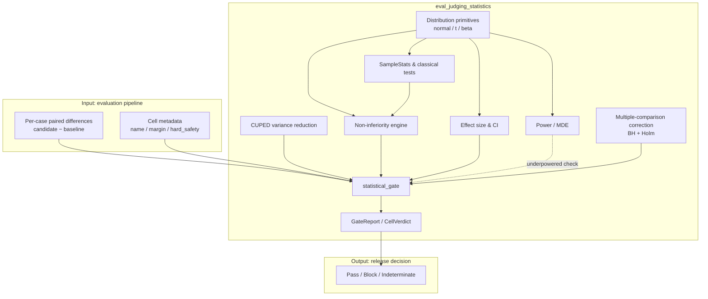
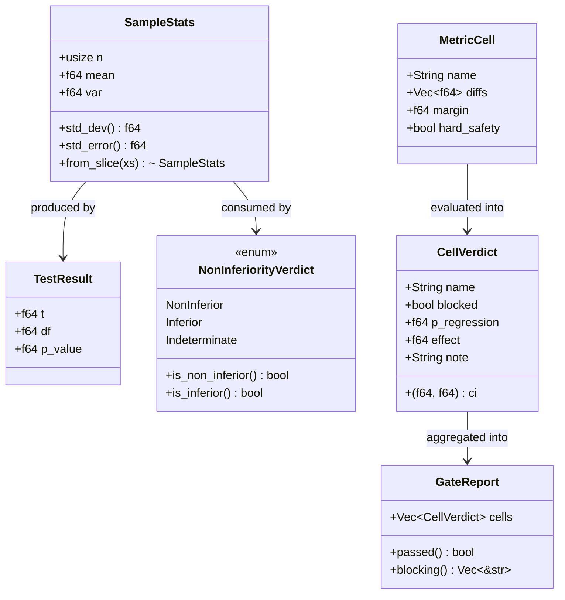
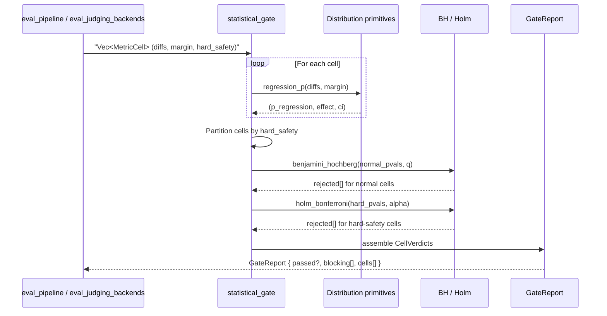
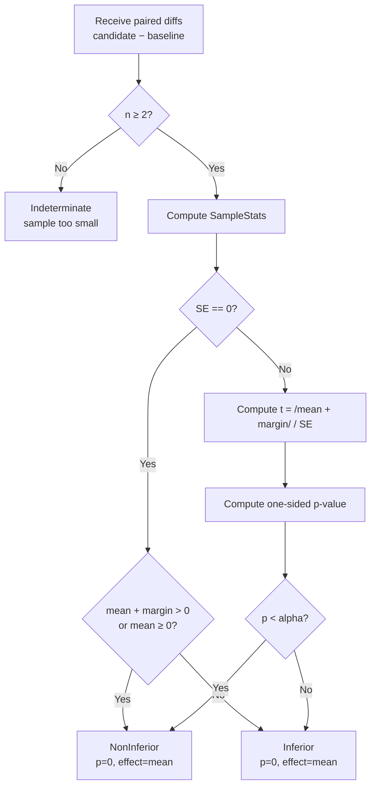
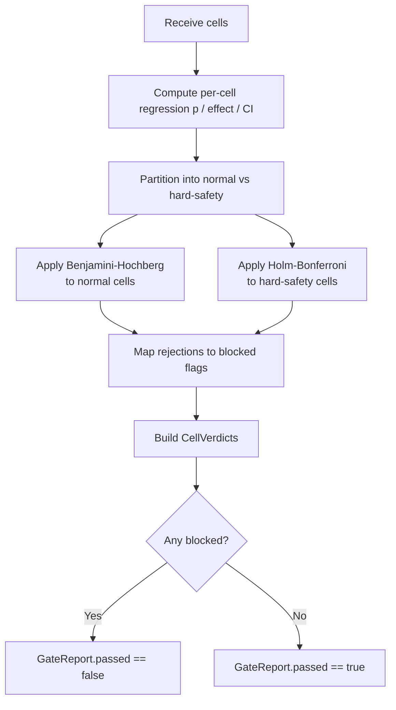
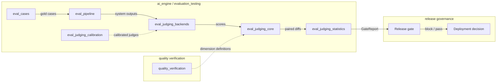

# eval_judging_statistics

## Brief Introduction

`eval_judging_statistics` provides the statistical methodology that powers the evaluation gate in the AI engine. Located in `crates/ainxt-eval/src/stats.rs`, it transforms raw per-case score differences into rigorous, pre-registered statistical decisions. The module addresses the core failure mode identified in ADR-010: *"the gate can be satisfied by noise."* By framing the gate as a **non-inferiority decision** with effect-size thresholds, confidence intervals, power analysis, and multiple-comparison correction, it ensures that only material regressions block a release while genuine improvements or null changes pass.

The module is intentionally pure, deterministic, and `std`-only. All distribution functions—`normal_cdf`, `normal_ppf`, `student_t_sf`, and the incomplete-beta machinery—are clean-room implementations of standard numerical methods, unit-tested against known reference values. This makes the p-values and confidence intervals the gate acts on trustworthy and reproducible.

This module is a leaf in the [`eval_judging`](eval_judging.md) family, sitting alongside [`eval_judging_core`](eval_judging_core.md), [`eval_judging_calibration`](eval_judging_calibration.md), [`eval_judging_backends`](eval_judging_backends.md), and [`eval_judging_dogfood`](eval_judging_dogfood.md). It consumes paired per-case differences produced by the broader evaluation pipeline (see [`eval_pipeline`](eval_pipeline.md)) and emits a `GateReport` that downstream release gates consume.

---

## Core Functionality

### 1. Distribution Primitives

The module implements its own distribution functions so it has no external numerical dependencies beyond `serde`:

| Function | Purpose |
|----------|---------|
| `erf` | Error function via Abramowitz & Stegun 7.1.26 |
| `normal_cdf` | Standard-normal CDF Φ(x) |
| `normal_ppf` | Inverse standard-normal CDF (probit) via Acklam's approximation plus one Halley step |
| `betai` / `betacf` | Regularized incomplete beta via Lentz continued fraction |
| `ln_gamma` | Log-gamma via Lanczos approximation |
| `student_t_sf` / `student_t_two_sided` / `student_t_cdf` | Student's t survival, two-sided, and CDF |

These primitives are the foundation for every test in the module and are validated in unit tests against standard tables.

### 2. Sample Summaries and Classical Tests

- **`SampleStats`** — mean, unbiased sample variance, standard deviation, and standard error computed from a slice of `f64` values.
- **`TestResult`** — t-statistic, degrees of freedom, and p-value returned by the classical tests.
- **`welch_t_test`** — Welch's two-sample t-test for unequal variances (two-sided).
- **`paired_t_test`** — Paired t-test on per-case differences `candidate − baseline`, the default eval design because it cancels per-case variance.

### 3. Non-Inferiority Testing

The central abstraction is the **non-inferiority test**:

- **Null hypothesis H₀**: `mean(candidate − baseline) ≤ −margin` (candidate is materially worse).
- **Alternative H₁**: `mean(candidate − baseline) > −margin` (candidate is not meaningfully worse).

`non_inferiority_paired` returns a `NonInferiorityVerdict`:

- `NonInferior { p_value, effect }` — candidate may ship.
- `Inferior { p_value, effect }` — blocking regression.
- `Indeterminate(reason)` — not enough data; never a silent pass.

This framing is the concrete answer to gap [40]: a null change returns "no measured effect," never "regression."

### 4. Effect Size and Confidence Intervals

- **`cohens_d`** — pooled standardized effect size for two independent samples.
- **`mean_diff_ci`** — two-sided confidence interval for the difference of means.

A "significant" but sub-MDE difference is reported as *no material effect*; significance alone never flaps the gate.

### 5. Power and Minimum Detectable Effect (MDE)

- **`power_two_sample`** — approximate power for a two-sample test given standardized effect `d`, per-arm `n`, and `alpha`.
- **`mde_two_sample`** — inverse: minimum detectable standardized effect.
- **`is_powered`** — checks whether a sample is large enough to detect its pre-registered MDE.

An underpowered evaluation set is treated as a defect: the gate refuses to pass a change that cannot be confidently assessed.

### 6. CUPED Variance Reduction

- **`cuped_adjust`** — adjusts a metric series `y` using a pre-period covariate `x` (e.g., per-case difficulty), producing `y − θ(x − x̄)` where `θ = cov(x, y) / var(x)`. Strong correlation between `x` and `y` dramatically reduces variance, allowing smaller evaluation sets to reach adequate power.

### 7. Multiple-Comparison Correction

Evaluation gates watch many `metric × model × category` cells. The module provides two correction strategies:

- **`benjamini_hochberg`** — FDR control for ordinary metric cells. Prevents a false block from pure multiplicity while still letting real regressions surface.
- **`holm_bonferroni`** — family-wise error control for hard-safety cells (e.g., data-class leak, redaction, RBAC) where any false negative is unacceptable.

### 8. The Statistical Gate

- **`MetricCell`** — one `metric × model × category` cell represented as paired differences, a non-inferiority margin, and a `hard_safety` flag.
- **`CellVerdict`** — per-cell outcome: blocked, regression p-value, effect size, 95% CI, and a human-readable note.
- **`GateReport`** — collection of `CellVerdict`s with `passed()` and `blocking()` helpers.
- **`statistical_gate`** — the top-level entry point. It computes per-cell regression p-values, partitions cells into ordinary and hard-safety families, applies the appropriate correction, and produces the final report.

---

## Architecture

The module is organized as a stack of pure functions. The bottom layer implements distribution primitives; the middle layer builds sample summaries, classical tests, non-inferiority, effect sizes, power, and variance reduction; the top layer (`statistical_gate`) orchestrates everything and applies multiplicity correction.

---

## Component Relationships

- **`SampleStats`** is the universal summary object. It feeds Welch's t-test, paired t-tests, Cohen's d, and non-inferiority tests.
- **`TestResult`** is the lightweight output of classical tests.
- **`NonInferiorityVerdict`** is the semantic outcome for a single non-inferiority decision.
- **`MetricCell`** is the input boundary between the evaluation pipeline and the statistical gate.
- **`CellVerdict`** and **`GateReport`** are the output boundary consumed by release gates and reporting surfaces.

---

## Data Flow

1. The pipeline supplies a vector of `MetricCell`s, each representing paired differences for one `metric × model × category` slice.
2. `statistical_gate` computes a regression p-value, effect size, and confidence interval for every cell using the distribution primitives.
3. Cells are split into ordinary and hard-safety families.
4. Benjamini-Hochberg controls false-discovery rate across ordinary cells; Holm-Bonferroni controls family-wise error across hard-safety cells.
5. Rejections are mapped back to cells, producing `CellVerdict`s and the final `GateReport`.

---

## Process Flows

### Non-Inferiority Decision Flow

### Statistical Gate Decision Flow

---

## How It Fits into the Overall System

`eval_judging_statistics` sits at the intersection of the evaluation and release-governance subsystems:

- **[`eval_cases`](eval_cases.md)** provides the corpus of evaluation cases.
- **[`eval_pipeline`](eval_pipeline.md)** orchestrates execution, contamination scans, vault checks, and CI integration.
- **[`eval_judging_backends`](eval_judging_backends.md)** supplies judge implementations such as semantic overlap judges and live provider judges.
- **[`eval_judging_core`](eval_judging_core.md)** defines the core evaluation abstractions (`EvalCase`, `EvalCriteria`, `KeywordJudge`, `CaseResult`).
- **[`eval_judging_calibration`](eval_judging_calibration.md)** calibrates pairwise and panel judges so that the scores entering statistics are reliable.
- **[`quality_verification`](quality_verification.md)** defines the dimensions (correctness, groundedness, tone, etc.) that become the `MetricCell` names and margins.

The statistical gate is the final quantitative filter before a release decision. It does not replace human review or policy gates, but it prevents noisy metrics from either blocking a safe change or letting a regression slip through.

---

## Design Principles

1. **Non-inferiority, not superiority.** The gate asks "is the candidate meaningfully worse?" rather than "is the candidate better?" This avoids penalizing null changes.
2. **Effect size + CI, not just p-values.** A statistically significant but practically tiny difference is reported as "no material effect."
3. **Power as a first-class requirement.** Underpowered evaluation sets are flagged explicitly rather than passed with false confidence.
4. **Paired design by default.** `paired_t_test` and `non_inferiority_paired` exploit per-case correlation to reduce variance.
5. **Variance reduction via CUPED.** Pre-period covariates let smaller, cheaper evaluation sets reach adequate power.
6. **Multiplicity correction by family.** Ordinary metrics use FDR; hard-safety metrics use family-wise control.
7. **Determinism and auditability.** Pure functions, clean-room numerical implementations, and serde serialization make results reproducible and auditable.

---

## References

- **[eval_judging.md](eval_judging.md)** — parent module overview for the judging subsystem.
- **[eval_judging_core.md](eval_judging_core.md)** — core evaluation types and keyword judging.
- **[eval_judging_calibration.md](eval_judging_calibration.md)** — calibrated pairwise and panel judges.
- **[eval_judging_backends.md](eval_judging_backends.md)** — semantic overlap, live provider, and echo judge backends.
- **[eval_judging_dogfood.md](eval_judging_dogfood.md)** — dogfood and broken-provider testing.
- **[eval_pipeline.md](eval_pipeline.md)** — release-gate pipeline orchestration.
- **[eval_cases.md](eval_cases.md)** — evaluation case definitions and integrity.
- **[quality_verification.md](quality_verification.md)** — quality dimensions that feed into metric cells.
