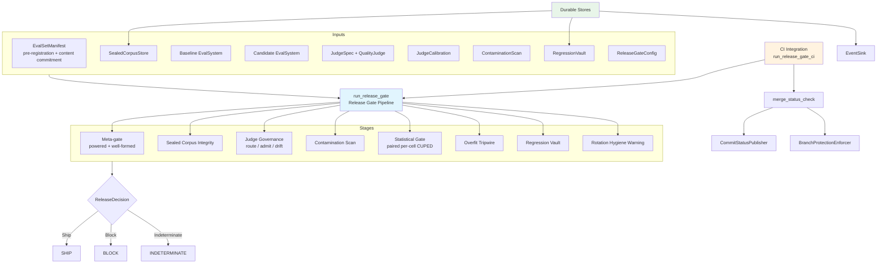
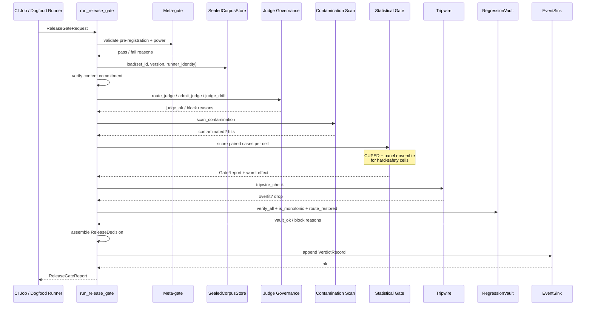
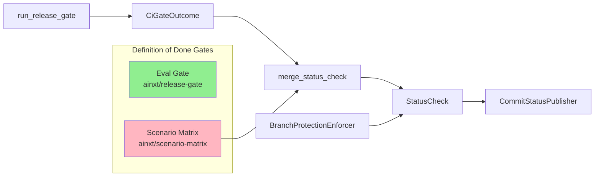

# eval_pipeline Module

> Sub-module documentation: [Release Gate](eval_pipeline_release_gate.md) · [CI Integration](eval_pipeline_ci_integration.md) · [Durable Stores](eval_pipeline_durable_stores.md)

## Overview

The `eval_pipeline` module is the **merge-blocking release gate composition** for the AI engine's evaluation platform. It takes the individual evaluation instruments defined elsewhere in the `ainxt-eval` crate — meta-gate validation, sealed corpus integrity, Judge governance, contamination scanning, statistical gating, overfit tripwires, and regression vaults — and composes them into a single, fail-closed, statistically valid, auditable pipeline that a CI system can block a merge on.

Prior to this module, each rigorous instrument existed but was only exercised from its own unit tests. The downstream gate that actually ran was a naive aggregate pass-rate comparison that could block on sampling noise ("coin-flips"). `eval_pipeline` closes that gap by providing [`run_release_gate`](eval_pipeline_release_gate.md), the single entrypoint a CI merge-check or dogfood runner calls.

The module is intentionally I/O-agnostic: all heavy dependencies (encrypted sealed corpus store, tamper-evident Event Log, in-house Judge, dogfood runner) are supplied through trait seams. This lets the same composition be tested end-to-end with fakes in-crate and wired to real backends by the parent crates.

## Architecture

### Key Design Principles

- **Fail-closed**: any stage that cannot be evaluated, any integrity failure, or any cancellation/over-budget condition results in `Block` or `Indeterminate` — never a silent pass.
- **Statistically valid**: the ship decision is the per-cell [`statistical_gate`](eval_judging.md), not a mean comparison or pass-rate arithmetic.
- **Auditable**: a deterministic, reproduce-from-SHA [`VerdictRecord`](eval_judging.md) is written to the Event Log **before** the decision is returned.
- **Enterprise-grade**: honours cooperative cancellation, per-run case budgets, and regulated-data-class Judge routing.

## Sub-modules

### [eval_pipeline_release_gate](eval_pipeline_release_gate.md)

Implements the core [`run_release_gate`](eval_pipeline_release_gate.md) entrypoint and all supporting request/response types (`ReleaseGateRequest`, `ReleaseGateReport`, `ReleaseDecision`, `GatedCase`, `PanelInputs`, etc.). It orchestrates the nine-stage pipeline:

1. Budget / cancellation check
2. Meta-gate validation
3. Sealed corpus load + content commitment verification
4. Judge governance (routing, admission, drift)
5. Contamination scan
6. Statistical gate with optional CUPED variance reduction and Judge-panel ensemble for hard-safety cells
7. Overfit tripwire
8. Regression vault monotonicity + route restoration
9. Rotation hygiene warning

### [eval_pipeline_ci_integration](eval_pipeline_ci_integration.md)

Wires the release gate to CI merge-check semantics. Provides [`run_release_gate_ci`](eval_pipeline_ci_integration.md) to map a `ReleaseDecision` to a merge-block decision and process exit code, plus [`merge_status_check`](eval_pipeline_ci_integration.md) to compose the eval gate with other required Definition-of-Done gates (e.g. the Scenario Matrix). It also includes the full [`run_ci_merge_check_enforced`](eval_pipeline_ci_integration.md) entrypoint that publishes a named commit status and enforces the branch-protection rule that requires it.

### [eval_pipeline_durable_stores](eval_pipeline_durable_stores.md)

File-backed, durable implementations of the trait seams the pipeline depends on:

- [`FileSealedCorpusStore`](eval_pipeline_durable_stores.md) — runner-identity-restricted sealed corpus.
- [`FileVaultStore`](eval_pipeline_durable_stores.md) — append-only regression vault with seal verification.
- [`FileEventSink`](eval_pipeline_durable_stores.md) — durable JSONL verdict log.

These are the no-infra tier behind the same seams; swapping in KMS-encrypted database/object-store backends is a configuration change.

## Data Flow

## CI Merge-Check Wiring

The eval gate alone is not enough to merge. Branch protection must require the composite `ainxt/release-gate` status, and that status is `Success` only when the eval gate **Ship**s **and** every other required DoD gate (typically the Scenario Matrix) has reported and passed. A missing required gate is treated as a failure (fail-closed).

## Relationship to Other Modules

- **[eval_cases](eval_cases.md)**: supplies `EvalCase`, `EvalSetManifest`, `EvalCaseContent`, `HoldoutCase`, and the sealed-corpus abstractions consumed by the pipeline.
- **[eval_judging](eval_judging.md)**: supplies `QualityJudge`, `JudgeSpec`, `JudgePanel`, `JudgeCalibration`, `statistical_gate`, `VerdictRecord`, and `EventSink` — the scoring and audit primitives the pipeline composes.
- **[conformance](conformance.md) / [canary](canary.md) / [replay](replay.md)**: sibling evaluation-testing modules that provide other gates and observability surfaces; the Scenario Matrix required check often draws from these.
- **[scenario_service](../scenario_service/scenario_service.md)**: the source of the Scenario Matrix safety/correctness gate that is composed with the eval gate in the merge-check.

## When to Use This Module

Use `eval_pipeline` when you need to:

- Block a PR merge on a rigorous, statistically valid evaluation of a candidate change.
- Run a dogfood evaluation that produces an auditable, reproduce-from-SHA verdict.
- Compose the individual evaluation instruments into a single fail-closed decision.
- Wire the eval gate into CI as a named, merge-blocking status check with branch-protection enforcement.
