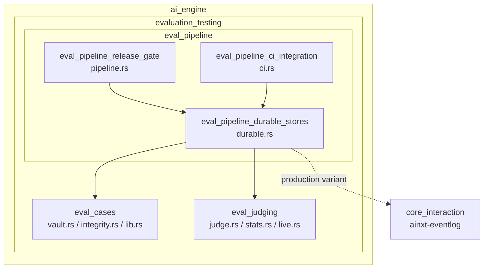
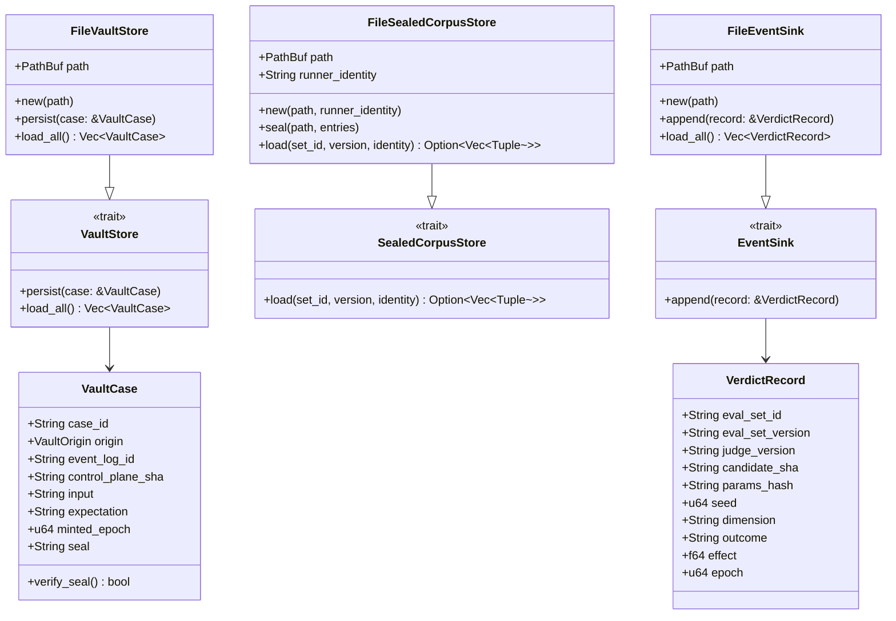
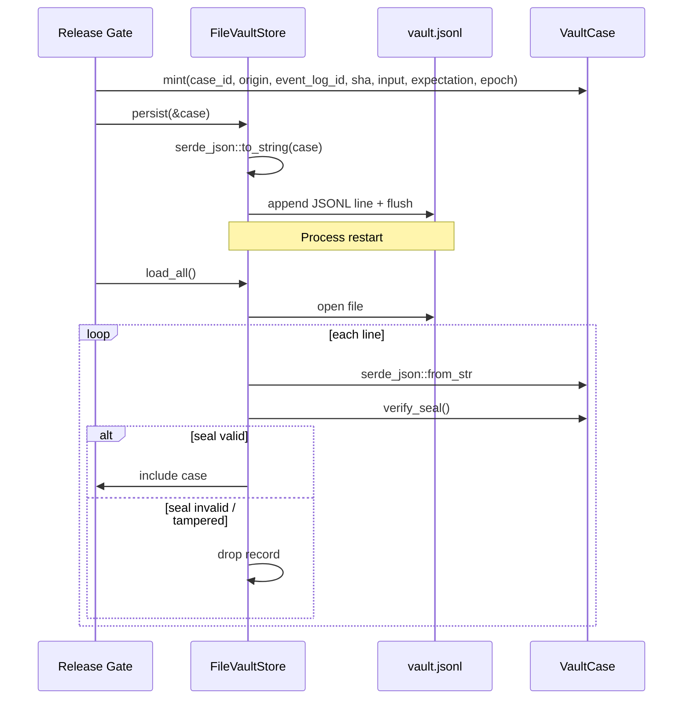
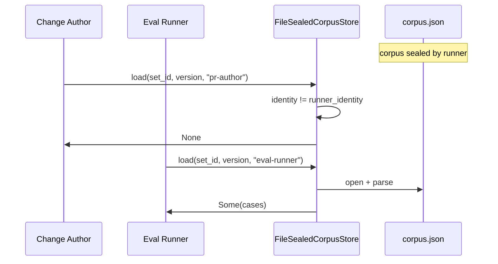
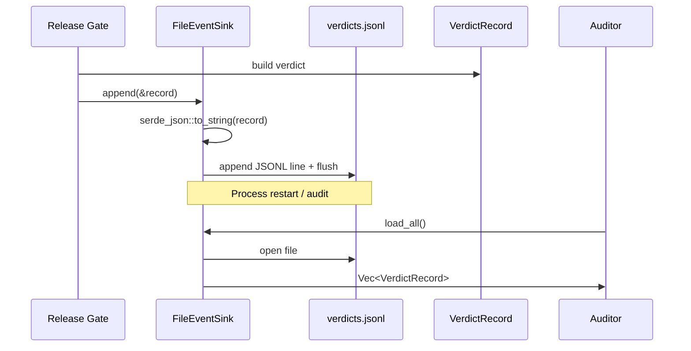
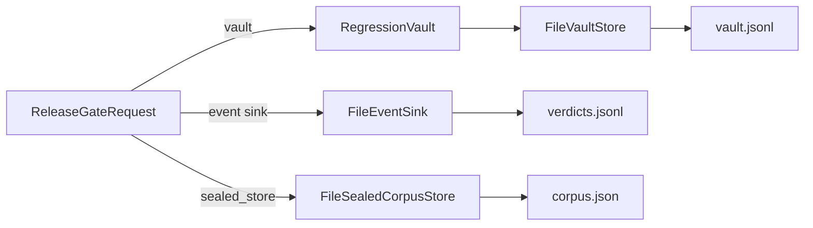
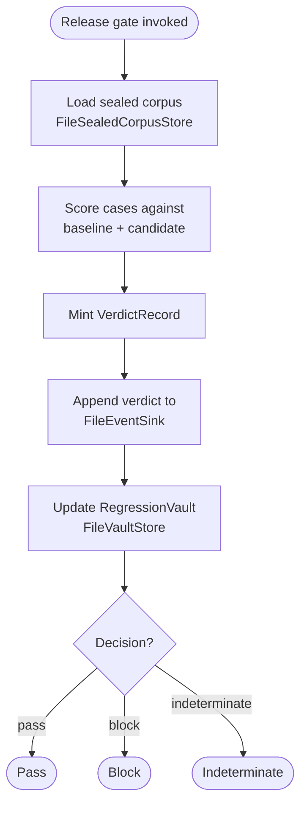

# eval_pipeline_durable_stores

## Brief Introduction

`eval_pipeline_durable_stores` provides **durable, file-backed implementations** of the three data-plane seams defined in the evaluation platform: the tamper-evident **Event Log**, the encrypted **Sealed Corpus**, and the sealed **Regression Vault**. These stores let the evaluation pipeline survive process restarts with no external infrastructure, using the same append-only JSONL discipline as `ainxt-eventlog`. They sit behind the same trait seams as their production (KMS-encrypted, access-controlled database/object-store) counterparts, so swapping tiers is a configuration change rather than a code change.

The module is part of the larger [`eval_pipeline`](eval_pipeline.md) within [`evaluation_testing`](evaluation_testing.md), and is consumed directly by the release-gate logic in [`eval_pipeline_release_gate`](eval_pipeline_release_gate.md) and the CI integration in [`eval_pipeline_ci_integration`](eval_pipeline_ci_integration.md).

---

## Core Components

| Component | File | Responsibility |
|-----------|------|----------------|
| `FileVaultStore` | `crates/ainxt-eval/src/durable.rs` | Persists [`VaultCase`](eval_cases.md)s as append-only JSONL and reloads them across restarts, dropping records whose content seal no longer verifies. |
| `FileSealedCorpusStore` | `crates/ainxt-eval/src/durable.rs` | Reads a sealed corpus file and enforces runner-only read identity, preventing authors of gated changes from reading gold answers. |
| `FileEventSink` | `crates/ainxt-eval/src/durable.rs` | Appends [`VerdictRecord`](eval_judging.md)s to a durable JSONL log so reproduce-from-SHA verdicts survive restarts. |

---

## Architecture

### Module Position

### Component Relationships

---

## Data Flow

### Vault Case Persistence and Reload

### Sealed Corpus Read Flow

### Verdict Event Logging

---

## Component Details

### `FileVaultStore`

`FileVaultStore` is the durable implementation of the [`VaultStore`](eval_cases.md) trait used by the regression vault. Each [`VaultCase`](eval_cases.md) is serialized to one JSON line and appended to a file. On `load_all`, every line is re-parsed and its cryptographic seal is re-verified; any record that fails verification is silently dropped. This gives the vault **tamper evidence across restarts** without requiring an external database.

Key behaviors:
- Append-only writes with explicit `flush`.
- Creates the file on first write.
- Returns an empty vector if the file does not yet exist.
- Drops tampered or unparseable lines rather than surfacing them as valid cases.

### `FileSealedCorpusStore`

`FileSealedCorpusStore` is the durable implementation of the [`SealedCorpusStore`](eval_cases.md) trait. The corpus file is a JSON map from `set_id` to `version` to a list of `(case_id, input, gold)` tuples. The store enforces **runner-only read access**: only callers presenting the configured `runner_identity` can load cases. This is the contamination-defense mechanism that prevents the authors of a gated change from reading the gold answers.

Key behaviors:
- `seal` writes the corpus file from a list of entries (producer side, runner-controlled).
- `load` returns `None` for any identity other than the runner.
- Returns `None` for unknown set/version combinations.

### `FileEventSink`

`FileEventSink` is the durable implementation of the [`EventSink`](eval_judging.md) trait. It appends [`VerdictRecord`](eval_judging.md)s to a JSONL file so that release-gate verdicts are reproducible from the candidate SHA even after a process restart. The production-grade counterpart is `ainxt-eventlog`'s hash-chained `JsonlEventLog`; `FileEventSink` provides the same seam with no external infrastructure.

Key behaviors:
- Append-only durable writes with explicit `flush`.
- `load_all` re-reads every persisted verdict for audit or verification.
- Creates the file on first write.

---

## Integration with the Evaluation Pipeline

The durable stores are wired into the release gate through [`ReleaseGateRequest`](eval_pipeline_release_gate.md):

- `vault: VaultInputs` uses a `RegressionVault`, which is backed by a `VaultStore` (e.g., `FileVaultStore`).
- `sealed_store: &dyn SealedCorpusStore` is typically a `FileSealedCorpusStore`.
- The gate mints a `VerdictRecord` and writes it via an `EventSink` (e.g., `FileEventSink`) before returning the [`ReleaseGateReport`](eval_pipeline_release_gate.md).

---

## Security and Compliance Properties

| Property | Mechanism |
|----------|-----------|
| Tamper evidence | `VaultCase` seals are verified on every `load_all`; tampered records are dropped. |
| Contamination defense | `FileSealedCorpusStore` returns gold answers only to the runner identity. |
| Reproducibility | `VerdictRecord` includes `candidate_sha`, `params_hash`, `seed`, `judge_version`, and `epoch`. |
| No external infra | File-backed JSONL stores work offline; production variants swap in via config. |
| Auditability | `FileEventSink::load_all` and `FileVaultStore::load_all` support post-hoc review. |

---

## Process Flow: Running a Gated Release

---

## Related Modules

- [`eval_pipeline`](eval_pipeline.md) — parent module covering the full evaluation pipeline.
- [`eval_pipeline_release_gate`](eval_pipeline_release_gate.md) — release-gate orchestration that consumes these stores.
- [`eval_pipeline_ci_integration`](eval_pipeline_ci_integration.md) — CI gates and status publishing.
- [`eval_cases`](eval_cases.md) — defines `VaultCase`, `RegressionVault`, `SealedCorpusStore`, and related integrity types.
- [`eval_judging`](eval_judging.md) — defines `VerdictRecord`, `EventSink`, judges, and statistical reporting.
- [`core_interaction`](../core_infrastructure/core_interaction.md) — includes `ainxt-eventlog`, the production hash-chained event log.
