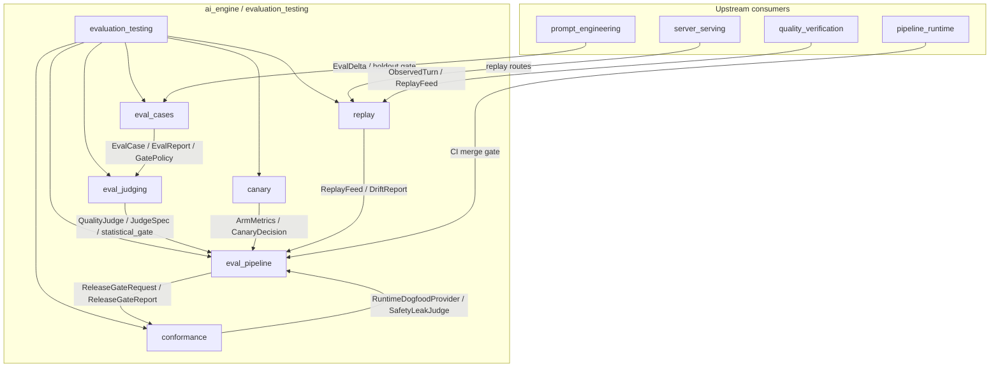
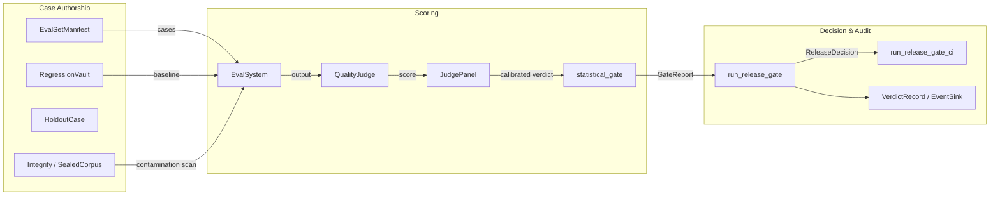
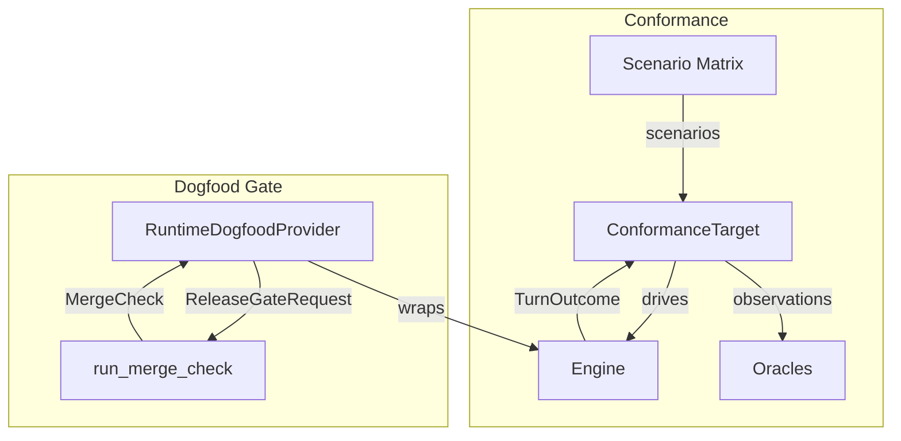
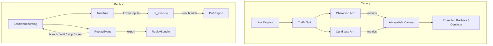

# `evaluation_testing` Module Overview

## Purpose

The `evaluation_testing` module is the **continuous-evaluation and safety-gating backbone** of the AI engine. It ensures that every change that can affect model behavior—prompts, retrieval configurations, guardrails, or runtime wiring—is measured against a fixed, reviewable set of test cases, scored by governed judges, and blocked from shipping if it regresses quality or safety.

The module unifies six evaluation disciplines into one fail-closed platform:

| Concern | Responsibility |
|---|---|
| **Gold-set evaluation** (`eval_cases`) | Define, version, and run eval cases with rubrics, thresholds, and gate policies. |
| **Judging** (`eval_judging`) | Calibrate LLM judges, run paired statistical gates, and provide offline + live scoring backends. |
| **Release pipeline** (`eval_pipeline`) | Compose all evaluation instruments into a single merge-blocking release gate with CI integration. |
| **Runtime conformance** (`conformance`) | Exercise the fully assembled runtime against an adversarial scenario matrix. |
| **Production canary** (`canary`) | Compare champion and candidate deployments on live traffic with statistically valid rollback/promotion decisions. |
| **Deterministic replay** (`replay`) | Record sessions as turn trees, replay redacted events, re-execute turns to detect drift, and export auditable bundles. |

The module is **deterministic by default**, **content-addressed**, and **auditable**: every gate binds inputs to hashes, writes a verdict record before returning, and treats missing data, underpowered tests, or contamination as a block rather than a pass.

---

## Architecture

### Module Relationships

### Evaluation Data Flow

### Runtime Conformance & Dogfood Flow

### Canary & Replay Flow

---

## Core Components

| Sub-module | Crate(s) | Responsibility | Documentation |
|---|---|---|---|
| `eval_cases` | `ainxt-eval` | Gold-set cases, eval reports, gate policies, manifest integrity, regression vault, RAG-specific evals. | [eval_cases.md](eval_cases.md) |
| `eval_judging` | `ainxt-eval` | Calibrated judges, panels, statistical non-inferiority testing, offline/live scoring backends, CI dogfood. | [eval_judging.md](eval_judging.md) |
| `eval_pipeline` | `ainxt-eval` | Release gate composition, CI merge-check wiring, durable sealed-corpus / vault / event-sink stores. | [eval_pipeline.md](eval_pipeline.md) |
| `conformance` | `ainxt-conformance` | End-to-end runtime scenario matrix and dogfood provider feeding the release gate. | [conformance.md](conformance.md) |
| `canary` | `ainxt-canary` | Online two-arm and anytime-valid canary analysis with git-ref-pinned traffic splits and pointer-flip rollback. | [canary.md](canary.md) |
| `replay` | `ainxt-replay` | Deterministic session replay, turn-tree editing, re-execution drift detection, and content-committed bundle export. | [replay.md](replay.md) |

---

## Key Design Principles

1. **Fail-closed** — empty runs, missing judges, underpowered tests, integrity failures, and contamination all block.
2. **Deterministic** — eval runs, scenario matrices, canary assignment, and replay use explicit seeds and stable hashes; no wall-clock or RNG dependence in core logic.
3. **Reproducible-from-SHA** — verdict records, vault cases, sealed manifests, and replay bundles bind every input to a content hash.
4. **Statistically valid** — baseline comparison uses paired, corrected non-inferiority tests rather than pass-rate arithmetic.
5. **Separation of concerns** — case authorship, scoring, gating, audit, runtime conformance, canary analysis, and replay are independent sub-modules composed at the pipeline layer.

---

## References

- [eval_cases.md](eval_cases.md) — gold-set evaluation core, manifests, integrity, vault, audit, and RAG evals.
- [eval_judging.md](eval_judging.md) — calibrated judge instruments, panels, statistical testing, and scoring backends.
- [eval_pipeline.md](eval_pipeline.md) — release gate composition, CI integration, and durable stores.
- [conformance.md](conformance.md) — runtime scenario matrix and dogfood release gate provider.
- [canary.md](canary.md) — online canary analysis, traffic splits, and rollback/promotion decisions.
- [replay.md](replay.md) — deterministic replay, turn-tree interactions, re-execution drift, and bundle export.
- Parent domain: [ai_engine.md](ai_engine.md)
- Related runtime: [runtime_engine.md](../pipeline_runtime/runtime_engine.md)
- Related quality: [quality_verification.md](quality_verification.md)