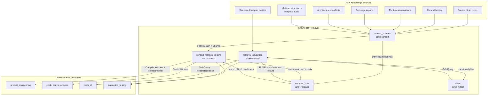
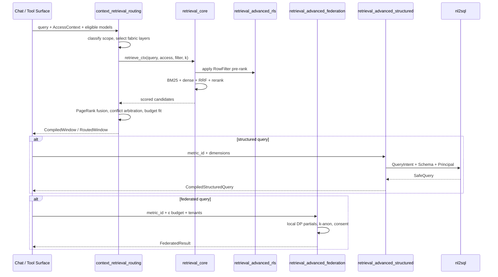

# `knowledge_retrieval` Module Overview

## Purpose

`knowledge_retrieval` is the secure, governed retrieval layer of the AI engine. It is responsible for turning raw, heterogeneous enterprise knowledge — source code, documents, runtime observations, structured ledger data, and multimodal artifacts — into access-controlled, citable, and auditable context that downstream model calls can safely consume.

The module guarantees that:

- **Security is enforced before ranking** — data-class clearance, node-level RBAC, and row-level security filters are applied before any scoring, fusion, reranking, or window assembly.
- **Models never emit raw SQL** — structured data access is compiled from a closed-vocabulary intent into a parameterized, RLS-aware `SafeQuery`.
- **Sensitive data stays isolated** — federated aggregation adds differential-privacy noise inside tenant boundaries, with ε-budget accounting and k-anonymity.
- **Answers are verifiable** — retrieved numeric claims can be re-derived server-side and checked against source data.

## Module Scope

`knowledge_retrieval` lives under `ai_engine` and contains five sub-modules:

| Sub-module | Crate | Responsibility |
|---|---|---|
| [`context_sources`](context_sources.md) | `ainxt-context` | Ingests multimodal artifacts and extracts a deterministic Context Fabric graph from source files, commits, runtime observations, coverage, and architecture manifests. |
| [`context_retrieval_routing`](context_retrieval_routing.md) | `ainxt-context` | Plans, routes, ranks, and compiles fabric chunks into token-budget-fitted, citable context windows with lineage and verification. |
| [`retrieval_core`](retrieval_core.md) | `ainxt-retrieval` | Dependency-light hybrid retrieval engine: BM25, dense cosine, reciprocal-rank fusion, reranker seam, pre-rank ACL, and budget fitting. |
| [`retrieval_advanced`](retrieval_advanced.md) | `ainxt-retrieval` | Federated privacy-preserving aggregation, principal-bound row-level security, and closed-vocabulary structured retrieval over a metric catalog. |
| [`nl2sql`](nl2sql.md) | `ainxt-nl2sql` | Safe natural-language-to-SQL boundary: model proposes a structured `QueryIntent`; the crate compiles it into a parameterized, schema-allowlisted, RLS-injected `SafeQuery`. |

## Architecture

### Retrieval Flow

## Core Design Principles

- **Pre-rank security**: ACL, data-class, and RLS checks remove unauthorized chunks before scoring, preventing information leakage through rankings or result counts.
- **Same seam, different engines**: The `Retriever` trait abstracts `LexicalRetriever` and `HybridRetriever`, allowing test and production engines to be swapped without caller changes.
- **Determinism**: No RNG, wall-clock, or unordered iteration in core retrieval paths, making results reproducible for audit and evaluation.
- **Fail-closed**: Missing clearance, missing RLS bindings, exhausted privacy budgets, or unregistered metrics all refuse the query rather than silently degrade.
- **Accountability**: Every included, dropped, or superseded chunk is recorded in `LineageNode` and `TurnEventRecord`.

## Key Component References

- [`context_sources`](context_sources.md) — artifact ingestion and Context Fabric extraction.
- [`context_retrieval_routing`](context_retrieval_routing.md) — query planning, multi-graph routing, ranking, and context-window assembly.
- [`retrieval_core`](retrieval_core.md) — hybrid retrieval engine, ACL, rerankers, and budget fitting.
- [`retrieval_advanced`](retrieval_advanced.md) — federation, RLS, and structured metric-catalog retrieval.
- [`nl2sql`](nl2sql.md) — safe structured-query compiler.
- Related security and verification layers:
  - [`security_config_identity`](../core_infrastructure/security_config_identity.md) — `Principal`, `DataClass`, and capabilities.
  - [`quality_verification`](quality_verification.md) — numeric re-derivation and answer verification.
  - [`prompt_engineering`](prompt_engineering.md) — constrained decoding and prompt assembly that consumes retrieved context.