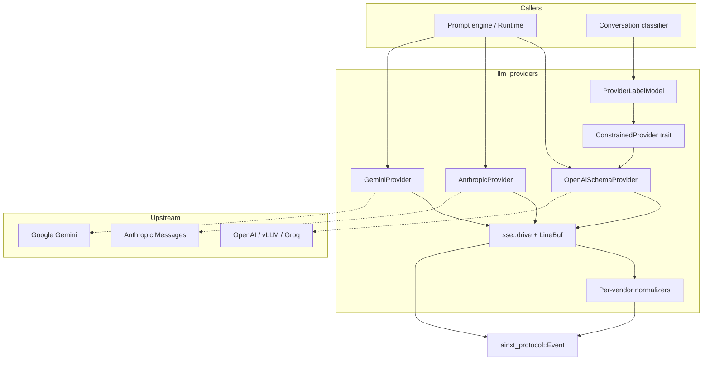

# LLM Providers

The `llm_providers` module (`crates/ainxt-providers`) is the model-agnostic transport layer that connects the rest of the AI engine to external large-language-model endpoints. It exposes a uniform streaming interface over three vendor families — OpenAI-schema servers (OpenAI, vLLM, Groq, local), Anthropic Messages, and Google Gemini — and adds a constrained-decoding adapter used by the conversation intelligence classifier.

## Purpose

* **Vendor neutrality**: Every higher-level feature (prompting, classification, judging, answering) must work irrespective of which model vendor is configured. This crate hides vendor-specific wire formats behind the shared [`Provider`](../pipeline_runtime/runtime_engine.md) trait from `ainxt-runtime` and the shared [`Event`](../core_infrastructure/core_interaction.md) protocol from `ainxt-protocol`.
* **Streaming first**: All adapters produce an async `mpsc::Receiver<Event>` so callers can consume text deltas, usage reports, errors, and completion signals incrementally.
* **Testability without credentials**: The SSE-to-`Event` translation is factored into pure, per-vendor "normalizer" structs that are unit-tested against recorded byte fixtures. The live HTTP driver is a thin wrapper around these normalizers.
* **Capability-aware constrained decoding**: The [`ProviderLabelModel`](llm_providers_label_model.md) bridges the synchronous [`LabelModel`](classification.md) seam used by the Stage-2 intent classifier to a real streaming provider, optionally applying grammar-constrained decoding when the model advertises support.

## Architecture

### Data flow

1. A caller invokes `Provider::stream(prompt)` (or `ConstrainedProvider::stream_constrained`).
2. The provider builds a vendor-specific HTTP request and hands it to [`sse::drive`](llm_providers_sse_transport.md).
3. `drive` streams response bytes through a per-vendor [`SseNormalizer`](llm_providers_sse_transport.md), which emits normalized [`Event`](../core_infrastructure/core_interaction.md) values (`TextDelta`, `Usage`, `Error`, `Done`).
4. `drive` guarantees exactly one terminal `Event::Done`, even if the upstream connection fails or the vendor does not send an explicit terminator.

### Sub-modules

| Sub-module | Files | Responsibility |
|------------|-------|----------------|
| [Vendor adapters](llm_providers_vendor_adapters.md) | `anthropic.rs`, `gemini.rs`, `openai.rs` | Per-vendor request building, wire-type deserialization, and SSE normalization. |
| [SSE transport](llm_providers_sse_transport.md) | `sse.rs` | Shared Server-Sent Events plumbing: line buffering, error shaping, request driving, and the `SseNormalizer` trait. |
| [Label model](llm_providers_label_model.md) | `label_model.rs` | Production adapter that implements `ainxt_classify::LabelModel` over a `ConstrainedProvider`, with optional grammar-constrained decoding. |

## Integration with the wider system

* **Runtime**: The providers implement the `Provider` trait defined in `ainxt-runtime` (see [runtime engine](../pipeline_runtime/runtime_engine.md)). The runtime's `Engine` and `ModelRouter` select a provider based on model ID and data-class eligibility.
* **Protocol**: All events are `ainxt_protocol::Event` values (see [core interaction](../core_infrastructure/core_interaction.md)), giving every consumer a single enum to match against.
* **Configuration**: Model endpoints, API keys, and eligible data classes are loaded from `ainxt-config` (see [security config](../core_infrastructure/security_config.md)) and wired into the providers at startup.
* **Classification**: `ProviderLabelModel` is consumed by `ainxt_convo::ModelIntentClassifier` (see [surface conversation intelligence](../core_infrastructure/surface_conversation_intelligence.md)) to run Stage-2 intent classification on a real model.
* **Telemetry**: `Event::Usage` feeds cost and token accounting in `ainxt-telemetry` (see [core interaction telemetry](../core_infrastructure/core_interaction.md)).

## Key design decisions

* **Pure normalizers**: Each adapter keeps its wire-format parser in a separate, I/O-free normalizer. This makes the parsing logic trivial to test with recorded fixtures and keeps the live path small.
* **Single `Event` vocabulary**: Text, usage, errors, and completion all flow through the same channel type, so callers do not need vendor-specific result types.
* **Bounded stalls**: Every provider configures `connect_timeout` and `read_timeout` on the underlying `reqwest` client. A hung upstream becomes a retryable error instead of an indefinitely parked task.
* **Data-class eligibility**: Each provider instance carries an `eligible: Vec<DataClass>` list. The runtime uses this to enforce ADR-012 routing rules (e.g., cloud vendors are typically restricted from regulated/PII data classes).
* **Constrained decoding cascade**: For grammar-capable models, `ProviderLabelModel` derives a GBNF grammar and JSON schema from the classifier's own constraint line and passes it to the transport. Weak models fall back to the same prompt without a grammar, so the extraction technique varies but the classifier contract stays the same.

## Documentation map

* [Vendor adapters](llm_providers_vendor_adapters.md) — OpenAI-schema, Anthropic, and Gemini providers.
* [SSE transport](llm_providers_sse_transport.md) — Shared streaming request driver and line buffering.
* [Label model](llm_providers_label_model.md) — `LabelModel` adapter with grammar-constrained decoding.
