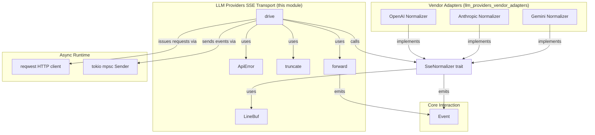
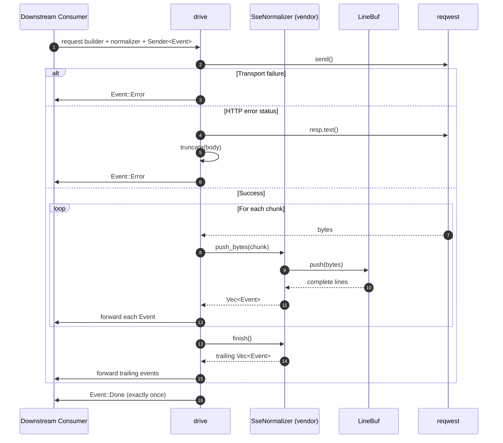
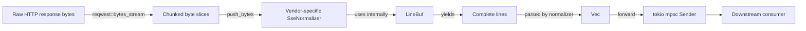
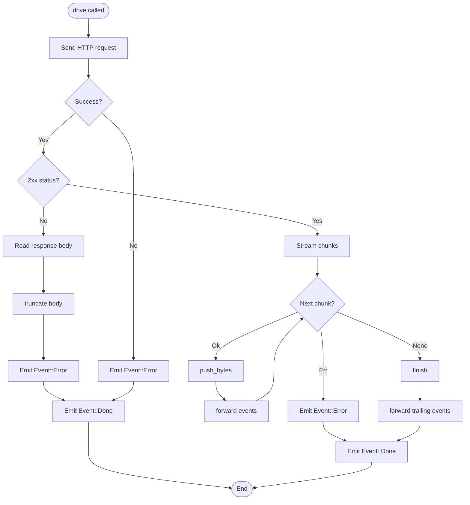
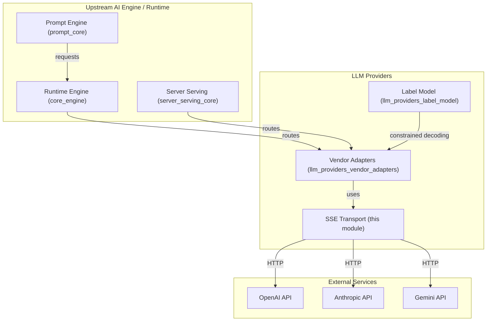

# LLM Providers SSE Transport

## Brief Introduction

The `llm_providers_sse_transport` module provides shared Server-Sent Events (SSE) transport plumbing for the vendor-specific LLM adapters in the `ainxt-providers` crate. It isolates the raw HTTP streaming mechanics from vendor wire-format normalization, enabling each provider adapter (OpenAI, Anthropic, Gemini) to focus purely on translating vendor-specific byte streams into canonical [`Event`](../core_infrastructure/core_interaction.md) objects.

The module is intentionally split into two responsibilities:

1. **Pure normalization** — implemented per vendor via the [`SseNormalizer`](#ssenormalizer) trait, which is fully deterministic and testable against recorded byte fixtures without network access or credentials.
2. **Live HTTP driving** — implemented by the [`drive`](#drive) function, which issues the streaming request, feeds chunks to the normalizer, and forwards normalized events to a Tokio channel while enforcing terminal-event invariants.

This separation makes the vendor adapters easier to unit test, audit, and maintain, because the complex streaming and error-handling logic lives in one place while the vendor-specific parsing logic lives in another.

---

## Core Components

### `SseNormalizer`

`SseNormalizer` is a private trait that defines the contract between the transport layer and a vendor adapter:

```rust
pub(crate) trait SseNormalizer: Send + 'static {
    fn push_bytes(&mut self, bytes: &[u8]) -> Vec<Event>;
    fn finish(&mut self) -> Vec<Event>;
}
```

* `push_bytes` receives the next raw chunk from the HTTP body and returns any complete [`Event`](../core_infrastructure/core_interaction.md) objects that can now be emitted.
* `finish` flushes any trailing, unterminated data when the stream ends.

Implementations must be **pure** (no I/O) so that the same byte sequence always produces the same event sequence. This property is essential for deterministic replay and fixture-based testing. For details on how the core protocol defines the events that flow through this layer, see [`core_interaction`](../core_infrastructure/core_interaction.md).

### `LineBuf`

`LineBuf` is a small, reusable byte accumulator that turns arbitrary HTTP chunk boundaries into complete newline-delimited lines. It is the primary public component exported by this module and is used by vendor normalizers to handle the line-oriented nature of SSE streams.

```rust
#[derive(Default)]
pub(crate) struct LineBuf {
    buf: Vec<u8>,
}
```

Key behaviors:

* Buffers partial lines across chunk boundaries, including boundaries that fall in the middle of a multi-byte UTF-8 character.
* Strips trailing `\r` characters so that both `\n` and `\r\n` line endings are accepted.
* Returns complete lines via `push` and any final unterminated remainder via `take_remainder`.

`LineBuf` is intentionally agnostic to the SSE field semantics (`data:`, `event:`, `id:`, etc.); those details are left to the vendor-specific normalizer.

### `ApiError`

`ApiError` is a shared deserialization helper for vendor error payloads of the shape `{"type": ..., "message": ...}`. Both OpenAI-schema and Anthropic-compatible APIs use this shape, so the type is reused across normalizers.

```rust
pub(crate) struct ApiError {
    pub r#type: Option<String>,
    pub message: Option<String>,
}
```

The `describe` method renders a compact, human-readable string suitable for [`Event::Error`](../core_infrastructure/core_interaction.md).

### `truncate`

A small string utility that truncates on a UTF-8 character boundary and appends an ellipsis (`…`) when clipping. It is used primarily to keep HTTP error bodies readable in telemetry and error events.

### `forward`

An internal helper that sends an [`Event`](../core_infrastructure/core_interaction.md) to the caller's channel and tracks whether the terminal `Event::Done` has already been emitted. It returns `false` when the receiver has been dropped, allowing the driver to stop early and avoid unnecessary work.

### `drive`

`drive` is the live HTTP entry point. It takes a `reqwest::RequestBuilder`, an `SseNormalizer`, and a Tokio `Sender<Event>`, then:

1. Issues the request.
2. On transport failure, emits `Event::Error`.
3. On non-success HTTP status, reads the response body, truncates it, and emits `Event::Error`.
4. On success, streams the response body chunk by chunk, feeding each chunk to the normalizer and forwarding every emitted event.
5. When the stream ends, calls `finish` on the normalizer to flush any trailing events.
6. Guarantees that exactly one terminal `Event::Done` is sent last, regardless of whether the stream ended cleanly, errored, or never produced an explicit terminator.

This invariant simplifies downstream consumers because they can rely on `Event::Done` as a definitive stream-completion signal.

---

## Architecture

The module sits between the raw HTTP client (`reqwest`) and the vendor-specific adapters. It does not know anything about LLM-specific concepts such as tokens, choices, or usage; it only knows how to stream bytes, split lines, and forward normalized protocol events.



### Component Interaction



---

## Data Flow

The data flow through the SSE transport is byte-oriented at the bottom and event-oriented at the top:



1. **Raw bytes** arrive from the network via `reqwest`.
2. **`drive`** reads chunks asynchronously.
3. Each chunk is passed to the vendor normalizer's `push_bytes`.
4. The normalizer uses **`LineBuf`** to reassemble complete lines, even when chunks split lines or UTF-8 characters.
5. The normalizer parses those lines into zero or more canonical **`Event`** objects.
6. **`forward`** sends each event through the channel.
7. When the stream ends, `finish` flushes any buffered remainder, and **`drive`** ensures a final `Event::Done`.

---

## Process Flows

### Normal Streaming Path



### Error Handling

The module converts every failure mode into a predictable sequence of events:

| Failure mode | Emitted events |
|--------------|----------------|
| DNS / connection failure | `Event::Error("request failed: ...")`, `Event::Done` |
| HTTP 4xx/5xx | `Event::Error("http NNN: <truncated body>")`, `Event::Done` |
| Chunk read error | `Event::Error("stream read error: ...")`, `Event::Done` |
| Receiver dropped mid-stream | Streaming stops early; `Event::Done` is still guaranteed if not already sent |

The guarantee of exactly one terminal `Event::Done` means consumers never have to infer stream completion from silence or connection closure.

---

## Dependencies

### Internal Dependencies

| Dependency | Module | Purpose |
|------------|--------|---------|
| `ainxt_protocol::Event` | [`core_interaction`](../core_infrastructure/core_interaction.md) | Canonical event type emitted by the transport. |

### External Dependencies

| Dependency | Purpose |
|------------|---------|
| `reqwest` | Issues the live HTTP request and exposes a byte stream. |
| `tokio::sync::mpsc::Sender` | Channel used to forward events to the downstream consumer. |
| `futures_util::StreamExt` | Async stream iteration over `reqwest` byte chunks. |
| `serde::Deserialize` | Deserializes vendor error payloads into `ApiError`. |

### Dependents

This module is consumed by the vendor adapter implementations in [`llm_providers_vendor_adapters`](llm_providers_vendor_adapters.md):

* `crates/ainxt-providers/src/openai.rs`
* `crates/ainxt-providers/src/anthropic.rs`
* `crates/ainxt-providers/src/gemini.rs`

These adapters implement `SseNormalizer` and call `drive` to execute streaming chat completions. For provider-specific normalization details, refer to the vendor adapters documentation.

---

## How It Fits into the Overall System

The SSE transport is a narrow but critical layer in the `ai_engine` → `llm_providers` subsystem. It enables the higher-level prompt engine, runtime, and serving layers to consume LLM responses as a uniform stream of [`Event`](../core_infrastructure/core_interaction.md) objects, regardless of which vendor is actually serving the model.



By centralizing the streaming transport here, the system gains:

* **Testability** — vendor normalizers can be tested against static byte fixtures.
* **Consistency** — all adapters emit the same event types and obey the same completion invariant.
* **Maintainability** — changes to HTTP handling, retry semantics, or chunk parsing only need to happen in one place.

---

## Design Notes

* **Purity**: `SseNormalizer` implementations must not perform I/O. This is enforced by the trait bounds and by convention; the `drive` function owns all I/O.
* **Chunk boundary tolerance**: `LineBuf` handles arbitrary chunk boundaries, including mid-line and mid-character splits, so the normalizer never needs to reason about TCP framing.
* **Terminal invariant**: `drive` guarantees exactly one `Event::Done`. This is implemented by tracking `done_sent` and emitting a synthetic `Event::Done` if the normalizer or error path did not already do so.
* **Minimal public surface**: Only `LineBuf` is a concrete public component; the rest of the module is crate-private. This keeps the API small and prevents downstream crates from coupling to transport internals.

---

## See Also

* [`llm_providers_vendor_adapters`](llm_providers_vendor_adapters.md) — OpenAI, Anthropic, and Gemini adapter implementations that use this transport.
* [`llm_providers_label_model`](llm_providers_label_model.md) — constrained decoding support that may be combined with vendor adapters.
* [`core_interaction`](../core_infrastructure/core_interaction.md) — defines the `Event` type and the protocol events carried by this transport.
* [`prompt_core`](prompt_core.md) — the prompt engineering layer that produces requests consumed by the providers.
* [`core_engine`](../pipeline_runtime/core_engine.md) — the runtime engine that routes turns to the appropriate provider.
