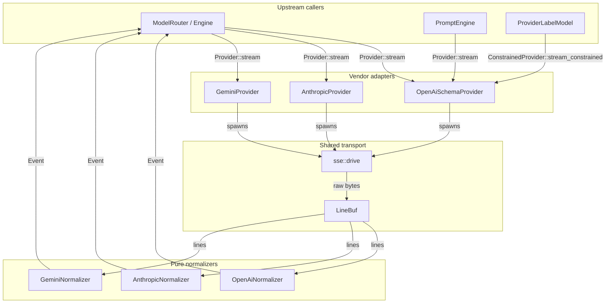
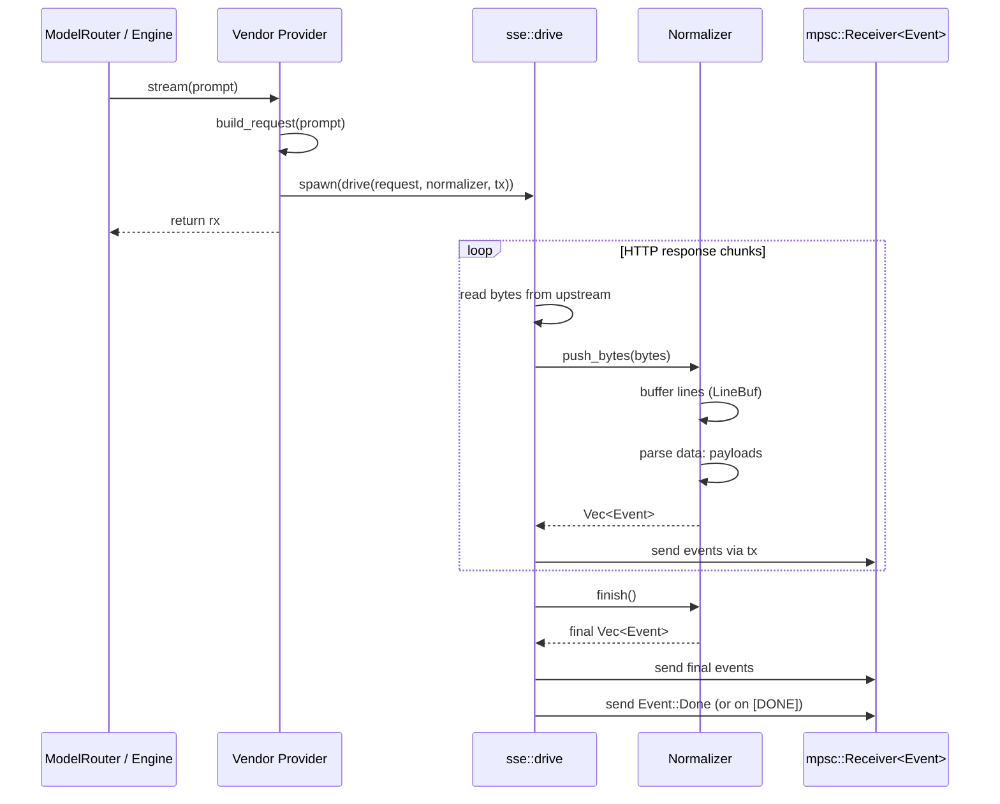
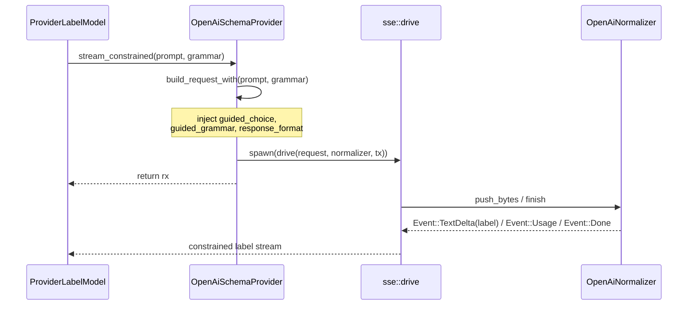
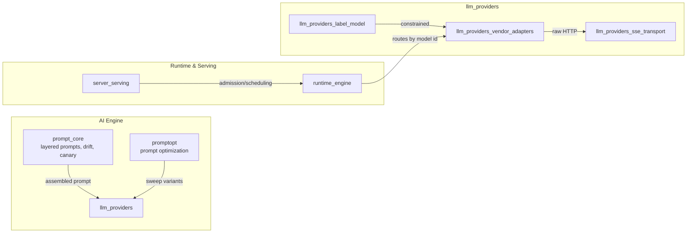
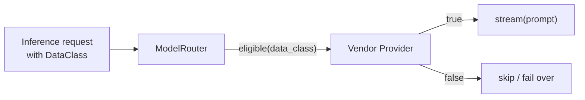

# LLM Provider Vendor Adapters

The `llm_providers_vendor_adapters` module provides vendor-specific HTTP/SSE adapters that normalize streaming responses from third-party large language model (LLM) endpoints into the system-wide [`Event`](../core_infrastructure/core_interaction.md) protocol. It is the outermost edge of the [LLM providers](llm_providers.md) layer and implements the multi-model policy: every runtime feature must work irrespective of whether the underlying model is served by an OpenAI-schema endpoint, Anthropic, or Google Gemini.

Each adapter is a thin, stateless wrapper around an HTTP client. The actual Server-Sent Events (SSE) parsing and vendor-wire translation is factored into pure, testable **normalizer** components that consume raw bytes and emit generic events. This split keeps network I/O separate from business logic and allows the unit tests to run entirely from recorded fixture bytes.

---

## Purpose and Core Functionality

The module's responsibilities are:

1. **Vendor protocol encapsulation** — Hide the request/response details of OpenAI-compatible, Anthropic Messages, and Google Gemini streaming APIs.
2. **Unified streaming interface** — Expose a single `Provider` implementation that returns `mpsc::Receiver<Event>` so upstream callers (router, prompt engine, runtime) do not need vendor-specific code.
3. **Data-class eligibility** — Declare which [data classifications](../core_infrastructure/security_config.md) each endpoint is allowed to serve, enforced by the router.
4. **Constrained decoding support** — The OpenAI-schema adapter optionally accepts a label grammar for classification tasks, emitting the appropriate `guided_choice`, `guided_grammar`, and `response_format` knobs.
5. **Resilience** — Bound stalled upstream connections with connect/read timeouts so a hung stream becomes a retryable error rather than an indefinitely parked task.

The module does **not** handle routing, retries, load balancing, caching, or model selection. Those concerns live in the [runtime engine](../pipeline_runtime/runtime_engine.md), [serving infrastructure](../pipeline_runtime/server_serving.md), and [prompt core](prompt_core.md) modules.

---

## Architecture



### Design principles

- **Adapter/Normalizer split**: The provider structs own the HTTP client and request construction; the normalizers are pure SSE→`Event` translators. Normalizers have no `async` code, no network dependencies, and no API keys.
- **Shared SSE driver**: All three adapters reuse [`crate::sse::drive`](llm_providers_sse_transport.md) to read the HTTP response body, buffer partial lines, and dispatch complete SSE lines to the normalizer.
- **Model-as-identity**: Each provider's `Provider::id` returns the configured model name. This lets the [runtime engine](../pipeline_runtime/runtime_engine.md) route by model without maintaining a separate alias table.
- **Data-class gating**: `eligible` is configured at construction time and checked by the router before a prompt is dispatched.

---

## Component Relationships

### `OpenAiSchemaProvider`

Covers any endpoint that speaks the OpenAI `/chat/completions` streaming schema, including OpenAI itself, vLLM, Groq, and local inference servers.

- Implements `Provider` for ordinary streaming chat completion.
- Implements `ConstrainedProvider` (defined in the [label model](llm_providers_label_model.md) submodule) for classification-style constrained decoding.
- Request body always sets `stream: true` and `stream_options.include_usage: true` so the final usage-only chunk is emitted.
- When a `LabelGrammar` is supplied, the request is augmented with:
  - `guided_choice` — vLLM exact-string constraint.
  - `guided_grammar` — GBNF grammar for llama.cpp-style servers.
  - `response_format` with JSON schema — OpenAI-compatible structured output.

### `AnthropicProvider`

Adapter for the Anthropic Messages API (`/v1/messages`).

- Always sends `stream: true`, a frozen `max_tokens: 4096` default, and the `anthropic-version: 2023-06-01` header.
- Usage is split across events: `input_tokens` arrives on `message_start`, cumulative `output_tokens` on `message_delta`. The normalizer carries the input count forward and emits a single combined `Event::Usage` when the delta lands.
- Error events use Anthropic's `{type, message}` error shape.

### `GeminiProvider`

Adapter for Google Gemini `:streamGenerateContent`.

- Requests `?alt=sse` so the shared SSE line buffer can be reused (the default streamed JSON array format is not used).
- Sends the API key in the `x-goog-api-key` header rather than the URL query string.
- Usage is cumulative in `usageMetadata`; the normalizer emits it **once**, gated on the terminal chunk that carries a `finishReason`.
- Gemini sends **no `[DONE]` sentinel**; the terminal `Event::Done` is supplied by the shared SSE driver when the HTTP stream ends.

### Normalizers

| Normalizer | Key wire peculiarity handled |
|------------|------------------------------|
| `OpenAiNormalizer` | `[DONE]` sentinel; usage-only trailer chunk; `{type, message}` errors. |
| `AnthropicNormalizer` | Carries `input_tokens` from `message_start` to `message_delta`; ignores `ping` and block-start/stop events. |
| `GeminiNormalizer` | Emits usage only on the terminal `finishReason` chunk; `{code, message, status}` errors. |

All normalizers implement the `SseNormalizer` trait:

```rust
fn push_bytes(&mut self, bytes: &[u8]) -> Vec<Event>;
fn finish(&mut self) -> Vec<Event>;
```

This interface is consumed by [`crate::sse::drive`](llm_providers_sse_transport.md).

---

## Data Flow

### Ordinary streaming completion



### Constrained classification (OpenAI-schema only)



---

## Dependencies

### Internal dependencies

| Dependency | Module | Role |
|------------|--------|------|
| `ainxt_protocol::Event` | [core_interaction](../core_infrastructure/core_interaction.md) | Canonical streaming event enum (`TextDelta`, `Usage`, `Done`, `Error`). |
| `ainxt_runtime::provider::Provider` | [runtime_engine](../pipeline_runtime/runtime_engine.md) | Trait that all adapters implement. |
| `ainxt_types::DataClass` | [security_config](../core_infrastructure/security_config.md) | Data classification used for eligibility checks. |
| `crate::sse::{drive, LineBuf, SseNormalizer}` | [llm_providers_sse_transport](llm_providers_sse_transport.md) | Shared SSE framing and HTTP driver. |
| `crate::label_model::{ConstrainedProvider, LabelGrammar}` | [llm_providers_label_model](llm_providers_label_model.md) | Constrained decoding contract for classification. |

### External dependencies

- `reqwest` — HTTP client with connect/read timeout configuration.
- `serde` / `serde_json` — Request body construction and response deserialization.
- `tokio::sync::mpsc` — Channel returned to callers.

---

## How It Fits into the System

The vendor adapters sit at the bottom of the [prompt engineering](prompt_engineering.md) stack, just above the network boundary:



Upstream callers such as the [runtime engine](../pipeline_runtime/runtime_engine.md)'s `ModelRouter` hold a collection of `Provider` trait objects. When a turn is ready for inference, the router selects an eligible provider (based on model id and data class), calls `stream(prompt)`, and consumes the resulting `Event` stream. The prompt engine and prompt optimizer produce the prompt text; they do not interact with vendor specifics.

The [label model](llm_providers_label_model.md) submodule uses the OpenAI-schema adapter's `ConstrainedProvider` implementation to obtain deterministic label outputs for classification tasks.

---

## Process Flows

### Adding a new vendor adapter

1. Define wire types (request/response JSON structs) in a new file under `crates/ainxt-providers/src/`.
2. Implement a pure `SseNormalizer` that converts vendor SSE payloads into `Event`.
3. Implement `Provider` for a new provider struct, configuring timeouts, request construction, and data-class eligibility.
4. If the vendor supports constrained decoding, optionally implement `ConstrainedProvider`.
5. Add fixture-based unit tests covering full streams, byte-by-byte reassembly, error payloads, malformed JSON, and usage semantics.
6. Add an optional live smoke test gated on environment variables.

### Eligibility enforcement



The adapter only declares eligibility; the router enforces it. This prevents regulated or PII data from being sent to endpoints that are not authorized for that classification.

---

## Testing Strategy

Every adapter follows the same testing pattern:

- **Fixture tests**: Recorded SSE byte streams exercise the normalizer without network access or credentials. Tests verify:
  - Full stream parsing.
  - Byte-by-byte reassembly through `LineBuf`.
  - Multibyte UTF-8 survival across chunk boundaries.
  - Error payload mapping.
  - Malformed JSON handling.
  - Usage semantics (e.g., Anthropic input-token carry-forward, Gemini terminal-chunk gating).
- **Live smoke tests**: Optional `#[ignore]` async tests that hit real endpoints when environment variables (`AX_OPENAI_BASE_URL`, `AX_ANTHROPIC_BASE_URL`, `AX_GEMINI_API_KEY`, etc.) are set. They assert the stream reaches `Event::Done` and produces at least one `Event::TextDelta`.

This design makes the module safe to run in CI while still allowing quick validation against live vendors during development.

---

## Related Documentation

- [llm_providers](llm_providers.md) — Parent module overview.
- [llm_providers_sse_transport](llm_providers_sse_transport.md) — Shared SSE framing and HTTP driver.
- [llm_providers_label_model](llm_providers_label_model.md) — Constrained decoding and label classification.
- [prompt_core](prompt_core.md) — Prompt assembly, drift monitoring, and canary releases.
- [prompt_optimization](prompt_optimization.md) — Prompt variant sweeps and budgeted optimization.
- [runtime_engine](../pipeline_runtime/runtime_engine.md) — Model routing, inference execution, and data-class enforcement.
- [core_interaction](../core_infrastructure/core_interaction.md) — `Event` protocol and turn lifecycle.
- [security_config](../core_infrastructure/security_config.md) — `DataClass` and eligibility policies.
