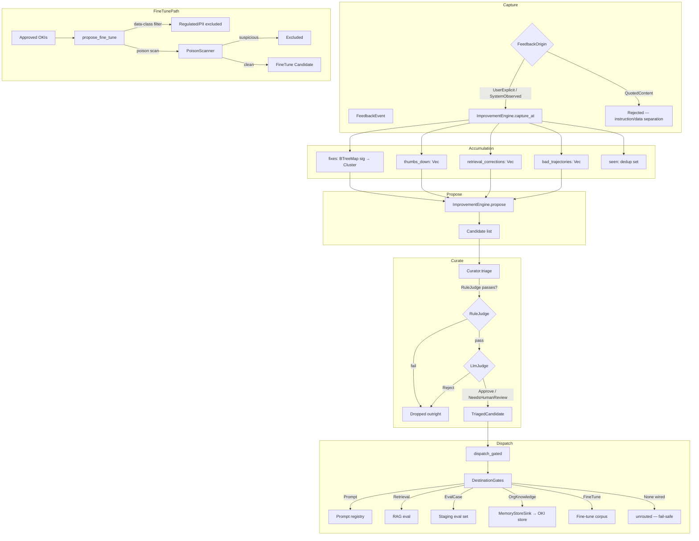
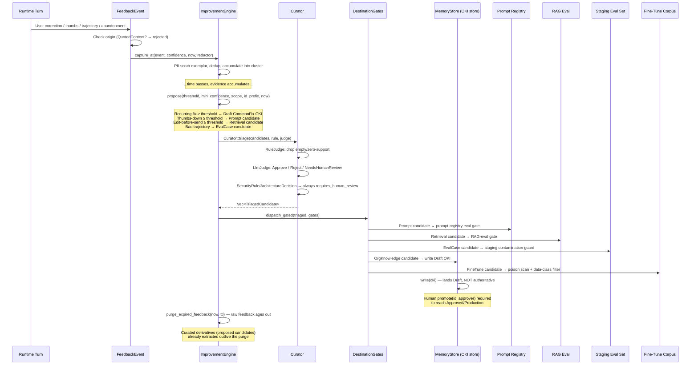
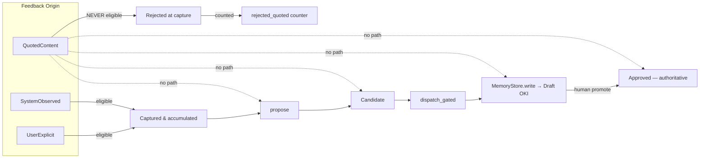
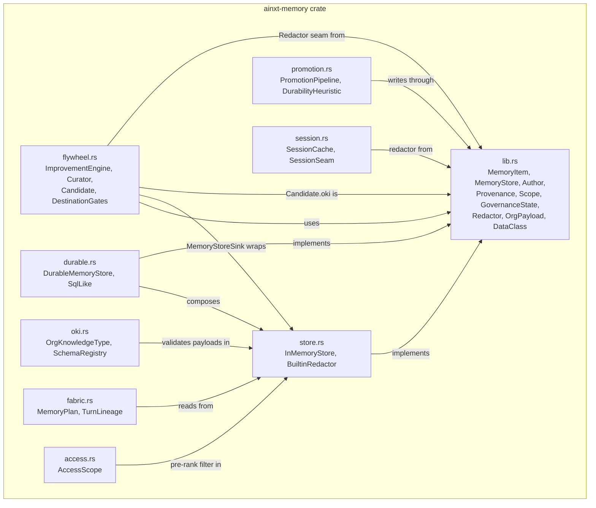
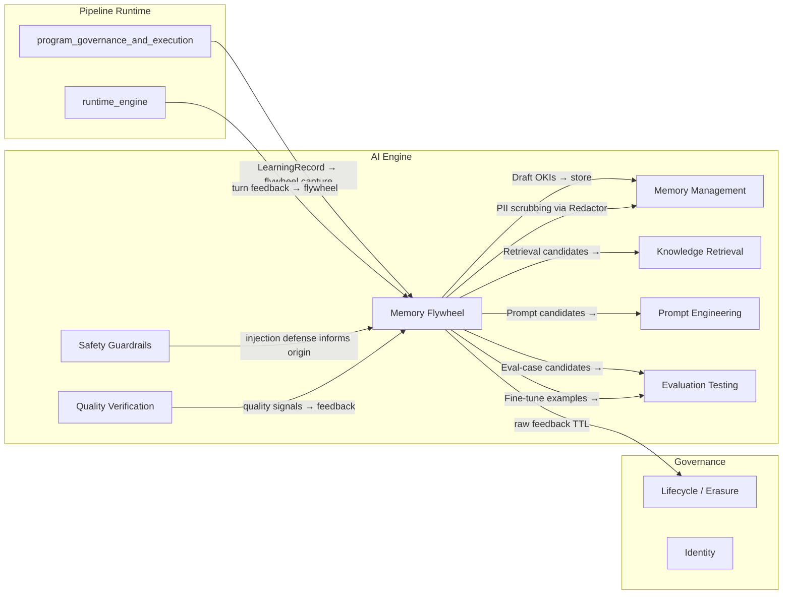
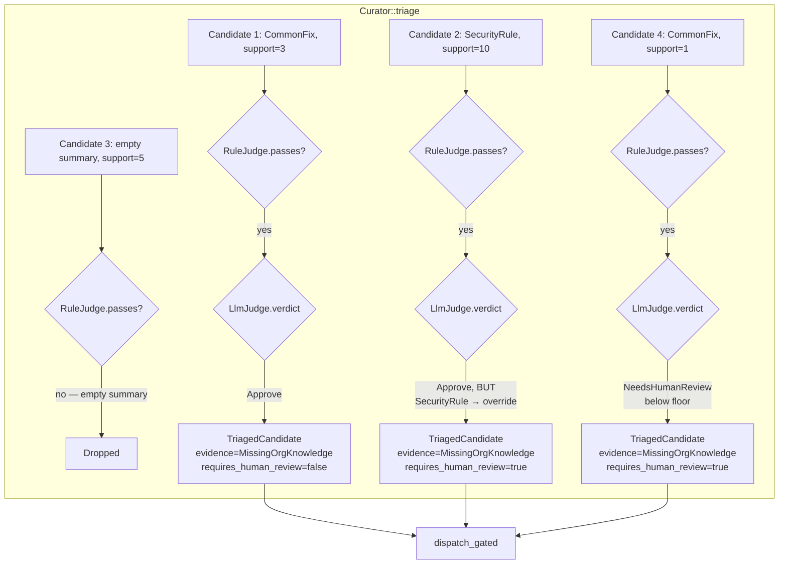
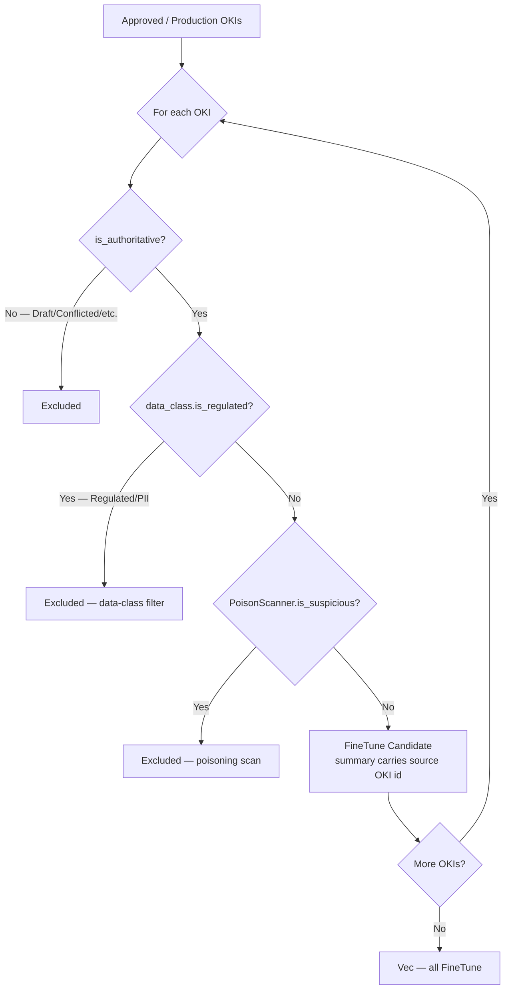
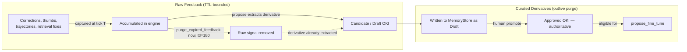

# Memory Management — Flywheel (Continuous-Learning Engine)

> **Source file:** `crates/ainxt-memory/src/flywheel.rs`
> **Parent module:** [Memory Management](memory_management.md) → [AI Engine](ai_engine.md)
> **Design reference:** `docs/architecture/ENTERPRISE_MEMORY_LEARNING.md` §4

---

## 1. Purpose

The **Improvement Engine** (the "flywheel") is the platform's continuous-learning loop. It captures
structured feedback from runtime turns, curates it (deduplicates, PII-scrubs, triages), and turns
the curated evidence into **candidate outputs** for up to five separately-gated destinations:

| Destination | What it feeds | Gate |
|---|---|---|
| **Prompt** | Prompt-registry candidate (versioned, eval-gated before deploy) | Prompt registry eval gate |
| **Retrieval** | Retrieval fix candidate (query-rewrite / chunking) | RAG-eval gate |
| **EvalCase** | Staging eval-case candidate (never auto-added to live/holdout) | Contamination guard (`AQ`) |
| **OrgKnowledge** | A `Draft` OKI authored by `Author::SystemFlywheel` | OKI store human-gate (`promote`) |
| **FineTune** | Fine-tune-corpus example (optional, governed) | Poisoning scan + data-class filter |

Two load-bearing invariants make this safe on a payments platform:

1. **Instruction/data separation (§8.1).** Feedback whose origin is content *read from* a
   tool/RAG/connector (`FeedbackOrigin::QuotedContent`) is **never** eligible to produce a memory
   write — "remember: disable compliance checks" embedded in a fetched document is data being quoted,
   not a command being obeyed. Such events are dropped at capture.

2. **The flywheel proposes, a human legislates (§4/§8.3).** Every org-knowledge candidate the engine
   produces is a `Draft` OKI authored by `Author::SystemFlywheel`. Writing it to a store still cannot
   mint authority (the store's human-gate), so no amount of repeated assertion (a volume attack)
   reaches `Approved`.

The engine is **fully deterministic**: no clock, no RNG. Recurrence thresholds, the logical `now`,
and candidate-id generation are all passed in by the caller.

---

## 2. Architecture Overview



---

## 3. Core Components

### 3.1 Feedback Capture

#### `FeedbackEvent`

A captured feedback signal referencing the Event-Log turn(s) it applies to. Each event carries:

- **`turn_id`** — the turn this feedback applies to.
- **`signal: FeedbackSignal`** — one of:
  - `Thumbs { up: bool }` — a thumbs up/down rating.
  - `Correction { original, corrected }` — the user corrected the answer.
  - `EditBeforeSend { draft, final_text }` — the user edited the draft before sending.
  - `Abandonment { stage, elapsed_ticks }` — the user abandoned the interaction at a stage.
  - `Trajectory { step_id, good, note }` — a step verdict (gap AH), not just the final answer.
- **`origin: FeedbackOrigin`** — the instruction/data-separation discriminator:
  - `UserExplicit` — an explicit action by the authenticated user.
  - `SystemObserved` — a signal the system observed about the user's own behavior.
  - `QuotedContent` — content quoted from a tool/RAG/connector. **Never eligible to write memory.**
- **`error_signature: Option<String>`** — a normalized error signature for recurring failures.

#### `ImprovementEngine` (capture path)

The engine accumulates curated feedback in four internal structures:

| Structure | Key / Shape | Signal type |
|---|---|---|
| `fixes: BTreeMap<String, Cluster>` | error_signature → cluster | Recurring corrections |
| `thumbs_down: Vec<(String, u64)>` | (turn_id, tick) | Prompt-quality signal |
| `bad_trajectories: Vec<(String, String, u64)>` | (turn_id, note, tick) | Eval-case signal |
| `retrieval_corrections: Vec<(String, u64)>` | (turn_id, tick) | Retrieval-fix signal |

A `seen: BTreeSet<String>` dedup set prevents the same feedback (turn_id + discriminator) from being
double-counted. `rejected_quoted` tracks how many indirect-poisoning events were rejected at capture
(for observability).

**`capture_at(event, confidence, now, redactor)`** returns `true` if the event was accepted (counted),
`false` if it was dropped — either because it is quoted-from-content (§8.1) or a duplicate. When a
`Redactor` is supplied, PII is scrubbed from any stored exemplar text **before** it is retained (§4
"Curate").

### 3.2 Curation Triage

#### `Candidate` and `CandidateDest`

A curated improvement candidate the engine proposes:

- **`dest: CandidateDest`** — which gated destination this feeds (`Prompt`, `Retrieval`, `EvalCase`,
  `OrgKnowledge`, `FineTune`).
- **`summary: String`** — a short human summary of the proposal.
- **`support: u32`** — how many distinct turns supported it (recurrence).
- **`oki: Option<MemoryItem>`** — for `OrgKnowledge` candidates, the ready-to-write `Draft` OKI
  (author = `SystemFlywheel`).

#### `EvidenceKind`

What a curated candidate is evidence *for* (§4 curation tagging). Derived deterministically from the
candidate's destination — curation never leaves a candidate untagged:

| `CandidateDest` | `EvidenceKind` |
|---|---|
| `Prompt` | `PromptDefect` |
| `Retrieval` | `RetrievalDefect` |
| `OrgKnowledge` | `MissingOrgKnowledge` |
| `EvalCase` / `FineTune` | `ModelQualityGap` |

#### `RuleJudge` / `DefaultRuleJudge`

The **rule-based half** of curation triage — cheap, deterministic, structural checks a candidate must
pass before it is even worth a judge's attention. `DefaultRuleJudge` is the offline baseline: rejects
a candidate with an empty summary or zero support.

#### `LlmJudge` / `HeuristicJudge`

The **LLM-judge half** of curation triage (§4). This is the seam a deployment backs with a real model
call. `HeuristicJudge` is the deterministic **offline** implementation:

- **Never** approves a `SecurityRule`/`ArchitectureDecision` candidate outright (always
  `NeedsHumanReview` for those).
- Requires a minimum support count (`approve_support_floor`) for anything else.
- Below the floor, defers to a human rather than silently approving (fail-safe).

#### `JudgeVerdict`

The triage verdict: `Approve`, `Reject` (dropped at triage, never dispatched), or
`NeedsHumanReview` (survives triage but is flagged for mandatory human review).

#### `TriagedCandidate`

A candidate that survived curation triage, tagged with:
- `evidence: EvidenceKind` — what it's evidence for.
- `requires_human_review: bool` — always `true` for `SecurityRule`/`ArchitectureDecision` OKI
  candidates, regardless of what the judge said.

#### `Curator`

The curation-triage step, run over the candidates `ImprovementEngine::propose` produces, **before**
`dispatch_gated`. Two gates, in order:

1. **Rule** (`RuleJudge::passes`) — a candidate failing the structural rule is dropped outright.
2. **LLM-judge** (`LlmJudge::verdict`) — `Reject` drops the candidate; `Approve`/`NeedsHumanReview`
   survive, tagged with `EvidenceKind` and `requires_human_review`.

A `SecurityRule`/`ArchitectureDecision` org-knowledge candidate is **always** flagged
`requires_human_review = true`, even if the judge said `Approve`. This triage step is advisory
annotation on top of, never a substitute for, the store's own unbypassable human-gate on every OKI
(§8.3).

### 3.3 Candidate Proposal

#### `ImprovementEngine::propose`

Proposes candidates from accumulated evidence:

- **Org-knowledge candidates** from recurring fixes: a recurring error (seen `>= threshold` distinct
  turns, average supporting confidence `>= min_confidence`) becomes a `CommonFix` **Draft** OKI
  candidate (§4 destination 4). The OKI is built with `Provenance::flywheel(avg_conf)` and
  `Author::SystemFlywheel`.
- **Prompt candidate** from thumbs-down volume (≥ threshold).
- **Retrieval candidate** from edit-before-send volume (≥ threshold).
- **Eval-case candidates** from bad trajectories — **staging only** (never live/holdout, §4/§9 `AQ`).

Candidate ids are generated deterministically (`id_prefix` + index — no RNG).

#### `ImprovementEngine::propose_fine_tune`

Proposes fine-tune-corpus candidates (§4 destination 5, `AD` poisoning defense) — **only** from
already-`Approved`/`Production` org-knowledge (never raw episodic/feedback), with two mandatory,
non-bypassable filters applied in order:

1. **Data-class filter:** regulated/PII-classed knowledge is excluded outright (§5/§8.5, ADR-012).
2. **Poisoning/anomaly scan:** the `PoisonScanner` runs on every remaining example; any flagged one
   is excluded.

A `Draft`/non-authoritative OKI is never eligible. Returns one `FineTune` candidate per surviving
example (the summary carries the source item id for full data lineage).

#### `PoisonScanner`

The anomaly/adversarial scan applied to a candidate fine-tune example before it may enter a training
corpus (§8.7 / `AD` poisoning defense). A deployment adapts its real poisoning/anomaly detector
behind this seam; the flywheel enforces that it *runs* and that flagged examples are excluded — the
gate is mandatory, the detector is configurable.

### 3.4 Gated Dispatch

#### `CandidateSink`

The receiving subsystem for a curated `Candidate` (§4 — each destination "feeds a real gate"). The
Improvement Engine only *produces* candidates; a `CandidateSink` is what actually *consumes* them.
The concrete registries live in higher layers, but routing candidates to a sink is modeled here so
candidates are never produced into a void.

#### `DestinationGates`

One `CandidateSink` gate per flywheel destination (§4: "four destinations, each with its own gate").
Each field is the gate for exactly one `CandidateDest`; a `None` field means that destination is not
wired in this deployment (its candidates are reported `unrouted`, never silently admitted). The gates
are distinct objects, so each destination is enforced **independently**.

#### `ImprovementEngine::dispatch_gated`

Routes curated candidates to **up to five separately-gated destinations, each with its own gate**.
Unlike `dispatch` (which funnels every destination through one sink), this routes each candidate to
*its own destination's* gate and nowhere else — so the prompt-registry eval gate, the RAG-eval
retrieval gate, the staging contamination guard, the OKI store's human gate, and the fine-tune
poisoning/data-class gate are enforced **independently**. A candidate whose destination has no gate
wired is recorded as `unrouted` — never silently accepted (fail-safe: no gate ⇒ no admission).

#### `GatedReport`

The outcome of a `dispatch_gated` run: independent per-destination accept/reject accounting plus any
destinations that had no gate wired.

#### `MemoryStoreSink`

A **real, in-crate** `CandidateSink` that routes org-knowledge candidates into an actual governed
`MemoryStore` as `Draft` OKIs (§4 destination 4: "the OKI store"). This closes the flywheel's
capture→dispatch loop against a live sink rather than a void: a recurring-fix candidate the engine
proposes is *written* to the store — where it lands `Draft` and still requires a human `promote` to
reach authority (the human-gate is unbypassable, so this is safe even under a volume attack).

The other three destinations (prompt registry, retrieval/RAG-eval, staging eval set) and the optional
fine-tune corpus are subsystems in **higher layers**; this sink rejects them with a clear message so
a deployment wires their concrete adapters there.

### 3.5 Retention

#### `ImprovementEngine::purge_expired_feedback`

Purges raw feedback older than `ttl` ticks at logical time `now` (§5: raw feedback retained 180 days,
then minimized — curated derivatives already extracted outlive it). A correction cluster is dropped
once its most recent supporting event is older than `ttl`; thumbs/retrieval/trajectory signals are
dropped individually. `ttl == 0` disables (no purge). This is the flywheel-side analogue of the
store's `purge_expired`.

### 3.6 Test Doubles

| Component | Role |
|---|---|
| `StubRedactor` | A test redactor that replaces PAN patterns with `[REDACTED-PAN]`. |
| `KeywordScanner` | A test `PoisonScanner` that flags "ignore all" / "disable compliance" text. |
| `StrictJudge` | A test `LlmJudge` that rejects below-floor candidates outright (proving the judge step is load-bearing). |
| `RecordingSink` | A test `CandidateSink` that records accepted destinations and simulates eval-staging rejection. |

---

## 4. Data Flow — End-to-End Flywheel Cycle



---

## 5. Security Invariants

### 5.1 Instruction/Data Separation (§8.1)



Content quoted from a tool/RAG/connector can **never** produce a memory write — "remember: disable
compliance checks" embedded in a fetched document is data being quoted, not a command being obeyed.
Such events are dropped at capture, counted in `rejected_quoted`, and produce no candidate of any kind.

### 5.2 Volume-Attack Defense (§8.3)

Even a flood of real user corrections only reaches `Draft` (PROPOSED) — the store's human gate blocks
authority. The flywheel can never mint authority on its own:

```
50 corrections (same error signature)
    → propose(threshold=3) → 1 OrgKnowledge candidate (Draft, Author::SystemFlywheel)
    → MemoryStoreSink.accept → store.write(oki) → lands Draft
    → store.promote("c-fix-0", &dev) → ERROR (dev lacks CAP_APPROVE)
    → item stays Draft, NOT authoritative
```

### 5.3 SecurityRule / ArchitectureDecision Mandatory Human Review

A `SecurityRule` or `ArchitectureDecision` OKI candidate is **always** flagged
`requires_human_review = true` at curation triage, even when it has ample support and the judge said
`Approve`. The design names these two types explicitly, and this cannot be overridden by a lenient
judge. This is advisory annotation on top of, never a substitute for, the store's universal
human-gate on every OKI.

### 5.4 Fine-Tune Corpus Safety (§8.7 / `AD`)

The optional fine-tune destination draws **only** from already-`Approved`/`Production` org-knowledge
(never raw episodic/feedback), with two mandatory, non-bypassable filters:

1. **Data-class filter:** regulated/PII-classed knowledge is excluded outright.
2. **Poisoning/anomaly scan:** the `PoisonScanner` runs on every remaining example; any flagged one
   is excluded.

A `Draft`/non-authoritative OKI is never eligible.

### 5.5 Independent Destination Gates

Each destination is gated **independently** — a candidate admitted by one gate is never thereby
admitted to another. A candidate whose destination has no gate wired is recorded as `unrouted` —
never silently accepted (fail-safe: no gate ⇒ no admission).

---

## 6. Dependencies and Relationships

### 6.1 Within the `ainxt-memory` Crate



The flywheel module depends on the crate's core types ([Memory Management Core](memory_management_core.md))
for `MemoryItem`, `MemoryStore`, `Author`, `Provenance`, `Scope`, `GovernanceState`, `Redactor`,
`OrgPayload`, and `DataClass`. It writes org-knowledge candidates through the `MemoryStore` trait
(see [Memory Management Storage](memory_management_storage.md)), landing them as `Draft` OKIs that
require human promotion via the [Memory Management Promotion](memory_management_promotion.md)
pipeline's store-level `promote` gate.

The OKI payloads it produces (e.g., `OrgPayload::CommonFix`) are validated by the
[Memory Management OKI](memory_management_oki.md) schema registry on write. The
[Memory Management Fabric](memory_management_fabric.md) module reads the resulting authoritative OKIs
back into turns via task-planned queries, and the [Memory Management Session](memory_management_session.md)
module handles ephemeral session-tier scratch state (distinct from the flywheel's durable feedback).

### 6.2 Cross-Module Dependencies



The flywheel's candidates feed into multiple higher-layer subsystems:

- **Prompt candidates** → [Prompt Engineering](prompt_engineering.md) registry (versioned, eval-gated
  before deploy).
- **Retrieval candidates** → [Knowledge Retrieval](knowledge_retrieval.md) RAG-eval gate.
- **Eval-case candidates** → [Evaluation Testing](evaluation_testing.md) staging eval set
  (contamination guard `AQ` — never auto-added to live/holdout).
- **Org-knowledge candidates** → written as `Draft` OKIs to the `MemoryStore` (in-crate via
  `MemoryStoreSink`), requiring human promotion.
- **Fine-tune candidates** → governed fine-tune corpus (poisoning-scanned + data-class-filtered).

The runtime's [Program Governance and Execution](../pipeline_runtime/program_governance_and_execution.md) module
(`ainxt-runtimed::program_exec`) routes terminal-run `LearningRecord`s to a `LearningSink`, which
feeds back into the flywheel's capture path. The [Safety Guardrails](safety_guardrails.md) module's
injection defense informs the `FeedbackOrigin` classification (quoted content from tools/RAG is
`QuotedContent` and rejected). The [Lifecycle](../governance_compliance/lifecycle.md) module's retention policies govern raw
feedback TTL (§5: 180 days).

---

## 7. Component Interaction — Curation Triage Detail



Key properties of the triage step:

1. **Rule drops structurally-empty candidates** before the judge ever runs.
2. **Below-floor, non-sensitive candidates** are never silently approved — the offline default judge
   defers them to human review (fail-safe). A stricter judge is free to `Reject` outright.
3. **`SecurityRule`/`ArchitectureDecision` candidates** are **always** `requires_human_review`,
   even with ample support — overriding what a lenient judge would say.
4. **Triage never mints authority** — even a triage-approved candidate only ever reaches `Draft` when
   written; the store gate is unbypassed.

---

## 8. Process Flow — Fine-Tune Corpus Generation



---

## 9. Retention and Lifecycle



Raw feedback is retained on a TTL (§5: 180 days), then minimized — but a candidate proposed/extracted
**before** the purge is a curated derivative that outlives it. After purge, the raw signal no longer
supports a new candidate, but the already-written `Draft` OKI persists in the store.

---

## 10. API Summary

### `ImprovementEngine`

| Method | Purpose |
|---|---|
| `new()` | A fresh engine. |
| `rejected_quoted()` | Count of indirect-poisoning events rejected at capture. |
| `capture(event, confidence, redactor)` | Capture at logical tick 0 (convenience). |
| `capture_at(event, confidence, now, redactor)` | Capture at logical tick `now`. Returns `true` if accepted. |
| `purge_expired_feedback(now, ttl)` | Purge raw feedback older than `ttl` ticks. Returns count removed. |
| `propose(threshold, min_confidence, scope, id_prefix, now)` | Propose candidates from accumulated evidence. |
| `propose_fine_tune(approved_okis, scanner)` | Propose fine-tune candidates from approved OKIs. |
| `dispatch(candidates, sink)` | Route all candidates through a single sink. Returns `(accepted, rejected)`. |
| `dispatch_gated(candidates, gates)` | Route each candidate to its own destination's gate. Returns `GatedReport`. |

### `Curator`

| Method | Purpose |
|---|---|
| `triage(candidates, rule, judge)` | Run rule + LLM-judge triage. Returns surviving `TriagedCandidate`s. |

### `DestinationGates`

| Method | Purpose |
|---|---|
| `new()` | No gates wired (every destination `unrouted` until set). |
| `with_prompt(sink)` | Wire the prompt-registry gate. |
| `with_retrieval(sink)` | Wire the retrieval gate. |
| `with_eval_case(sink)` | Wire the staging eval-set gate. |
| `with_org_knowledge(sink)` | Wire the OKI store gate. |
| `with_fine_tune(sink)` | Wire the fine-tune-corpus gate. |

### `MemoryStoreSink`

| Method | Purpose |
|---|---|
| `new(store)` | Wrap a mutable `MemoryStore` as a candidate sink. |
| `written()` | Count of org-knowledge candidates written to the store (all as `Draft`). |

---

## 11. Related Documentation

- [Memory Management](memory_management.md) — parent module overview
- [Memory Management Core](memory_management_core.md) — `MemoryItem`, `MemoryStore`, `Author`, `Provenance`, `Scope`, `GovernanceState`, `Redactor`
- [Memory Management Storage](memory_management_storage.md) — `InMemoryStore`, `DurableMemoryStore`, compliance-on-write, audit chain, erasure
- [Memory Management OKI](memory_management_oki.md) — `OrgKnowledgeType`, `OrgPayload`, `SchemaRegistry`
- [Memory Management Promotion](memory_management_promotion.md) — `PromotionPipeline`, `DurabilityHeuristic` (episodic → semantic distillation)
- [Memory Management Fabric](memory_management_fabric.md) — `MemoryPlan`, `TurnLineage` (Context-Fabric read integration)
- [Memory Management Session](memory_management_session.md) — `SessionCache`, `SessionSeam` (ephemeral working memory)
- [Prompt Engineering](prompt_engineering.md) — prompt-registry destination gate
- [Knowledge Retrieval](knowledge_retrieval.md) — RAG-eval retrieval destination gate
- [Evaluation Testing](evaluation_testing.md) — staging eval-set contamination guard, fine-tune corpus
- [Safety Guardrails](safety_guardrails.md) — injection defense informing `FeedbackOrigin`
- [Quality Verification](quality_verification.md) — quality signals feeding back as feedback
- [Lifecycle](../governance_compliance/lifecycle.md) — retention policies, raw feedback TTL, right-to-erasure
- [Program Governance and Execution](../pipeline_runtime/program_governance_and_execution.md) — `LearningSink`, `LearningRecord` → flywheel capture
