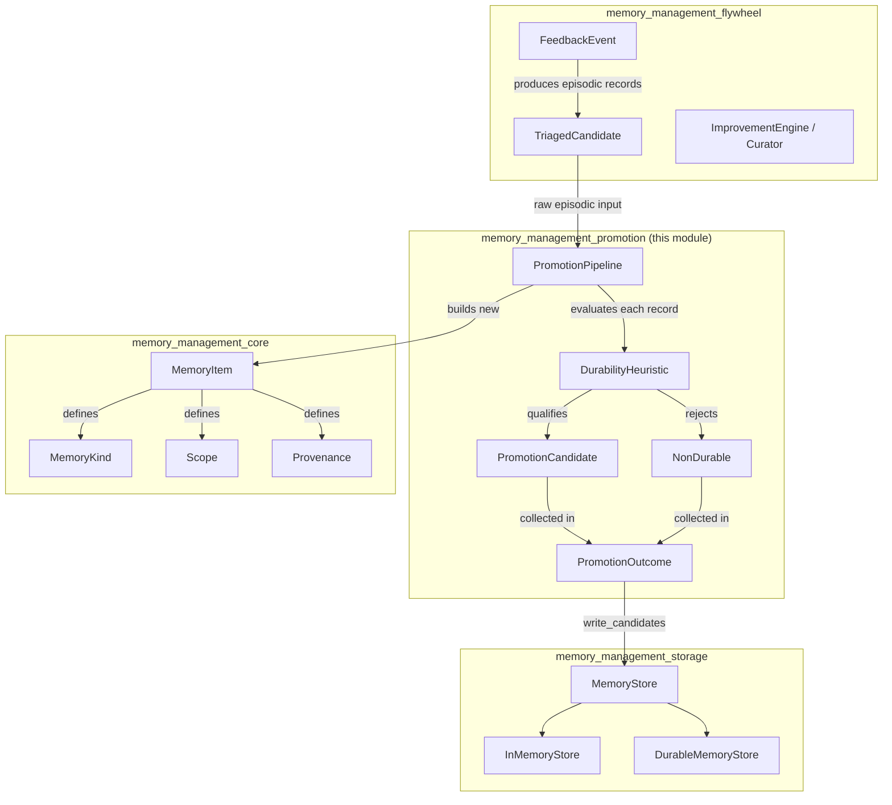
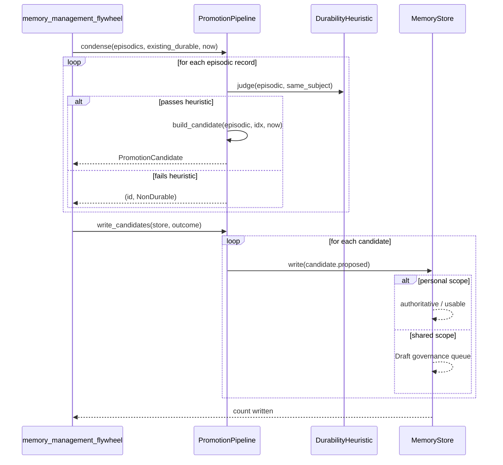
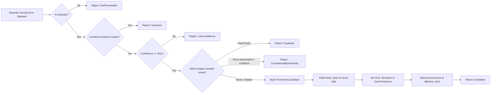

# Memory Management: Promotion

The **memory management promotion** module implements the deterministic, governance-aware pipeline that distills short-lived **episodic** memory into durable **semantic** or **user-preference** memory. It is the bridge between the raw, per-session material produced by the [memory management flywheel](memory_management_flywheel.md) and the long-term, queryable knowledge stored by [memory management storage](memory_management_storage.md).

## Purpose

Semantic memory is intentionally not an ever-growing transcript archive. The promotion pipeline runs at session-end or condensation checkpoints to:

1. **Propose** distilled durable facts from raw episodic records.
2. **Reject** transient, low-confidence, contradictory, or duplicate records with an explicit, auditable reason.
3. **Preserve governance boundaries** by routing personal facts directly into usable memory while forcing any shared-scope candidate into a `Draft` governance queue for human review.

The module's core philosophy is **"promotion, not duplication"**: an episodic record is never copied verbatim into durable memory. Instead, a new typed `MemoryItem` is distilled, stripping run-local detail and carrying forward provenance, data class, and scope.

## Core Components

### `DurabilityHeuristic`

The gate every episodic record must clear before it can become a promotion candidate. It is deterministic, has no external dependencies, and evaluates four rules:

| Rule | Rationale | Rejection |
|------|-----------|-----------|
| **Durable, not transient** | Session-local values (dates, times, "today", "right now") are not stable across turns. | `NonDurable::Transient(marker)` |
| **Confident enough** | Only facts above a configurable confidence floor are worth remembering. | `NonDurable::LowConfidence` |
| **Not contradicted by authority** | A more-authoritative or equally-confident existing record on the same subject blocks promotion. | `NonDurable::ContradictedByAuthority(id)` |
| **Not a duplicate** | An equal durable record already exists; promotion would duplicate memory. | `NonDurable::Duplicate(id)` |

The heuristic also rejects non-episodic or empty inputs as `NonDurable::NotPromotable`.

Key fields:

- `min_confidence: f32` — confidence floor (default `0.6`).
- `transient_markers: Vec<String>` — lowercased substrings that mark a value as transient, plus structural detection of ISO dates (`YYYY-MM-DD`) and 24-hour clock tokens (`HH:MM`).

### `PromotionPipeline`

Orchestrates the condensation checkpoint. It takes a slice of episodic `MemoryItem`s and the current durable records, groups durable records by subject, and runs the heuristic against each episodic record.

Key operations:

- `condense(episodics, existing_durable, now) -> PromotionOutcome` — produces candidates and explained rejections.
- `build_candidate(ep, idx, now) -> PromotionCandidate` — distills a qualifying episodic record into a new `MemoryItem`.
- `write_candidates(store, outcome) -> Result<usize, MemoryError>` — persists proposed candidates through a `MemoryStore`, enforcing the store's governance invariants.

The pipeline is deterministic: candidate IDs are generated from a caller-supplied prefix and index, and provenance timestamps use a caller-supplied logical `now`.

### `PromotionCandidate`

A single proposed durable fact:

- `source_episodic_id: String` — lineage back to the originating episodic record.
- `proposed: MemoryItem` — the new durable `MemoryItem` (never a verbatim copy).
- `rationale: String` — human-readable explanation of why it was proposed.

The candidate's kind is:

- `MemoryKind::UserPreference` if the source episodic record is tagged `preference`.
- `MemoryKind::Semantic` otherwise.

### `PromotionOutcome`

The result of a condensation checkpoint:

- `candidates: Vec<PromotionCandidate>` — records that cleared the heuristic.
- `rejected: Vec<(String, NonDurable)>` — records that failed, each with an explicit reason.

### `NonDurable`

An explained rejection reason. Every rejection is explicit and auditable; nothing is silently dropped. The source episodic record remains in episodic memory and ages out naturally.

## Architecture

## Data Flow

## Component Interactions

### With memory_management_core

The promotion module depends on the core memory model defined in [`memory_management_core`](memory_management_core.md):

- [`MemoryItem`](memory_management_core.md#memoryitem) — the unit being proposed and written.
- [`MemoryKind`](memory_management_core.md#memorykind) — distinguishes `Episodic` input from `Semantic` and `UserPreference` outputs.
- [`Scope`](memory_management_core.md#scope) — determines visibility and governance routing.
- [`Provenance`](memory_management_core.md#provenance) — carries confidence, author, and source-turn lineage.
- [`Author`](memory_management_core.md#author) — candidates are authored as `SystemIngest`.

### With memory_management_flywheel

The [flywheel](memory_management_flywheel.md) produces raw episodic records and feedback-driven candidates. The promotion pipeline consumes those records at condensation checkpoints. The flywheel does not write durable memory directly; it delegates persistence to the promotion pipeline so that durability, duplication, and governance checks are centralized.

### With memory_management_storage

Candidates are written through the [`MemoryStore`](memory_management_storage.md#memorystore) trait. The store enforces:

- **Personal scope** (`Scope::User`) facts become immediately authoritative.
- **Shared scope** facts (`Org`, `Department`, `Team`, `Repo`) are forced to `GovernanceState::Draft` and require human approval.
- **Data class** is preserved from the episodic source, so regulated/PII content remains regulated through embedding-tier routing and clearance filtering.
- **Audit chain** and redaction are applied on every write.

### With memory_management_session

Session-scratch memory is explicitly out of scope for promotion. Only `MemoryKind::Episodic` records are promotable; `MemoryKind::Session` records are rejected as `NotPromotable`.

## Process Flow: Condensation Checkpoint

## Governance and Safety

- **No force promotion**: a record that fails the heuristic stays in episodic memory and ages out naturally.
- **Honest rejections**: every rejection carries a `NonDurable` reason, making the pipeline auditable and debuggable.
- **Scope-based governance**: the pipeline itself does not decide authority; it proposes. The store forces shared-scope candidates into `Draft`.
- **Data-class preservation**: regulated or PII episodic records promote to regulated/PII durable facts, preserving downstream clearance and routing rules.
- **Determinism**: no clock or RNG inside the pipeline. All time and ID generation inputs are caller-supplied, supporting reproducible tests and replay.

## Configuration

`DurabilityHeuristic` is tunable at pipeline construction:

- `min_confidence` — default `0.6`.
- `transient_markers` — default includes common temporal/session-local phrases; additional markers can be added via `with_transient_marker`.

`PromotionPipeline` requires:

- A `DurabilityHeuristic` instance.
- An `id_prefix` for deterministic candidate ID generation.

## Testing Highlights

The module's tests verify:

- Transient values (including structural dates and clock times) are rejected.
- Low-confidence records stay in episodic memory.
- Qualifying facts promote to `Semantic` and remain queryable.
- The `preference` tag routes candidates to `UserPreference`.
- Duplicates and contradictions against authoritative records are blocked.
- Shared-scope candidates land in the `Draft` governance queue.
- Regulated data classes are carried forward.
- Source episodic records are left untouched.

## References

- [memory_management_core](memory_management_core.md) — `MemoryItem`, `MemoryKind`, `Scope`, `Provenance`, `Author`.
- [memory_management_storage](memory_management_storage.md) — `MemoryStore`, `InMemoryStore`, governance enforcement, audit chain.
- [memory_management_flywheel](memory_management_flywheel.md) — episodic record production and feedback-driven curation.
- [memory_management_session](memory_management_session.md) — session-scratch memory lifecycle.
- [memory_management_oki](memory_management_oki.md) — typed org-knowledge schema registry (relevant for shared-scope candidates that graduate to OKIs).
