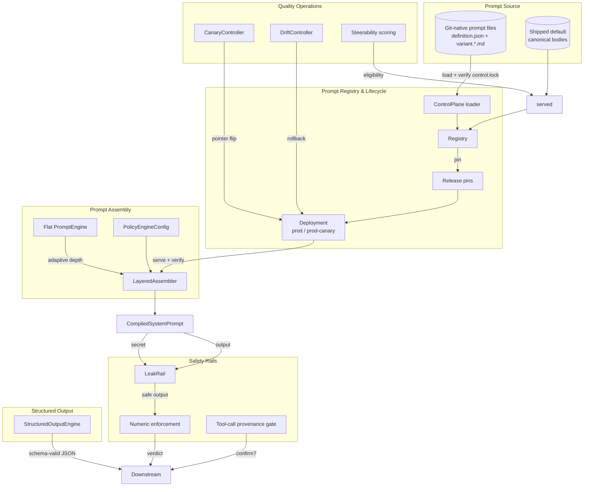
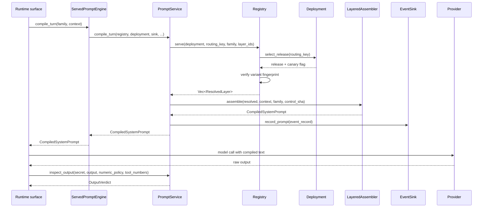
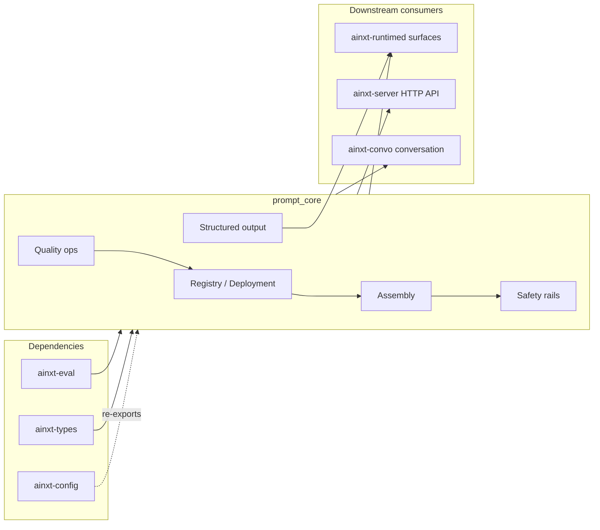

# prompt_core — Prompt Engineering Core

The `prompt_core` module (`crates/ainxt-prompt`) is the runtime heart of the system's prompt-engineering discipline. It treats prompts as versioned, model-agnostic, auditable code artifacts rather than ad-hoc strings. The module is responsible for:

* **Prompts-as-code lifecycle** — versioned layer artifacts (L1–L4), git-native loading, eval-gated promotion, canary/rollback-by-pointer, and per-model variant serving.
* **Deterministic assembly** — composing L1 persona, L2 policy, L3 task, L4 guards, and L5 context into a plain-structured-text system prompt that works across Claude, OpenAI, Gemini, and in-house OSS families (Qwen/GLM/Gemma/Kimi).
* **Safety rails** — output-side system-prompt-leak detection, numeric-via-tools enforcement, and indirect-prompt-injection provenance gating that do **not** trust the model's own judgment.
* **Quality operations** — canary auto-promote/rollback, continuous production drift detection, and steerability scoring that gates model eligibility.
* **Structured output** — schema-valid JSON generation via native grammar decoding or a bounded repair loop, generalized to every structured-output call site in the system.

`prompt_core` sits under `ai_engine → prompt_engineering` and is consumed by the runtime surfaces in `ainxt-runtimed`, the HTTP server in `ainxt-server`, and the conversation manager in `ainxt-convo`. It depends on `ainxt-eval` for eval gates and quality judging, and on `ainxt-types` for routing tiers.

---

## Architecture Overview

### Layer Model (L1–L5)

The system prompt is assembled from five ordered layers:

| Layer | Purpose | Source | Key type |
|-------|---------|--------|----------|
| L1 | Persona / identity | Registry artifact | `Layer::Persona` |
| L2 | Org / config policy | `PolicyEngineConfig` (config-sourced) | `Layer::Policy` |
| L3 | Task instructions | Registry artifact | `Layer::Task` |
| L4 | Guard prompts | Registry artifact (`guard::GUARD_BODY`) | `Layer::Guards` |
| L5 | Per-turn context | Context Fabric / runtime | untrusted data |

L1–L4 are versioned, per-model artifacts loaded from the prompt tree; L5 is the per-turn untrusted context slice. Guards sit immediately above L5 to maximize recency-based adherence.

---

## Sub-modules

The module is split into five sub-modules for detailed documentation:

* **[prompt_core_registry](prompt_core_registry.md)** — `registry`, `control`, `served`, and `policy`: the prompts-as-code registry, git-native loader, lifecycle gates, deployment pins, and config-sourced L2 policy.
* **[prompt_core_assembly](prompt_core_assembly.md)** — `lib` and `layered`: the flat `PromptEngine` and the `LayeredAssembler` that builds the five-layer system prompt, including adaptive reasoning depth and token-budget condensation.
* **[prompt_core_safety](prompt_core_safety.md)** — `guard`, `numeric`, and `service`: output-side leak rail, numeric-via-tools enforcement, indirect-injection tool-call gate, and the per-turn `PromptService` / `ServedPromptEngine` wiring.
* **[prompt_core_quality](prompt_core_quality.md)** — `canary`, `drift`, and `steerability`: canary promote/rollback, continuous quality-drift monitoring, and instruction-following steerability scoring.
* **[prompt_core_structured](prompt_core_structured.md)** — `constrained`: the `StructuredOutputEngine`, `JsonSchema`, and GBNF grammar generation that guarantee schema-valid JSON from every model.

---

## Data Flow: One Served Turn

The forensic event record is written **before** the provider call, so a later timeout, cancellation, or panic still leaves a byte-for-byte replayable prompt on disk.

---

## Key Design Principles

1. **Prompts are code** — Every L1–L4 artifact has an id, semver, owner, author, eval-set FK, per-model variants, and a lifecycle stage (`Draft → Eval → Review → Canary → Production → Deprecated`).
2. **Model-agnostic plain text** — Compiled prompts use plain section markers (`[L1]`, `[L2]`, `[REASONING]`, `[L5-CONTEXT]`) so the same artifact works on frontier and in-house OSS models.
3. **Fail-closed serving** — `Registry::serve` verifies every variant body against the pinned content fingerprint in the release; a tampered or drifted body returns `ServeError::LockMismatch`.
4. **Rollback by pointer flip** — Canary and production releases are immutable; rollback/promotion is an instant ref flip, not a rewrite.
5. **Never trust the model** — Output rails (`LeakRail`, numeric enforcement, tool-call provenance gate) inspect model output independently of what the model "decided".
6. **Deterministic** — No clock, RNG, or I/O in the core; sampling, canary splits, and drift keys are driven by stable hashes of routing keys.

---

## Integration with the Wider System

* `ainxt-eval` provides `EvalReport`, `GatePolicy`, `QualityJudge`, and the statistical drop-in gate used by the registry lifecycle and drift monitoring.
* `ainxt-types` provides the `Tier` enum that `ReasoningDepth` maps to for routing.
* `ainxt-config` re-exports `PromptConfig` and `PolicyEngineConfig` through its layered TOML loader so deployments can configure prompts without depending directly on `ainxt-prompt`.

For details on each area, see the sub-module documentation: [prompt_core_registry.md](prompt_core_registry.md), [prompt_core_assembly.md](prompt_core_assembly.md), [prompt_core_safety.md](prompt_core_safety.md), [prompt_core_quality.md](prompt_core_quality.md), and [prompt_core_structured.md](prompt_core_structured.md).
