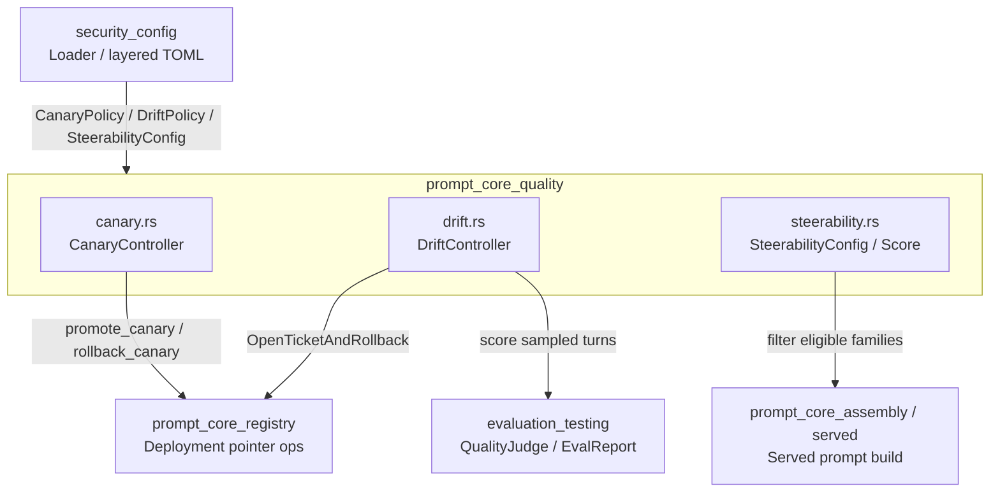
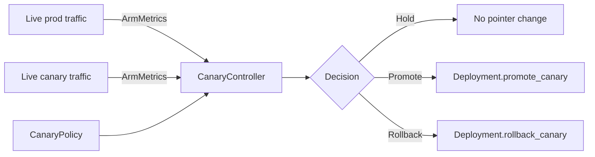
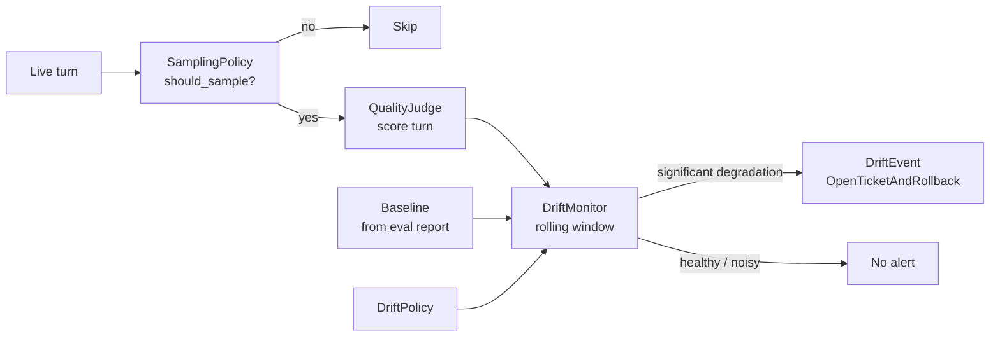
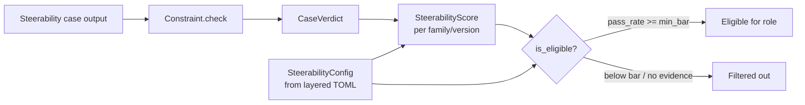
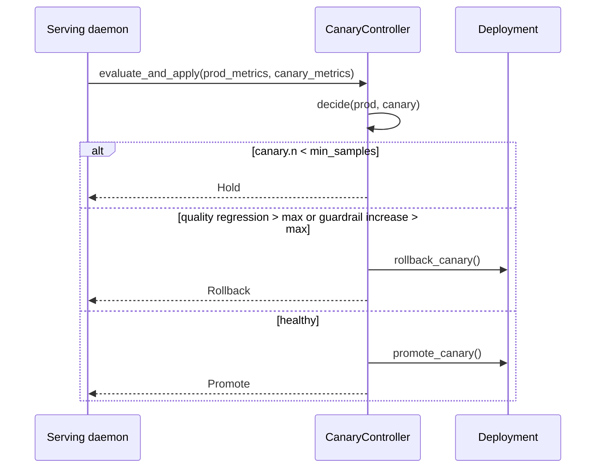
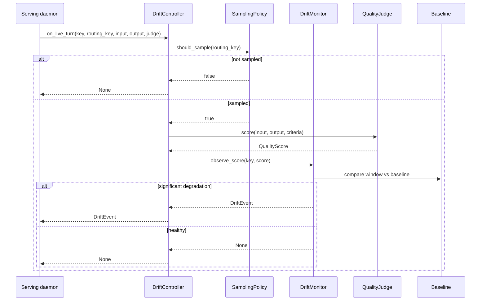
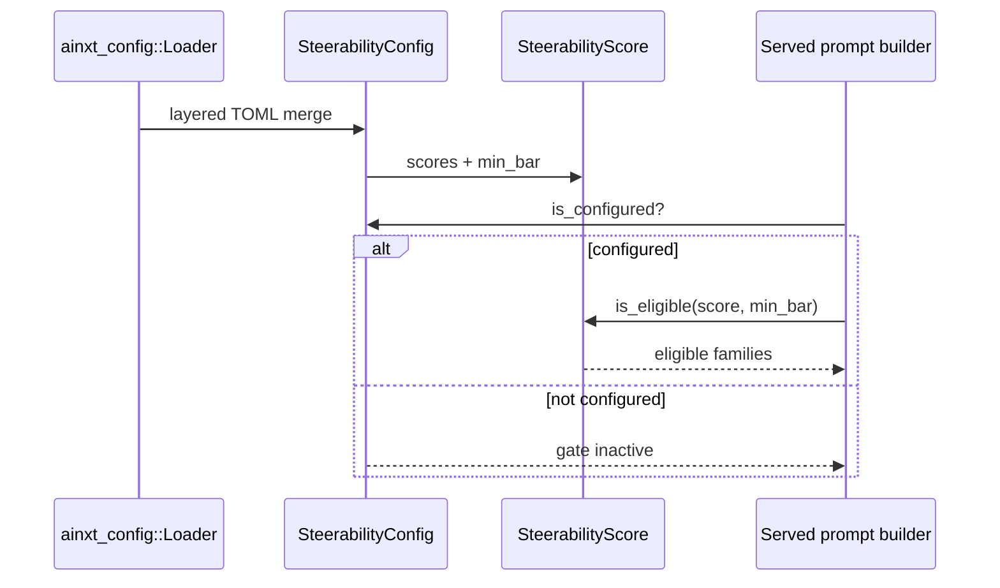

# prompt_core_quality

The **prompt_core_quality** module is the runtime quality-observability and progressive-delivery subsystem of the prompt engineering layer. It watches deployed prompts in production, decides whether a new canary artifact is safe to promote, detects slow quality drift after a deployment, and enforces a mechanical steerability gate that filters which model families are eligible for a given role.

This module lives inside `prompt_core` (the reusable prompt-engineering kernel) and is intentionally separate from prompt assembly, safety rails, and structured-output decoding. Its only job is to **measure, compare, and act on quality signals**.

---

## Core Functionality

`prompt_core_quality` provides three tightly related capabilities:

1. **Canary progressive delivery** (`canary.rs`)  
   Compares live `prod` and `prod-canary` arms on quality mean and guardrail-trigger rate. When enough evidence is collected, it either promotes the canary onto `prod` or rolls it back with a single pointer flip. A human is notified, not paged.

2. **Continuous drift detection** (`drift.rs`)  
   Samples a bounded fraction of live turns, scores them with the same LLM judge used at deploy time, and tracks the score distribution per `(role, model_family, artifact_version)`. It fires a `DriftEvent` only when a statistically significant degradation exceeds a minimum effect size, then recommends opening a ticket and rolling back.

3. **Steerability gating** (`steerability.rs`)  
   Scores instruction-following with cheap, mechanical constraints (bullet counts, required/forbidden terms, section headers, word bounds, JSON-object shape). Per-family `SteerabilityScore`s are supplied through the layered config loader and used to filter the candidate model list before serving.

All three subsystems are deterministic and free of clock/RNG/I-O in the library path. Live traffic, the judge model, and the deployment store are injected seams, which makes the logic trivially testable and replayable.

---

## Architecture

### Component Overview

| File | Primary Types | Responsibility |
|------|---------------|----------------|
| `canary.rs` | `ArmMetrics`, `CanaryPolicy`, `CanaryController`, `CanaryDecision` | Active canary promote/rollback control loop. |
| `drift.rs` | `DriftKey`, `SamplingPolicy`, `Baseline`, `DriftPolicy`, `DriftMonitor`, `DriftController`, `DriftEvent`, `DriftAction` | Continuous production drift detection with bounded sampling and significance testing. |
| `steerability.rs` | `Constraint`, `CaseVerdict`, `SteerabilityScore`, `SteerabilityConfig` | Mechanical instruction-following scoring and model-eligibility gating. |

### High-Level Architecture

### Canary Control Loop

### Drift Detection Pipeline

### Steerability Grading and Gating

---

## Component Relationships

### Canary and Registry

`CanaryController` never rewrites prompt bodies. It delegates the actual pointer flip to [`prompt_core_registry`](prompt_core_registry.md) via `Deployment::promote_canary` and `Deployment::rollback_canary`. This preserves the immutability and content-addressing invariants of the prompt registry.

### Drift and Evaluation

`DriftController` scores sampled turns through the same `QualityJudge` interface used by the deploy gate in [`evaluation_testing`](evaluation_testing.md). Baselines are derived from `ainxt_eval::EvalReport::mean`. Because the same judge and rubric are reused, drift detection cannot drift apart from the gate that approved the artifact.

### Steerability and Served Prompts

`SteerabilityConfig` is resolved through the same layered TOML merge as every other config domain (see [`security_config`](../core_infrastructure/security_config.md) / `ainxt_config::Loader`). When configured, [`prompt_core_assembly`](prompt_core_assembly.md) and the served prompt builders use `is_eligible` to drop model families that fail the instruction-following bar. An empty config keeps the gate inactive and preserves legacy behavior.

### Quality Verification

While `prompt_core_quality` performs runtime measurement, the deeper answer-quality dimensions (completeness, groundedness, citation presence, tone, format validity, synthesis, rederivation) are implemented in [`quality_verification`](quality_verification.md). The canary and drift subsystems consume those dimensions as aggregate scores; they do not redefine them.

---

## Data Flow

### Canary Decision Flow

### Drift Observation Flow

### Steerability Config Flow

---

## Process Flows

### Promoting or Rolling Back a Canary

1. The serving daemon computes live `ArmMetrics` for both `prod` and `prod-canary`.
2. It calls `CanaryController::evaluate_and_apply`.
3. The controller checks evidence sufficiency (`min_samples`).
4. It computes quality regression and guardrail increase versus the policy thresholds.
5. If any threshold is exceeded, it calls `Deployment::rollback_canary` and returns `Rollback`.
6. If the canary is healthy, it calls `Deployment::promote_canary` and returns `Promote`.
7. If evidence is thin, it returns `Hold` and leaves the deployment untouched.

### Detecting Production Drift

1. At deploy time, the daemon seeds each `(role, model_family, artifact_version)` stream with a `Baseline` derived from the passing eval report.
2. For every live turn, `DriftController::on_live_turn` hashes the routing key to make a deterministic sampling decision.
3. Sampled turns are scored by the injected `QualityJudge` against the same `EvalCriteria` used at deploy time.
4. Scores are appended to a rolling window; old scores fall off when the window capacity is exceeded.
5. When the window has enough samples, the monitor runs a one-sample t-test against the baseline mean.
6. A `DriftEvent` is emitted only once per confirmed degradation, recommending `OpenTicketAndRollback`.

### Gating Model Families by Steerability

1. An offline steerability harness (see [`evaluation_testing`](evaluation_testing.md)) produces per-family `SteerabilityScore`s.
2. A deployment/tenant TOML `[steerability]` layer supplies those scores plus a `min_bar` through `ainxt_config::Loader`.
3. At served-prompt build time, the builder checks `SteerabilityConfig::is_configured`.
4. If configured, only families present in the config and meeting `min_bar` remain eligible.
5. `regressed_cases` can be used during artifact promotion to ensure no previously passing instruction-following case now fails.

---

## How It Fits into the Overall System

`prompt_core_quality` sits between the **prompt registry** (which knows how to flip deployment pointers) and the **serving runtime** (which sees live traffic). It closes three gaps that would otherwise leave prompt deployments as one-shot, point-in-time approvals:

- **Canary** turns the registry's pointer primitives into an active control loop, so new prompt versions can be shipped progressively and rolled back automatically.
- **Drift** extends quality assurance from deploy time into the continuous operation of the system, catching regressions caused by model updates, retrieval shifts, or unseen usage patterns.
- **Steerability** adds an objective, mechanical eligibility gate that prevents model families from being selected for roles where they cannot reliably follow explicit instructions.

Together, these mechanisms make prompt engineering a closed-loop discipline: artifacts are assembled, evaluated, deployed, measured in production, and rolled back when quality regresses.

---

## References

- [`prompt_core_registry`](prompt_core_registry.md) — deployment pointers, canary/rollback primitives, and release lifecycle.
- [`prompt_core_assembly`](prompt_core_assembly.md) — prompt assembly and served prompt construction.
- [`prompt_core_safety`](prompt_core_safety.md) — guardrails, leak detection, and output verdicts.
- [`prompt_core_structured`](prompt_core_structured.md) — constrained/structured output decoding.
- [`quality_verification`](quality_verification.md) — answer-quality dimensions, synthesis, and rederivation.
- [`evaluation_testing`](evaluation_testing.md) — eval cases, judges, `QualityJudge`, and `EvalReport`.
- [`security_config`](../core_infrastructure/security_config.md) — layered configuration loading via `ainxt_config::Loader`.
