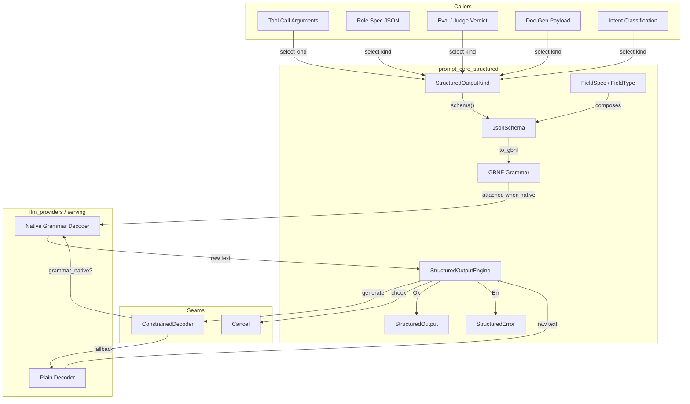
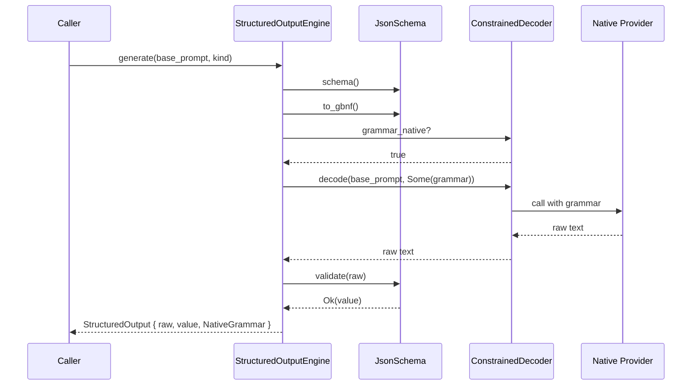
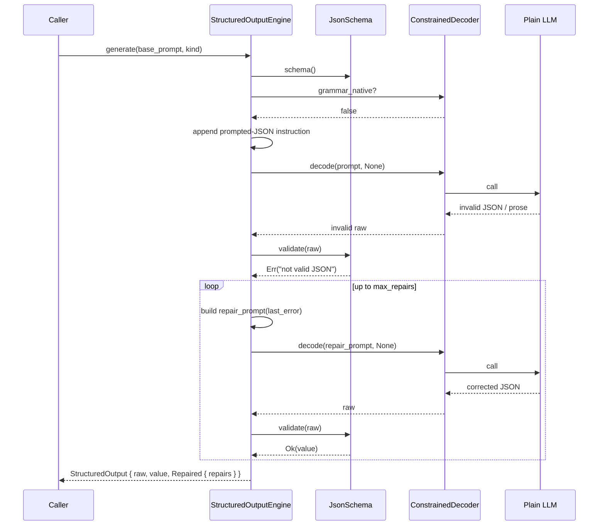
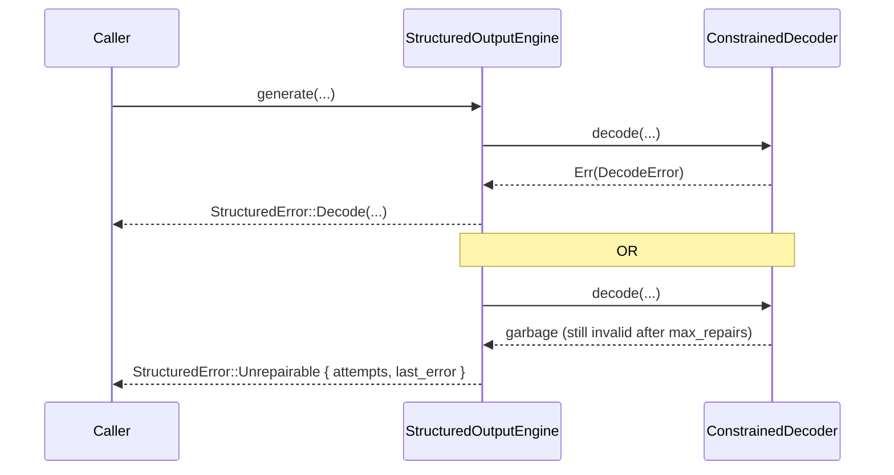
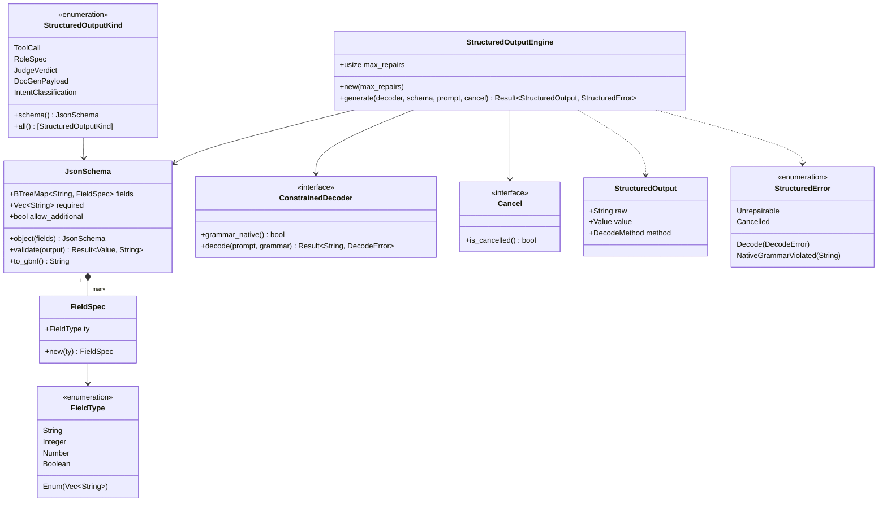

# prompt_core_structured

## Brief Introduction

`prompt_core_structured` is the constrained/structured-output subsystem of the prompt engineering layer. It guarantees that any Large Language Model (LLM) call that must return a machine-readable object — tool-call arguments, Role Spec JSON, eval-judge verdicts, doc-generation payloads, or intent classification — either receives a schema-valid JSON value or fails in a structured, observable way. The module is deliberately deterministic and seam-driven: it contains no clock, RNG, or I/O, and all provider interactions flow through a trait so the runtime guarantee is independent of any specific serving stack.

The core design is two-layered:

1. **Grammar-native decoding** — a [`JsonSchema`] compiles to a deterministic GBNF grammar that a native constrained decoder (vLLM, Outlines, lm-format-enforcer) enforces at token-sampling time. The model cannot emit an invalid token.
2. **Bounded repair loop** — for models without native constrained decoding, the engine appends strict JSON instructions, validates the output, and re-prompts with the exact validation error, up to a hard cap. If the budget is exhausted, it returns a structured error rather than an invalid object.

In both paths the engine **never trusts the decoder's claim of validity**; it always validates the returned text against the schema as a fail-closed backstop.

---

## Where This Module Fits

`prompt_core_structured` lives inside the `prompt_core` submodule of the `prompt_engineering` domain under `ai_engine`. It is a sibling to:

- [`prompt_core_registry`](prompt_core_registry.md) — layer/release registry and lifecycle control.
- [`prompt_core_assembly`](prompt_core_assembly.md) — prompt assembly, layered system prompts, and condensation.
- [`prompt_core_safety`](prompt_core_safety.md) — leak rails, numeric policy, and prompt-service gating.
- [`prompt_core_quality`](prompt_core_quality.md) — canary releases, drift monitoring, and steerability scoring.

It consumes LLM inference through the provider abstraction defined in [`llm_providers`](llm_providers.md) and is consumed by higher-level orchestrators such as [`classification`](classification.md), the runtime engine, and the workforce/skill surfaces. It also supports eval-judge verdicts used by [`eval_judging`](eval_judging.md) and doc-generation payloads produced by [`answer_artifact`](answer_artifact.md).

---

## Core Concepts

| Concept | Description |
|--------|-------------|
| `JsonSchema` | A minimal, deterministic JSON-schema subset: a flat object of typed fields, a required-field list, and a strict/lenient switch for additional properties. |
| `FieldSpec` / `FieldType` | Declares a single field's scalar type (`String`, `Integer`, `Number`, `Boolean`, or closed `Enum`). |
| `StructuredOutputEngine` | The engine that orchestrates grammar-native decoding or the bounded repair loop. |
| `ConstrainedDecoder` | Serving seam: a provider-side decoder that may or may not enforce grammar natively. |
| `Cancel` | Cooperative cancellation seam used to abort the repair loop on timeout or client cancellation. |
| `StructuredOutputKind` | Canonical catalog of every structured-output call site in the system, each with a fixed schema. |
| `DecodeMethod` | Telemetry enum recording how the valid output was obtained (`NativeGrammar`, `PromptedFirstTry`, `Repaired`). |
| `StructuredError` | The fail-closed error type returned when no valid object can be produced. |

---

## Architecture

### Component Responsibilities

- **`JsonSchema`** — owns schema definition, validation of raw model text, and deterministic GBNF grammar generation.
- **`FieldSpec` / `FieldType`** — the typed building blocks of a schema; `Enum` variants are rendered as literal alternatives in the grammar.
- **`StructuredOutputEngine`** — the only public entry point for producing a structured object. It decides between the native-grammar fast path and the repair-loop fallback.
- **`ConstrainedDecoder`** — abstracts the serving layer. Production implementations call the provider gateway with an optional grammar; test implementations model weak, lying, failing, and native decoders.
- **`Cancel`** — lets the runtime abort mid-loop without blocking on a pathological model.
- **`StructuredOutputKind`** — centralizes every structured-output contract so no caller invents a one-off parser.

---

## Data Flow

### Happy Path: Native Grammar Decoder

### Fallback Path: Weak Model + Bounded Repair

### Fail-Closed Path: Budget Exhausted or Provider Failure

---

## Component Interactions

---

## Process Flows

### Selecting and Enforcing a Schema

1. A caller chooses a `StructuredOutputKind` (e.g., `ToolCall`).
2. `StructuredOutputKind::schema()` returns the canonical `JsonSchema`.
3. The caller invokes `StructuredOutputEngine::generate` with the schema, base prompt, decoder, and cancel seam.
4. The engine compiles the schema to GBNF via `JsonSchema::to_gbnf`.
5. If the decoder is grammar-native, the grammar is attached and the output is validated once.
6. Otherwise, the engine appends strict JSON instructions and enters the repair loop.
7. Each repair iteration re-prompts with the exact validation error from the previous attempt.
8. The loop terminates on success, cancellation, provider error, or budget exhaustion.

### Deterministic Grammar Generation

`JsonSchema::to_gbnf` partitions declared fields into required and optional sets and emits:

- A `root` rule that lists required fields in stable key order, followed by optional `( "," ws kv-N )?` groups.
- Per-field `kv-N` rules that constrain the value to the declared type or enum literals.
- Shared terminal rules for `string`, `integer`, `number`, `boolean`, and whitespace.

Because fields are stored in a `BTreeMap` and required fields are sorted, the grammar text is fully deterministic — the same schema always yields the same grammar, which is essential for forensic replay and regression testing.

### Validation Rules

`JsonSchema::validate`:

1. Parses the raw text as JSON.
2. Ensures the top-level value is an object.
3. Checks that every required field is present.
4. Rejects undeclared keys when `allow_additional` is `false` (the default).
5. Type-checks every present field, including closed `Enum` membership.
6. Returns the canonical `serde_json::Value` on success or a precise, model-readable error string on failure.

---

## Dependencies

### Upstream (consumed by this module)

- [`llm_providers`](llm_providers.md) — the actual LLM inference surface is abstracted through `ConstrainedDecoder`. The module does not depend on provider-specific normalizers directly.
- [`prompt_core_assembly`](prompt_core_assembly.md) / [`prompt_core_registry`](prompt_core_registry.md) — higher-level prompt construction and layer selection may feed base prompts into the structured-output engine.

### Downstream (consumers of this module)

- [`classification`](classification.md) — intent classification verdicts are produced through `StructuredOutputKind::IntentClassification`.
- [`answer_artifact`](answer_artifact.md) — doc-generation payloads use `StructuredOutputKind::DocGenPayload`.
- [`eval_judging`](eval_judging.md) — LLM-judge verdicts use `StructuredOutputKind::JudgeVerdict`.
- [`prompt_core_safety`](prompt_core_safety.md) / [`prompt_core_quality`](prompt_core_quality.md) — safety and quality subsystems may invoke structured outputs for policy verdicts or steerability scores.
- Runtime surfaces in [`runtime_engine`](../pipeline_runtime/runtime_engine.md) and [`workforce`](../governance_compliance/workforce.md) — tool calls and Role Spec emission rely on schema-valid JSON.

---

## Design Principles

1. **Never trust the model's claim of validity.** Even a grammar-native decoder is validated as a backstop against a lying or misbuilt serving layer.
2. **Bounded cost.** The repair loop has a hard `max_repairs` cap; a pathological model cannot spin forever.
3. **Deterministic.** No clock, RNG, or I/O inside the module; grammar generation is stable and reproducible.
4. **Generalized.** One engine and one schema catalog cover every structured-output call site, rather than per-call-site parsers.
5. **Fail-closed.** On any failure the engine returns a structured error, never a silently-invalid object.

---

## Testing Strategy

The module's tests are included in the same source file and exercise:

- Schema validation for missing fields, wrong types, undeclared keys, enum violations, and non-JSON output.
- Deterministic GBNF generation and field coverage.
- 100 consecutive successful decodes on a fake weak model via the repair loop.
- Bounded repair budget and `Unrepairable` outcomes.
- Provider error propagation as `StructuredError::Decode`.
- Cancellation aborting the loop.
- A lying native decoder being caught by the validation backstop.

These tests map directly to the PE3 acceptance criterion: a weak self-hosted model returns a syntactically valid object 100% of the time for every structured-output prompt.

---

## References

- [`prompt_core_registry`](prompt_core_registry.md)
- [`prompt_core_assembly`](prompt_core_assembly.md)
- [`prompt_core_safety`](prompt_core_safety.md)
- [`prompt_core_quality`](prompt_core_quality.md)
- [`prompt_optimization`](prompt_optimization.md)
- [`llm_providers`](llm_providers.md)
- [`classification`](classification.md)
- [`answer_artifact`](answer_artifact.md)
- [`eval_judging`](eval_judging.md)
- [`runtime_engine`](../pipeline_runtime/runtime_engine.md)
- [`workforce`](../governance_compliance/workforce.md)
