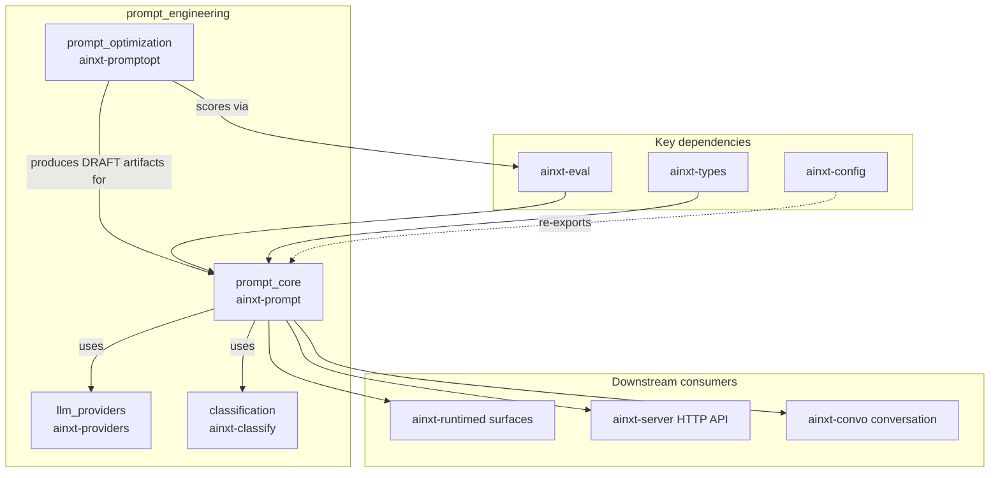
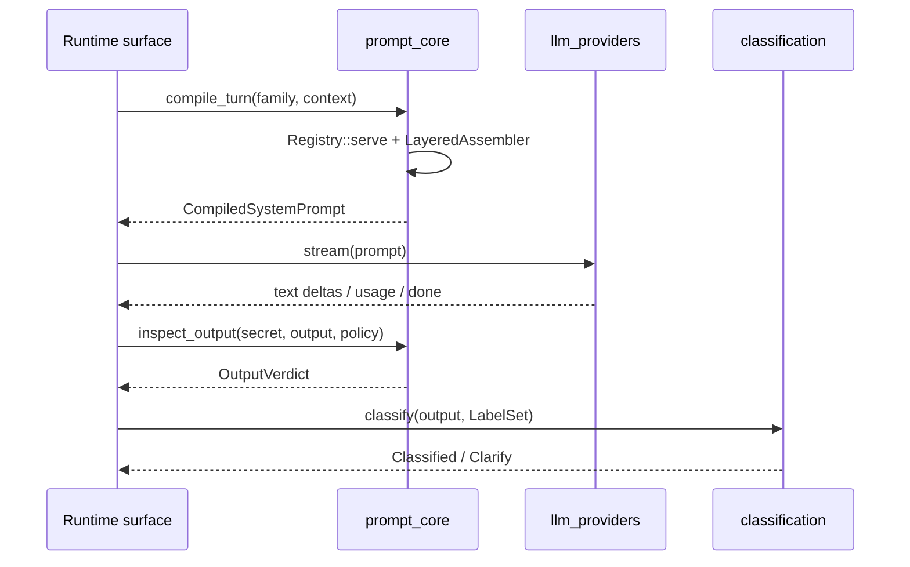

# `prompt_engineering` Module Overview

The `prompt_engineering` module is the AI engine's discipline for treating prompts as **versioned, model-agnostic, auditable code artifacts** rather than ad-hoc strings. It owns the full lifecycle of prompts—from registry and assembly, through safety and quality operations, to structured output, automated optimization, and the provider/classification primitives that make prompts reliable across model families.

## Purpose

- **Prompts-as-code lifecycle** — versioned layer artifacts, git-native loading, eval-gated promotion, canary/rollback-by-pointer, and per-model variant serving.
- **Deterministic assembly** — composing persona, policy, task, guards, and context into a plain-structured-text system prompt that works across Claude, OpenAI, Gemini, and in-house OSS models.
- **Safety and quality** — output-side leak rails, numeric enforcement, tool-call provenance gating, canary auto-promotion, drift monitoring, and steerability scoring.
- **Structured output** — schema-valid JSON generation via native grammar decoding or bounded repair loops.
- **Automated optimization** — search and rank prompt variants on a shared gold set with cost-budgeted A/B promotion.
- **Model-agnostic providers & classification** — vendor-neutral streaming adapters and deterministic label extraction so model output is safely actionable.

## Architecture

### Submodule responsibilities

| Submodule | Crate | Responsibility |
|-----------|-------|----------------|
| `prompt_core` | `ainxt-prompt` | Registry/lifecycle, layered assembly, safety rails, quality ops, structured output. |
| `prompt_optimization` | `ainxt-promptopt` | Automated variant search, A/B promotion, holdout guard, cost-budgeted optimization. |
| `llm_providers` | `ainxt-providers` | Vendor-neutral streaming adapters for OpenAI-schema, Anthropic, and Gemini endpoints. |
| `classification` | `ainxt-classify` | Deterministic fixed-vocabulary label extraction with confidence grading and ambiguity detection. |

## Data Flow: A Served Turn

## Core Components

- **`PromptEngine` / `LayeredAssembler`** — assemble the five-layer system prompt (L1 persona, L2 policy, L3 task, L4 guards, L5 context).
- **`Registry` / `Deployment` / `Release`** — prompts-as-code registry with semver, lifecycle stages, and immutable release pins.
- **`ServedPromptEngine` / `PromptService`** — per-turn serving, forensic event recording, and output inspection.
- **`LeakRail` / `NumericPolicyConfig` / `ToolCallGate`** — output-side safety rails.
- **`CanaryController` / `DriftController` / `SteerabilityConfig`** — quality operations.
- **`StructuredOutputEngine` / `JsonSchema`** — schema-valid structured output.
- **`ModelOptimization` / `PromptVariant` / `ConstrainedLlmJudge`** — prompt optimization.
- **`OpenAiSchemaProvider` / `AnthropicProvider` / `GeminiProvider` / `ProviderLabelModel`** — provider adapters.
- **`LabelSet` / `Classified` / `ClarifyPolicy` / `LabelModel`** — deterministic classification.

## References to Core Components Documentation

- [prompt_core.md](prompt_core.md) — prompt registry, assembly, safety, quality, and structured output.
- [prompt_optimization.md](prompt_optimization.md) — automated prompt optimization.
- [llm_providers.md](llm_providers.md) — vendor-neutral LLM provider adapters.
- [classification.md](classification.md) — deterministic label extraction and classification.