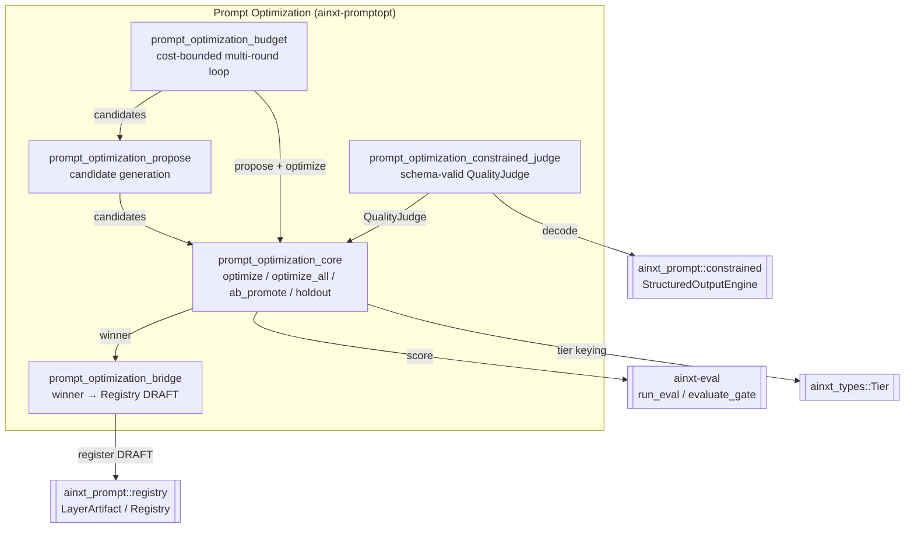

# Prompt Optimization Module

The **prompt optimization** module (`ainxt-promptopt`) automates the search for high-quality prompt templates across model families. It treats prompt text as a deterministic search space and the eval-platform gold set as the objective function, so prompt engineering becomes a repeatable, measurable platform capability rather than an ad-hoc craft.

## Purpose

- **Search and rank** prompt variants on a shared gold set using the same evaluator the release gate uses (`ainxt-eval`).
- **A/B promotion with non-inferiority**: a challenger displaces the champion only when it is better beyond a configured margin.
- **Holdout / overfit guard**: winners are chosen on a train split and confirmed on a disjoint holdout; candidates that memorize the train set are flagged as overfit.
- **Per-model keying**: optimization runs once per model family, so the best prompt for one model is never silently reused for another.
- **Cost-budgeted offline jobs**: hard caps on rounds, candidates, model calls, and spend, with exact accounting.
- **Registry integration**: the optimizer's winner is bridged into the Prompt Registry as a `DRAFT` artifact; it never auto-promotes to production.
- **Constrained-decoding judge**: a real `QualityJudge` backend that routes judge-model verdicts through the structured-output engine for schema-valid scoring, including self-hosted models that need a bounded repair loop.

## Architecture Overview

### Data Flow

1. A **seed prompt** enters the module.
2. The **proposal** sub-module expands the seed into a bounded, deterministic set of candidate variants (rephrasing, few-shot, format placement, decomposition).
3. The **core optimization** sub-module scores every candidate against the gold set via `ainxt-eval`, ranks them deterministically, and certifies a winner.
4. The **budget** sub-module can wrap the propose → optimize loop in a cost-bounded, multi-round search that stops on convergence or budget exhaustion.
5. The **holdout guard** (in core) re-scores the train winner on a disjoint holdout and flags overfit candidates.
6. The **bridge** sub-module converts a holdout-confirmed winner into a per-model-family `LayerArtifact` at `Stage::Draft` in the Prompt Registry.
7. The **constrained judge** sub-module supplies a `QualityJudge` implementation that decodes judge-model replies through the structured-output engine, so the optimizer can be used reliably with self-hosted models.

## Sub-modules

| Sub-module | Responsibility | Key Components |
|------------|----------------|----------------|
| [prompt_optimization_core](prompt_optimization_core.md) | Single-model and multi-model optimization, A/B promotion, train/holdout overfit guard | `PromptVariant`, `ModelSeam`, `VariantSystem`, `ModelOptimization`, `HoldoutOutcome`, `AbResult`, `optimize`, `optimize_all`, `ab_promote`, `optimize_with_holdout` |
| [prompt_optimization_propose](prompt_optimization_propose.md) | Deterministic expansion of a seed prompt into a bounded candidate search space | `ProposeCatalog`, `ProposeConfig`, `Exemplar`, `propose` |
| [prompt_optimization_budget](prompt_optimization_budget.md) | Cost-budgeted, multi-round optimization with exact spend accounting | `OptBudget`, `CostModel`, `BudgetedOutcome`, `StopReason`, `optimize_budgeted` |
| [prompt_optimization_bridge](prompt_optimization_bridge.md) | Bridge an optimizer winner into the Prompt Registry as a DRAFT artifact | `DraftSpec`, `BridgeError`, `winner_to_draft`, `holdout_winner_to_draft`, `register_draft` |
| [prompt_optimization_constrained_judge](prompt_optimization_constrained_judge.md) | `QualityJudge` backend backed by the structured-output engine | `ConstrainedLlmJudge` |

## Integration with the System

- **Evaluation platform**: the optimizer does not invent its own scorer. Every variant is adapted into an `ainxt_eval::EvalSystem` and scored with `ainxt_eval::run_eval`, inheriting the gate's independent-judge discipline. See [evaluation_testing](evaluation_testing.md).
- **Prompt engineering / Registry**: winning variants are handed to the Prompt Registry as DRAFT artifacts and must advance through the normal DRAFT → EVAL → REVIEW → CANARY → PRODUCTION lifecycle. See [prompt_core](prompt_core.md) and [prompt_engineering](prompt_engineering.md).
- **Structured output**: the constrained judge is the real production caller of `ainxt_prompt::constrained::StructuredOutputEngine::generate` for judge verdicts. See [prompt_core](prompt_core.md).
- **Model routing**: results are keyed by model id and `Tier`, aligning with the per-model-family tuning requirement in the broader prompt-engineering layer.

## Design Principles

- **Deterministic**: no clock, RNG, or I/O inside the optimization core; same inputs always yield same outputs.
- **Fail-closed**: an empty gold set, missing winner, or judge decode failure never fabricates a passing result.
- **No auto-promotion**: the optimizer creates DRAFTs, not production artifacts.
- **Spend accountability**: every model call and cost unit is tracked and capped.

## Related Documentation

Detailed documentation for each sub-module is available in the generated files:
[prompt_optimization_core.md](prompt_optimization_core.md),
[prompt_optimization_propose.md](prompt_optimization_propose.md),
[prompt_optimization_budget.md](prompt_optimization_budget.md),
[prompt_optimization_bridge.md](prompt_optimization_bridge.md), and
[prompt_optimization_constrained_judge.md](prompt_optimization_constrained_judge.md).

For broader context, see the [prompt_engineering](prompt_engineering.md) and [evaluation_testing](evaluation_testing.md) module documentation.
