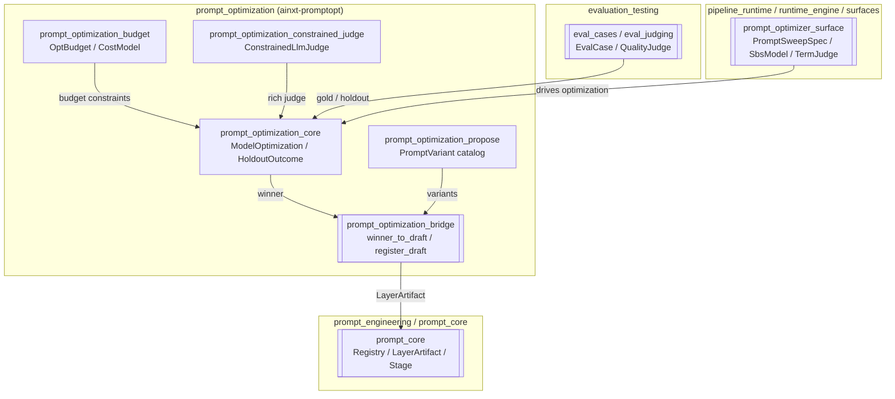
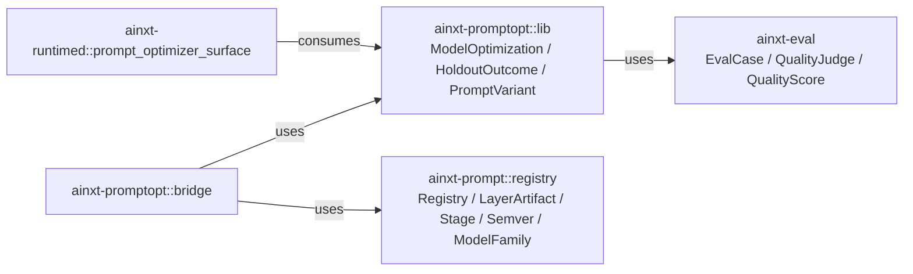
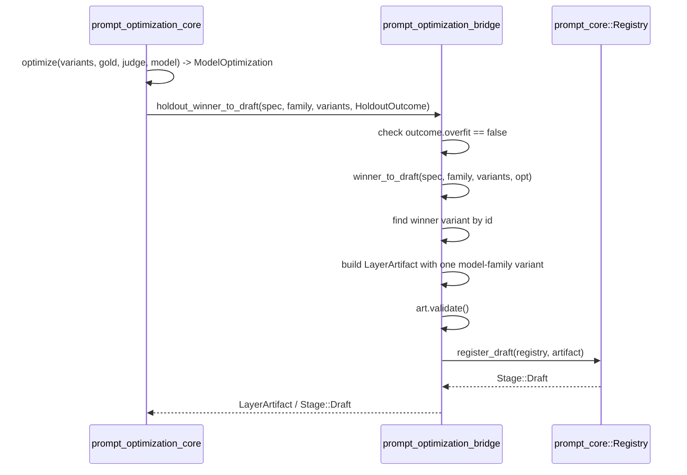
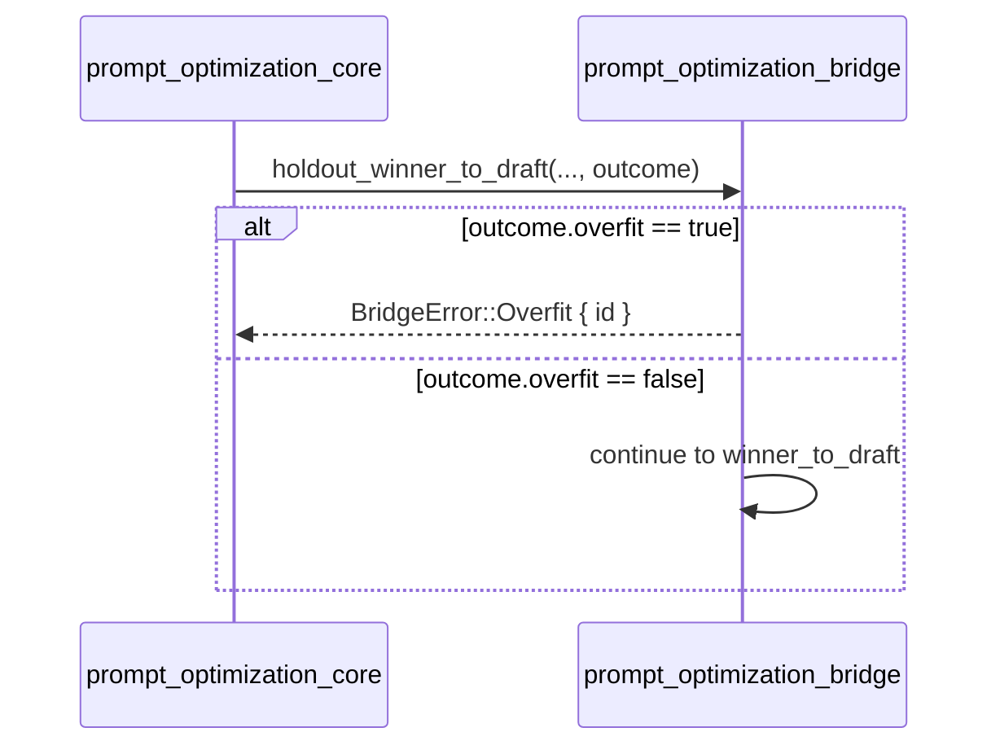
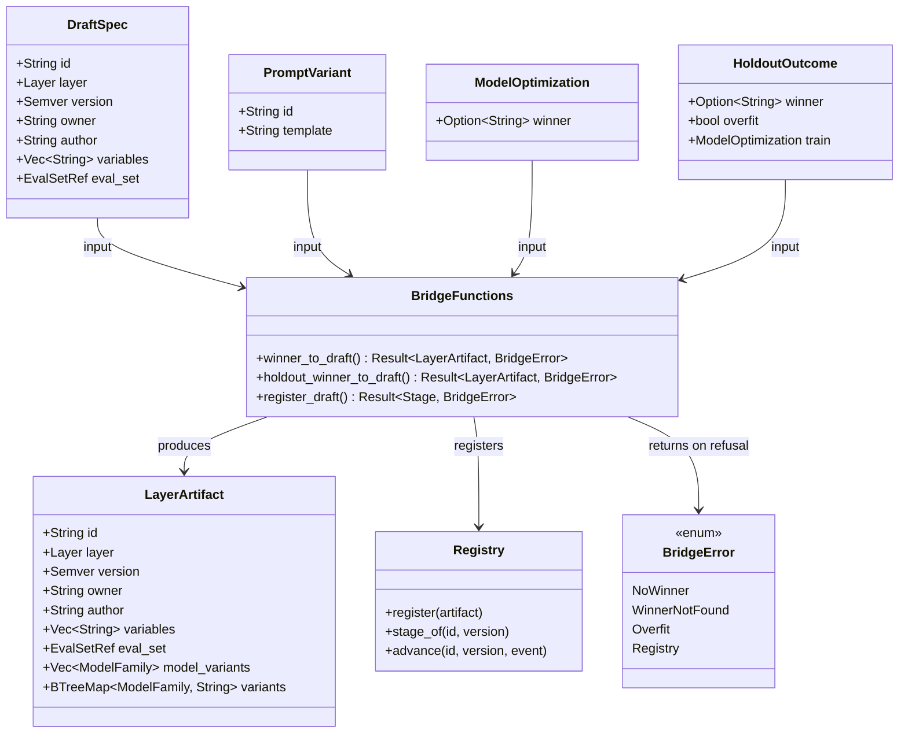
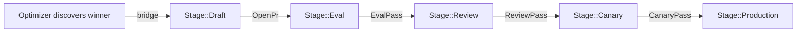

# Prompt Optimization Bridge

## Brief Introduction

The **Prompt Optimization Bridge** (`crates/ainxt-promptopt/src/bridge.rs`) is the controlled hand-off between the automated prompt optimizer and the governed prompt artifact lifecycle. While the optimizer can discover a winning prompt variant through A/B evaluation and holdout validation, that winner is **never** allowed to ship directly to production. Instead, the bridge converts the winning [`PromptVariant`] into a per-model-family [`LayerArtifact`] and registers it in the Prompt [`Registry`] at [`Stage::Draft`]. From there, the artifact must advance through the normal gated pipeline—EVAL → REVIEW → CANARY → PRODUCTION—just like any human-authored prompt change.

This module enforces two critical safety properties:

1. **No auto-promotion**: the optimizer can only create a DRAFT; advancement requires the full lifecycle.
2. **Overfit refusal**: a winner flagged as overfit by the holdout outcome is rejected at the bridge and never becomes a draft.

---

## Core Responsibilities

| Responsibility | Description |
| -------------- | ----------- |
| **Winner → DRAFT conversion** | Turn a certified optimizer winner into a validated [`LayerArtifact`] for a specific [`ModelFamily`]. |
| **Holdout gating** | Refuse to bridge overfit candidates (gap AQ / PE10) before they can enter the registry. |
| **Registry integration** | Register the artifact at [`Stage::Draft`] and return the stage, performing no further lifecycle advancement. |
| **SoD enforcement** | The artifact author is recorded as `"prompt-optimizer"`; an optimizer author can never self-approve promotion. |

---

## Core Components

### `DraftSpec`

Metadata required to mint a new DRAFT artifact from an optimizer winner.

```rust
pub struct DraftSpec {
    pub id: String,              // artifact id (typically an L3 task layer)
    pub layer: Layer,            // registry layer classification
    pub version: Semver,         // new DRAFT version, bumped from current PRODUCTION
    pub owner: String,           // CODEOWNERS group
    pub author: String,          // e.g. "prompt-optimizer"
    pub variables: Vec<String>,  // template variables
    pub eval_set: EvalSetRef,    // evaluation set reference for the artifact
}
```

### `BridgeError`

Enumerates the ways the bridge can refuse to create a DRAFT:

- `NoWinner` — the optimization produced no certified winner.
- `WinnerNotFound` — the declared winner id is not in the supplied variant set.
- `Overfit` — the holdout flagged the winner as overfit.
- `Registry(RegistryError)` — the registry rejected the artifact (invalid body, dangling eval-set FK, duplicate version, etc.).

### Bridge Functions

| Function | Purpose |
| -------- | ------- |
| `winner_to_draft` | Converts a [`ModelOptimization`] winner into a [`LayerArtifact`] for one model family. |
| `holdout_winner_to_draft` | Wraps `winner_to_draft` and rejects overfit winners. |
| `register_draft` | Registers the artifact in the [`Registry`] at [`Stage::Draft`] only. |

### Test Helpers

- `SbsModel` — a test model seam that only succeeds when the prompt asks for step-by-step reasoning.
- `TermJudge` — a test quality judge that scores by terminal-keyword presence.

These are internal test fixtures and are not part of the production API surface.

---

## Architecture



---

## Dependencies

The bridge depends on components from the same crate and from the prompt registry:



- **[prompt_optimization_core](prompt_optimization_core.md)** — provides the optimization result types (`ModelOptimization`, `HoldoutOutcome`) and the variant type (`PromptVariant`).
- **[prompt_optimization_propose](prompt_optimization_propose.md)** — produces the candidate `PromptVariant`s that the bridge consumes.
- **[prompt_optimization_budget](prompt_optimization_budget.md)** — constrains how many variants and judge calls the optimizer can afford before a winner reaches the bridge.
- **[prompt_optimization_constrained_judge](prompt_optimization_constrained_judge.md)** — supplies the constrained judge implementations used during optimization.
- **[prompt_core](prompt_core.md)** — owns the [`Registry`], [`LayerArtifact`], [`Stage`], and lifecycle semantics.
- **[evaluation_testing](evaluation_testing.md)** — defines the evaluation cases and quality judges that determine the winner.
- **[runtime_engine](../pipeline_runtime/runtime_engine.md)** / **[surfaces](../pipeline_runtime/surfaces.md)** — the runtime surface that orchestrates prompt optimization and consumes the resulting DRAFTs.

---

## Data Flow

### Optimizer Winner → Registry DRAFT



### Overfit Rejection Path



---

## Component Interaction



---

## Process Flows

### Creating a DRAFT from an Optimization Winner

1. The optimizer runs `optimize` or `optimize_with_holdout` and produces a `ModelOptimization` or `HoldoutOutcome`.
2. The caller constructs a `DraftSpec` describing the target artifact id, layer, version, owner, author, variables, and eval set.
3. The caller invokes `holdout_winner_to_draft` (recommended) or `winner_to_draft` (direct).
4. The bridge extracts the winner id; if missing, returns `BridgeError::NoWinner`.
5. If using the holdout path and `outcome.overfit` is true, returns `BridgeError::Overfit`.
6. The bridge locates the winning `PromptVariant` in the supplied variant list; if absent, returns `BridgeError::WinnerNotFound`.
7. The bridge builds a `LayerArtifact` whose `variants` map contains exactly one entry: the winning template compiled for the requested `ModelFamily`.
8. The artifact is validated; validation failures surface as `BridgeError::Registry`.
9. `register_draft` stores the artifact in the `Registry` and returns `Stage::Draft`.
10. The artifact now follows the standard gated lifecycle; the optimizer cannot advance it further.

### Lifecycle After the Bridge



This is the same lifecycle applied to all prompt artifacts; see [prompt_core](prompt_core.md) for details.

---

## Safety & Governance Properties

| Property | Mechanism |
| -------- | --------- |
| **No auto-promotion** | `register_draft` only calls `registry.register`; it never invokes `registry.advance`. |
| **Overfit guard** | `holdout_winner_to_draft` checks `outcome.overfit` and returns `BridgeError::Overfit` when true. |
| **Separation of duties** | The artifact author is `"prompt-optimizer"`; registry promotion requires human/CI approval gates. |
| **Per-model-family drafts** | Each `LayerArtifact` declares exactly one `ModelFamily`; other families are optimized and drafted separately. |
| **Registry validation** | `LayerArtifact::validate` catches invalid bodies, dangling eval-set references, and duplicate versions before registration. |

---

## Error Handling

All bridge operations return `Result<T, BridgeError>`. Callers should handle:

- `NoWinner` — optimization did not certify a winner; nothing to draft.
- `WinnerNotFound` — caller supplied a mismatched variant set; indicates a programming error.
- `Overfit` — holdout detected memorization; the winner must be discarded.
- `Registry(...)` — registry-level validation failure; inspect the inner `RegistryError`.

---

## Testing

The module includes tests that verify the PRMT-07 requirement family:

- `optimizer_winner_lands_as_draft_only` — winner becomes `Stage::Draft`, not production.
- `no_winner_cannot_be_drafted` — empty gold set yields `BridgeError::NoWinner`.
- `overfit_winner_is_refused_at_the_bridge` — overfit holdout outcome yields `BridgeError::Overfit`.
- `dangling_eval_set_fk_is_rejected_by_the_registry` — missing eval set in index yields `BridgeError::Registry(DanglingEvalSet)`.

---

## Integration Notes

- The bridge is intentionally small and stateless. It does not own the registry, the optimizer, or the judge.
- Runtime surfaces such as [`prompt_optimizer_surface`](../pipeline_runtime/runtime_engine.md) drive the optimization and then call the bridge to land results in the registry.
- Because the bridge produces a `LayerArtifact` for a single model family, multi-family prompt rollouts require one optimization + bridge cycle per family.
- For the optimization primitives that feed the bridge, see [prompt_optimization_core](prompt_optimization_core.md).
- For the registry lifecycle that consumes the bridge output, see [prompt_core](prompt_core.md).
