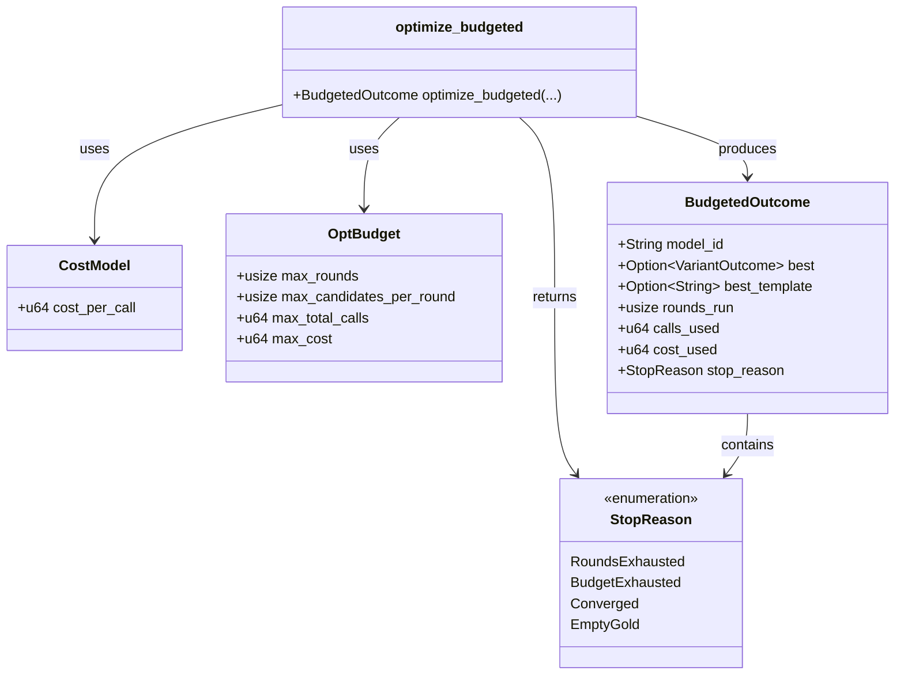
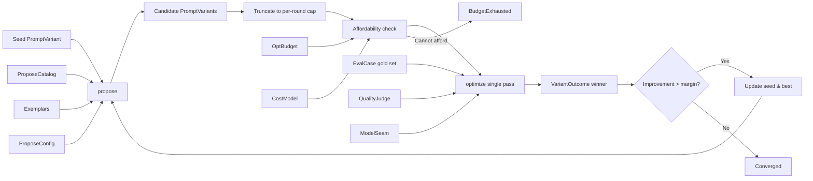
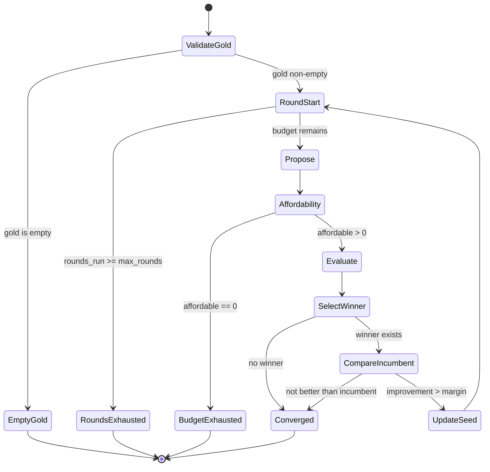
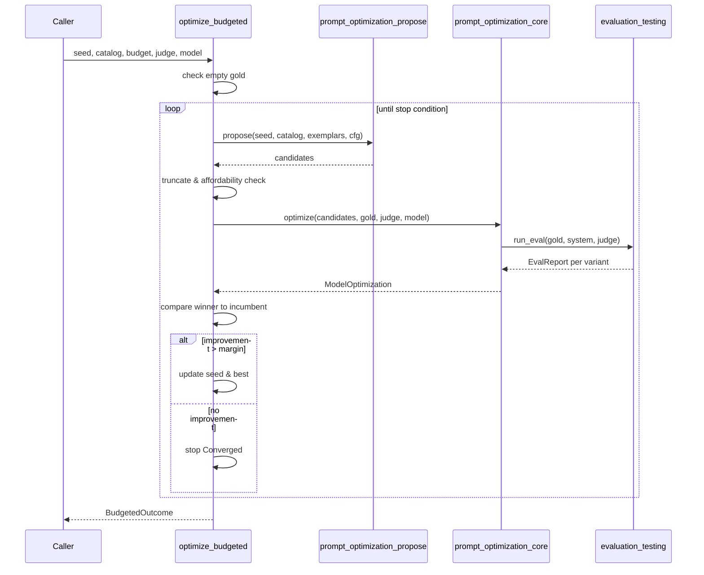
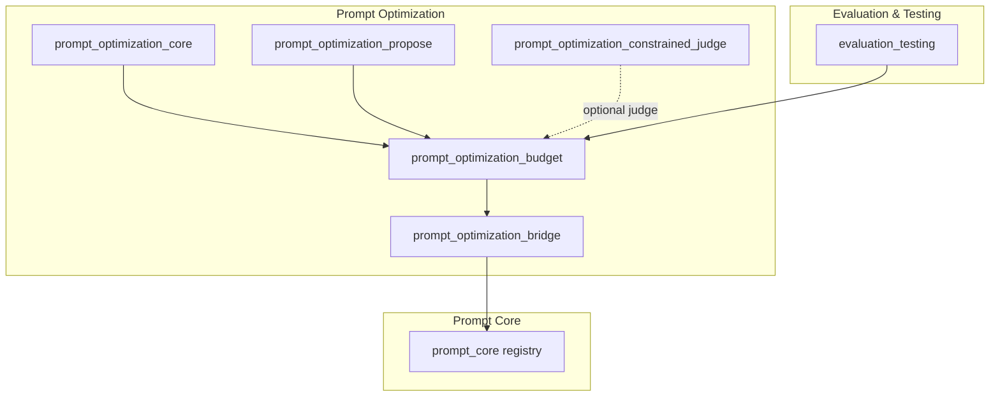

# prompt_optimization_budget

## Overview

The `prompt_optimization_budget` module provides **cost-budgeted, multi-round prompt optimization** for the AI engine's prompt engineering subsystem. It wraps the single-pass optimization logic from [`prompt_optimization_core`](prompt_optimization_core.md) into an explicitly bounded offline job that respects hard caps on rounds, candidates per round, total model calls, and total cost.

Without these caps, prompt optimization is often the first casualty of cost pressure or becomes an unowned line item. This module makes spend **accountable and deterministic**: the loop stops the moment the next unit of work would breach any budget, and every outcome reports exact call and cost consumption.

## Purpose

- Enforce **hard budget caps** on prompt optimization runs.
- Provide **exact spend accounting** (model calls and cost units).
- Enable **deterministic, reproducible optimization**: same seed, catalog, and budget always produce the same rounds, spend, and winner.
- Support **convergence detection** via an improvement margin so the optimizer does not burn budget on churn.
- Bridge optimized variants back into the prompt registry as DRAFT artifacts (see [`prompt_optimization_bridge`](prompt_optimization_bridge.md)).

## Core Components

### `CostModel`

An abstract per-call cost model. A production deployment can plug in a real currency model (e.g., ₹/token × tokens/call). The default is `1` cost unit per call.

```rust
pub struct CostModel {
    pub cost_per_call: u64,
}
```

### `OptBudget`

The hard budget container. Every field is enforced; the run never exceeds any of them.

| Field | Meaning |
|-------|---------|
| `max_rounds` | Maximum optimization iterations. |
| `max_candidates_per_round` | Candidates evaluated per round after proposal truncation. |
| `max_total_calls` | Hard cap on total model calls (`Σ candidates × eval-set-size`). |
| `max_cost` | Hard cap on total cost units. |

```rust
pub struct OptBudget {
    pub max_rounds: usize,
    pub max_candidates_per_round: usize,
    pub max_total_calls: u64,
    pub max_cost: u64,
}
```

### `StopReason`

Explains why the budgeted loop terminated:

- `RoundsExhausted` — all configured rounds were consumed.
- `BudgetExhausted` — the remaining budget cannot afford even one candidate.
- `Converged` — no round produced a candidate better than the incumbent by the improvement margin.
- `EmptyGold` — the gold evaluation set was empty, so there is nothing to optimize against.

### `BudgetedOutcome`

The result of a budgeted run, including the best variant found, exact spend, and stop reason.

```rust
pub struct BudgetedOutcome {
    pub model_id: String,
    pub best: Option<VariantOutcome>,
    pub best_template: Option<String>,
    pub rounds_run: usize,
    pub calls_used: u64,
    pub cost_used: u64,
    pub stop_reason: StopReason,
}
```

### `optimize_budgeted`

The main entry point. It iterates the propose → evaluate → select → re-propose cycle while respecting the budget and improvement margin.

```rust
pub fn optimize_budgeted(
    seed: &PromptVariant,
    catalog: &ProposeCatalog,
    exemplars: &[Exemplar],
    propose_cfg: ProposeConfig,
    gold: &[EvalCase],
    judge: &dyn QualityJudge,
    model: &dyn ModelSeam,
    cost: CostModel,
    budget: OptBudget,
    improve_margin: f64,
) -> BudgetedOutcome
```

## Architecture



## Data Flow



## Optimization Loop State Machine



## Component Interaction



## How It Fits into the System

The `prompt_optimization_budget` module sits in the **AI Engine** → **Prompt Engineering** → **Prompt Optimization** branch of the system. It consumes:

- **Prompt variants** and **model seams** from [`prompt_optimization_core`](prompt_optimization_core.md).
- **Candidate proposals** from [`prompt_optimization_propose`](prompt_optimization_propose.md).
- **Evaluation cases and quality judges** from [`evaluation_testing`](evaluation_testing.md) (specifically `ainxt_eval`).

Its output (`BudgetedOutcome`) can be handed to [`prompt_optimization_bridge`](prompt_optimization_bridge.md) to author a new DRAFT layer artifact in the prompt registry, completing the optimization-to-deployment pipeline.



## Budget Enforcement Details

For each round, the optimizer computes how many candidates it can actually afford:

1. **Call budget**: `affordable_by_calls = remaining_calls / gold_set_size`
2. **Cost budget**: `affordable_by_cost = remaining_cost / (gold_set_size × cost_per_call)`
3. **Effective cap**: `min(affordable_by_calls, affordable_by_cost, max_candidates_per_round)`

If the effective cap is zero before any evaluation, the loop stops with `BudgetExhausted`. Cost accounting is exact:

```
calls_used += evaluated_candidates × gold_set_size
cost_used  += evaluated_candidates × gold_set_size × cost_per_call
```

## Configuration

Default budget (can be overridden per run):

```rust
OptBudget {
    max_rounds: 5,
    max_candidates_per_round: 12,
    max_total_calls: 10_000,
    max_cost: 10_000,
}
```

Default cost model:

```rust
CostModel {
    cost_per_call: 1,
}
```

The `improve_margin` parameter controls non-inferiority: a round winner must beat the incumbent's pass rate by more than this margin to justify continuing. This prevents churn and preserves budget.

## Determinism Guarantees

`optimize_budgeted` is deterministic: `propose` and `optimize` are deterministic, and the module uses no clock or RNG. The same seed, catalog, budget, and margin always yield the same rounds, spend, and winner.

## Testing

The module includes tests covering:

- **Hard cap enforcement** (`PRMT-09`): calls and cost never exceed the configured budget.
- **Zero-call budget**: stops immediately with `BudgetExhausted`.
- **Multi-round convergence**: finds the winning variant, then converges instead of running forever.
- **Round cap respect**: stops with `RoundsExhausted` after `max_rounds`.
- **Empty gold set**: returns `EmptyGold` without spending budget.
- **Serialization round-trip**: `BudgetedOutcome` serializes and deserializes correctly.

## References

- [`prompt_optimization_core`](prompt_optimization_core.md) — single-pass optimization and `ModelSeam`/`PromptVariant` definitions.
- [`prompt_optimization_propose`](prompt_optimization_propose.md) — candidate generation via `propose`, `ProposeCatalog`, and `ProposeConfig`.
- [`prompt_optimization_bridge`](prompt_optimization_bridge.md) — converting optimization winners into registry DRAFT artifacts.
- [`prompt_optimization_constrained_judge`](prompt_optimization_constrained_judge.md) — constrained LLM judges used during evaluation.
- [`prompt_core`](prompt_core.md) — prompt engine, registry, and layer lifecycle.
- [`evaluation_testing`](evaluation_testing.md) — `EvalCase`, `QualityJudge`, `EvalReport`, and scoring infrastructure.
