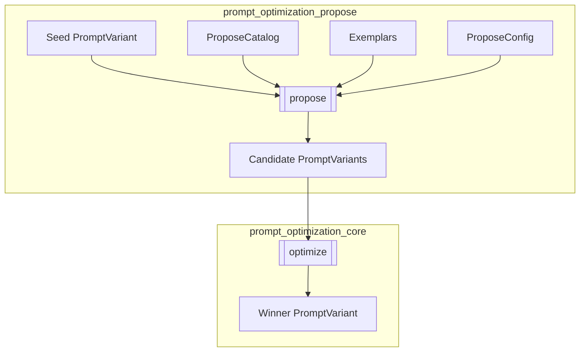
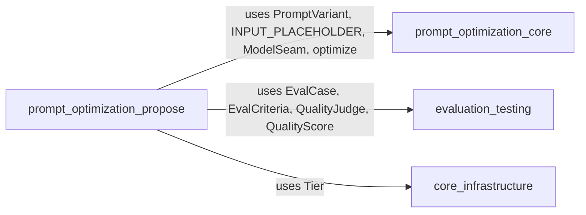
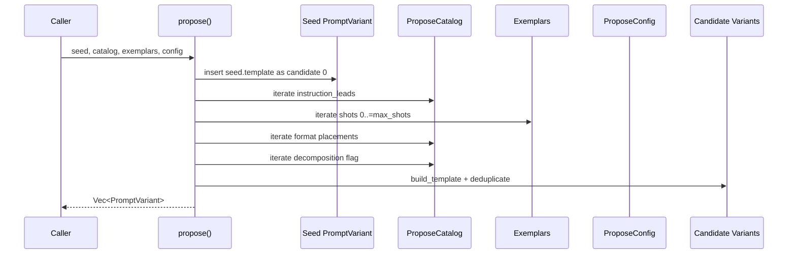
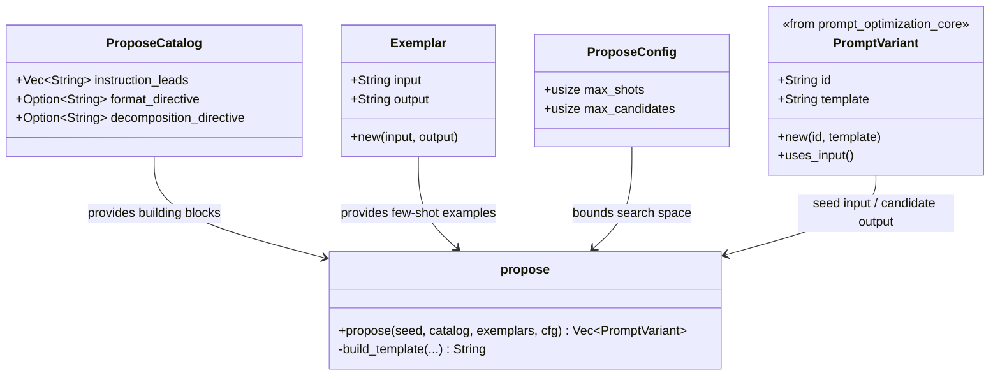
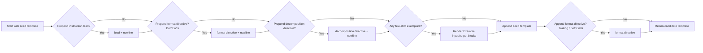
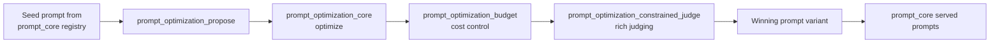

# prompt_optimization_propose

The **Propose** step of the prompt optimizer. Given a seed prompt, it deterministically generates a bounded search space of candidate prompt variants that the optimizer's scoring step ([prompt_optimization_core](prompt_optimization_core.md)) then evaluates. The module is intentionally a *variant selector*, not a generator: it recombines a fixed catalog of prompt-building blocks rather than asking a model to invent new prompts.

---

## Overview

`prompt_optimization_propose` lives inside the `prompt_optimization` family of the larger [prompt_engineering](prompt_engineering.md) domain. Its single responsibility is to expand one seed prompt into many candidate prompts along a small, well-defined set of axes:

- **Instruction rephrasing** — prepend an instruction lead (e.g. "Explain step by step.").
- **Few-shot bootstrapping** — prepend `k` worked exemplars.
- **Output-format restatement placement** — none, trailing, or both ends of the prompt.
- **Decomposition granularity** — optionally add a numbered-steps directive.

The expansion is deterministic (no RNG), reproducible, and cost-bounded through configuration caps. The seed prompt is always candidate 0, so the incumbent is guaranteed to compete in the optimization race.

---

## Core Components

| Component | File | Responsibility |
|-----------|------|----------------|
| `Exemplar` | `crates/ainxt-promptopt/src/propose.rs` | A worked input/output example used for few-shot bootstrapping. |
| `ProposeCatalog` | `crates/ainxt-promptopt/src/propose.rs` | The building blocks the Propose step recombines: instruction leads, format directive, and decomposition directive. |
| `ProposeConfig` | `crates/ainxt-promptopt/src/propose.rs` | Bounds the search space via `max_shots` and `max_candidates`. |
| `propose` (function) | `crates/ainxt-promptopt/src/propose.rs` | Deterministically enumerates the cross-product of catalog options and returns deduplicated `PromptVariant` candidates. |
| `StepByStepModel` / `TermJudge` | `crates/ainxt-promptopt/src/propose.rs` | Test-only model and judge seams used to prove the Propose step can discover strictly better prompts than the seed alone. |

### Component Details

#### `Exemplar`

```rust
pub struct Exemplar {
    pub input: String,
    pub output: String,
}
```

A simple worked example. When few-shot bootstrapping is enabled, the first `k` exemplars are rendered as:

```text
Example input: <input>
Example output: <output>
```

#### `ProposeCatalog`

```rust
pub struct ProposeCatalog {
    pub instruction_leads: Vec<String>,
    pub format_directive: Option<String>,
    pub decomposition_directive: Option<String>,
}
```

The catalog is the "vocabulary" of the Propose step. The default catalog includes common instruction leads and a decomposition directive, but no format directive (which is typically domain-specific).

#### `ProposeConfig`

```rust
pub struct ProposeConfig {
    pub max_shots: usize,
    pub max_candidates: usize,
}
```

`max_shots` bounds the few-shot axis (`k` ranges `0..=max_shots`). `max_candidates` is a hard cap on the returned candidate list, including the seed. Defaults are `max_shots = 2` and `max_candidates = 24`.

#### `propose` function

```rust
pub fn propose(
    seed: &PromptVariant,
    catalog: &ProposeCatalog,
    exemplars: &[Exemplar],
    cfg: ProposeConfig,
) -> Vec<PromptVariant>
```

The main entry point. It:

1. Adds the seed as candidate 0.
2. Enumerates the cross-product of leads × shots × placements × decomposition.
3. Builds each candidate template with `build_template`.
4. Filters out candidates that lose the `{input}` placeholder or are duplicates.
5. Stops early when `max_candidates` is reached.

---

## Architecture



The Propose step is a pure function: it takes a seed, catalog, exemplars, and config, and returns candidates. It has no side effects and does not call models. The downstream `optimize` step in [prompt_optimization_core](prompt_optimization_core.md) evaluates each candidate against a judge and model.

---

## Dependencies



### Internal dependencies

- **[prompt_optimization_core](prompt_optimization_core.md)** — provides `PromptVariant`, the `INPUT_PLACEHOLDER` constant, the `ModelSeam` trait, and the `optimize` function that scores candidates.
- **[prompt_optimization_budget](prompt_optimization_budget.md)** — related cost-bounding logic for the broader optimization loop (not directly imported in `propose.rs`, but part of the same optimization pipeline).
- **[prompt_optimization_bridge](prompt_optimization_bridge.md)** and **[prompt_optimization_constrained_judge](prompt_optimization_constrained_judge.md)** — sibling modules that handle draft bridging and constrained judging.

### Cross-domain dependencies

- **[evaluation_testing](evaluation_testing.md)** — test code uses `EvalCase`, `EvalCriteria`, `QualityJudge`, and `QualityScore` to demonstrate that Propose + Optimize can beat the seed.
- **[core_infrastructure / ainxt-types](../core_infrastructure/core_infrastructure.md)** — test code uses `Tier`.

---

## Data Flow



The data flow is a deterministic nested loop:

1. **Leads**: empty lead (no rephrasing) plus each catalog lead.
2. **Shots**: `0` to `min(max_shots, exemplars.len())`.
3. **Placements**: if a format directive exists, `None`, `Trailing`, `BothEnds`; otherwise just `None`.
4. **Decomposition**: `false` and `true` (skipped if no decomposition directive).

Each combination is rendered, checked for the `{input}` placeholder, deduplicated, and added to the output vector until `max_candidates` is reached.

---

## Component Interaction



---

## Process Flow: Building a Candidate



The `build_template` helper assembles candidates in a fixed order:

1. Optional instruction lead.
2. Optional format directive at the top (only for `BothEnds`).
3. Optional decomposition directive.
4. Optional few-shot exemplars.
5. Seed template.
6. Optional format directive at the bottom (for `Trailing` or `BothEnds`).

---

## How It Fits into the Overall System

`prompt_optimization_propose` is one step in the larger prompt-engineering lifecycle:



- **[prompt_core](prompt_core.md)** authors, versions, and serves prompts via the registry and layered assembler.
- **[prompt_optimization_propose](prompt_optimization_propose.md)** (this module) expands a seed into candidates.
- **[prompt_optimization_core](prompt_optimization_core.md)** runs the A/B-style optimization over candidates.
- **[prompt_optimization_budget](prompt_optimization_budget.md)** models cost and decides when to stop.
- **[prompt_optimization_constrained_judge](prompt_optimization_constrained_judge.md)** provides judges that work even with weak or constrained models.

The winning variant is typically promoted back into the prompt registry or served prompt set, completing the loop.

---

## Design Invariants

1. **Determinism**: same seed + catalog + exemplars + config always produce identical candidates. No RNG is used.
2. **Incumbent preservation**: candidate 0 is always the seed.
3. **Placeholder preservation**: any candidate that loses the `{input}` placeholder is discarded.
4. **Deduplication**: candidates are deduplicated by rendered template.
5. **Cost bounding**: `max_candidates` caps the output; `max_shots` caps the few-shot axis.

---

## Testing Strategy

The module includes unit tests that verify:

- The seed is always candidate 0.
- Candidates are distinct, preserve the input placeholder, and respect `max_candidates`.
- Propose is deterministic.
- Few-shot exemplars appear in generated candidates.
- Format directive placement expands candidates.
- An end-to-end `propose` → `optimize` flow can find a strictly better variant than the seed alone (using `StepByStepModel` and `TermJudge`).

---

## References

- [prompt_optimization_core](prompt_optimization_core.md) — candidate scoring and optimization loop.
- [prompt_optimization_budget](prompt_optimization_budget.md) — cost modeling and budget enforcement.
- [prompt_optimization_bridge](prompt_optimization_bridge.md) — draft bridging between optimization domains.
- [prompt_optimization_constrained_judge](prompt_optimization_constrained_judge.md) — constrained and weak-model judging.
- [prompt_engineering](prompt_engineering.md) — parent domain documentation.
- [prompt_core](prompt_core.md) — prompt authoring, versioning, and serving.
- [evaluation_testing](evaluation_testing.md) — evaluation cases, criteria, and judges.
