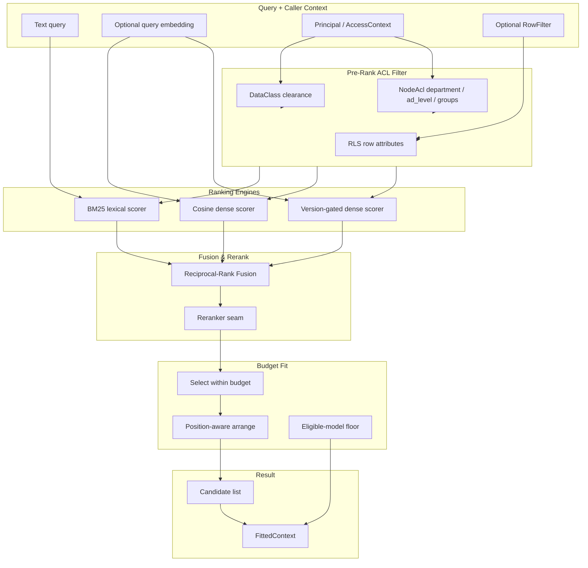
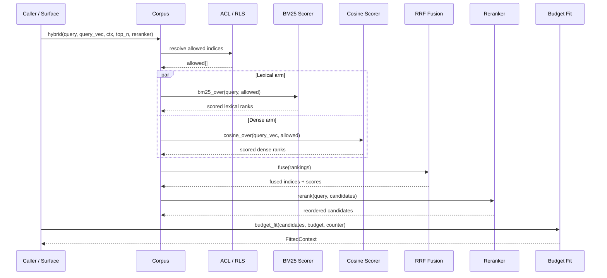
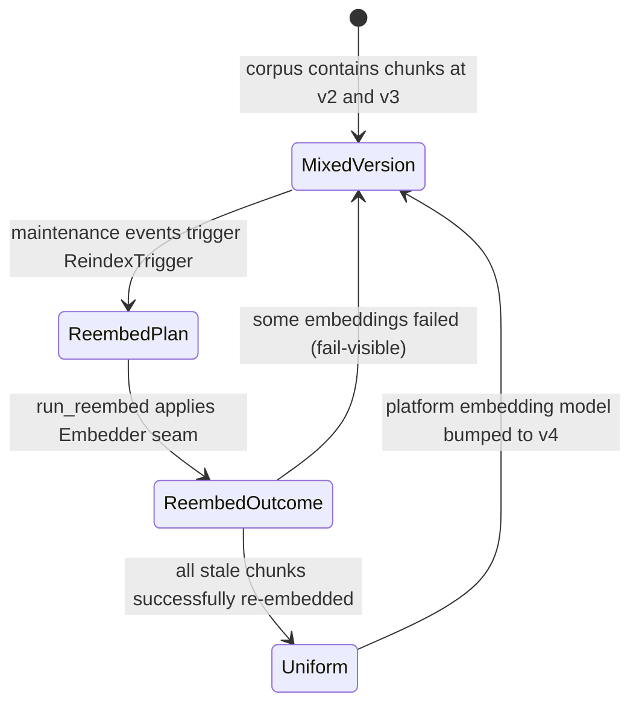

# retrieval_core

## Introduction

`retrieval_core` is the in-process, dependency-light hybrid retrieval / RAG engine at the heart of the AiNxt **knowledge retrieval** layer. It lives in the `ainxt-retrieval` crate and implements Context Fabric layer 11 (hybrid document retrieval) together with the pre-rank security filter described in the architecture design documents.

The crate is intentionally pure and synchronous: it performs no I/O, has no external vector-DB dependency, and contains no ML runtime. Embeddings, reranker models, and tokenizers are all supplied through traits, keeping the legal and supply-chain surface limited to `serde` and `ainxt-types`. This makes `retrieval_core` safe to embed directly in the serving runtime while remaining trivial to test deterministically.

## Purpose

`retrieval_core` exists to turn a static corpus of text chunks into an ordered, access-controlled, budget-fitted context window for a language-model turn. Its responsibilities are:

1. **Lexical ranking (BM25 / Okapi)** over an indexed [`Corpus`](retrieval_core_hybrid_retrieval.md#corpus).
2. **Dense ranking (cosine similarity)** using caller-supplied, precomputed query embeddings.
3. **Reciprocal-Rank Fusion (RRF)** to merge lexical and dense rankings without normalizing incomparable score scales.
4. **Pre-rank ACL enforcement** using data-class clearance, node-level RBAC, and row-level security filters so that unauthorized chunks are never scored, ranked, fused, reranked, or returned.
5. **Reranking seam** via the [`Reranker`](retrieval_core_hybrid_retrieval.md#reranker-trait-and-implementations) trait, supporting identity, lexical, and cross-encoder rerankers.
6. **Token-budget fitting** with position-aware arrangement to mitigate "lost-in-the-middle" effects.
7. **Embedding-version lifecycle** tracking and a deterministic re-embed pipeline so model migrations never leave a mixed-version index.
8. **Index maintenance and SLO monitoring** with event-driven staleness tracking and recall/latency health checks.

## Architecture Overview

The central invariant is that **ACL filtering happens before ranking**. A chunk that the caller is not allowed to read is removed from the candidate set before any scorer touches it. This prevents information leakage through result counts, score gaps, IDF perturbation, or reranker behavior.

## Sub-Modules

| Sub-module | File | Responsibility | Documentation |
|------------|------|----------------|---------------|
| Hybrid Retrieval Engine | `src/lib.rs` | BM25, cosine, RRF fusion, reranker seam, token-budget fitting, embedding-version tracking | [retrieval_core_hybrid_retrieval.md](retrieval_core_hybrid_retrieval.md) |
| Access Control | `src/acl.rs` | Node/edge-level RBAC beyond the data-class scalar (department, AD seniority, groups) | [retrieval_core_acl.md](retrieval_core_acl.md) |
| Index Maintenance | `src/maintenance.rs` | Event-driven index staleness tracking, re-index triggers, freshness flags, recall/latency SLO monitoring | [retrieval_core_maintenance.md](retrieval_core_maintenance.md) |
| Re-embed Pipeline | `src/reembed.rs` | Embedding-model migration planning and execution, fail-visible partial migration reporting | [retrieval_core_reembed.md](retrieval_core_reembed.md) |

## Component Interaction

## Data Flow

1. A surface (for example, the chat or conversation runtime) calls one of the `Corpus` hybrid methods with a text query, an optional query embedding, the caller's identity, and a reranker.
2. `Corpus` resolves the **pre-rank allowed set** by evaluating data-class clearance, [`NodeAcl`](retrieval_core_acl.md#nodeacl), and optionally an [`rls::RowFilter`](retrieval_advanced.md) (the RLS implementation lives in the sibling `retrieval_advanced` module).
3. The allowed set is fed independently into the BM25 lexical scorer and the cosine dense scorer.
4. The two ordered rankings are merged with Reciprocal-Rank Fusion using `1/(k + rank)`.
5. The fused candidate list is passed to the configured [`Reranker`](retrieval_core_hybrid_retrieval.md#reranker-trait-and-implementations), which may reorder or rescore but must not introduce new candidates.
6. The surface then calls [`budget_fit`](retrieval_core_hybrid_retrieval.md#tokencounter-and-budget-fitting) (or the eligible-model variant) to produce a [`FittedContext`](retrieval_core_hybrid_retrieval.md#fittedcontext-fitdecision-and-eligiblemodel) containing the included chunks and a complete lineage of included/dropped decisions.

## Security Model

`retrieval_core` enforces a fail-closed, pre-rank security model:

- **Data-class gate**: a chunk's sensitivity must not exceed the caller's clearance.
- **Node ACL gate**: if a chunk carries a [`NodeAcl`](retrieval_core_acl.md#nodeacl), the caller must satisfy department, `ad_level`, and group constraints. Missing claims deny access.
- **RLS gate**: row-level security filters compare per-row attributes against principal-bound values; a missing attribute or missing binding denies the row.
- **Reranker contract**: rerankers are read-only order/score transformations. They cannot add candidates, so the ACL guarantee is preserved.
- **Fail-open reranking**: the cross-encoder reranker degrades to the fused order on transport or model failure because reranking is a retrieval concern, not an admission decision.

## Embedding Version Lifecycle

Embeddings are accepted precomputed and tagged with an [`EmbeddingVersion`](retrieval_core_hybrid_retrieval.md#embeddingversion). Two vectors are only compared when their versions match exactly, preventing silent mixed-version degradation. The [`maintenance`](retrieval_core_maintenance.md) and [`reembed`](retrieval_core_reembed.md) sub-modules provide the event-driven machinery that keeps the index at a uniform version over time.

## Dependencies and System Context

`retrieval_core` is a sub-module of `knowledge_retrieval` within the larger `ai_engine` domain. It sits alongside:

- [`context_retrieval_routing`](context_retrieval_routing.md) — higher-level routing, graph-based context assembly, and optimizer planning in `ainxt-context`.
- [`nl2sql`](nl2sql.md) — structured natural-language-to-SQL retrieval in `ainxt-nl2sql`.
- [`retrieval_advanced`](retrieval_advanced.md) — federation, differential privacy, row-level security policies, and structured query pipelines in the same `ainxt-retrieval` crate.

The only external crate dependencies used in the retrieval core are:

- `ainxt-types` for [`DataClass`](../core_infrastructure/security_config_identity.md) and [`Principal`](../core_infrastructure/security_config_identity.md).
- `serde` for serialization of configuration and result types.

## Operational Notes

- The [`Corpus`](retrieval_core_hybrid_retrieval.md#corpus) is immutable after construction; updates are performed by rebuilding from a new chunk list. This keeps BM25 document-frequency and average-length statistics consistent.
- The [`IndexState`](retrieval_core_maintenance.md#indexstate--the-event-driven-tracker) tracker sits above the immutable corpus and turns source events into deterministic re-index/re-embed triggers.
- The [`RecallLatencyMonitor`](retrieval_core_maintenance.md#indexslo-and-recalllatencymonitor) tracks vector-index health against SLOs so that ANN degradation is detected rather than silently degrading answer quality.

## Related Documentation

- [retrieval_core_hybrid_retrieval.md](retrieval_core_hybrid_retrieval.md) — BM25, cosine, RRF, rerankers, and budget fitting.
- [retrieval_core_acl.md](retrieval_core_acl.md) — node/edge RBAC and access context.
- [retrieval_core_maintenance.md](retrieval_core_maintenance.md) — event-driven index maintenance and SLO monitoring.
- [retrieval_core_reembed.md](retrieval_core_reembed.md) — embedding-model migration pipeline.
