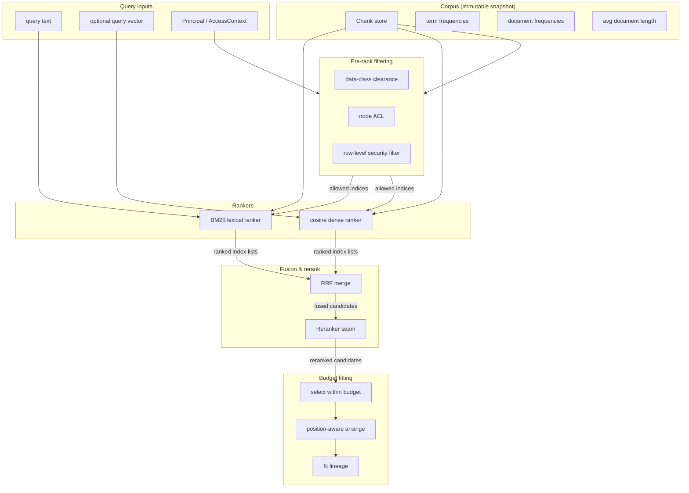
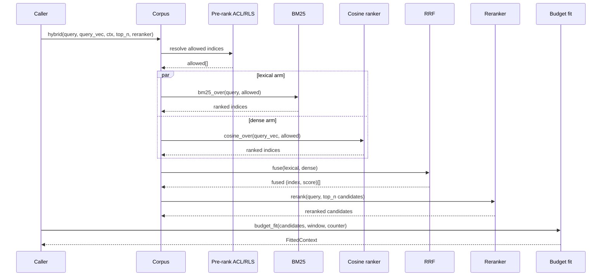
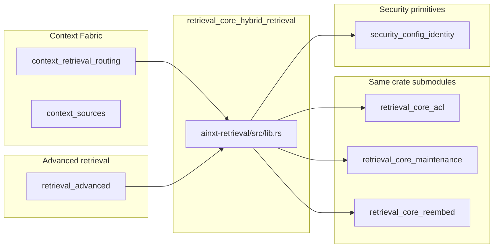
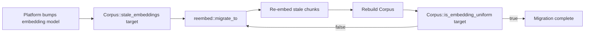

# retrieval_core_hybrid_retrieval

The `retrieval_core_hybrid_retrieval` module is the in-process, dependency-light heart of the Context Fabric's hybrid document retrieval layer. It implements the ranking, fusion, access-control, and budget-fitting primitives that higher-level retrievers compose into a complete RAG grounding path.

The module is intentionally pure and synchronous: it contains no I/O, no external vector database, and no ML runtime. Embeddings, reranker models, and tokenizers are all supplied through traits, keeping the legal and supply-chain surface minimal while remaining fast, testable, and auditable.

## Core responsibilities

1. **Lexical retrieval (BM25/Okapi)** over an immutable [`Corpus`].
2. **Dense retrieval (cosine similarity)** using caller-supplied, precomputed embeddings.
3. **Reciprocal-Rank Fusion (RRF)** to merge lexical and dense rankings without normalizing incomparable score scales.
4. **Pluggable reranking** through the [`Reranker`] trait, with identity, lexical-coverage, and cross-encoder implementations.
5. **Pre-rank access control** using data-class clearance, node-level ACL, and row-level security (RLS) so that inaccessible chunks are never scored, ranked, or returned.
6. **Position-aware budget fitting** to turn ranked candidates into a token-bounded context window, mitigating "lost-in-the-middle" effects and recording a full lineage of included/dropped chunks.
7. **Embedding-version lifecycle management** to prevent silent mixed-version degradation and to drive re-embedding migrations.

## Architecture

## Key components

### `Chunk`

A [`Chunk`] is the single retrievable unit. It carries:

- `id`: a stable identifier.
- `text`: the raw retrievable text.
- `data_class`: the sensitivity label used for scalar clearance checks.
- `embedding`: an optional precomputed dense vector.
- `embedding_model`: an optional [`EmbeddingVersion`] tagging the vector's source.
- `acl`: an optional [`NodeAcl`] for fine-grained node-level access control.
- `attributes`: row-level labels used by [`rls::RowFilter`](retrieval_core_acl.md).

Chunks are intentionally plain data. They can be built with a fluent builder API (`new`, `with_embedding`, `with_versioned_embedding`, `with_acl`, `with_attribute`).

### `Corpus`

[`Corpus`] is an immutable snapshot of chunks plus precomputed lexical statistics (term frequencies, document frequencies, average document length). Because the index is a snapshot, mutations require rebuilding the corpus, which prevents inconsistent statistics mid-query.

The corpus exposes several retrieval surfaces:

- `bm25(query, principal, top_n)` — lexical ranking.
- `cosine(query_vec, principal, top_n)` — dense ranking (dimension-only comparability).
- `cosine_versioned(query_vec, query_ver, principal, top_n)` — dense ranking that only compares vectors with matching [`EmbeddingVersion`].
- `hybrid(query, query_vec, principal, top_n, reranker)` — full pipeline: ACL pre-filter → BM25 → cosine → RRF → rerank.
- `hybrid_ctx(...)` — same pipeline using the richer [`AccessContext`](retrieval_core_acl.md) for department/ad_level/group RBAC.
- `hybrid_rls(...)` — hybrid pipeline with an additional row-level security filter.
- `hybrid_ctx_rls(...)` — combined node/edge RBAC and RLS pre-filter.

### `Reranker` trait and implementations

The [`Reranker`] trait is the seam where second-stage scoring is plugged in. Implementations must only reorder or rescore the candidates they receive; they must never introduce new candidates, because the ACL guarantee depends on the candidate set being closed after pre-rank filtering.

| Implementation | Purpose |
|---------------|---------|
| [`IdentityReranker`] | No-op default; passes candidates through unchanged. |
| [`LexicalReranker`] | Cheap coverage-based reranker that rewards distinct query-term presence. |
| [`CrossEncoderReranker`] | Borrowed wrapper around a [`RerankClient`] (e.g., the `/rerank` endpoint). |
| [`SharedCrossEncoderReranker`] | `Arc`-owned variant that can live in long-lived, thread-shared retrievers. |

Both cross-encoder rerankers **fail open**: on transport or model errors, or on a misaligned score vector length, they return the prior fused order rather than dropping candidates or blocking the turn. This is safe because reranking is a read-filter/ordering concern, not an admission decision.

### `TokenCounter` and budget fitting

[`TokenCounter`] is the seam for token counting. The default [`WordTokenCounter`] splits on whitespace for tests and lexical estimation; production deployments plug in the eligible model's actual tokenizer.

Budget-fitting functions:

- `select_within_budget` — greedily includes highest-ranked candidates that fit the budget, skipping oversized items so smaller later items can still fit.
- `position_aware` — rearranges survivors so the most relevant items sit at the edges of the window, mitigating "lost-in-the-middle" attention decay.
- `budget_fit` — combines selection and position-aware arrangement.
- `refit` — fits to an explicit window and returns a full [`FittedContext`] lineage.
- `budget_fit_eligible` — fits to the narrowest window among the eligible model set (fit-to-eligible-floor).

### `FittedContext`, `FitDecision`, and `EligibleModel`

[`FittedContext`] is the result of fitting a ranked list to a token window. It contains:

- `included`: the positioned, included candidates.
- `lineage`: one [`FitDecision`] per input candidate, recording whether it was included or dropped over budget and its token cost.
- `window` and `used_tokens`: the target cap and actual consumption.

[`EligibleModel`] represents one model in the turn's eligible set with its context-window size. The narrowest window across the set is the "eligible floor" used by `budget_fit_eligible`, ensuring the assembled context never exceeds what any eligible model — including failover targets — can accept.

### `EmbeddingVersion`

[`EmbeddingVersion`] tags a vector with the model name and generation that produced it. Two vectors are only comparable when their versions match exactly. This prevents silent mixed-version degradation: a `nomic-embed-text@v2` vector and a `nomic-embed-text@v3` vector are not compared, because cosine between incompatible spaces is a meaningless number.

The corpus provides lifecycle helpers:

- `stale_embeddings(target)` — lists indices whose embedding is missing or not at the target version.
- `is_embedding_uniform(target)` — true when every chunk is at the target version.

The [`reembed`](retrieval_core_reembed.md) module consumes these helpers to drive migration jobs.

## Security model: pre-rank access control

A central design invariant is that **access control happens before ranking**. A chunk the caller may not read is removed from the candidate set before any ranker scores it. This prevents information leakage through result counts, score gaps, IDF perturbation, or reranker side effects.

The visibility check is fail-closed and layered:

1. **Data-class clearance** — the chunk's `data_class.sensitivity()` must not exceed the principal's clearance.
2. **Node ACL** — if present, the chunk's [`NodeAcl`](retrieval_core_acl.md) is evaluated against the caller's [`AccessContext`](retrieval_core_acl.md) (department, `ad_level`, allow/deny groups).
3. **RLS row filter** — if supplied, the chunk's `attributes` must satisfy the active [`rls::RowFilter`](retrieval_core_acl.md) policies.

Every public retrieval surface (`bm25`, `cosine`, `hybrid`, `hybrid_ctx`, `hybrid_rls`, `hybrid_ctx_rls`) routes through these checks. The bare [`Principal`](../core_infrastructure/security_config_identity.md) path can only supply department; `ad_level` and group claims are unknown and therefore fail-closed for nodes that require them. The [`AccessContext`](retrieval_core_acl.md) path carries the full OBO/JWT claims.

See [retrieval_core_acl.md](retrieval_core_acl.md) for the ACL and RLS implementation details.

## Data flow: hybrid retrieval

## Dependencies and module relationships

- [retrieval_core_acl.md](retrieval_core_acl.md) — node-level ACL and row-level security filters consumed during pre-rank filtering.
- [retrieval_core_maintenance.md](retrieval_core_maintenance.md) — index SLOs and recall/latency monitoring that operate over corpus outputs.
- [retrieval_core_reembed.md](retrieval_core_reembed.md) — embedding migration pipeline driven by `stale_embeddings` and `is_embedding_uniform`.
- [context_retrieval_routing.md](context_retrieval_routing.md) — the Context Fabric's `HybridRetriever`, which wraps this module's `Corpus` and reranker seam.
- [security_config_identity.md](../core_infrastructure/security_config_identity.md) — `Principal` and `DataClass`, the shared labels used for clearance decisions.
- [retrieval_advanced.md](retrieval_advanced.md) — federation, structured query, and advanced RLS policies that build on the core retrieval primitives.

## Process flow: embedding-version migration

The migration loop ensures the index never silently remains in a mixed-version state. The `reembed` module is documented separately in [retrieval_core_reembed.md](retrieval_core_reembed.md).

## Testing strategy

The module includes an extensive inline test suite covering:

- BM25 ranking quality (on-topic docs first, IDF discrimination).
- Cosine ranking and dimension/version mismatch handling.
- RRF fusion correctness and formula verification.
- Pre-rank ACL enforcement across data-class, node-ACL, and RLS boundaries.
- Budget fitting, position-aware arrangement, and eligible-floor fitting.
- Cross-encoder reranker seam behavior, including fail-open on errors.
- Embedding-version lifecycle and re-embed migration.

Because the crate is pure Rust with no external services, all tests are deterministic and run without network access or model weights.

## When to use this module

Use `retrieval_core_hybrid_retrieval` when you need:

- A self-contained, auditable hybrid ranker for RAG grounding.
- Strong pre-rank access-control guarantees.
- Pluggable embeddings, rerankers, and tokenizers.
- Embedding-version-aware dense retrieval and migration support.

For higher-level orchestration — query planning, multi-source routing, citation assembly, and conversation-aware context windows — see [context_retrieval_routing.md](context_retrieval_routing.md). For production serving concerns such as index maintenance SLOs and recall/latency monitoring, see [retrieval_core_maintenance.md](retrieval_core_maintenance.md).
